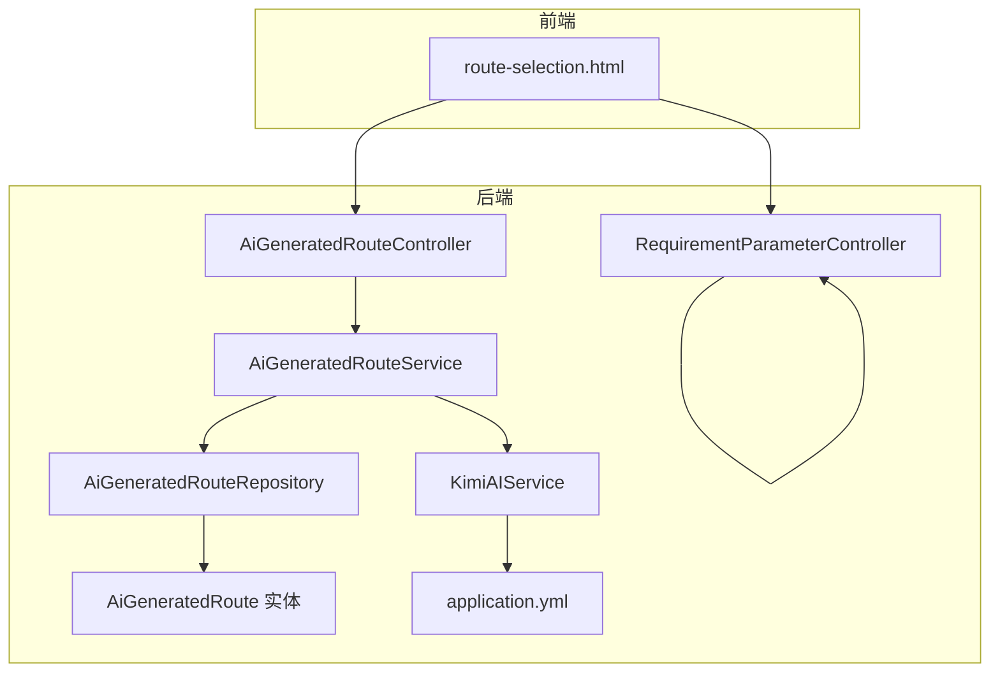
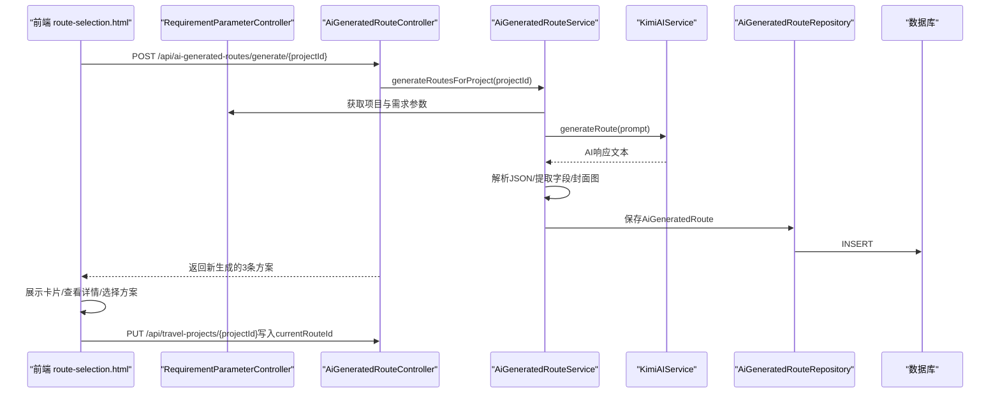
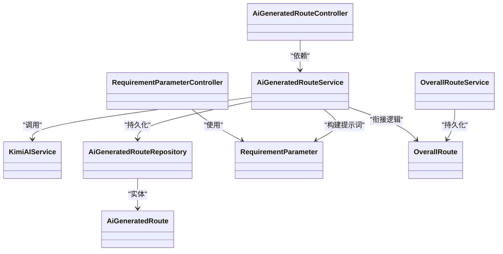

# AI智能路线生成

<cite>
**本文引用的文件**
- [RequirementParameterController.java](file://tudianersha/src/main/java/com/tudianersha/controller/RequirementParameterController.java)
- [AiGeneratedRouteController.java](file://tudianersha/src/main/java/com/tudianersha/controller/AiGeneratedRouteController.java)
- [AiGeneratedRouteService.java](file://tudianersha/src/main/java/com/tudianersha/service/AiGeneratedRouteService.java)
- [KimiAIService.java](file://tudianersha/src/main/java/com/tudianersha/service/KimiAIService.java)
- [AiGeneratedRoute.java](file://tudianersha/src/main/java/com/tudianersha/entity/AiGeneratedRoute.java)
- [RequirementParameter.java](file://tudianersha/src/main/java/com/tudianersha/entity/RequirementParameter.java)
- [AiGeneratedRouteRepository.java](file://tudianersha/src/main/java/com/tudianersha/repository/AiGeneratedRouteRepository.java)
- [route-selection.html](file://tudianersha/src/main/resources/static/route-selection.html)
- [application.yml](file://tudianersha/src/main/resources/application.yml)
- [OverallRoute.java](file://tudianersha/src/main/java/com/tudianersha/entity/OverallRoute.java)
- [OverallRouteService.java](file://tudianersha/src/main/java/com/tudianersha/service/OverallRouteService.java)
</cite>

## 目录
1. [引言](#引言)
2. [项目结构](#项目结构)
3. [核心组件](#核心组件)
4. [架构总览](#架构总览)
5. [详细组件分析](#详细组件分析)
6. [依赖关系分析](#依赖关系分析)
7. [性能考量](#性能考量)
8. [故障排查指南](#故障排查指南)
9. [结论](#结论)
10. [附录](#附录)

## 引言
本文件深入解析“AI智能路线生成”功能的技术实现，围绕以下目标展开：
- RequirementParameterController如何收集旅行需求（目的地、天数、预算、兴趣点类型等）
- AiGeneratedRouteService如何调用KimiAIService向大模型发送请求生成候选路线
- AiGeneratedRoute实体结构设计与持久化机制
- 前端route-selection.html如何展示多个AI生成的路线方案并支持用户选择
- 错误处理（AI服务超时、无效响应）、请求重试机制、提示词工程优化策略
- 与OverallRoute的衔接逻辑
- 调用链路追踪示例与性能监控建议

## 项目结构
该功能涉及后端控制器、服务层、实体与仓库、AI服务、前端页面及配置文件。整体采用Spring Boot分层架构，控制器负责HTTP接口，服务层编排业务流程，实体与仓库负责数据持久化，前端通过AJAX与后端交互。

图表来源
- [route-selection.html](file://tudianersha/src/main/resources/static/route-selection.html#L1-L606)
- [RequirementParameterController.java](file://tudianersha/src/main/java/com/tudianersha/controller/RequirementParameterController.java#L1-L85)
- [AiGeneratedRouteController.java](file://tudianersha/src/main/java/com/tudianersha/controller/AiGeneratedRouteController.java#L1-L112)
- [AiGeneratedRouteService.java](file://tudianersha/src/main/java/com/tudianersha/service/AiGeneratedRouteService.java#L1-L486)
- [KimiAIService.java](file://tudianersha/src/main/java/com/tudianersha/service/KimiAIService.java#L1-L176)
- [AiGeneratedRoute.java](file://tudianersha/src/main/java/com/tudianersha/entity/AiGeneratedRoute.java#L1-L193)
- [AiGeneratedRouteRepository.java](file://tudianersha/src/main/java/com/tudianersha/repository/AiGeneratedRouteRepository.java#L1-L12)
- [application.yml](file://tudianersha/src/main/resources/application.yml#L1-L57)

章节来源
- [RequirementParameterController.java](file://tudianersha/src/main/java/com/tudianersha/controller/RequirementParameterController.java#L1-L85)
- [AiGeneratedRouteController.java](file://tudianersha/src/main/java/com/tudianersha/controller/AiGeneratedRouteController.java#L1-L112)
- [AiGeneratedRouteService.java](file://tudianersha/src/main/java/com/tudianersha/service/AiGeneratedRouteService.java#L1-L486)
- [KimiAIService.java](file://tudianersha/src/main/java/com/tudianersha/service/KimiAIService.java#L1-L176)
- [AiGeneratedRoute.java](file://tudianersha/src/main/java/com/tudianersha/entity/AiGeneratedRoute.java#L1-L193)
- [AiGeneratedRouteRepository.java](file://tudianersha/src/main/java/com/tudianersha/repository/AiGeneratedRouteRepository.java#L1-L12)
- [route-selection.html](file://tudianersha/src/main/resources/static/route-selection.html#L1-L606)
- [application.yml](file://tudianersha/src/main/resources/application.yml#L1-L57)

## 核心组件
- RequirementParameterController：提供旅行需求参数的CRUD接口，支持按项目ID查询与更新。
- AiGeneratedRouteController：提供AI生成路线的入口接口，支持删除旧方案并生成新方案。
- AiGeneratedRouteService：核心业务编排，构建提示词、调用AI、解析响应、持久化、封面图提取。
- KimiAIService：封装Kimi大模型API调用，设置超时、消息结构与响应解析。
- AiGeneratedRoute实体与AiGeneratedRouteRepository：定义路线实体结构与按项目ID查询能力。
- route-selection.html：前端页面，展示AI生成的多方案，支持查看详情、重新生成、选择并跳转协作界面。
- application.yml：配置Kimi API密钥、地址、模型与数据库连接等。

章节来源
- [RequirementParameterController.java](file://tudianersha/src/main/java/com/tudianersha/controller/RequirementParameterController.java#L1-L85)
- [AiGeneratedRouteController.java](file://tudianersha/src/main/java/com/tudianersha/controller/AiGeneratedRouteController.java#L1-L112)
- [AiGeneratedRouteService.java](file://tudianersha/src/main/java/com/tudianersha/service/AiGeneratedRouteService.java#L1-L486)
- [KimiAIService.java](file://tudianersha/src/main/java/com/tudianersha/service/KimiAIService.java#L1-L176)
- [AiGeneratedRoute.java](file://tudianersha/src/main/java/com/tudianersha/entity/AiGeneratedRoute.java#L1-L193)
- [AiGeneratedRouteRepository.java](file://tudianersha/src/main/java/com/tudianersha/repository/AiGeneratedRouteRepository.java#L1-L12)
- [route-selection.html](file://tudianersha/src/main/resources/static/route-selection.html#L1-L606)
- [application.yml](file://tudianersha/src/main/resources/application.yml#L1-L57)

## 架构总览
AI智能路线生成的端到端流程如下：
- 前端route-selection.html加载项目信息与AI生成的路线方案
- 用户点击“重新生成”，前端调用AiGeneratedRouteController的生成接口
- 控制器清理旧方案并触发AiGeneratedRouteService.generateRoutesForProject
- 服务层构建提示词，调用KimiAIService向大模型请求生成路线
- 解析AI响应，提取结构化字段并持久化到AiGeneratedRouteRepository
- 前端刷新展示新的三条候选方案，用户选择后将currentRouteId写回项目并跳转协作界面

图表来源
- [route-selection.html](file://tudianersha/src/main/resources/static/route-selection.html#L496-L569)
- [AiGeneratedRouteController.java](file://tudianersha/src/main/java/com/tudianersha/controller/AiGeneratedRouteController.java#L78-L112)
- [AiGeneratedRouteService.java](file://tudianersha/src/main/java/com/tudianersha/service/AiGeneratedRouteService.java#L70-L112)
- [KimiAIService.java](file://tudianersha/src/main/java/com/tudianersha/service/KimiAIService.java#L44-L98)
- [AiGeneratedRouteRepository.java](file://tudianersha/src/main/java/com/tudianersha/repository/AiGeneratedRouteRepository.java#L1-L12)

## 详细组件分析

### RequirementParameterController：旅行需求收集
- 提供按项目ID查询需求参数的接口，便于AiGeneratedRouteService构建提示词
- 支持增删改查，便于在需求变更时更新
- 关键接口路径与方法：
  - GET /api/requirement-parameters/project/{projectId}
  - GET /api/requirement-parameters/project/{projectId}/all
  - POST/PUT/DELETE 对应需求参数的创建、更新与删除

章节来源
- [RequirementParameterController.java](file://tudianersha/src/main/java/com/tudianersha/controller/RequirementParameterController.java#L1-L85)
- [RequirementParameter.java](file://tudianersha/src/main/java/com/tudianersha/entity/RequirementParameter.java#L1-L123)

### AiGeneratedRouteController：生成与管理AI路线
- 生成接口：POST /api/ai-generated-routes/generate/{projectId}
  - 行为：删除旧方案，生成新方案，返回成功状态与数据
  - 错误处理：对非法参数与异常分别返回不同HTTP状态码
- 查询接口：GET /api/ai-generated-routes/project/{projectId}
  - 行为：按项目ID返回AI生成的路线集合

章节来源
- [AiGeneratedRouteController.java](file://tudianersha/src/main/java/com/tudianersha/controller/AiGeneratedRouteController.java#L1-L112)
- [AiGeneratedRouteRepository.java](file://tudianersha/src/main/java/com/tudianersha/repository/AiGeneratedRouteRepository.java#L1-L12)

### AiGeneratedRouteService：提示词构建与AI调用
- generateRoutesForProject(projectId)
  - 获取项目信息与所有参与者的需求参数
  - buildPrompt：整合项目基础信息与各参与者的兴趣标签、心愿单、不喜欢列表、每日预算等
  - 调用KimiAIService.generateRoute(prompt)
  - parseAndSaveRoutes：解析AI响应，提取结构化字段（标题、标签、景点/餐厅数量、交通方式、总预算、推荐指数、每日行程），并保存至数据库
  - 封面图提取：从每日行程中抽取景点名称，调用高德POI服务获取图片URL，合并为逗号分隔字符串存入coverImageUrl
- 提示词工程要点
  - 明确要求返回三条不同风格的路线
  - 严格约束每条路线包含标题、标签、每日详细行程、景点/餐厅数量、交通方式、总预算、推荐指数
  - 强制要求景点/餐厅真实存在、开放时间与门票信息明确、时间安排合理、避免不可预约的景点
  - 提供标准JSON格式示例，便于解析
- 容错与降级
  - 当AI响应非预期或解析失败时，生成默认示例行程（按项目天数构造），并尝试从高德POI获取默认封面图
- 性能与超时
  - KimiAIService设置了较长的读取超时，以适应AI生成较长响应

章节来源
- [AiGeneratedRouteService.java](file://tudianersha/src/main/java/com/tudianersha/service/AiGeneratedRouteService.java#L70-L486)
- [KimiAIService.java](file://tudianersha/src/main/java/com/tudianersha/service/KimiAIService.java#L1-L176)

### KimiAIService：大模型调用封装
- 使用OkHttp客户端，设置连接、写入、读取超时
- 构造系统消息与用户消息，携带提示词prompt
- 解析响应，提取choices[0].message.content作为AI回复
- 提供景点介绍生成接口（扩展用途）

章节来源
- [KimiAIService.java](file://tudianersha/src/main/java/com/tudianersha/service/KimiAIService.java#L1-L176)
- [application.yml](file://tudianersha/src/main/resources/application.yml#L47-L57)

### AiGeneratedRoute实体与持久化
- 实体字段
  - 基础信息：projectId、generatedTime、routeContent（完整AI响应）
  - 结构化字段：routeTitle、routeTag、attractionsCount、restaurantsCount、transportMode、totalBudget、recommendationScore
  - 行程与封面：dailyItinerary（JSON字符串）、coverImageUrl（多图逗号分隔）
- 仓库接口：AiGeneratedRouteRepository.findByProjectId(projectId)
- 数据库迁移脚本新增了封面图与结构化字段，确保前后端一致

章节来源
- [AiGeneratedRoute.java](file://tudianersha/src/main/java/com/tudianersha/entity/AiGeneratedRoute.java#L1-L193)
- [AiGeneratedRouteRepository.java](file://tudianersha/src/main/java/com/tudianersha/repository/AiGeneratedRouteRepository.java#L1-L12)
- [database_migration.sql](file://tudianersha/database_migration.sql#L1-L14)

### 前端route-selection.html：方案展示与交互
- 加载项目信息与AI生成的三条路线
- 展示卡片：推荐指数、景点/餐厅/交通统计、总预算、封面图（多图网格拼接）
- 交互功能
  - 查看详情：弹窗展示预算明细与每日行程可视化
  - 重新生成：调用生成接口，覆盖旧方案
  - 选择方案：记录选中路由ID，保存到项目currentRouteId并跳转协作界面
- 错误处理：加载失败提示、空数据引导返回重新生成

章节来源
- [route-selection.html](file://tudianersha/src/main/resources/static/route-selection.html#L1-L606)

### 与OverallRoute的衔接逻辑
- AiGeneratedRouteService在解析AI响应时，会将完整AI响应保存到routeContent，同时提取结构化字段
- OverallRoute实体用于存储最终确定的整体路线细节（文本或结构化JSON），通常在用户确认AI方案后，由协作编辑流程生成并持久化
- 两者关系
  - AiGeneratedRoute：候选方案集合（多条）
  - OverallRoute：最终选定的完整路线（一条）
- 建议流程
  - 用户在route-selection.html选择某条AiGeneratedRoute后，将其dailyItinerary与必要元信息写入OverallRoute，作为后续协作与导出的基础

章节来源
- [OverallRoute.java](file://tudianersha/src/main/java/com/tudianersha/entity/OverallRoute.java#L1-L74)
- [OverallRouteService.java](file://tudianersha/src/main/java/com/tudianersha/service/OverallRouteService.java#L1-L36)
- [AiGeneratedRouteService.java](file://tudianersha/src/main/java/com/tudianersha/service/AiGeneratedRouteService.java#L194-L360)

## 依赖关系分析
- 控制器依赖服务层；服务层依赖仓库与外部AI服务；实体与仓库通过JPA映射数据库
- 前端通过AJAX调用后端REST接口，实现无刷新交互
- 配置文件提供Kimi API密钥、地址、模型与数据库连接参数

图表来源
- [RequirementParameterController.java](file://tudianersha/src/main/java/com/tudianersha/controller/RequirementParameterController.java#L1-L85)
- [AiGeneratedRouteController.java](file://tudianersha/src/main/java/com/tudianersha/controller/AiGeneratedRouteController.java#L1-L112)
- [AiGeneratedRouteService.java](file://tudianersha/src/main/java/com/tudianersha/service/AiGeneratedRouteService.java#L1-L486)
- [KimiAIService.java](file://tudianersha/src/main/java/com/tudianersha/service/KimiAIService.java#L1-L176)
- [AiGeneratedRoute.java](file://tudianersha/src/main/java/com/tudianersha/entity/AiGeneratedRoute.java#L1-L193)
- [AiGeneratedRouteRepository.java](file://tudianersha/src/main/java/com/tudianersha/repository/AiGeneratedRouteRepository.java#L1-L12)
- [RequirementParameter.java](file://tudianersha/src/main/java/com/tudianersha/entity/RequirementParameter.java#L1-L123)
- [OverallRoute.java](file://tudianersha/src/main/java/com/tudianersha/entity/OverallRoute.java#L1-L74)
- [OverallRouteService.java](file://tudianersha/src/main/java/com/tudianersha/service/OverallRouteService.java#L1-L36)

## 性能考量
- AI调用超时设置
  - KimiAIService设置了较长的读取超时，适合生成较长响应的场景
- JSON解析与容错
  - parseAndSaveRoutes对AI响应进行多种提取策略（Markdown代码块、直接JSON对象），并在解析失败时生成默认示例行程，降低失败率
- 封面图获取
  - 从每日行程中抽取景点名称，调用高德POI服务获取图片，最多收集6张，避免过多网络请求
- 前端渲染
  - route-selection.html对每日行程进行结构化展示，减少前端复杂计算
- 建议
  - 在AI服务层增加指数退避重试与熔断保护
  - 对高德POI服务增加缓存与限流
  - 对数据库查询增加索引（如按projectId查询）

[本节为通用性能讨论，无需列出具体文件来源]

## 故障排查指南
- AI服务超时或失败
  - 检查application.yml中的Kimi API配置是否正确
  - 观察KimiAIService的超时设置与响应解析逻辑
  - 前端在重新生成按钮处有错误提示与恢复状态
- 无效响应或JSON解析失败
  - AiGeneratedRouteService会在解析失败时生成默认示例行程并尝试获取默认封面图
  - 建议在日志中记录AI原始响应以便定位问题
- 项目不存在或无需求参数
  - AiGeneratedRouteController在生成接口中对非法参数返回400，服务层对项目缺失抛出IllegalArgumentException
- 前端交互异常
  - route-selection.html对空数据进行引导，对详情弹窗进行格式化展示；检查浏览器控制台错误与网络面板

章节来源
- [KimiAIService.java](file://tudianersha/src/main/java/com/tudianersha/service/KimiAIService.java#L1-L176)
- [AiGeneratedRouteController.java](file://tudianersha/src/main/java/com/tudianersha/controller/AiGeneratedRouteController.java#L78-L112)
- [AiGeneratedRouteService.java](file://tudianersha/src/main/java/com/tudianersha/service/AiGeneratedRouteService.java#L194-L360)
- [route-selection.html](file://tudianersha/src/main/resources/static/route-selection.html#L198-L219)

## 结论
本功能通过清晰的分层架构与完善的提示词工程，实现了从旅行需求到AI生成候选路线再到用户选择与协作的完整闭环。服务层具备良好的容错与降级策略，前端提供了直观的交互体验。建议在生产环境中进一步增强AI服务的重试与熔断、高德POI服务的缓存与限流，并完善日志与监控体系以提升稳定性与可观测性。

[本节为总结性内容，无需列出具体文件来源]

## 附录

### 调用链路追踪示例
- 重新生成流程
  - route-selection.html → AiGeneratedRouteController.generateRoutes → AiGeneratedRouteService.generateRoutesForProject → KimiAIService.generateRoute → AiGeneratedRouteService.parseAndSaveRoutes → AiGeneratedRouteRepository.save
- 选择并保存流程
  - route-selection.html → AiGeneratedRouteController（生成接口） → AiGeneratedRouteService（保存） → 前端PUT更新项目currentRouteId

章节来源
- [route-selection.html](file://tudianersha/src/main/resources/static/route-selection.html#L496-L569)
- [AiGeneratedRouteController.java](file://tudianersha/src/main/java/com/tudianersha/controller/AiGeneratedRouteController.java#L78-L112)
- [AiGeneratedRouteService.java](file://tudianersha/src/main/java/com/tudianersha/service/AiGeneratedRouteService.java#L70-L112)

### 提示词工程优化策略
- 明确输出格式与示例，降低解析成本
- 强制约束真实景点与开放时间，避免不可执行的行程
- 细化每日活动粒度与时序合理性，提升用户体验
- 增加“如果需要预约”的提示，避免当日无法预约的景点

章节来源
- [AiGeneratedRouteService.java](file://tudianersha/src/main/java/com/tudianersha/service/AiGeneratedRouteService.java#L94-L191)