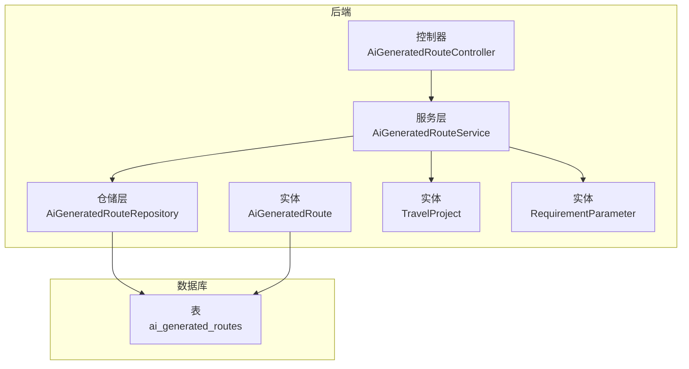
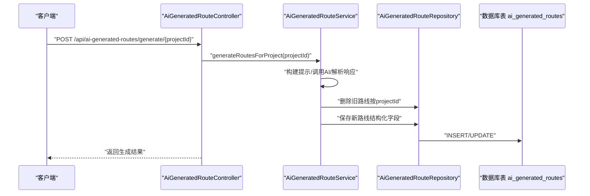
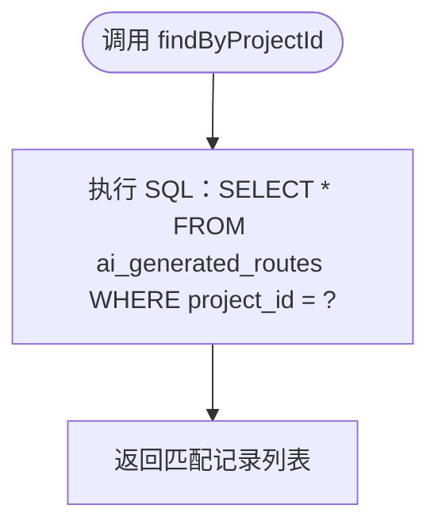
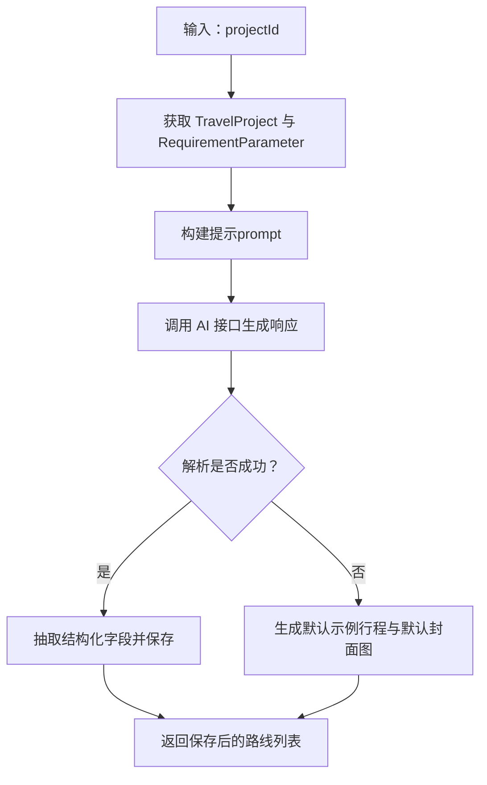
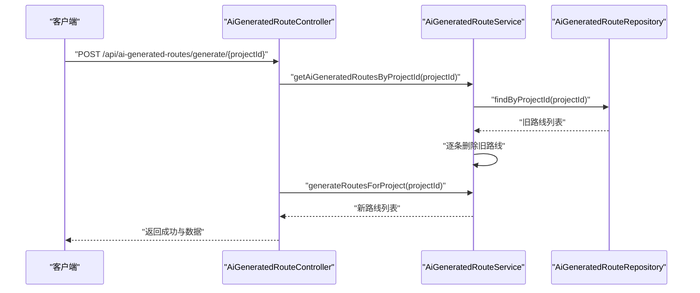
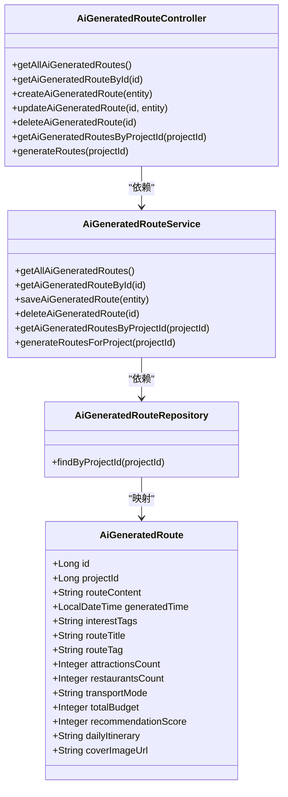

# AI生成路线数据模型

<cite>
**本文引用的文件**
- [AiGeneratedRoute.java](file://tudianersha/src/main/java/com/tudianersha/entity/AiGeneratedRoute.java)
- [AiGeneratedRouteRepository.java](file://tudianersha/src/main/java/com/tudianersha/repository/AiGeneratedRouteRepository.java)
- [AiGeneratedRouteService.java](file://tudianersha/src/main/java/com/tudianersha/service/AiGeneratedRouteService.java)
- [AiGeneratedRouteController.java](file://tudianersha/src/main/java/com/tudianersha/controller/AiGeneratedRouteController.java)
- [schema.sql](file://tudianersha/src/main/resources/schema.sql)
- [application.yml](file://tudianersha/src/main/resources/application.yml)
- [database_migration.sql](file://tudianersha/database_migration.sql)
- [database_update_cover_url.sql](file://tudianersha/database_update_cover_url.sql)
- [TravelProject.java](file://tudianersha/src/main/java/com/tudianersha/entity/TravelProject.java)
- [RequirementParameter.java](file://tudianersha/src/main/java/com/tudianersha/entity/RequirementParameter.java)
</cite>

## 目录
1. [简介](#简介)
2. [项目结构](#项目结构)
3. [核心组件](#核心组件)
4. [架构总览](#架构总览)
5. [详细组件分析](#详细组件分析)
6. [依赖关系分析](#依赖关系分析)
7. [性能与查询优化](#性能与查询优化)
8. [故障排查指南](#故障排查指南)
9. [结论](#结论)
10. [附录](#附录)

## 简介
本文件系统性梳理“AI生成路线（AiGeneratedRoute）”的数据模型，涵盖实体字段的业务含义与数据类型、数据库列映射、JPA注解使用、仓库层查询方法实现，以及数据持久化策略、查询性能考量与数据生命周期管理（覆盖旧路线）。同时提供面向开发与非技术读者的渐进式理解路径与可视化图示。

## 项目结构
围绕“AI生成路线”的关键文件组织如下：
- 实体层：AiGeneratedRoute（JPA实体）
- 仓储层：AiGeneratedRouteRepository（基于Spring Data JPA）
- 服务层：AiGeneratedRouteService（AI生成、解析、保存、删除）
- 控制层：AiGeneratedRouteController（REST接口）
- 数据库脚本：schema.sql（初始表结构）、database_migration.sql（新增字段）、database_update_cover_url.sql（扩大字段长度）
- 关联实体：TravelProject、RequirementParameter（用于构建AI提示与解析）

**图表来源**
- [AiGeneratedRouteController.java](file://tudianersha/src/main/java/com/tudianersha/controller/AiGeneratedRouteController.java#L1-L112)
- [AiGeneratedRouteService.java](file://tudianersha/src/main/java/com/tudianersha/service/AiGeneratedRouteService.java#L1-L486)
- [AiGeneratedRouteRepository.java](file://tudianersha/src/main/java/com/tudianersha/repository/AiGeneratedRouteRepository.java#L1-L12)
- [AiGeneratedRoute.java](file://tudianersha/src/main/java/com/tudianersha/entity/AiGeneratedRoute.java#L1-L193)
- [schema.sql](file://tudianersha/src/main/resources/schema.sql#L52-L59)

**章节来源**
- [AiGeneratedRouteController.java](file://tudianersha/src/main/java/com/tudianersha/controller/AiGeneratedRouteController.java#L1-L112)
- [AiGeneratedRouteService.java](file://tudianersha/src/main/java/com/tudianersha/service/AiGeneratedRouteService.java#L1-L120)
- [AiGeneratedRouteRepository.java](file://tudianersha/src/main/java/com/tudianersha/repository/AiGeneratedRouteRepository.java#L1-L12)
- [AiGeneratedRoute.java](file://tudianersha/src/main/java/com/tudianersha/entity/AiGeneratedRoute.java#L1-L193)
- [schema.sql](file://tudianersha/src/main/resources/schema.sql#L52-L59)

## 核心组件
- 实体类 AiGeneratedRoute：承载一次AI生成的路线记录，包含项目关联、原始内容、生成时间、兴趣标签、标题/标签、景点/餐厅计数、交通方式、总预算、推荐指数、每日行程JSON、封面图URL等。
- 仓储接口 AiGeneratedRouteRepository：提供按项目ID查询的JPQL派生查询方法。
- 服务类 AiGeneratedRouteService：负责生成AI提示、调用AI接口、解析响应、保存结构化字段、抽取封面图、删除旧路线并写入新路线。
- 控制器 AiGeneratedRouteController：提供REST接口，包括按ID查询、创建、更新、删除、按项目ID查询、以及批量生成并覆盖旧路线。

**章节来源**
- [AiGeneratedRoute.java](file://tudianersha/src/main/java/com/tudianersha/entity/AiGeneratedRoute.java#L1-L193)
- [AiGeneratedRouteRepository.java](file://tudianersha/src/main/java/com/tudianersha/repository/AiGeneratedRouteRepository.java#L1-L12)
- [AiGeneratedRouteService.java](file://tudianersha/src/main/java/com/tudianersha/service/AiGeneratedRouteService.java#L43-L120)
- [AiGeneratedRouteController.java](file://tudianersha/src/main/java/com/tudianersha/controller/AiGeneratedRouteController.java#L1-L112)

## 架构总览
AI生成路线的端到端流程如下：
- 控制器接收请求，触发服务层生成逻辑
- 服务层组装提示（结合旅行项目与参与者需求），调用AI接口
- 解析AI响应，填充结构化字段并保存至数据库
- 控制器返回结果，前端可按项目ID拉取最新生成的路线

**图表来源**
- [AiGeneratedRouteController.java](file://tudianersha/src/main/java/com/tudianersha/controller/AiGeneratedRouteController.java#L78-L112)
- [AiGeneratedRouteService.java](file://tudianersha/src/main/java/com/tudianersha/service/AiGeneratedRouteService.java#L70-L120)
- [AiGeneratedRouteRepository.java](file://tudianersha/src/main/java/com/tudianersha/repository/AiGeneratedRouteRepository.java#L1-L12)

## 详细组件分析

### 实体类 AiGeneratedRoute 字段与业务含义
- 字段概览与类型
  - id：Long，主键，自增
  - projectId：Long，非空，关联旅行项目
  - routeContent：String（TEXT），AI生成的原始文本内容
  - generatedTime：LocalDateTime，非空，生成时间戳
  - interestTags：String（VARCHAR），兴趣标签，逗号分隔
  - routeTitle：String（VARCHAR），路线名称
  - routeTag：String（VARCHAR），特色标签
  - attractionsCount：Integer，景点数量
  - restaurantsCount：Integer，餐厅数量
  - transportMode：String（VARCHAR），交通方式
  - totalBudget：Integer，总预算
  - recommendationScore：Integer，推荐指数（0-100）
  - dailyItinerary：String（TEXT），每日行程JSON字符串
  - coverImageUrl：String（TEXT），封面图URL列表（逗号分隔）

- 数据库列映射与约束
  - 初始表结构由 schema.sql 定义，包含 id、project_id、route_content、generated_time、interest_tags 等列
  - 后续通过 database_migration.sql 新增 route_title、route_tag、attractions_count、restaurants_count、transport_mode、total_budget、recommendation_score、daily_itinerary 等列
  - 通过 database_update_cover_url.sql 将 cover_image_url 从 VARCHAR(500) 改为 TEXT，以容纳多张图片URL

- JPA 注解使用
  - @Entity、@Table：声明实体与表映射
  - @Id、@GeneratedValue：主键与自增
  - @Column：字段到列的映射；对长文本字段（route_content、daily_itinerary、cover_image_url）使用 columnDefinition="TEXT"
  - 对部分字段设置 nullable=false 或默认值，确保数据完整性

- 字段业务说明
  - projectId：作为外键关联旅行项目，用于按项目维度聚合与覆盖
  - routeContent：保留AI原始响应，便于回溯与审计
  - generatedTime：记录生成时刻，便于排序与展示
  - interestTags：汇总参与者兴趣，辅助筛选与推荐
  - routeTitle/routeTag：增强可读性与分类
  - attractionsCount/restaurantsCount/transportMode/totalBudget/recommendationScore：结构化指标，便于前端展示与排序
  - dailyItinerary：标准化的每日行程JSON，便于渲染与导出
  - coverImageUrl：封面图URL集合，用于列表缩略图

**章节来源**
- [AiGeneratedRoute.java](file://tudianersha/src/main/java/com/tudianersha/entity/AiGeneratedRoute.java#L1-L193)
- [schema.sql](file://tudianersha/src/main/resources/schema.sql#L52-L59)
- [database_migration.sql](file://tudianersha/database_migration.sql#L1-L14)
- [database_update_cover_url.sql](file://tudianersha/database_update_cover_url.sql#L1-L5)

### 仓储层：AiGeneratedRouteRepository 的 findByProjectId 查询
- 方法定义
  - List<AiGeneratedRoute> findByProjectId(Long projectId)
- 实现机制
  - Spring Data JPA 通过方法命名约定自动推断查询条件为“按 project_id 等于给定值”
- 使用场景
  - 控制器按项目ID拉取该项目的全部AI生成路线
  - 服务层在生成新路线前先删除旧路线，避免重复

**图表来源**
- [AiGeneratedRouteRepository.java](file://tudianersha/src/main/java/com/tudianersha/repository/AiGeneratedRouteRepository.java#L1-L12)

**章节来源**
- [AiGeneratedRouteRepository.java](file://tudianersha/src/main/java/com/tudianersha/repository/AiGeneratedRouteRepository.java#L1-L12)
- [AiGeneratedRouteController.java](file://tudianersha/src/main/java/com/tudianersha/controller/AiGeneratedRouteController.java#L72-L76)
- [AiGeneratedRouteService.java](file://tudianersha/src/main/java/com/tudianersha/service/AiGeneratedRouteService.java#L59-L61)

### 服务层：AiGeneratedRouteService 的生成与解析流程
- 生成入口
  - generateRoutesForProject(Long projectId)：获取项目与需求参数，构建提示，调用AI，解析并保存
- 解析与落库
  - parseAndSaveRoutes：从AI响应中抽取JSON，填充结构化字段（标题、标签、景点/餐厅数量、交通方式、总预算、推荐指数、每日行程JSON），并尝试抽取封面图URL
  - 若解析失败，回退生成默认示例行程与默认封面图
- 生命周期管理
  - 在生成新路线前，先按 projectId 删除旧路线，确保“覆盖式”更新

**图表来源**
- [AiGeneratedRouteService.java](file://tudianersha/src/main/java/com/tudianersha/service/AiGeneratedRouteService.java#L70-L120)
- [AiGeneratedRouteService.java](file://tudianersha/src/main/java/com/tudianersha/service/AiGeneratedRouteService.java#L194-L360)
- [AiGeneratedRouteService.java](file://tudianersha/src/main/java/com/tudianersha/service/AiGeneratedRouteService.java#L362-L486)
- [TravelProject.java](file://tudianersha/src/main/java/com/tudianersha/entity/TravelProject.java#L1-L163)
- [RequirementParameter.java](file://tudianersha/src/main/java/com/tudianersha/entity/RequirementParameter.java#L1-L123)

**章节来源**
- [AiGeneratedRouteService.java](file://tudianersha/src/main/java/com/tudianersha/service/AiGeneratedRouteService.java#L43-L120)
- [AiGeneratedRouteService.java](file://tudianersha/src/main/java/com/tudianersha/service/AiGeneratedRouteService.java#L194-L360)
- [AiGeneratedRouteService.java](file://tudianersha/src/main/java/com/tudianersha/service/AiGeneratedRouteService.java#L362-L486)

### 控制层：AiGeneratedRouteController 的接口与生命周期控制
- 接口清单
  - GET /api/ai-generated-routes：获取全部
  - GET /api/ai-generated-routes/{id}：按ID获取
  - POST /api/ai-generated-routes：创建
  - PUT /api/ai-generated-routes/{id}：更新
  - DELETE /api/ai-generated-routes/{id}：删除
  - GET /api/ai-generated-routes/project/{projectId}：按项目ID获取
  - POST /api/ai-generated-routes/generate/{projectId}：生成并覆盖旧路线
- 生命周期控制
  - 生成接口在保存新路线前，先按 projectId 删除旧路线，实现“覆盖式”更新

**图表来源**
- [AiGeneratedRouteController.java](file://tudianersha/src/main/java/com/tudianersha/controller/AiGeneratedRouteController.java#L72-L112)
- [AiGeneratedRouteService.java](file://tudianersha/src/main/java/com/tudianersha/service/AiGeneratedRouteService.java#L59-L61)

**章节来源**
- [AiGeneratedRouteController.java](file://tudianersha/src/main/java/com/tudianersha/controller/AiGeneratedRouteController.java#L1-L112)

## 依赖关系分析
- 实体与表
  - AiGeneratedRoute 映射到 ai_generated_routes 表
  - TravelProject、RequirementParameter 为生成提示与解析提供上下文
- 仓储与服务
  - AiGeneratedRouteRepository 继承 JpaRepository，提供 findByProjectId
  - AiGeneratedRouteService 依赖 AiGeneratedRouteRepository、KimiAIService、TravelProjectService、RequirementParameterService、UserService、AmapPoiService
- 控制器与服务
  - AiGeneratedRouteController 注入 AiGeneratedRouteService，暴露REST接口

**图表来源**
- [AiGeneratedRoute.java](file://tudianersha/src/main/java/com/tudianersha/entity/AiGeneratedRoute.java#L1-L193)
- [AiGeneratedRouteRepository.java](file://tudianersha/src/main/java/com/tudianersha/repository/AiGeneratedRouteRepository.java#L1-L12)
- [AiGeneratedRouteService.java](file://tudianersha/src/main/java/com/tudianersha/service/AiGeneratedRouteService.java#L1-L120)
- [AiGeneratedRouteController.java](file://tudianersha/src/main/java/com/tudianersha/controller/AiGeneratedRouteController.java#L1-L112)

**章节来源**
- [AiGeneratedRoute.java](file://tudianersha/src/main/java/com/tudianersha/entity/AiGeneratedRoute.java#L1-L193)
- [AiGeneratedRouteRepository.java](file://tudianersha/src/main/java/com/tudianersha/repository/AiGeneratedRouteRepository.java#L1-L12)
- [AiGeneratedRouteService.java](file://tudianersha/src/main/java/com/tudianersha/service/AiGeneratedRouteService.java#L1-L120)
- [AiGeneratedRouteController.java](file://tudianersha/src/main/java/com/tudianersha/controller/AiGeneratedRouteController.java#L1-L112)

## 性能与查询优化
- 索引建议
  - 当前 ai_generated_routes 表未显式创建 project_id 索引。由于 findByProjectId 是高频查询，建议在数据库层面为 project_id 添加索引，以提升按项目维度查询性能
- JPA 查询优化
  - 使用 @Query 自定义 SQL 可进一步减少字段选择与排序开销（如仅查必要字段）
  - 对频繁排序字段（如 generated_time）建立索引，避免内存排序
- 缓存策略
  - 对热点项目ID的最近路线可引入Redis缓存，降低数据库压力
- 数据量控制
  - 生成接口采用“覆盖式”写入，避免历史数据无限增长；若需审计，可在应用层保留 routeContent 原始内容

[本节为通用性能建议，不直接分析具体文件，故无章节来源]

## 故障排查指南
- 生成失败
  - 检查 TravelProject 是否存在（不存在会抛出非法参数异常）
  - 检查 RequirementParameter 是否为空（为空会抛出非法参数异常）
  - 检查 AI 接口连通性与鉴权配置
- JSON解析失败
  - parseAndSaveRoutes 中包含回退逻辑：生成默认示例行程与默认封面图
  - 若仍失败，检查 AI 返回格式是否符合预期
- 封面图缺失
  - extractCoverPhoto 会从每日行程中抽取景点名称并调用高德POI服务获取图片
  - 若POI服务不可用或返回为空，将回退为默认图片或留空
- 数据库迁移问题
  - 确认 database_migration.sql 与 database_update_cover_url.sql 已执行
  - 确认 application.yml 中 JPA DDL 自动更新策略与数据库方言正确

**章节来源**
- [AiGeneratedRouteService.java](file://tudianersha/src/main/java/com/tudianersha/service/AiGeneratedRouteService.java#L70-L120)
- [AiGeneratedRouteService.java](file://tudianersha/src/main/java/com/tudianersha/service/AiGeneratedRouteService.java#L194-L360)
- [AiGeneratedRouteService.java](file://tudianersha/src/main/java/com/tudianersha/service/AiGeneratedRouteService.java#L362-L486)
- [application.yml](file://tudianersha/src/main/resources/application.yml#L1-L57)
- [database_migration.sql](file://tudianersha/database_migration.sql#L1-L14)
- [database_update_cover_url.sql](file://tudianersha/database_update_cover_url.sql#L1-L5)

## 结论
AiGeneratedRoute 数据模型通过结构化字段与长文本字段的组合，既满足AI生成内容的可追溯性，又提供丰富的展示与排序能力。配合“覆盖式”生成策略与按项目ID的查询方法，实现了高效、可控的路线生命周期管理。建议在生产环境中补充 project_id 索引与缓存策略，以进一步提升查询性能与用户体验。

[本节为总结性内容，不直接分析具体文件，故无章节来源]

## 附录

### 字段与数据库列对照表
- id → id（BIGINT AUTO_INCREMENT PRIMARY KEY）
- projectId → project_id（BIGINT NOT NULL）
- routeContent → route_content（TEXT）
- generatedTime → generated_time（DATETIME NOT NULL）
- interestTags → interest_tags（VARCHAR(200)）
- routeTitle → route_title（VARCHAR(255)）
- routeTag → route_tag（VARCHAR(100)）
- attractionsCount → attractions_count（INT）
- restaurantsCount → restaurants_count（INT）
- transportMode → transport_mode（VARCHAR(100)）
- totalBudget → total_budget（INT）
- recommendationScore → recommendation_score（INT）
- dailyItinerary → daily_itinerary（TEXT）
- coverImageUrl → cover_image_url（TEXT）

**章节来源**
- [schema.sql](file://tudianersha/src/main/resources/schema.sql#L52-L59)
- [database_migration.sql](file://tudianersha/database_migration.sql#L1-L14)
- [database_update_cover_url.sql](file://tudianersha/database_update_cover_url.sql#L1-L5)