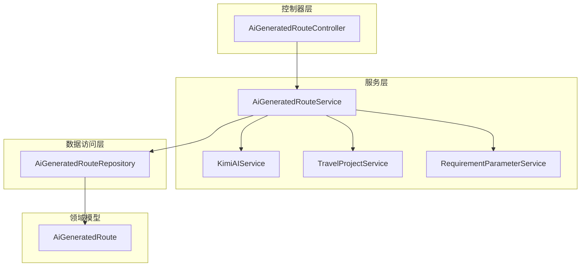
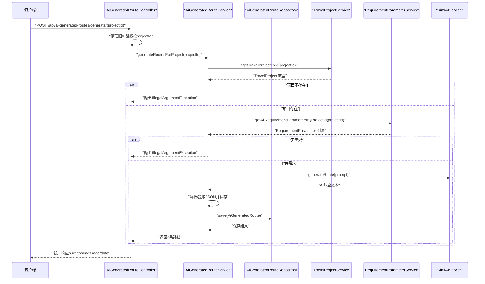
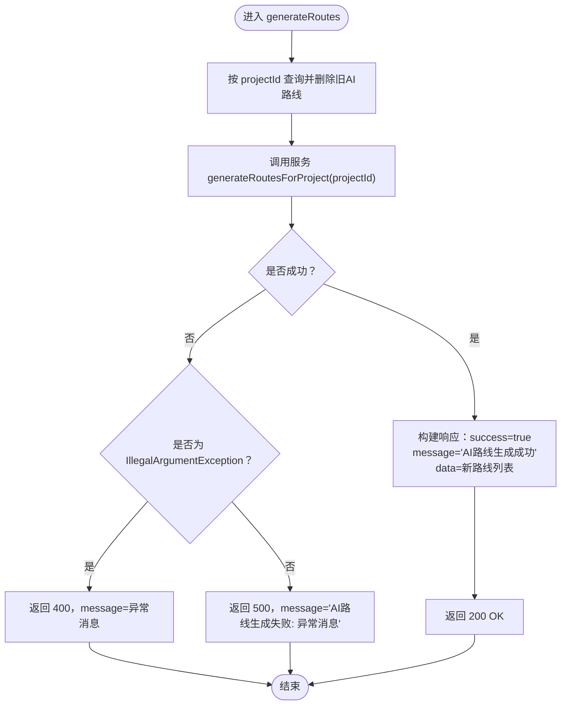
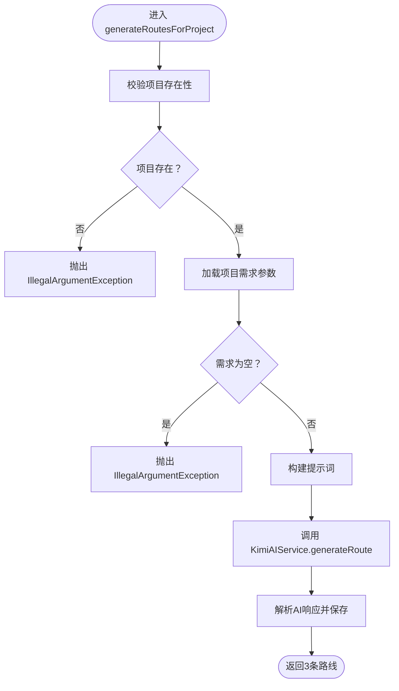
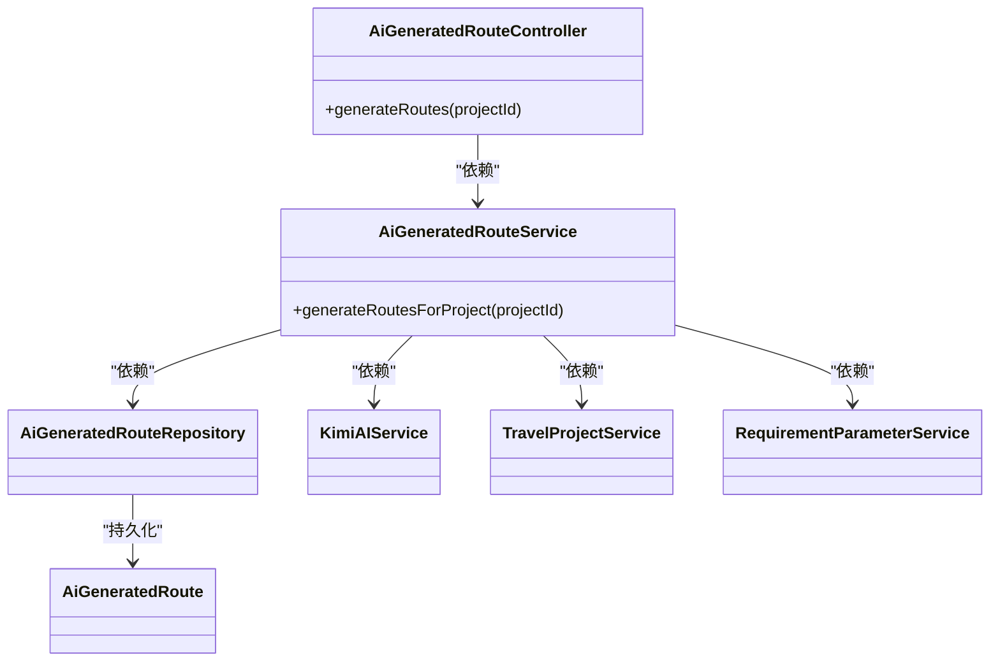

# AI路线生成控制器

<cite>
**本文引用的文件**
- [AiGeneratedRouteController.java](file://tudianersha/src/main/java/com/tudianersha/controller/AiGeneratedRouteController.java)
- [AiGeneratedRouteService.java](file://tudianersha/src/main/java/com/tudianersha/service/AiGeneratedRouteService.java)
- [AiGeneratedRoute.java](file://tudianersha/src/main/java/com/tudianersha/entity/AiGeneratedRoute.java)
- [AiGeneratedRouteRepository.java](file://tudianersha/src/main/java/com/tudianersha/repository/AiGeneratedRouteRepository.java)
- [KimiAIService.java](file://tudianersha/src/main/java/com/tudianersha/service/KimiAIService.java)
- [TravelProjectService.java](file://tudianersha/src/main/java/com/tudianersha/service/TravelProjectService.java)
- [RequirementParameterService.java](file://tudianersha/src/main/java/com/tudianersha/service/RequirementParameterService.java)
- [ApiResponse.java](file://tudianersha/src/main/java/com/tudianersha/dto/ApiResponse.java)
</cite>

## 目录
1. [简介](#简介)
2. [项目结构](#项目结构)
3. [核心组件](#核心组件)
4. [架构总览](#架构总览)
5. [详细组件分析](#详细组件分析)
6. [依赖分析](#依赖分析)
7. [性能考量](#性能考量)
8. [故障排查指南](#故障排查指南)
9. [结论](#结论)
10. [附录](#附录)

## 简介
本文件深入解析 AiGeneratedRouteController 类对 POST /api/ai-generated-routes/generate/{projectId} 接口的实现细节，重点覆盖：
- generateRoutes 方法如何接收项目ID参数
- 如何构建统一响应映射（success、message、data）
- 如何清理旧的AI路线记录
- 如何调用服务层生成新路线
- 异常处理机制（IllegalArgumentException 与通用 Exception）
- 响应格式设计及字段用途
- HTTP 状态码说明（200 成功、400 参数错误、500 服务器错误）
- 控制器与 AiGeneratedRouteService 的协作关系

## 项目结构
该模块采用典型的分层架构：控制器层负责 HTTP 请求与响应封装；服务层负责业务流程编排与外部调用；实体与仓库层负责数据模型与持久化。

图表来源
- [AiGeneratedRouteController.java](file://tudianersha/src/main/java/com/tudianersha/controller/AiGeneratedRouteController.java#L72-L112)
- [AiGeneratedRouteService.java](file://tudianersha/src/main/java/com/tudianersha/service/AiGeneratedRouteService.java#L1-L120)
- [AiGeneratedRouteRepository.java](file://tudianersha/src/main/java/com/tudianersha/repository/AiGeneratedRouteRepository.java#L1-L12)
- [AiGeneratedRoute.java](file://tudianersha/src/main/java/com/tudianersha/entity/AiGeneratedRoute.java#L1-L60)

章节来源
- [AiGeneratedRouteController.java](file://tudianersha/src/main/java/com/tudianersha/controller/AiGeneratedRouteController.java#L1-L112)
- [AiGeneratedRouteService.java](file://tudianersha/src/main/java/com/tudianersha/service/AiGeneratedRouteService.java#L1-L120)

## 核心组件
- 控制器：AiGeneratedRouteController 提供 REST 接口，其中 generateRoutes 方法处理 AI 路线生成请求。
- 服务：AiGeneratedRouteService 编排生成流程，包括校验项目存在性、聚合需求、构建提示词、调用 KimiAIService、解析与落库。
- 实体与仓库：AiGeneratedRoute 实体定义字段，AiGeneratedRouteRepository 提供按项目ID查询能力。
- DTO：ApiResponse 定义统一响应结构，便于前后端约定。

章节来源
- [AiGeneratedRouteController.java](file://tudianersha/src/main/java/com/tudianersha/controller/AiGeneratedRouteController.java#L72-L112)
- [AiGeneratedRouteService.java](file://tudianersha/src/main/java/com/tudianersha/service/AiGeneratedRouteService.java#L63-L120)
- [AiGeneratedRoute.java](file://tudianersha/src/main/java/com/tudianersha/entity/AiGeneratedRoute.java#L1-L60)
- [AiGeneratedRouteRepository.java](file://tudianersha/src/main/java/com/tudianersha/repository/AiGeneratedRouteRepository.java#L1-L12)
- [ApiResponse.java](file://tudianersha/src/main/java/com/tudianersha/dto/ApiResponse.java#L1-L80)

## 架构总览
POST /api/ai-generated-routes/generate/{projectId} 的端到端流程如下：

图表来源
- [AiGeneratedRouteController.java](file://tudianersha/src/main/java/com/tudianersha/controller/AiGeneratedRouteController.java#L82-L112)
- [AiGeneratedRouteService.java](file://tudianersha/src/main/java/com/tudianersha/service/AiGeneratedRouteService.java#L63-L120)
- [AiGeneratedRouteRepository.java](file://tudianersha/src/main/java/com/tudianersha/repository/AiGeneratedRouteRepository.java#L1-L12)
- [TravelProjectService.java](file://tudianersha/src/main/java/com/tudianersha/service/TravelProjectService.java#L21-L23)
- [RequirementParameterService.java](file://tudianersha/src/main/java/com/tudianersha/service/RequirementParameterService.java#L37-L39)
- [KimiAIService.java](file://tudianersha/src/main/java/com/tudianersha/service/KimiAIService.java#L44-L98)

## 详细组件分析

### 控制器：AiGeneratedRouteController.generateRoutes
- 路径与方法：POST /api/ai-generated-routes/generate/{projectId}
- 参数绑定：通过 @PathVariable 接收 projectId
- 处理逻辑：
  - 清理旧记录：先按 projectId 查询并逐条删除
  - 调用服务：generateRoutesForProject(projectId) 生成新路线
  - 统一响应：构造包含 success、message、data 的 Map，返回 ResponseEntity
- 异常处理：
  - IllegalArgumentException：返回 400，message 为异常消息
  - Exception：返回 500，message 为“AI路线生成失败: ...”
- 返回值：Map<String, Object>，由 ResponseEntity 包装

图表来源
- [AiGeneratedRouteController.java](file://tudianersha/src/main/java/com/tudianersha/controller/AiGeneratedRouteController.java#L82-L112)

章节来源
- [AiGeneratedRouteController.java](file://tudianersha/src/main/java/com/tudianersha/controller/AiGeneratedRouteController.java#L82-L112)

### 服务：AiGeneratedRouteService.generateRoutesForProject
- 输入：projectId
- 校验与准备：
  - 通过 TravelProjectService 校验项目是否存在，否则抛出 IllegalArgumentException
  - 通过 RequirementParameterService 获取该项目的所有需求参数，若为空则抛出 IllegalArgumentException
- 提示词构建：buildPrompt 将项目信息与各参与者的兴趣标签、心愿单、不喜欢项、每日预算等整合为结构化提示词
- AI 调用：通过 KimiAIService.generateRoute(prompt) 发起外部 API 请求
- 解析与落库：parseAndSaveRoutes
  - 优先从 AI 响应中提取 JSON（支持代码块包裹与直接 JSON）
  - 解析 routes 数组，最多取前 3 条，填充 AiGeneratedRoute 字段并保存
  - 若解析失败，回退生成默认示例行程（按项目天数生成每日行程），并尝试从高德 POI 获取封面图
- 输出：返回保存后的 AiGeneratedRoute 列表（通常为3条）

图表来源
- [AiGeneratedRouteService.java](file://tudianersha/src/main/java/com/tudianersha/service/AiGeneratedRouteService.java#L63-L120)
- [AiGeneratedRouteService.java](file://tudianersha/src/main/java/com/tudianersha/service/AiGeneratedRouteService.java#L194-L360)
- [AiGeneratedRouteService.java](file://tudianersha/src/main/java/com/tudianersha/service/AiGeneratedRouteService.java#L362-L486)

章节来源
- [AiGeneratedRouteService.java](file://tudianersha/src/main/java/com/tudianersha/service/AiGeneratedRouteService.java#L63-L120)
- [AiGeneratedRouteService.java](file://tudianersha/src/main/java/com/tudianersha/service/AiGeneratedRouteService.java#L194-L360)
- [AiGeneratedRouteService.java](file://tudianersha/src/main/java/com/tudianersha/service/AiGeneratedRouteService.java#L362-L486)

### 实体与仓库：AiGeneratedRoute 与 AiGeneratedRouteRepository
- AiGeneratedRoute 字段覆盖：项目ID、路线标题/标签、景点/餐厅数量、交通方式、总预算、推荐指数、每日行程、封面图等
- AiGeneratedRouteRepository 提供按项目ID查询的能力，供控制器清理旧记录与服务层二次查询

章节来源
- [AiGeneratedRoute.java](file://tudianersha/src/main/java/com/tudianersha/entity/AiGeneratedRoute.java#L1-L193)
- [AiGeneratedRouteRepository.java](file://tudianersha/src/main/java/com/tudianersha/repository/AiGeneratedRouteRepository.java#L1-L12)

### 统一响应格式
- 控制器当前返回 Map<String, Object>，包含 success、message、data 字段
- 项目中存在 ApiResponse<T> DTO，可用于统一响应封装（可选优化方向）

章节来源
- [AiGeneratedRouteController.java](file://tudianersha/src/main/java/com/tudianersha/controller/AiGeneratedRouteController.java#L82-L112)
- [ApiResponse.java](file://tudianersha/src/main/java/com/tudianersha/dto/ApiResponse.java#L1-L80)

## 依赖分析
- 控制器依赖服务：AiGeneratedRouteController 注入 AiGeneratedRouteService
- 服务依赖：
  - 数据访问：AiGeneratedRouteRepository
  - 外部AI：KimiAIService
  - 业务服务：TravelProjectService、RequirementParameterService
- 实体依赖：AiGeneratedRoute

图表来源
- [AiGeneratedRouteController.java](file://tudianersha/src/main/java/com/tudianersha/controller/AiGeneratedRouteController.java#L1-L112)
- [AiGeneratedRouteService.java](file://tudianersha/src/main/java/com/tudianersha/service/AiGeneratedRouteService.java#L1-L120)
- [AiGeneratedRouteRepository.java](file://tudianersha/src/main/java/com/tudianersha/repository/AiGeneratedRouteRepository.java#L1-L12)
- [AiGeneratedRoute.java](file://tudianersha/src/main/java/com/tudianersha/entity/AiGeneratedRoute.java#L1-L60)
- [KimiAIService.java](file://tudianersha/src/main/java/com/tudianersha/service/KimiAIService.java#L1-L176)
- [TravelProjectService.java](file://tudianersha/src/main/java/com/tudianersha/service/TravelProjectService.java#L1-L40)
- [RequirementParameterService.java](file://tudianersha/src/main/java/com/tudianersha/service/RequirementParameterService.java#L1-L40)

章节来源
- [AiGeneratedRouteController.java](file://tudianersha/src/main/java/com/tudianersha/controller/AiGeneratedRouteController.java#L1-L112)
- [AiGeneratedRouteService.java](file://tudianersha/src/main/java/com/tudianersha/service/AiGeneratedRouteService.java#L1-L120)

## 性能考量
- AI 调用超时：KimiAIService 设置了较长的连接/读取/写入超时，以适配大模型生成耗时
- JSON 解析健壮性：parseAndSaveRoutes 支持从 Markdown 代码块中提取 JSON，并在解析失败时回退生成默认示例行程，提升鲁棒性
- 数据库写入：逐条保存 AiGeneratedRoute，建议在高并发场景下评估批量插入策略

章节来源
- [KimiAIService.java](file://tudianersha/src/main/java/com/tudianersha/service/KimiAIService.java#L28-L35)
- [AiGeneratedRouteService.java](file://tudianersha/src/main/java/com/tudianersha/service/AiGeneratedRouteService.java#L194-L360)

## 故障排查指南
- 400 参数错误
  - 场景：项目不存在或项目无需求参数
  - 触发：服务层抛出 IllegalArgumentException
  - 处理：控制器捕获后返回 400，message 为异常消息
- 500 服务器错误
  - 场景：AI 接口调用失败、JSON 解析异常、数据库保存异常
  - 触发：通用 Exception 捕获
  - 处理：控制器返回 500，message 为“AI路线生成失败: 异常消息”
- 日志与调试
  - 服务层在解析失败时打印 AI 原始响应，便于定位问题
  - 建议在控制器层增加统一异常拦截器，结合 ApiResponse 统一输出

章节来源
- [AiGeneratedRouteController.java](file://tudianersha/src/main/java/com/tudianersha/controller/AiGeneratedRouteController.java#L101-L111)
- [AiGeneratedRouteService.java](file://tudianersha/src/main/java/com/tudianersha/service/AiGeneratedRouteService.java#L294-L300)

## 结论
AiGeneratedRouteController 对 /generate/{projectId} 的实现清晰地遵循了“控制器负责参数与响应、服务层负责业务编排”的分层原则。通过严格的参数校验、统一的异常处理与健壮的 JSON 解析回退策略，系统能够在多种异常情况下保持稳定输出。建议后续引入统一响应 DTO（如 ApiResponse）以进一步规范前端交互。

## 附录

### 接口调用示例与状态码
- 请求
  - 方法：POST
  - 路径：/api/ai-generated-routes/generate/{projectId}
  - 参数：路径变量 projectId（Long）
  - 请求体：无
- 成功响应（200 OK）
  - 结构：包含 success（布尔）、message（字符串）、data（数组，元素为 AiGeneratedRoute）
  - 示例字段含义：
    - success：表示本次操作是否成功
    - message：简要说明（如“AI路线生成成功”）
    - data：生成的路线列表（通常为3条）
- 错误响应
  - 400 参数错误：当项目不存在或无需求参数时，message 为异常消息
  - 500 服务器错误：当 AI 调用失败或解析异常时，message 为“AI路线生成失败: 异常消息”

章节来源
- [AiGeneratedRouteController.java](file://tudianersha/src/main/java/com/tudianersha/controller/AiGeneratedRouteController.java#L82-L112)
- [AiGeneratedRouteService.java](file://tudianersha/src/main/java/com/tudianersha/service/AiGeneratedRouteService.java#L63-L120)