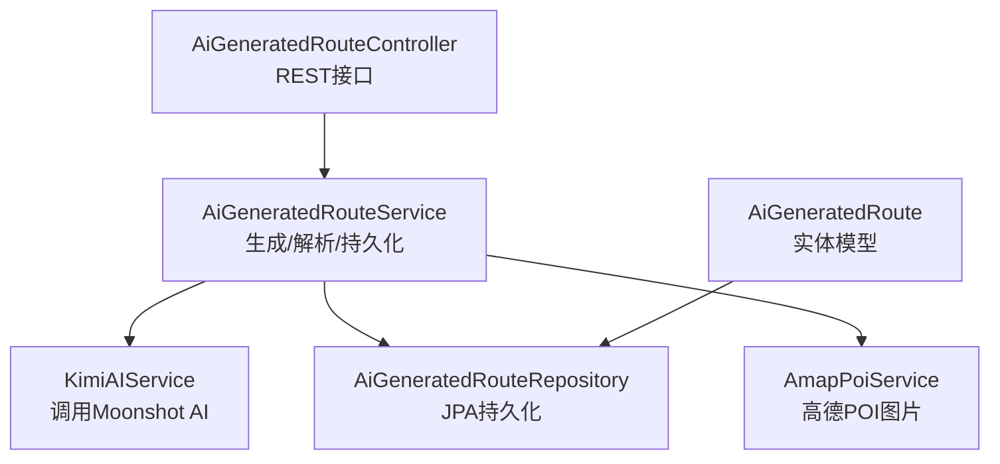
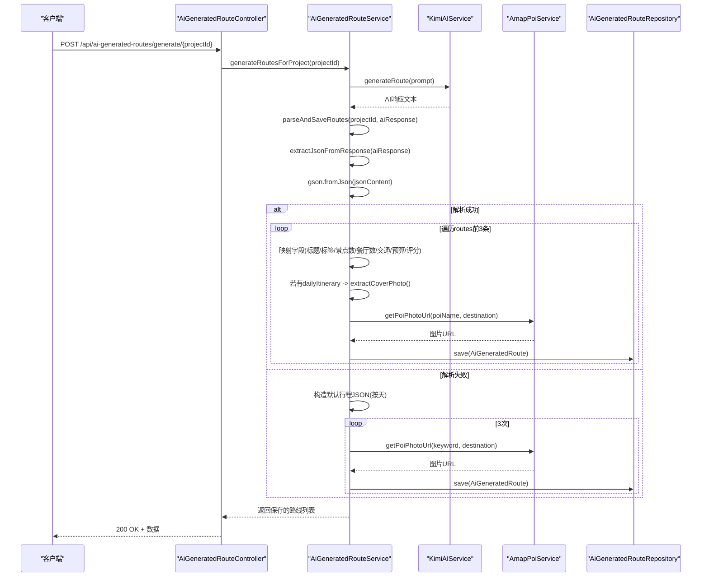
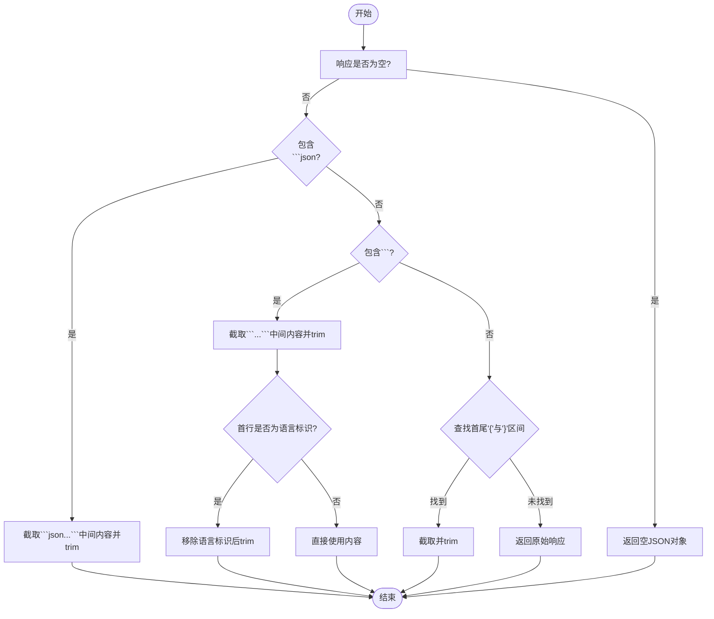
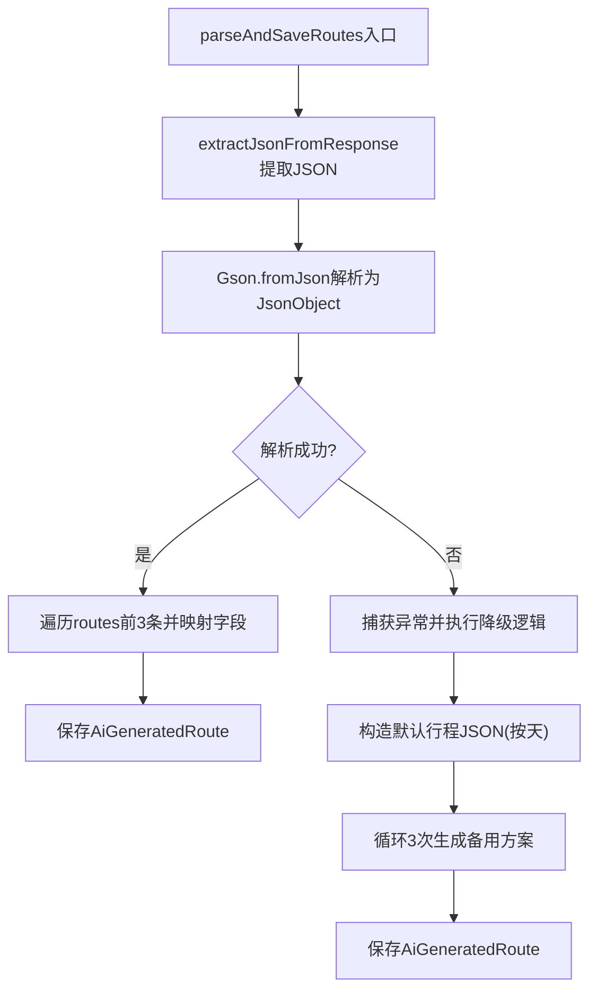
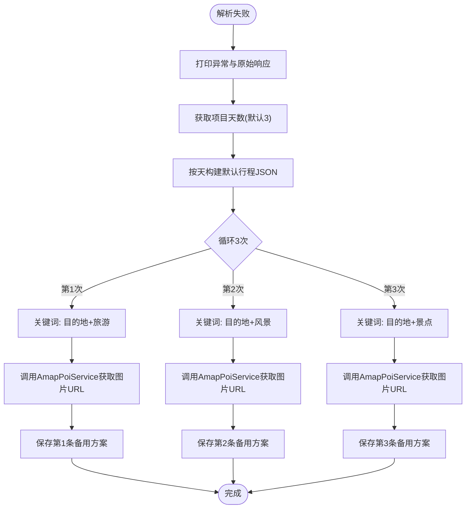
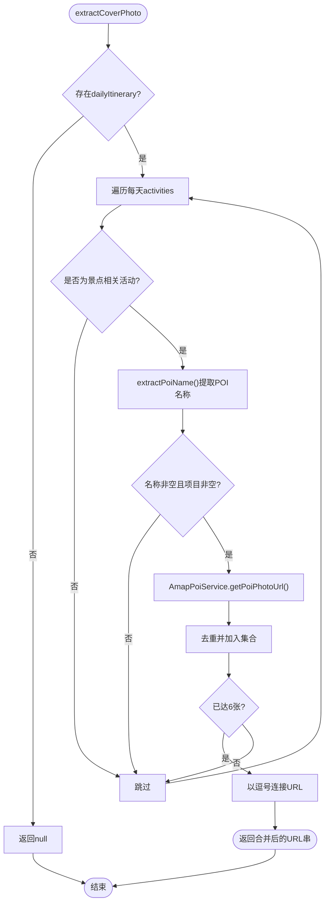
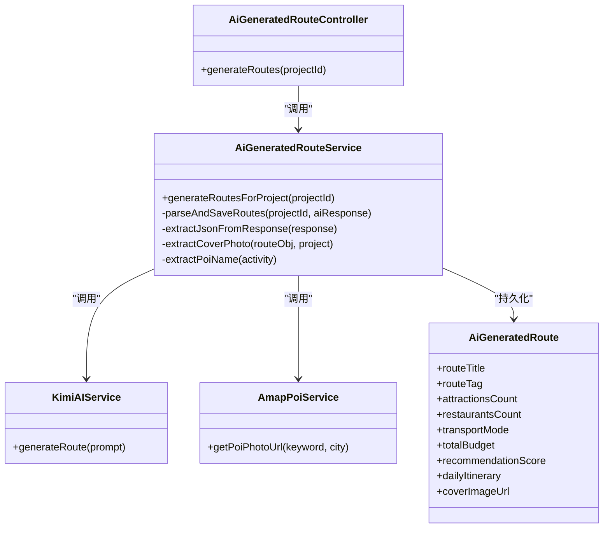

# AI响应解析与持久化

<cite>
**本文引用的文件列表**
- [AiGeneratedRouteService.java](file://tudianersha/src/main/java/com/tudianersha/service/AiGeneratedRouteService.java)
- [AiGeneratedRoute.java](file://tudianersha/src/main/java/com/tudianersha/entity/AiGeneratedRoute.java)
- [AmapPoiService.java](file://tudianersha/src/main/java/com/tudianersha/service/AmapPoiService.java)
- [KimiAIService.java](file://tudianersha/src/main/java/com/tudianersha/service/KimiAIService.java)
- [AiGeneratedRouteController.java](file://tudianersha/src/main/java/com/tudianersha/controller/AiGeneratedRouteController.java)
- [application.yml](file://tudianersha/src/main/resources/application.yml)
</cite>

## 目录
1. [引言](#引言)
2. [项目结构](#项目结构)
3. [核心组件](#核心组件)
4. [架构总览](#架构总览)
5. [详细组件分析](#详细组件分析)
6. [依赖关系分析](#依赖关系分析)
7. [性能考量](#性能考量)
8. [故障排查指南](#故障排查指南)
9. [结论](#结论)

## 引言
本文件围绕 parseAndSaveRoutes 方法的JSON解析与数据持久化流程进行系统性剖析，重点覆盖以下四方面：
1) extractJsonFromResponse 辅助方法如何从AI的Markdown格式响应中提取纯JSON内容（支持```json```和```代码块）；
2) Gson库解析JSON的异常处理机制；
3) 解析成功时，如何将JSON中的routes数组映射到 AiGeneratedRoute 实体的各个字段（包括路线标题、标签、景点数、餐厅数、交通方式、预算、推荐指数等），并说明每个字段的默认值策略；
4) 解析失败时的优雅降级方案——如何生成包含默认行程数据的3条备用路线，并说明 extractCoverPhoto 如何从每日行程中提取景点名称，调用 AmapPoiService 获取高德地图POI图片URL，以及多张图片URL用逗号连接存储的策略。

同时，文档涵盖异常处理、日志记录、数据库保存等细节，并提供成功与失败场景的流程图，帮助读者快速理解端到端的数据流。

## 项目结构
本项目采用Spring Boot分层架构，AI响应解析与持久化主要涉及服务层与实体层：
- 服务层：AiGeneratedRouteService 负责生成与解析AI响应、持久化到数据库、封面图提取与降级逻辑。
- 实体层：AiGeneratedRoute 映射数据库表，承载路线结构化字段与封面图URL。
- 外部集成：KimiAIService 调用外部AI接口；AmapPoiService 调用高德POI接口获取图片URL。
- 控制器：AiGeneratedRouteController 对外暴露生成接口，负责清理旧数据与统一返回。



图表来源
- [AiGeneratedRouteController.java](file://tudianersha/src/main/java/com/tudianersha/controller/AiGeneratedRouteController.java#L82-L111)
- [AiGeneratedRouteService.java](file://tudianersha/src/main/java/com/tudianersha/service/AiGeneratedRouteService.java#L69-L91)
- [AiGeneratedRoute.java](file://tudianersha/src/main/java/com/tudianersha/entity/AiGeneratedRoute.java#L5-L192)
- [AmapPoiService.java](file://tudianersha/src/main/java/com/tudianersha/service/AmapPoiService.java#L19-L361)
- [KimiAIService.java](file://tudianersha/src/main/java/com/tudianersha/service/KimiAIService.java#L1-L176)

章节来源
- [AiGeneratedRouteController.java](file://tudianersha/src/main/java/com/tudianersha/controller/AiGeneratedRouteController.java#L1-L112)
- [AiGeneratedRouteService.java](file://tudianersha/src/main/java/com/tudianersha/service/AiGeneratedRouteService.java#L69-L91)
- [AiGeneratedRoute.java](file://tudianersha/src/main/java/com/tudianersha/entity/AiGeneratedRoute.java#L5-L192)

## 核心组件
- AiGeneratedRouteService：实现 parseAndSaveRoutes、extractJsonFromResponse、extractCoverPhoto、extractPoiName 等关键逻辑。
- AiGeneratedRoute：持久化实体，包含路线标题、标签、景点/餐厅数量、交通方式、预算、推荐指数、每日行程JSON、封面图URL等字段。
- AmapPoiService：封装高德POI搜索与图片获取，提供 getPoiPhotoUrl 与 searchPoiWithPhotos。
- KimiAIService：封装Moonshot AI调用，返回AI生成的文本响应。
- AiGeneratedRouteController：对外提供生成接口，删除旧数据后生成新数据并返回。

章节来源
- [AiGeneratedRouteService.java](file://tudianersha/src/main/java/com/tudianersha/service/AiGeneratedRouteService.java#L193-L486)
- [AiGeneratedRoute.java](file://tudianersha/src/main/java/com/tudianersha/entity/AiGeneratedRoute.java#L5-L192)
- [AmapPoiService.java](file://tudianersha/src/main/java/com/tudianersha/service/AmapPoiService.java#L19-L361)
- [KimiAIService.java](file://tudianersha/src/main/java/com/tudianersha/service/KimiAIService.java#L1-L176)
- [AiGeneratedRouteController.java](file://tudianersha/src/main/java/com/tudianersha/controller/AiGeneratedRouteController.java#L82-L111)

## 架构总览
parseAndSaveRoutes 的端到端流程如下：
- 通过 KimiAIService 生成AI响应；
- 使用 extractJsonFromResponse 从Markdown代码块中提取JSON；
- 使用 Gson 解析JSON，若解析失败则触发降级逻辑；
- 成功解析后，遍历routes数组，映射到 AiGeneratedRoute 字段并保存；
- 若存在每日行程，提取封面图URL并回填；
- 解析失败时，构造默认行程与默认封面图，批量保存三条备用路线。



图表来源
- [AiGeneratedRouteController.java](file://tudianersha/src/main/java/com/tudianersha/controller/AiGeneratedRouteController.java#L82-L111)
- [AiGeneratedRouteService.java](file://tudianersha/src/main/java/com/tudianersha/service/AiGeneratedRouteService.java#L69-L91)
- [AiGeneratedRouteService.java](file://tudianersha/src/main/java/com/tudianersha/service/AiGeneratedRouteService.java#L193-L486)
- [AmapPoiService.java](file://tudianersha/src/main/java/com/tudianersha/service/AmapPoiService.java#L19-L361)
- [KimiAIService.java](file://tudianersha/src/main/java/com/tudianersha/service/KimiAIService.java#L1-L176)

## 详细组件分析

### 1) extractJsonFromResponse：从Markdown响应中提取纯JSON
该方法支持三种提取路径：
- 若响应包含```json代码块，则截取其中内容；
- 若仅包含```代码块，则去除语言标识后提取；
- 若未发现代码块，尝试从响应中直接定位首尾花括号，提取最内层JSON对象；
- 若均不满足，返回原响应字符串。



图表来源
- [AiGeneratedRouteService.java](file://tudianersha/src/main/java/com/tudianersha/service/AiGeneratedRouteService.java#L362-L396)

章节来源
- [AiGeneratedRouteService.java](file://tudianersha/src/main/java/com/tudianersha/service/AiGeneratedRouteService.java#L362-L396)

### 2) Gson解析JSON的异常处理机制
- parseAndSaveRoutes 中使用 Gson.fromJson 将提取后的JSON字符串解析为 JsonObject；
- 若解析抛出异常，立即捕获并执行降级逻辑（见下节）；
- 日志方面：方法内部打印“Extracted JSON content”、“解析到 N 条路线”等调试信息，便于问题定位。



图表来源
- [AiGeneratedRouteService.java](file://tudianersha/src/main/java/com/tudianersha/service/AiGeneratedRouteService.java#L193-L359)

章节来源
- [AiGeneratedRouteService.java](file://tudianersha/src/main/java/com/tudianersha/service/AiGeneratedRouteService.java#L193-L359)

### 3) 解析成功时的字段映射与默认值策略
当routes数组存在时，对每条路线映射以下字段（若JSON中缺失则使用默认值）：
- 路线标题 routeTitle：JSON中存在则使用，否则默认“方案i”；
- 特色标签 routeTag：JSON中存在则使用，否则默认“AI推荐”；
- 景点数量 attractionsCount：JSON中存在则使用，否则默认10；
- 餐厅数量 restaurantsCount：JSON中存在则使用，否则默认6；
- 交通方式 transportMode：JSON中存在则使用，否则默认“公共交通”；
- 总预算 totalBudget：JSON中存在则使用，否则默认5000；
- 推荐指数 recommendationScore：JSON中存在则使用，否则默认85；
- 每日行程 dailyItinerary：直接保存为字符串（JSON数组形式）；
- 封面图URL coverImageUrl：若存在dailyItinerary，尝试提取封面图并回填。

此外，方法还会保存原始AI响应 routeContent 与生成时间 generatedTime，便于后续展示与审计。

章节来源
- [AiGeneratedRouteService.java](file://tudianersha/src/main/java/com/tudianersha/service/AiGeneratedRouteService.java#L213-L291)
- [AiGeneratedRoute.java](file://tudianersha/src/main/java/com/tudianersha/entity/AiGeneratedRoute.java#L5-L192)

### 4) 解析失败时的优雅降级方案
当Gson解析失败时，服务会：
- 打印异常信息与原始AI响应；
- 根据项目天数构造默认每日行程（包含早餐/上午/午餐/下午/晚餐/晚上等典型活动）；
- 为三条备用方案分别设置默认字段（标题/标签/预算/评分等）；
- 为每条方案尝试获取目的地相关关键词的封面图（如“旅游”“风景”“景点”），若成功则回填；
- 逐条保存至数据库。



图表来源
- [AiGeneratedRouteService.java](file://tudianersha/src/main/java/com/tudianersha/service/AiGeneratedRouteService.java#L293-L359)
- [AmapPoiService.java](file://tudianersha/src/main/java/com/tudianersha/service/AmapPoiService.java#L19-L361)

章节来源
- [AiGeneratedRouteService.java](file://tudianersha/src/main/java/com/tudianersha/service/AiGeneratedRouteService.java#L293-L359)

### 5) extractCoverPhoto：从每日行程提取POI图片并合并
- 从 dailyItinerary 数组中遍历每一天的 activities；
- 仅提取与“景点”相关的活动（如上午/下午/晚上+景点：或包含“参观/游览/前往/体验/品尝/打卡”等动词的活动）；
- 使用 extractPoiName 从活动字符串中抽取POI名称；
- 调用 AmapPoiService.getPoiPhotoUrl 获取图片URL，最多收集6张；
- 将多张URL以逗号连接后存入 coverImageUrl。



图表来源
- [AiGeneratedRouteService.java](file://tudianersha/src/main/java/com/tudianersha/service/AiGeneratedRouteService.java#L398-L447)
- [AiGeneratedRouteService.java](file://tudianersha/src/main/java/com/tudianersha/service/AiGeneratedRouteService.java#L450-L486)
- [AmapPoiService.java](file://tudianersha/src/main/java/com/tudianersha/service/AmapPoiService.java#L19-L361)

章节来源
- [AiGeneratedRouteService.java](file://tudianersha/src/main/java/com/tudianersha/service/AiGeneratedRouteService.java#L398-L447)
- [AiGeneratedRouteService.java](file://tudianersha/src/main/java/com/tudianersha/service/AiGeneratedRouteService.java#L450-L486)
- [AmapPoiService.java](file://tudianersha/src/main/java/com/tudianersha/service/AmapPoiService.java#L19-L361)

### 6) extractPoiName：从活动字符串中抽取POI名称
- 去除时间戳前缀（如08:00-09:00）；
- 去除常见时间前缀（上午/下午/晚上/中午/早餐/午餐/晚餐）；
- 去除常见动词（参观/游览/前往/体验/品尝/打卡）；
- 截断至首个逗号、中文逗号或句号之前；
- 返回修剪后的名称。

章节来源
- [AiGeneratedRouteService.java](file://tudianersha/src/main/java/com/tudianersha/service/AiGeneratedRouteService.java#L450-L486)

## 依赖关系分析
- AiGeneratedRouteController 依赖 AiGeneratedRouteService，负责删除旧数据并调用生成方法；
- AiGeneratedRouteService 依赖 KimiAIService（AI响应）、AmapPoiService（封面图）、AiGeneratedRouteRepository（持久化）；
- AiGeneratedRoute 实体映射数据库表，字段与JSON结构一一对应，便于序列化/反序列化。



图表来源
- [AiGeneratedRouteController.java](file://tudianersha/src/main/java/com/tudianersha/controller/AiGeneratedRouteController.java#L82-L111)
- [AiGeneratedRouteService.java](file://tudianersha/src/main/java/com/tudianersha/service/AiGeneratedRouteService.java#L69-L91)
- [AiGeneratedRouteService.java](file://tudianersha/src/main/java/com/tudianersha/service/AiGeneratedRouteService.java#L193-L486)
- [AiGeneratedRoute.java](file://tudianersha/src/main/java/com/tudianersha/entity/AiGeneratedRoute.java#L5-L192)
- [AmapPoiService.java](file://tudianersha/src/main/java/com/tudianersha/service/AmapPoiService.java#L19-L361)
- [KimiAIService.java](file://tudianersha/src/main/java/com/tudianersha/service/KimiAIService.java#L1-L176)

章节来源
- [AiGeneratedRouteController.java](file://tudianersha/src/main/java/com/tudianersha/controller/AiGeneratedRouteController.java#L82-L111)
- [AiGeneratedRouteService.java](file://tudianersha/src/main/java/com/tudianersha/service/AiGeneratedRouteService.java#L69-L91)
- [AiGeneratedRoute.java](file://tudianersha/src/main/java/com/tudianersha/entity/AiGeneratedRoute.java#L5-L192)

## 性能考量
- JSON提取阶段：正则与字符串截取操作复杂度较低，但需注意大文本时的内存占用与字符串拼接成本；
- Gson解析：单次解析开销较小，但异常分支会触发降级逻辑，包含多次网络调用；
- 高德POI图片获取：每次提取最多6张图片，整体并发受网络与第三方API速率限制影响；
- 数据库保存：批量保存时建议结合事务与批处理优化（当前实现逐条保存，可按需优化）。

[本节为通用性能讨论，不直接分析具体文件]

## 故障排查指南
- AI响应解析失败
  - 现象：parseAndSaveRoutes 捕获异常并执行降级逻辑；
  - 排查要点：检查 extractJsonFromResponse 是否正确提取JSON；确认AI返回格式是否符合预期；查看日志中“Extracted JSON content”“解析到 N 条路线”等信息。
  - 参考路径：[AiGeneratedRouteService.java](file://tudianersha/src/main/java/com/tudianersha/service/AiGeneratedRouteService.java#L193-L359)

- 封面图获取失败
  - 现象：extractCoverPhoto 或 AmapPoiService 抛出异常或返回默认占位图；
  - 排查要点：确认 extractPoiName 是否正确抽取POI名称；检查高德API密钥与网络连通性；查看AmapPoiService日志输出。
  - 参考路径：[AiGeneratedRouteService.java](file://tudianersha/src/main/java/com/tudianersha/service/AiGeneratedRouteService.java#L398-L447), [AmapPoiService.java](file://tudianersha/src/main/java/com/tudianersha/service/AmapPoiService.java#L19-L361)

- 数据库保存异常
  - 现象：保存失败或数据不一致；
  - 排查要点：检查数据库连接配置与DDL自动更新设置；确认实体字段与表结构一致；查看JPA日志。
  - 参考路径：[application.yml](file://tudianersha/src/main/resources/application.yml#L1-L57), [AiGeneratedRoute.java](file://tudianersha/src/main/java/com/tudianersha/entity/AiGeneratedRoute.java#L5-L192)

- 接口调用错误
  - 现象：控制器返回400/500；
  - 排查要点：检查项目是否存在、参数合法性；查看控制器异常分支返回信息。
  - 参考路径：[AiGeneratedRouteController.java](file://tudianersha/src/main/java/com/tudianersha/controller/AiGeneratedRouteController.java#L82-L111)

章节来源
- [AiGeneratedRouteService.java](file://tudianersha/src/main/java/com/tudianersha/service/AiGeneratedRouteService.java#L193-L359)
- [AiGeneratedRouteService.java](file://tudianersha/src/main/java/com/tudianersha/service/AiGeneratedRouteService.java#L398-L447)
- [AmapPoiService.java](file://tudianersha/src/main/java/com/tudianersha/service/AmapPoiService.java#L19-L361)
- [AiGeneratedRouteController.java](file://tudianersha/src/main/java/com/tudianersha/controller/AiGeneratedRouteController.java#L82-L111)
- [application.yml](file://tudianersha/src/main/resources/application.yml#L1-L57)
- [AiGeneratedRoute.java](file://tudianersha/src/main/java/com/tudianersha/entity/AiGeneratedRoute.java#L5-L192)

## 结论
parseAndSaveRoutes 方法通过“提取JSON→解析→映射→保存”的清晰流程，实现了从AI响应到数据库的可靠落地。其设计亮点在于：
- 对Markdown响应的健壮提取策略；
- 对Gson解析异常的优雅降级；
- 对字段缺失的明确默认值策略；
- 对封面图的智能提取与容错回退；
- 对每日行程的结构化存储与展示友好。

建议后续可考虑：
- 在解析失败时增加重试与告警；
- 对高德API调用进行限流与缓存；
- 批量保存优化与事务控制；
- 前端展示时对AI响应进行二次清洗（移除代码块）以提升可读性。

[本节为总结性内容，不直接分析具体文件]