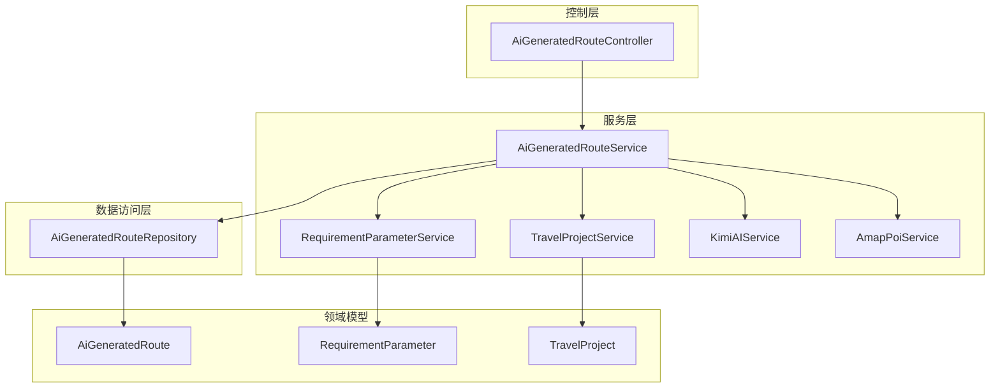
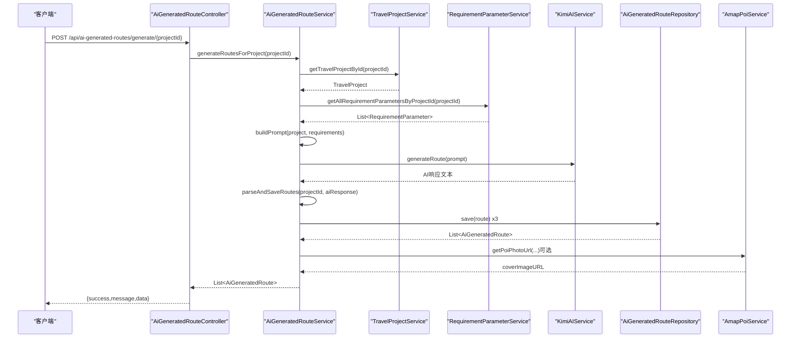
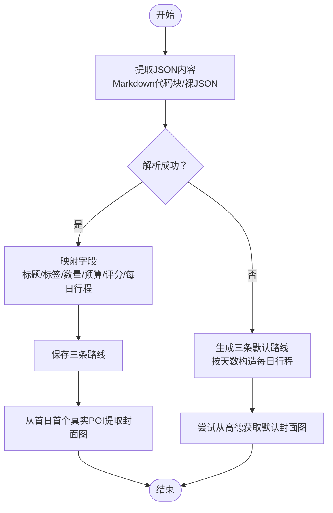
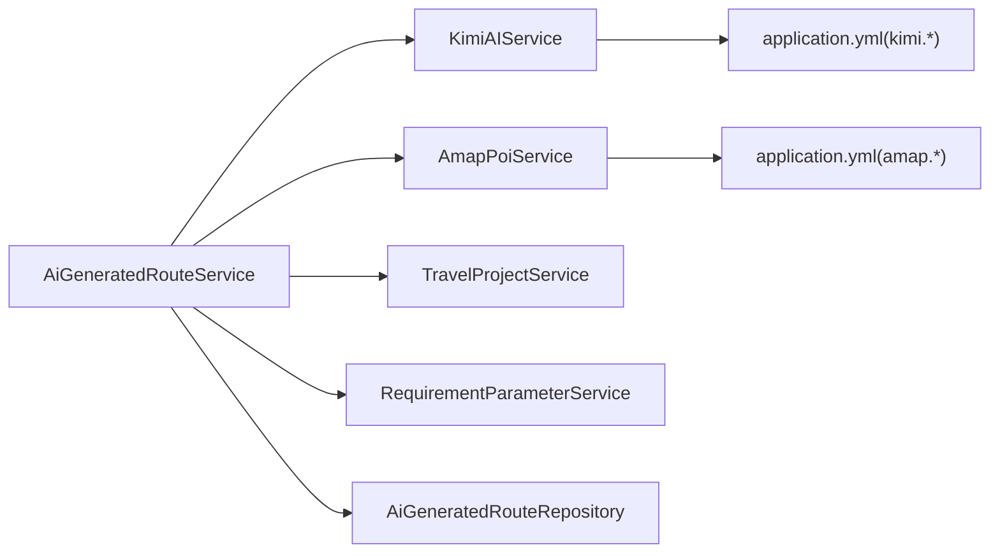

# AI路线生成服务

<cite>
**本文引用的文件列表**
- [AiGeneratedRouteService.java](file://tudianersha/src/main/java/com/tudianersha/service/AiGeneratedRouteService.java)
- [KimiAIService.java](file://tudianersha/src/main/java/com/tudianersha/service/KimiAIService.java)
- [TravelProjectService.java](file://tudianersha/src/main/java/com/tudianersha/service/TravelProjectService.java)
- [RequirementParameterService.java](file://tudianersha/src/main/java/com/tudianersha/service/RequirementParameterService.java)
- [AmapPoiService.java](file://tudianersha/src/main/java/com/tudianersha/service/AmapPoiService.java)
- [AiGeneratedRoute.java](file://tudianersha/src/main/java/com/tudianersha/entity/AiGeneratedRoute.java)
- [RequirementParameter.java](file://tudianersha/src/main/java/com/tudianersha/entity/RequirementParameter.java)
- [TravelProject.java](file://tudianersha/src/main/java/com/tudianersha/entity/TravelProject.java)
- [AiGeneratedRouteController.java](file://tudianersha/src/main/java/com/tudianersha/controller/AiGeneratedRouteController.java)
- [AiGeneratedRouteRepository.java](file://tudianersha/src/main/java/com/tudianersha/repository/AiGeneratedRouteRepository.java)
- [application.yml](file://tudianersha/src/main/resources/application.yml)
</cite>

## 目录
1. [简介](#简介)
2. [项目结构](#项目结构)
3. [核心组件](#核心组件)
4. [架构总览](#架构总览)
5. [详细组件分析](#详细组件分析)
6. [依赖关系分析](#依赖关系分析)
7. [性能与可靠性](#性能与可靠性)
8. [故障排查指南](#故障排查指南)
9. [结论](#结论)

## 简介
本文件围绕 AiGeneratedRouteService 类展开，系统性剖析其“为旅行项目生成三条AI路线”的核心业务流程，重点覆盖 generateRoutesForProject 的五个关键步骤，并深入解析：
- buildPrompt 如何聚合旅行项目信息与用户需求，构造面向AI模型的结构化提示
- parseAndSaveRoutes 的JSON解析与异常恢复机制（当AI响应格式错误时生成默认路线）
- 封面图片提取流程（从每日行程中抽取真实POI并调用高德POI接口获取图片）
- 服务层与 TravelProjectService、RequirementParameterService、KimiAIService、AmapPoiService 的协作关系

## 项目结构
该模块采用典型的分层架构：Controller 负责HTTP入口与响应封装；Service 负责业务编排与跨服务协调；Repository 负责数据持久化；Entity 描述领域对象；Controller 通过 Service 调用外部AI与地图服务。

图表来源
- [AiGeneratedRouteController.java](file://tudianersha/src/main/java/com/tudianersha/controller/AiGeneratedRouteController.java#L1-L112)
- [AiGeneratedRouteService.java](file://tudianersha/src/main/java/com/tudianersha/service/AiGeneratedRouteService.java#L1-L486)
- [TravelProjectService.java](file://tudianersha/src/main/java/com/tudianersha/service/TravelProjectService.java#L1-L40)
- [RequirementParameterService.java](file://tudianersha/src/main/java/com/tudianersha/service/RequirementParameterService.java#L1-L40)
- [KimiAIService.java](file://tudianersha/src/main/java/com/tudianersha/service/KimiAIService.java#L1-L176)
- [AmapPoiService.java](file://tudianersha/src/main/java/com/tudianersha/service/AmapPoiService.java#L1-L363)
- [AiGeneratedRouteRepository.java](file://tudianersha/src/main/java/com/tudianersha/repository/AiGeneratedRouteRepository.java#L1-L12)
- [AiGeneratedRoute.java](file://tudianersha/src/main/java/com/tudianersha/entity/AiGeneratedRoute.java#L1-L193)
- [RequirementParameter.java](file://tudianersha/src/main/java/com/tudianersha/entity/RequirementParameter.java#L1-L123)
- [TravelProject.java](file://tudianersha/src/main/java/com/tudianersha/entity/TravelProject.java#L1-L163)

章节来源
- [AiGeneratedRouteController.java](file://tudianersha/src/main/java/com/tudianersha/controller/AiGeneratedRouteController.java#L1-L112)
- [AiGeneratedRouteService.java](file://tudianersha/src/main/java/com/tudianersha/service/AiGeneratedRouteService.java#L1-L120)

## 核心组件
- AiGeneratedRouteService：负责生成AI路线的主流程编排，包括项目校验、需求聚合、提示词构建、调用AI、解析与落库、封面图提取与回退策略。
- KimiAIService：封装Moonshot Kimi API调用，负责发送系统提示与用户提示，接收并解析AI回复。
- TravelProjectService：提供旅行项目的查询能力，为提示词构建与回退策略提供基础信息。
- RequirementParameterService：按项目ID查询所有参与者的需求参数，作为提示词的重要输入。
- AmapPoiService：对接高德POI接口，支持POI搜索、照片提取与地理编码辅助。
- AiGeneratedRouteRepository：JPA仓库，提供按项目ID查询与CRUD操作。
- 实体类 AiGeneratedRoute、RequirementParameter、TravelProject：承载持久化字段与业务语义。

章节来源
- [AiGeneratedRouteService.java](file://tudianersha/src/main/java/com/tudianersha/service/AiGeneratedRouteService.java#L1-L120)
- [KimiAIService.java](file://tudianersha/src/main/java/com/tudianersha/service/KimiAIService.java#L1-L120)
- [TravelProjectService.java](file://tudianersha/src/main/java/com/tudianersha/service/TravelProjectService.java#L1-L40)
- [RequirementParameterService.java](file://tudianersha/src/main/java/com/tudianersha/service/RequirementParameterService.java#L1-L40)
- [AmapPoiService.java](file://tudianersha/src/main/java/com/tudianersha/service/AmapPoiService.java#L1-L120)
- [AiGeneratedRouteRepository.java](file://tudianersha/src/main/java/com/tudianersha/repository/AiGeneratedRouteRepository.java#L1-L12)
- [AiGeneratedRoute.java](file://tudianersha/src/main/java/com/tudianersha/entity/AiGeneratedRoute.java#L1-L193)
- [RequirementParameter.java](file://tudianersha/src/main/java/com/tudianersha/entity/RequirementParameter.java#L1-L123)
- [TravelProject.java](file://tudianersha/src/main/java/com/tudianersha/entity/TravelProject.java#L1-L163)

## 架构总览
下图展示 generateRoutesForProject 的端到端调用序列，从Controller触发到AI生成、解析与落库，再到封面图提取与回退。

图表来源
- [AiGeneratedRouteController.java](file://tudianersha/src/main/java/com/tudianersha/controller/AiGeneratedRouteController.java#L78-L112)
- [AiGeneratedRouteService.java](file://tudianersha/src/main/java/com/tudianersha/service/AiGeneratedRouteService.java#L70-L120)
- [KimiAIService.java](file://tudianersha/src/main/java/com/tudianersha/service/KimiAIService.java#L44-L98)
- [AiGeneratedRouteRepository.java](file://tudianersha/src/main/java/com/tudianersha/repository/AiGeneratedRouteRepository.java#L1-L12)
- [AmapPoiService.java](file://tudianersha/src/main/java/com/tudianersha/service/AmapPoiService.java#L203-L219)

## 详细组件分析

### generateRoutesForProject 方法的五步走
- 步骤一：验证项目存在性
  - 通过 TravelProjectService 查询项目，不存在则抛出非法参数异常。
- 步骤二：获取所有参与者需求参数
  - 通过 RequirementParameterService 按项目ID查询所有需求参数，若为空则抛出异常。
- 步骤三：构建AI提示词（buildPrompt）
  - 聚合项目基本信息（名称、目的地、时间、天数、人数）与各参与者的兴趣标签、心愿单、不喜欢项、每日预算等，附加AI生成规范与严格JSON格式要求。
- 步骤四：调用KimiAIService生成响应
  - 以系统提示+用户提示的方式调用Moonshot Kimi API，返回AI生成的文本（通常为包含JSON的Markdown块）。
- 步骤五：解析并保存结果（parseAndSaveRoutes）
  - 从响应中提取JSON（支持Markdown代码块包裹），解析routes数组中的前三条；逐条填充AiGeneratedRoute字段并保存；同时尝试从首日首个真实POI提取封面图URL；若解析失败，则生成三条默认路线并尝试从高德获取默认封面图。

章节来源
- [AiGeneratedRouteService.java](file://tudianersha/src/main/java/com/tudianersha/service/AiGeneratedRouteService.java#L70-L120)
- [AiGeneratedRouteService.java](file://tudianersha/src/main/java/com/tudianersha/service/AiGeneratedRouteService.java#L194-L360)

### buildPrompt：结构化提示词构造
- 输入来源
  - 旅行项目：名称、目的地、起止日期、天数、人数
  - 参与者需求：兴趣标签、心愿单、不喜欢项、每日预算
- 输出要求
  - 明确要求AI生成三条不同风格的路线，每条包含标题、标签、景点数量、餐厅数量、交通方式、总预算、推荐指数、每日详细行程（精确到小时、包含真实景点与餐厅名称、开放时间、门票、游玩时长建议等）
  - 强制要求严格JSON格式，给出示例模板，强调景点与餐厅必须真实可检索
- 设计要点
  - 将旅行项目与需求参数以自然语言形式组织，便于AI理解上下文
  - 对AI输出格式进行强约束，降低后续解析难度
  - 通过“必须遵守的规则”限定景点真实性与合理性，减少无效或不可执行的行程

章节来源
- [AiGeneratedRouteService.java](file://tudianersha/src/main/java/com/tudianersha/service/AiGeneratedRouteService.java#L94-L193)

### parseAndSaveRoutes：JSON解析、异常恢复与封面图提取
- JSON提取策略
  - 若响应被Markdown代码块包裹，先剥离代码块内容并去除语言标识
  - 否则尝试从响应中定位首尾大括号，提取最内层JSON对象
  - 若仍无法解析，进入异常恢复流程
- 字段映射与默认值
  - routes数组最多取前三条
  - 对缺失字段使用稳健默认值（如标题、标签、景点/餐厅数量、交通方式、总预算、推荐指数）
- 异常恢复机制
  - 解析失败时，基于项目天数生成默认每日行程模板，创建三条默认路线
  - 使用目的地关键词组合尝试从高德获取默认封面图
- 封面图片提取流程
  - 从每日行程中筛选“景点/上午/下午/晚上”等与POI相关的活动
  - 从活动文本中抽取POI名称（去除时间戳与前缀后取首个片段）
  - 调用高德POI服务获取照片URL，最多收集6张，合并为逗号分隔字符串存入封面图字段
  - 若提取失败，保留空值或使用默认占位图（在封面图提取阶段由AmapPoiService兜底）

图表来源
- [AiGeneratedRouteService.java](file://tudianersha/src/main/java/com/tudianersha/service/AiGeneratedRouteService.java#L194-L360)
- [AmapPoiService.java](file://tudianersha/src/main/java/com/tudianersha/service/AmapPoiService.java#L203-L219)

章节来源
- [AiGeneratedRouteService.java](file://tudianersha/src/main/java/com/tudianersha/service/AiGeneratedRouteService.java#L194-L360)
- [AmapPoiService.java](file://tudianersha/src/main/java/com/tudianersha/service/AmapPoiService.java#L203-L219)

### 封面图片提取细节：POI名称抽取与高德调用
- POI名称抽取
  - 去除时间戳前缀（如 HH:mm-HH:mm）
  - 去除常见时段前缀（上午/下午/晚上/中午/早餐/午餐/晚餐等）
  - 去除常见动词（参观/游览/前往/体验/品尝/打卡等）
  - 截取首个逗号/顿号/句号之前的片段作为候选名称
- 高德POI服务
  - 支持按关键字与城市搜索POI并返回照片URL
  - 若无有效照片，返回占位图URL

章节来源
- [AiGeneratedRouteService.java](file://tudianersha/src/main/java/com/tudianersha/service/AiGeneratedRouteService.java#L400-L486)
- [AmapPoiService.java](file://tudianersha/src/main/java/com/tudianersha/service/AmapPoiService.java#L196-L219)

### 服务层协作关系
- 与 TravelProjectService 的协作
  - 用于获取项目基本信息（目的地、天数等），支撑提示词构建与回退策略
- 与 RequirementParameterService 的协作
  - 用于聚合所有参与者的需求参数，作为提示词输入
- 与 KimiAIService 的协作
  - 发送系统提示与用户提示，接收AI生成的文本
- 与 AmapPoiService 的协作
  - 在解析阶段尝试从每日行程中提取POI并获取封面图；在异常恢复阶段使用目的地关键词组合兜底

章节来源
- [AiGeneratedRouteService.java](file://tudianersha/src/main/java/com/tudianersha/service/AiGeneratedRouteService.java#L1-L120)
- [KimiAIService.java](file://tudianersha/src/main/java/com/tudianersha/service/KimiAIService.java#L44-L98)
- [AmapPoiService.java](file://tudianersha/src/main/java/com/tudianersha/service/AmapPoiService.java#L196-L219)

## 依赖关系分析
- 组件耦合
  - AiGeneratedRouteService 依赖多个服务与仓库，承担编排职责，耦合度适中
  - 与KimiAIService、AmapPoiService均为外部服务依赖，通过接口隔离
- 外部依赖
  - Moonshot Kimi API：用于生成旅行路线
  - 高德地图POI API：用于获取POI照片与辅助信息
- 配置依赖
  - application.yml 中配置 Kimi 与高德API密钥与URL

图表来源
- [AiGeneratedRouteService.java](file://tudianersha/src/main/java/com/tudianersha/service/AiGeneratedRouteService.java#L1-L120)
- [KimiAIService.java](file://tudianersha/src/main/java/com/tudianersha/service/KimiAIService.java#L1-L60)
- [AmapPoiService.java](file://tudianersha/src/main/java/com/tudianersha/service/AmapPoiService.java#L1-L40)
- [application.yml](file://tudianersha/src/main/resources/application.yml#L47-L57)

章节来源
- [application.yml](file://tudianersha/src/main/resources/application.yml#L47-L57)

## 性能与可靠性
- 超时与并发
  - KimiAIService 设置了较长的连接/读取/写入超时，适合AI生成较长响应
- 解析健壮性
  - parseAndSaveRoutes 对AI响应格式进行多策略提取，具备强容错能力
- 回退策略
  - JSON解析失败时自动生成默认路线，保证功能可用性
- 图片获取稳定性
  - AmapPoiService 返回占位图兜底，避免封面图缺失导致的UI问题

章节来源
- [KimiAIService.java](file://tudianersha/src/main/java/com/tudianersha/service/KimiAIService.java#L28-L40)
- [AiGeneratedRouteService.java](file://tudianersha/src/main/java/com/tudianersha/service/AiGeneratedRouteService.java#L194-L360)
- [AmapPoiService.java](file://tudianersha/src/main/java/com/tudianersha/service/AmapPoiService.java#L203-L219)

## 故障排查指南
- 项目不存在或无需求参数
  - 现象：抛出非法参数异常
  - 排查：确认项目ID正确且存在需求参数
- AI响应非JSON或格式不符
  - 现象：解析失败，触发默认路线生成
  - 排查：检查提示词是否满足严格JSON格式要求；确认Kimi模型与API配置正确
- 封面图提取失败
  - 现象：封面图为空或使用默认占位图
  - 排查：确认每日行程中包含真实POI名称；检查高德API密钥与网络连通性
- API调用失败
  - 现象：Kimi或高德API返回非成功状态
  - 排查：核对application.yml中的密钥与URL；查看服务端日志

章节来源
- [AiGeneratedRouteService.java](file://tudianersha/src/main/java/com/tudianersha/service/AiGeneratedRouteService.java#L70-L120)
- [AiGeneratedRouteService.java](file://tudianersha/src/main/java/com/tudianersha/service/AiGeneratedRouteService.java#L194-L360)
- [KimiAIService.java](file://tudianersha/src/main/java/com/tudianersha/service/KimiAIService.java#L77-L98)
- [AmapPoiService.java](file://tudianersha/src/main/java/com/tudianersha/service/AmapPoiService.java#L203-L219)
- [application.yml](file://tudianersha/src/main/resources/application.yml#L47-L57)

## 结论
AiGeneratedRouteService 通过清晰的五步流程与稳健的异常恢复机制，实现了从旅行项目与参与者需求到AI生成路线的完整闭环。其提示词构建严谨、解析逻辑健壮、封面图提取与回退策略完备，配合Kimi与高德外部服务，形成了可靠的AI路线生成能力。建议在生产环境中持续监控外部API稳定性，并根据用户反馈优化提示词与默认回退策略。