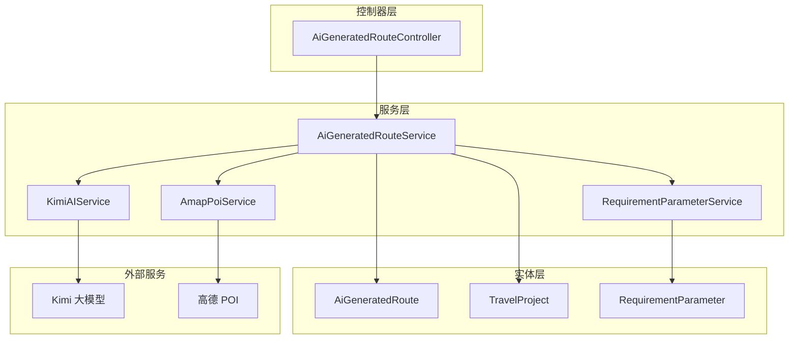
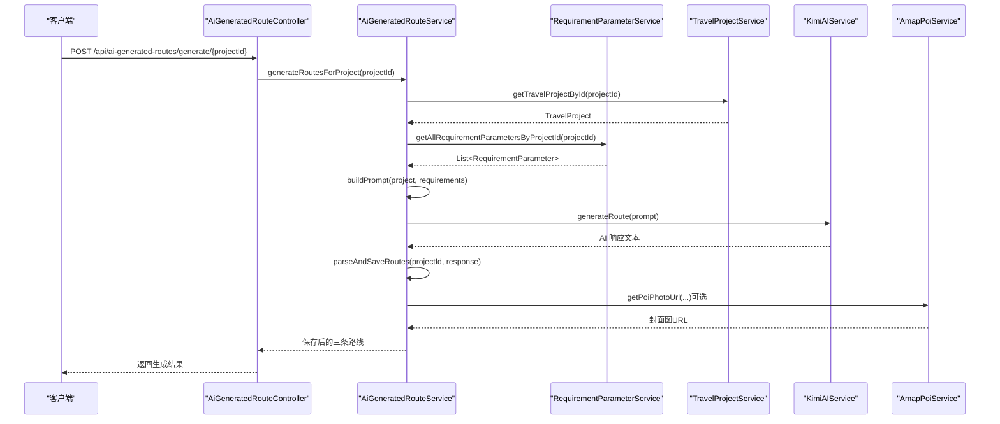
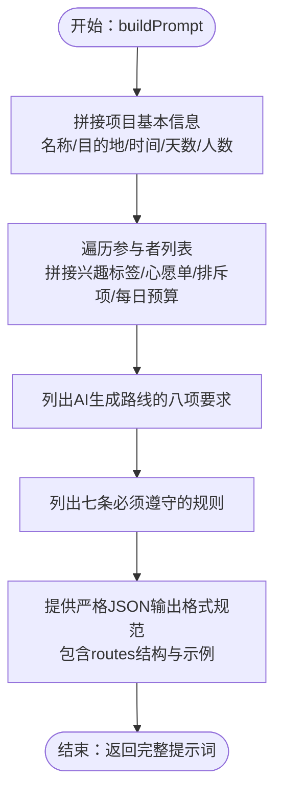
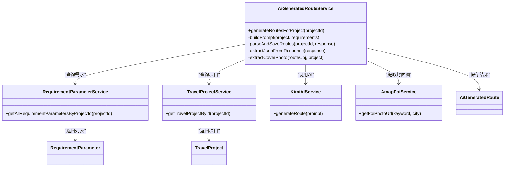

# 提示词构建机制

<cite>
**本文引用的文件列表**
- [AiGeneratedRouteService.java](file://tudianersha/src/main/java/com/tudianersha/service/AiGeneratedRouteService.java)
- [AiGeneratedRoute.java](file://tudianersha/src/main/java/com/tudianersha/entity/AiGeneratedRoute.java)
- [TravelProject.java](file://tudianersha/src/main/java/com/tudianersha/entity/TravelProject.java)
- [RequirementParameter.java](file://tudianersha/src/main/java/com/tudianersha/entity/RequirementParameter.java)
- [RequirementParameterService.java](file://tudianersha/src/main/java/com/tudianersha/service/RequirementParameterService.java)
- [KimiAIService.java](file://tudianersha/src/main/java/com/tudianersha/service/KimiAIService.java)
- [AmapPoiService.java](file://tudianersha/src/main/java/com/tudianersha/service/AmapPoiService.java)
- [AiGeneratedRouteController.java](file://tudianersha/src/main/java/com/tudianersha/controller/AiGeneratedRouteController.java)
- [application.yml](file://tudianersha/src/main/resources/application.yml)
- [schema.sql](file://tudianersha/src/main/resources/schema.sql)
</cite>

## 目录
1. [引言](#引言)
2. [项目结构](#项目结构)
3. [核心组件](#核心组件)
4. [架构总览](#架构总览)
5. [详细组件分析](#详细组件分析)
6. [依赖关系分析](#依赖关系分析)
7. [性能考量](#性能考量)
8. [故障排查指南](#故障排查指南)
9. [结论](#结论)
10. [附录](#附录)

## 引言
本文件围绕 AiGeneratedRouteService 类中的 buildPrompt 方法展开，系统性解析如何将 TravelProject 项目信息与 RequirementParameter 用户需求参数整合为符合大模型输入要求的结构化提示词。重点说明提示词的五大组成部分：
1) 项目基本信息（名称、目的地、时间、天数、人数）
2) 所有参与者的需求汇总（兴趣标签、愿望清单、排斥项、每日预算）
3) AI 生成路线的具体要求（路线名称、特色标签、每日行程等八项内容）
4) 必须遵守的七条规则（景点真实性、时间合理性、交通距离等）
5) 严格的 JSON 输出格式规范

同时，结合代码路径说明字符串拼接逻辑（如何遍历所有参与者并格式化其需求），解释为何强调高德地图可搜索的景点和餐厅，以及如何通过明确的格式要求确保 AI 输出的可解析性。最后给出实际生成的提示词示例，并分析其对 AI 生成质量的影响。

## 项目结构
该模块属于后端服务层，主要涉及服务编排、提示词构建、AI 调用与结果解析、封面图提取与落库等职责。关键文件如下：
- 服务层：AiGeneratedRouteService（提示词构建、AI 调用、结果解析与落库）
- 实体层：AiGeneratedRoute、TravelProject、RequirementParameter
- 服务层：RequirementParameterService（查询项目下所有需求参数）、KimiAIService（调用大模型）、AmapPoiService（POI 搜索与封面图）
- 控制器：AiGeneratedRouteController（对外暴露生成接口）
- 配置：application.yml（AI 与高德 API 的密钥与地址）
- 数据库：schema.sql（表结构定义）

图表来源
- [AiGeneratedRouteController.java](file://tudianersha/src/main/java/com/tudianersha/controller/AiGeneratedRouteController.java#L72-L112)
- [AiGeneratedRouteService.java](file://tudianersha/src/main/java/com/tudianersha/service/AiGeneratedRouteService.java#L70-L192)
- [RequirementParameterService.java](file://tudianersha/src/main/java/com/tudianersha/service/RequirementParameterService.java#L33-L39)
- [KimiAIService.java](file://tudianersha/src/main/java/com/tudianersha/service/KimiAIService.java#L44-L98)
- [AmapPoiService.java](file://tudianersha/src/main/java/com/tudianersha/service/AmapPoiService.java#L196-L219)
- [AiGeneratedRoute.java](file://tudianersha/src/main/java/com/tudianersha/entity/AiGeneratedRoute.java#L1-L193)
- [TravelProject.java](file://tudianersha/src/main/java/com/tudianersha/entity/TravelProject.java#L1-L163)
- [RequirementParameter.java](file://tudianersha/src/main/java/com/tudianersha/entity/RequirementParameter.java#L1-L123)

章节来源
- [AiGeneratedRouteController.java](file://tudianersha/src/main/java/com/tudianersha/controller/AiGeneratedRouteController.java#L72-L112)
- [AiGeneratedRouteService.java](file://tudianersha/src/main/java/com/tudianersha/service/AiGeneratedRouteService.java#L70-L192)
- [application.yml](file://tudianersha/src/main/resources/application.yml#L47-L57)
- [schema.sql](file://tudianersha/src/main/resources/schema.sql#L21-L100)

## 核心组件
- AiGeneratedRouteService：负责构建提示词、调用 KimiAIService 生成路线、解析并保存结果、提取封面图。
- RequirementParameterService：按项目 ID 查询所有参与者的需求参数。
- KimiAIService：封装 Moonshot API 请求，发送构建好的提示词并接收响应。
- AmapPoiService：基于关键词与城市进行高德 POI 搜索，提取照片 URL 作为封面图。
- 实体类：AiGeneratedRoute、TravelProject、RequirementParameter，承载持久化字段与业务属性。

章节来源
- [AiGeneratedRouteService.java](file://tudianersha/src/main/java/com/tudianersha/service/AiGeneratedRouteService.java#L70-L192)
- [RequirementParameterService.java](file://tudianersha/src/main/java/com/tudianersha/service/RequirementParameterService.java#L33-L39)
- [KimiAIService.java](file://tudianersha/src/main/java/com/tudianersha/service/KimiAIService.java#L44-L98)
- [AmapPoiService.java](file://tudianersha/src/main/java/com/tudianersha/service/AmapPoiService.java#L196-L219)
- [AiGeneratedRoute.java](file://tudianersha/src/main/java/com/tudianersha/entity/AiGeneratedRoute.java#L1-L193)
- [TravelProject.java](file://tudianersha/src/main/java/com/tudianersha/entity/TravelProject.java#L1-L163)
- [RequirementParameter.java](file://tudianersha/src/main/java/com/tudianersha/entity/RequirementParameter.java#L1-L123)

## 架构总览
提示词构建与生成流程如下：

图表来源
- [AiGeneratedRouteController.java](file://tudianersha/src/main/java/com/tudianersha/controller/AiGeneratedRouteController.java#L82-L112)
- [AiGeneratedRouteService.java](file://tudianersha/src/main/java/com/tudianersha/service/AiGeneratedRouteService.java#L70-L192)
- [RequirementParameterService.java](file://tudianersha/src/main/java/com/tudianersha/service/RequirementParameterService.java#L33-L39)
- [KimiAIService.java](file://tudianersha/src/main/java/com/tudianersha/service/KimiAIService.java#L44-L98)
- [AmapPoiService.java](file://tudianersha/src/main/java/com/tudianersha/service/AmapPoiService.java#L196-L219)

## 详细组件分析

### buildPrompt 方法：提示词构建的五大组成部分
buildPrompt 方法将 TravelProject 与 RequirementParameter 列表整合为结构化提示词，分为以下五大部分：

1) 项目基本信息
- 包含项目名称、目的地、出行时间范围、总天数、参与人数。
- 参考路径：[AiGeneratedRouteService.java](file://tudianersha/src/main/java/com/tudianersha/service/AiGeneratedRouteService.java#L97-L110)

2) 所有参与者的需求汇总
- 遍历 requirements 列表，逐个参与者输出兴趣标签、心愿单、排斥项、每日预算。
- 字符串拼接采用“参与者编号 + 字段名 + 内容”的固定格式，便于后续解析。
- 参考路径：[AiGeneratedRouteService.java](file://tudianersha/src/main/java/com/tudianersha/service/AiGeneratedRouteService.java#L109-L127)

3) AI 生成路线的具体要求
- 明确要求生成三条不同风格的路线，每条路线包含：路线名称、特色标签、每日详细行程、景点数量、餐厅数量、交通方式、总预算估算、推荐指数。
- 参考路径：[AiGeneratedRouteService.java](file://tudianersha/src/main/java/com/tudianersha/service/AiGeneratedRouteService.java#L128-L138)

4) 必须遵守的七条规则
- 景点必须真实存在且能在高德地图搜索到；每个活动必须包含时间段、景点/餐厅名称、开放时间、门票信息、游玩时长建议；餐厅必须真实存在；时间安排合理、考虑开放时间；景点间交通时间真实；避免安排当天无法预约的景点。
- 参考路径：[AiGeneratedRouteService.java](file://tudianersha/src/main/java/com/tudianersha/service/AiGeneratedRouteService.java#L139-L152)

5) 严格的 JSON 输出格式规范
- 要求返回包含 routes 数组的 JSON，每条路线包含 title、tag、attractions、restaurants、transport、budget、score、dailyItinerary 等字段。
- 提供了示例 JSON 结构与多行格式化片段，确保 AI 输出可被严格解析。
- 参考路径：[AiGeneratedRouteService.java](file://tudianersha/src/main/java/com/tudianersha/service/AiGeneratedRouteService.java#L153-L191)

图表来源
- [AiGeneratedRouteService.java](file://tudianersha/src/main/java/com/tudianersha/service/AiGeneratedRouteService.java#L97-L191)

章节来源
- [AiGeneratedRouteService.java](file://tudianersha/src/main/java/com/tudianersha/service/AiGeneratedRouteService.java#L97-L191)

### 字符串拼接逻辑与参与者格式化
- 使用 StringBuilder 进行高效拼接，避免频繁字符串对象创建。
- 对每个参与者，先输出“参与者编号”，再按字段顺序输出“字段名 + 内容”，保证结构一致。
- 对于预算字段，统一格式为“¥数值”，便于后续解析。
- 参考路径：
  - [AiGeneratedRouteService.java](file://tudianersha/src/main/java/com/tudianersha/service/AiGeneratedRouteService.java#L109-L127)

章节来源
- [AiGeneratedRouteService.java](file://tudianersha/src/main/java/com/tudianersha/service/AiGeneratedRouteService.java#L109-L127)

### 为什么强调高德地图可搜索的景点和餐厅
- 规则中明确要求景点/餐厅必须真实存在且能在高德地图搜索到，确保生成路线具备可落地性与可验证性。
- 解析阶段可利用 AmapPoiService 从 POI 名称提取封面图，提升用户体验。
- 参考路径：
  - [AiGeneratedRouteService.java](file://tudianersha/src/main/java/com/tudianersha/service/AiGeneratedRouteService.java#L139-L152)
  - [AmapPoiService.java](file://tudianersha/src/main/java/com/tudianersha/service/AmapPoiService.java#L196-L219)

章节来源
- [AiGeneratedRouteService.java](file://tudianersha/src/main/java/com/tudianersha/service/AiGeneratedRouteService.java#L139-L152)
- [AmapPoiService.java](file://tudianersha/src/main/java/com/tudianersha/service/AmapPoiService.java#L196-L219)

### 严格的 JSON 输出格式如何确保可解析性
- 在提示词末尾提供完整 JSON 结构示例，明确 routes 数组、每条路线字段与 dailyItinerary 的格式。
- parseAndSaveRoutes 中通过 extractJsonFromResponse 提取 JSON 片段，再用 Gson 解析，确保即使 AI 输出包含代码块标记也能正确提取。
- 参考路径：
  - [AiGeneratedRouteService.java](file://tudianersha/src/main/java/com/tudianersha/service/AiGeneratedRouteService.java#L153-L191)
  - [AiGeneratedRouteService.java](file://tudianersha/src/main/java/com/tudianersha/service/AiGeneratedRouteService.java#L362-L396)

章节来源
- [AiGeneratedRouteService.java](file://tudianersha/src/main/java/com/tudianersha/service/AiGeneratedRouteService.java#L153-L191)
- [AiGeneratedRouteService.java](file://tudianersha/src/main/java/com/tudianersha/service/AiGeneratedRouteService.java#L362-L396)

### 实际生成的提示词示例与质量影响
- 示例提示词由 buildPrompt 生成，包含项目基本信息、参与者需求、生成要求、规则与 JSON 规范。
- 质量影响：
  - 明确的字段与格式要求降低歧义，提高 AI 输出的结构化程度。
  - 强调“高德可搜索”与“开放时间/门票信息”减少无效 POI，提升可执行性。
  - 统一的 JSON 规范便于下游解析与落库，降低错误率。
- 参考路径：
  - [AiGeneratedRouteService.java](file://tudianersha/src/main/java/com/tudianersha/service/AiGeneratedRouteService.java#L97-L191)

章节来源
- [AiGeneratedRouteService.java](file://tudianersha/src/main/java/com/tudianersha/service/AiGeneratedRouteService.java#L97-L191)

### 生成流程与结果解析
- generateRoutesForProject：获取项目与需求 → 构建提示词 → 调用 KimiAIService → 解析并保存三条路线 → 可选提取封面图。
- parseAndSaveRoutes：提取 JSON、填充 AiGeneratedRoute 字段、回填封面图 URL。
- 参考路径：
  - [AiGeneratedRouteService.java](file://tudianersha/src/main/java/com/tudianersha/service/AiGeneratedRouteService.java#L70-L192)
  - [AiGeneratedRouteService.java](file://tudianersha/src/main/java/com/tudianersha/service/AiGeneratedRouteService.java#L194-L361)

章节来源
- [AiGeneratedRouteService.java](file://tudianersha/src/main/java/com/tudianersha/service/AiGeneratedRouteService.java#L70-L192)
- [AiGeneratedRouteService.java](file://tudianersha/src/main/java/com/tudianersha/service/AiGeneratedRouteService.java#L194-L361)

## 依赖关系分析
- AiGeneratedRouteService 依赖：
  - RequirementParameterService：查询项目下所有需求参数
  - TravelProjectService：获取项目基本信息
  - KimiAIService：调用大模型生成路线
  - AmapPoiService：提取 POI 封面图
- 实体依赖：
  - AiGeneratedRoute、TravelProject、RequirementParameter 作为数据载体
- 外部依赖：
  - Kimi API（Moonshot）与高德 POI API

图表来源
- [AiGeneratedRouteService.java](file://tudianersha/src/main/java/com/tudianersha/service/AiGeneratedRouteService.java#L70-L192)
- [RequirementParameterService.java](file://tudianersha/src/main/java/com/tudianersha/service/RequirementParameterService.java#L33-L39)
- [KimiAIService.java](file://tudianersha/src/main/java/com/tudianersha/service/KimiAIService.java#L44-L98)
- [AmapPoiService.java](file://tudianersha/src/main/java/com/tudianersha/service/AmapPoiService.java#L196-L219)
- [AiGeneratedRoute.java](file://tudianersha/src/main/java/com/tudianersha/entity/AiGeneratedRoute.java#L1-L193)
- [TravelProject.java](file://tudianersha/src/main/java/com/tudianersha/entity/TravelProject.java#L1-L163)
- [RequirementParameter.java](file://tudianersha/src/main/java/com/tudianersha/entity/RequirementParameter.java#L1-L123)

章节来源
- [AiGeneratedRouteService.java](file://tudianersha/src/main/java/com/tudianersha/service/AiGeneratedRouteService.java#L70-L192)
- [RequirementParameterService.java](file://tudianersha/src/main/java/com/tudianersha/service/RequirementParameterService.java#L33-L39)
- [KimiAIService.java](file://tudianersha/src/main/java/com/tudianersha/service/KimiAIService.java#L44-L98)
- [AmapPoiService.java](file://tudianersha/src/main/java/com/tudianersha/service/AmapPoiService.java#L196-L219)
- [AiGeneratedRoute.java](file://tudianersha/src/main/java/com/tudianersha/entity/AiGeneratedRoute.java#L1-L193)
- [TravelProject.java](file://tudianersha/src/main/java/com/tudianersha/entity/TravelProject.java#L1-L163)
- [RequirementParameter.java](file://tudianersha/src/main/java/com/tudianersha/entity/RequirementParameter.java#L1-L123)

## 性能考量
- 提示词构建使用 StringBuilder，避免大量字符串拼接开销。
- AI 调用设置较长的读取超时与较大的 max_tokens，确保能完整生成多天行程。
- JSON 解析采用 Gson，配合 extractJsonFromResponse 提升容错能力。
- 封面图提取仅从每日行程中抽取景点相关活动，控制 API 调用次数。

章节来源
- [AiGeneratedRouteService.java](file://tudianersha/src/main/java/com/tudianersha/service/AiGeneratedRouteService.java#L362-L396)
- [KimiAIService.java](file://tudianersha/src/main/java/com/tudianersha/service/KimiAIService.java#L28-L35)
- [KimiAIService.java](file://tudianersha/src/main/java/com/tudianersha/service/KimiAIService.java#L60-L63)

## 故障排查指南
- 提示词构建异常
  - 检查项目是否存在与需求是否为空，确保传入参数有效。
  - 参考路径：[AiGeneratedRouteService.java](file://tudianersha/src/main/java/com/tudianersha/service/AiGeneratedRouteService.java#L70-L83)
- AI 调用失败
  - 检查 Kimi API 配置（key、url、model）与网络连通性。
  - 参考路径：[application.yml](file://tudianersha/src/main/resources/application.yml#L48-L53)
- JSON 解析失败
  - AI 输出可能包含代码块标记，使用 extractJsonFromResponse 提取 JSON 片段后再解析。
  - 参考路径：[AiGeneratedRouteService.java](file://tudianersha/src/main/java/com/tudianersha/service/AiGeneratedRouteService.java#L362-L396)
- 封面图获取失败
  - 检查 POI 名称是否能被高德搜索到，必要时降级为占位图。
  - 参考路径：[AmapPoiService.java](file://tudianersha/src/main/java/com/tudianersha/service/AmapPoiService.java#L196-L219)

章节来源
- [AiGeneratedRouteService.java](file://tudianersha/src/main/java/com/tudianersha/service/AiGeneratedRouteService.java#L70-L83)
- [application.yml](file://tudianersha/src/main/resources/application.yml#L48-L53)
- [AiGeneratedRouteService.java](file://tudianersha/src/main/java/com/tudianersha/service/AiGeneratedRouteService.java#L362-L396)
- [AmapPoiService.java](file://tudianersha/src/main/java/com/tudianersha/service/AmapPoiService.java#L196-L219)

## 结论
buildPrompt 方法通过“项目基本信息 + 参与者需求汇总 + 生成要求 + 规则约束 + JSON 规范”五段式结构，将 TravelProject 与 RequirementParameter 的多源信息转化为可执行、可解析的大模型提示词。其严谨的字段与格式约定显著提升了 AI 输出的结构化程度与可落地性；结合高德 POI 的真实可搜索性与封面图提取，进一步增强了用户体验与结果可信度。整体设计体现了“强约束 + 强解析”的工程化思路，适合在复杂旅行场景中稳定复用。

## 附录
- 配置项参考
  - Kimi API 配置：key、url、model
  - 高德 API key
  - 参考路径：[application.yml](file://tudianersha/src/main/resources/application.yml#L48-L57)
- 数据库表结构参考
  - travel_projects、requirement_parameters、ai_generated_routes
  - 参考路径：[schema.sql](file://tudianersha/src/main/resources/schema.sql#L21-L100)