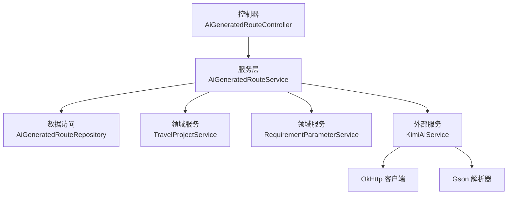
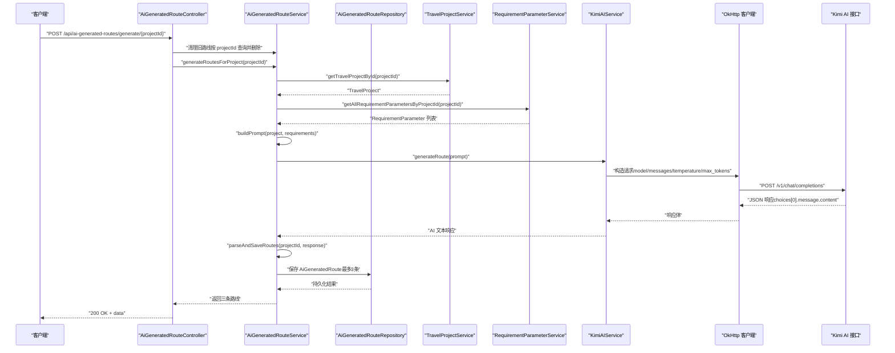
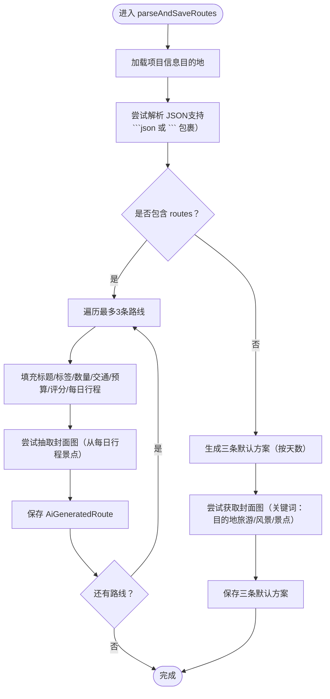
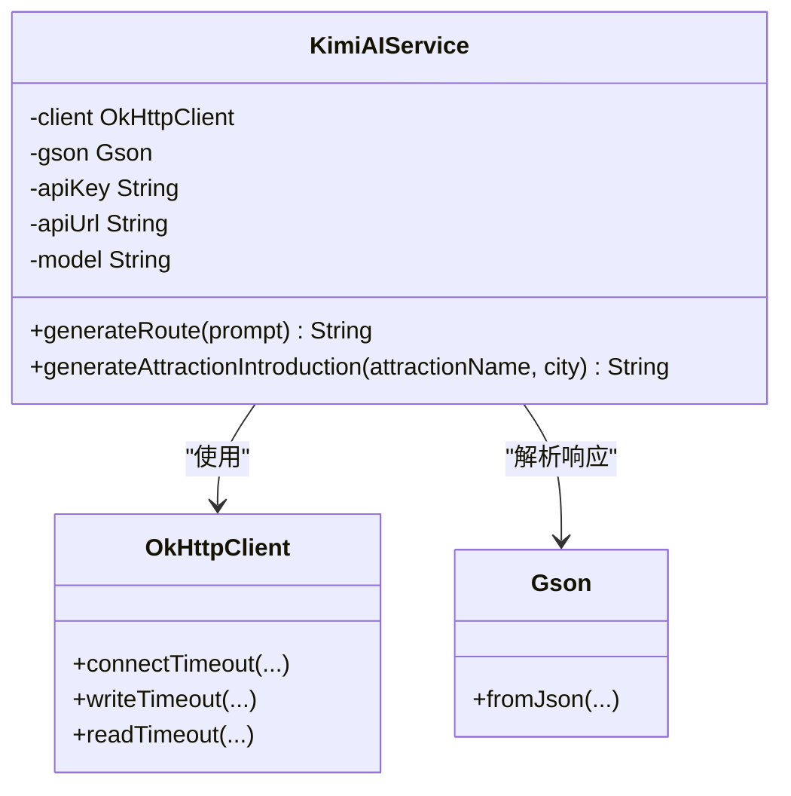
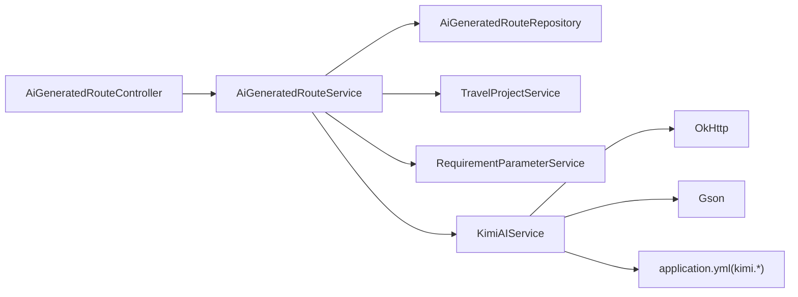

# AI路线生成流程

<cite>
**本文引用的文件**
- [AiGeneratedRouteController.java](file://tudianersha/src/main/java/com/tudianersha/controller/AiGeneratedRouteController.java)
- [AiGeneratedRouteService.java](file://tudianersha/src/main/java/com/tudianersha/service/AiGeneratedRouteService.java)
- [KimiAIService.java](file://tudianersha/src/main/java/com/tudianersha/service/KimiAIService.java)
- [TravelProject.java](file://tudianersha/src/main/java/com/tudianersha/entity/TravelProject.java)
- [RequirementParameter.java](file://tudianersha/src/main/java/com/tudianersha/entity/RequirementParameter.java)
- [AiGeneratedRoute.java](file://tudianersha/src/main/java/com/tudianersha/entity/AiGeneratedRoute.java)
- [AiGeneratedRouteRepository.java](file://tudianersha/src/main/java/com/tudianersha/repository/AiGeneratedRouteRepository.java)
- [TravelProjectService.java](file://tudianersha/src/main/java/com/tudianersha/service/TravelProjectService.java)
- [RequirementParameterService.java](file://tudianersha/src/main/java/com/tudianersha/service/RequirementParameterService.java)
- [application.yml](file://tudianersha/src/main/resources/application.yml)
</cite>

## 目录
1. [简介](#简介)
2. [项目结构](#项目结构)
3. [核心组件](#核心组件)
4. [架构总览](#架构总览)
5. [详细组件分析](#详细组件分析)
6. [依赖关系分析](#依赖关系分析)
7. [性能与超时配置](#性能与超时配置)
8. [故障排查指南](#故障排查指南)
9. [结论](#结论)

## 简介
本文件围绕“AI路线生成”的核心处理流程展开，自控制器 AiGeneratedRouteController 的 POST /api/ai-generated-routes/generate/{projectId} 接口出发，逐步剖析 generateRoutes 方法如何协调清理旧路线与生成新路线，并深入分析 AiGeneratedRouteService 的 generateRoutesForProject 实现细节：如何聚合 TravelProject 与 RequirementParameter 等多方数据构建 Prompt，再调用 KimiAIService 发起外部 API 请求；重点说明 KimiAIService 中 OkHttp 客户端的超时配置（连接/写入/读取）与请求构造逻辑，以及 JSON 响应解析策略；同时覆盖错误处理（IllegalArgumentException、IOException）、默认回退策略与性能优化考量（超时设置）。

## 项目结构
- 控制层：AiGeneratedRouteController 提供 REST 接口，负责接收请求、清理旧路线并触发生成流程。
- 业务层：AiGeneratedRouteService 负责数据聚合、Prompt 构建、调用 KimiAIService、解析与落库。
- 外部服务：KimiAIService 使用 OkHttp 客户端访问 Kimi（Moonshot）AI 接口。
- 数据模型：TravelProject、RequirementParameter、AiGeneratedRoute。
- 数据访问：AiGeneratedRouteRepository、TravelProjectService、RequirementParameterService。

图表来源
- [AiGeneratedRouteController.java](file://tudianersha/src/main/java/com/tudianersha/controller/AiGeneratedRouteController.java#L78-L112)
- [AiGeneratedRouteService.java](file://tudianersha/src/main/java/com/tudianersha/service/AiGeneratedRouteService.java#L70-L92)
- [KimiAIService.java](file://tudianersha/src/main/java/com/tudianersha/service/KimiAIService.java#L28-L35)
- [AiGeneratedRouteRepository.java](file://tudianersha/src/main/java/com/tudianersha/repository/AiGeneratedRouteRepository.java#L1-L12)
- [TravelProjectService.java](file://tudianersha/src/main/java/com/tudianersha/service/TravelProjectService.java#L21-L23)
- [RequirementParameterService.java](file://tudianersha/src/main/java/com/tudianersha/service/RequirementParameterService.java#L37-L39)

章节来源
- [AiGeneratedRouteController.java](file://tudianersha/src/main/java/com/tudianersha/controller/AiGeneratedRouteController.java#L78-L112)
- [AiGeneratedRouteService.java](file://tudianersha/src/main/java/com/tudianersha/service/AiGeneratedRouteService.java#L70-L92)
- [KimiAIService.java](file://tudianersha/src/main/java/com/tudianersha/service/KimiAIService.java#L28-L35)

## 核心组件
- 控制器接口：POST /api/ai-generated-routes/generate/{projectId}
  - 行为：删除旧 AI 路线 → 调用服务生成新路线 → 统一返回响应（成功/失败）
  - 错误处理：参数非法抛出 IllegalArgumentException；其他异常返回 500
- 服务层：
  - generateRoutesForProject：校验项目存在性与需求参数存在性 → 构建 Prompt → 调用 KimiAIService → 解析并保存三条路线
  - parseAndSaveRoutes：提取 JSON、解析结构化字段、生成默认方案、抽取封面图
  - buildPrompt：整合项目基本信息与各参与者的兴趣标签、心愿单、不喜欢项、预算分配
- 外部服务 KimiAIService：
  - OkHttp 客户端配置：连接/写入/读取超时（读取 180 秒）
  - 请求构造：model、messages（system/user）、temperature、max_tokens
  - 响应解析：从 choices.message.content 提取文本

章节来源
- [AiGeneratedRouteController.java](file://tudianersha/src/main/java/com/tudianersha/controller/AiGeneratedRouteController.java#L82-L111)
- [AiGeneratedRouteService.java](file://tudianersha/src/main/java/com/tudianersha/service/AiGeneratedRouteService.java#L70-L92)
- [AiGeneratedRouteService.java](file://tudianersha/src/main/java/com/tudianersha/service/AiGeneratedRouteService.java#L94-L192)
- [AiGeneratedRouteService.java](file://tudianersha/src/main/java/com/tudianersha/service/AiGeneratedRouteService.java#L194-L360)
- [AiGeneratedRouteService.java](file://tudianersha/src/main/java/com/tudianersha/service/AiGeneratedRouteService.java#L362-L486)
- [KimiAIService.java](file://tudianersha/src/main/java/com/tudianersha/service/KimiAIService.java#L28-L35)
- [KimiAIService.java](file://tudianersha/src/main/java/com/tudianersha/service/KimiAIService.java#L44-L98)

## 架构总览
下图展示从控制器到服务、再到外部 AI 服务的整体调用链路与关键数据流。

图表来源
- [AiGeneratedRouteController.java](file://tudianersha/src/main/java/com/tudianersha/controller/AiGeneratedRouteController.java#L82-L111)
- [AiGeneratedRouteService.java](file://tudianersha/src/main/java/com/tudianersha/service/AiGeneratedRouteService.java#L70-L92)
- [AiGeneratedRouteService.java](file://tudianersha/src/main/java/com/tudianersha/service/AiGeneratedRouteService.java#L194-L360)
- [KimiAIService.java](file://tudianersha/src/main/java/com/tudianersha/service/KimiAIService.java#L44-L98)
- [AiGeneratedRouteRepository.java](file://tudianersha/src/main/java/com/tudianersha/repository/AiGeneratedRouteRepository.java#L1-L12)
- [TravelProjectService.java](file://tudianersha/src/main/java/com/tudianersha/service/TravelProjectService.java#L21-L23)
- [RequirementParameterService.java](file://tudianersha/src/main/java/com/tudianersha/service/RequirementParameterService.java#L37-L39)

## 详细组件分析

### 控制器：AiGeneratedRouteController
- 关键职责
  - 删除旧 AI 路线：按 projectId 查询并逐条删除
  - 触发生成：调用 AiGeneratedRouteService.generateRoutesForProject
  - 统一响应：成功返回 data（三条新路线），参数非法返回 400，其他异常返回 500
- 错误处理
  - IllegalArgumentException：参数非法或项目不存在
  - 其他异常：IO/运行时异常统一转为 500

章节来源
- [AiGeneratedRouteController.java](file://tudianersha/src/main/java/com/tudianersha/controller/AiGeneratedRouteController.java#L82-L111)

### 服务：AiGeneratedRouteService
- generateRoutesForProject
  - 校验 TravelProject 存在性与 RequirementParameter 非空
  - 调用 buildPrompt 聚合项目与需求参数，形成 Prompt
  - 调用 KimiAIService.generateRoute 发起外部请求
  - parseAndSaveRoutes 解析并保存三条路线
- buildPrompt
  - 输出项目基础信息（名称、目的地、日期、天数、人数）
  - 汇总每个参与者的兴趣标签、心愿单、不喜欢项、每日预算
  - 明确要求 AI 返回三条路线，包含标题、标签、景点/餐厅数量、交通方式、预算、评分、每日行程等
  - 强调景点/餐厅必须真实可检索，时间安排合理，避免不可预约的景点
  - 提供 JSON 示例模板，要求严格遵循
- parseAndSaveRoutes
  - 从响应中提取 JSON（支持 Markdown 代码块包裹）
  - 解析 routes 数组，最多取前三条，填充 AiGeneratedRoute 字段
  - 若解析失败，回退生成三条默认方案（基于项目天数与目的地）
  - 尝试从每日行程中抽取景点名称，通过 AmapPoiService 获取封面图 URL（最多 6 张，逗号分隔）
- 辅助方法
  - extractJsonFromResponse：从 AI 响应中提取 JSON 内容
  - extractCoverPhoto：从每日行程中提取景点名并获取图片
  - extractPoiName：从活动字符串中抽取 POI 名称

图表来源
- [AiGeneratedRouteService.java](file://tudianersha/src/main/java/com/tudianersha/service/AiGeneratedRouteService.java#L194-L360)
- [AiGeneratedRouteService.java](file://tudianersha/src/main/java/com/tudianersha/service/AiGeneratedRouteService.java#L362-L486)

章节来源
- [AiGeneratedRouteService.java](file://tudianersha/src/main/java/com/tudianersha/service/AiGeneratedRouteService.java#L70-L92)
- [AiGeneratedRouteService.java](file://tudianersha/src/main/java/com/tudianersha/service/AiGeneratedRouteService.java#L94-L192)
- [AiGeneratedRouteService.java](file://tudianersha/src/main/java/com/tudianersha/service/AiGeneratedRouteService.java#L194-L360)
- [AiGeneratedRouteService.java](file://tudianersha/src/main/java/com/tudianersha/service/AiGeneratedRouteService.java#L362-L486)

### 外部服务：KimiAIService
- OkHttp 客户端配置
  - 连接超时：120 秒
  - 写入超时：120 秒
  - 读取超时：180 秒（AI 生成较长，适当放宽）
- 请求构造
  - model：来自配置（moonshot-v1-8k）
  - messages：system（角色扮演为旅行规划师）+ user（Prompt）
  - temperature：0.7（平衡创造性与稳定性）
  - max_tokens：4096（确保能生成完整多天行程）
- 响应解析
  - 从 JSON 中提取 choices[0].message.content 作为 AI 文本
  - 非成功状态码抛出 IOException
- 配置来源
  - kimi.api.key、kimi.api.url、kimi.api.model 在 application.yml 中定义

图表来源
- [KimiAIService.java](file://tudianersha/src/main/java/com/tudianersha/service/KimiAIService.java#L28-L35)
- [KimiAIService.java](file://tudianersha/src/main/java/com/tudianersha/service/KimiAIService.java#L44-L98)
- [application.yml](file://tudianersha/src/main/resources/application.yml#L48-L53)

章节来源
- [KimiAIService.java](file://tudianersha/src/main/java/com/tudianersha/service/KimiAIService.java#L28-L35)
- [KimiAIService.java](file://tudianersha/src/main/java/com/tudianersha/service/KimiAIService.java#L44-L98)
- [application.yml](file://tudianersha/src/main/resources/application.yml#L48-L53)

### 数据模型与仓库
- TravelProject：旅行项目基本信息（名称、目的地、天数、日期范围、状态等）
- RequirementParameter：参与者的兴趣标签、心愿单、不喜欢项、每日预算等
- AiGeneratedRoute：AI 生成的路线记录（标题、标签、景点/餐厅数量、交通、预算、评分、每日行程、封面图等）

章节来源
- [TravelProject.java](file://tudianersha/src/main/java/com/tudianersha/entity/TravelProject.java#L1-L163)
- [RequirementParameter.java](file://tudianersha/src/main/java/com/tudianersha/entity/RequirementParameter.java#L1-L123)
- [AiGeneratedRoute.java](file://tudianersha/src/main/java/com/tudianersha/entity/AiGeneratedRoute.java#L1-L193)
- [AiGeneratedRouteRepository.java](file://tudianersha/src/main/java/com/tudianersha/repository/AiGeneratedRouteRepository.java#L1-L12)

## 依赖关系分析
- 控制器依赖服务层，服务层依赖数据访问与领域服务，服务层还依赖外部 AI 服务
- 外部服务依赖 OkHttp 与 Gson
- 配置通过 application.yml 注入（Kimi API key/url/model）

图表来源
- [AiGeneratedRouteController.java](file://tudianersha/src/main/java/com/tudianersha/controller/AiGeneratedRouteController.java#L78-L112)
- [AiGeneratedRouteService.java](file://tudianersha/src/main/java/com/tudianersha/service/AiGeneratedRouteService.java#L70-L92)
- [KimiAIService.java](file://tudianersha/src/main/java/com/tudianersha/service/KimiAIService.java#L28-L35)
- [application.yml](file://tudianersha/src/main/resources/application.yml#L48-L53)

章节来源
- [AiGeneratedRouteController.java](file://tudianersha/src/main/java/com/tudianersha/controller/AiGeneratedRouteController.java#L78-L112)
- [AiGeneratedRouteService.java](file://tudianersha/src/main/java/com/tudianersha/service/AiGeneratedRouteService.java#L70-L92)
- [KimiAIService.java](file://tudianersha/src/main/java/com/tudianersha/service/KimiAIService.java#L28-L35)
- [application.yml](file://tudianersha/src/main/resources/application.yml#L48-L53)

## 性能与超时配置
- OkHttp 超时设置
  - 连接超时：120 秒
  - 写入超时：120 秒
  - 读取超时：180 秒（考虑到 AI 生成较长文本，适当放宽）
- 生成流程性能要点
  - Prompt 构建：O(N)（N 为参与者数量），字符串拼接
  - JSON 解析：Gson 解析，复杂度与响应大小相关
  - 默认回退：当解析失败时生成三条默认方案，避免长时间阻塞
  - 图片抓取：最多 6 张，避免过多网络请求导致延迟

章节来源
- [KimiAIService.java](file://tudianersha/src/main/java/com/tudianersha/service/KimiAIService.java#L28-L35)
- [AiGeneratedRouteService.java](file://tudianersha/src/main/java/com/tudianersha/service/AiGeneratedRouteService.java#L194-L360)

## 故障排查指南
- 参数非法（400）
  - 项目不存在或无需求参数：抛出 IllegalArgumentException
  - 控制器捕获后返回错误消息与 400
- 外部 API 调用失败（500）
  - OkHttp 非成功状态码或响应格式异常：抛出 IOException
  - 控制器捕获后返回通用错误消息与 500
- JSON 解析失败
  - parseAndSaveRoutes 中若无法提取有效 JSON，会回退生成三条默认方案
  - 建议检查 Prompt 是否满足 JSON 模板要求，或确认 AI 返回是否被包裹在 Markdown 代码块中
- 封面图获取失败
  - extractCoverPhoto 仅从景点活动抽取图片，若未命中或 AmapPoiService 抛错，会记录错误并跳过
  - 可检查 extractPoiName 的正则匹配是否正确

章节来源
- [AiGeneratedRouteController.java](file://tudianersha/src/main/java/com/tudianersha/controller/AiGeneratedRouteController.java#L82-L111)
- [AiGeneratedRouteService.java](file://tudianersha/src/main/java/com/tudianersha/service/AiGeneratedRouteService.java#L194-L360)
- [KimiAIService.java](file://tudianersha/src/main/java/com/tudianersha/service/KimiAIService.java#L44-L98)

## 结论
本流程以 AiGeneratedRouteController 为入口，通过 AiGeneratedRouteService 协调 TravelProject 与 RequirementParameter 数据，构建详尽 Prompt 并调用 KimiAIService 完成外部 API 请求。服务层对响应进行稳健解析与回退处理，最终将三条路线持久化并返回给前端。OkHttp 的超时配置与合理的错误处理策略共同保障了整体流程的稳定性与性能。