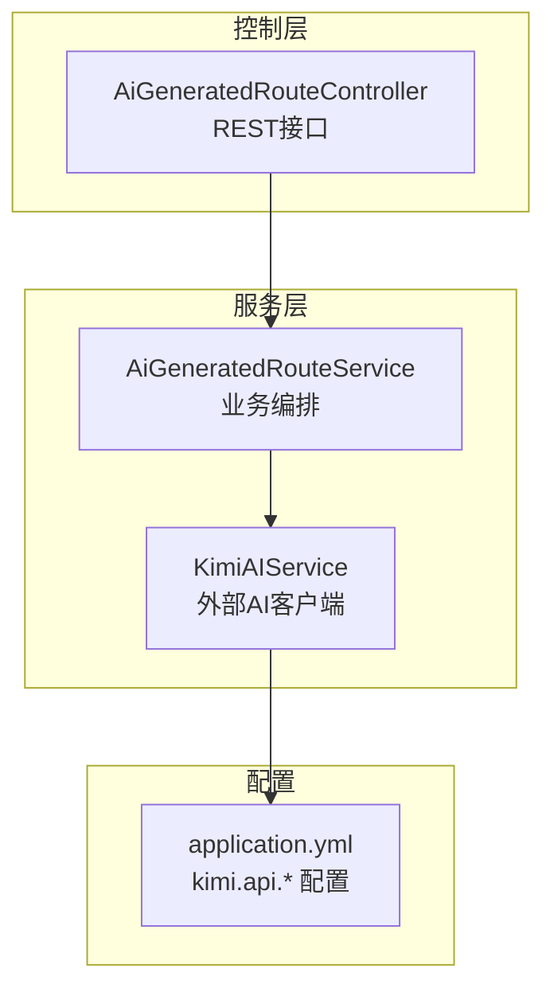
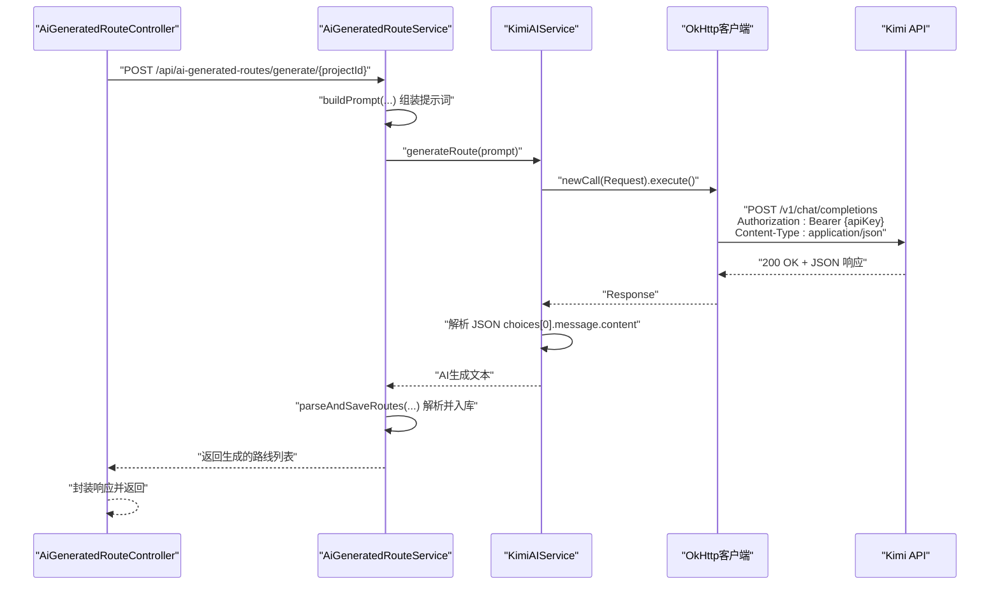
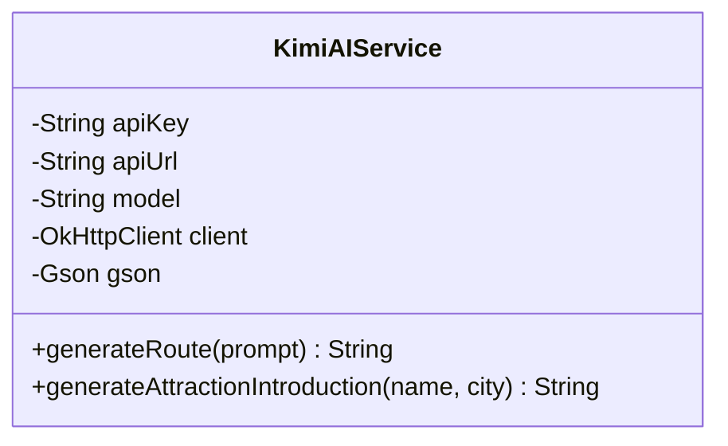
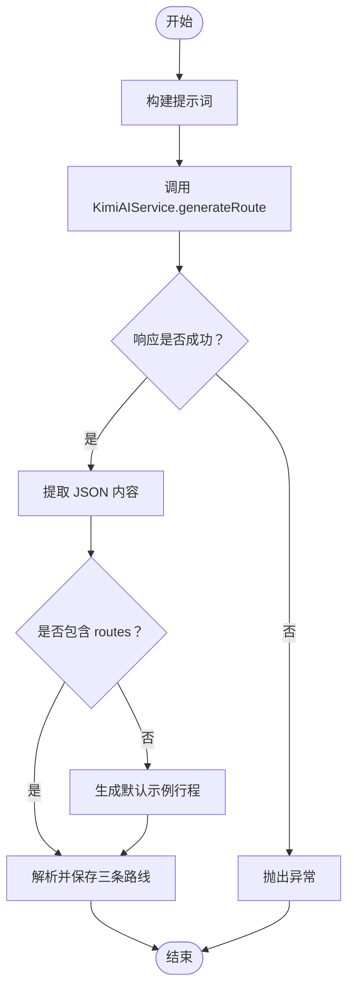
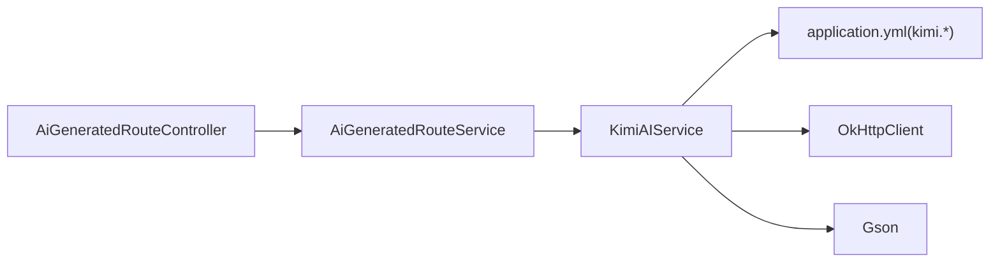

# Kimi AI服务集成

<cite>
**本文引用的文件**
- [KimiAIService.java](file://tudianersha/src/main/java/com/tudianersha/service/KimiAIService.java)
- [AiGeneratedRouteService.java](file://tudianersha/src/main/java/com/tudianersha/service/AiGeneratedRouteService.java)
- [application.yml](file://tudianersha/src/main/resources/application.yml)
- [AiGeneratedRouteController.java](file://tudianersha/src/main/java/com/tudianersha/controller/AiGeneratedRouteController.java)
</cite>

## 目录
1. [简介](#简介)
2. [项目结构](#项目结构)
3. [核心组件](#核心组件)
4. [架构总览](#架构总览)
5. [组件详细分析](#组件详细分析)
6. [依赖关系分析](#依赖关系分析)
7. [性能与超时配置](#性能与超时配置)
8. [故障排查指南](#故障排查指南)
9. [结论](#结论)

## 简介
本文件系统性文档化 KimiAIService 类的实现，重点说明其作为外部AI服务客户端的角色与行为。内容覆盖 OkHttp 客户端的超时配置原因、generateRoute 方法如何构造符合 Kimi API 规范的请求体（system 和 user 角色消息组织、temperature 与 max_tokens 的含义）、HTTP 请求头设置、JSON 响应解析流程、错误处理策略，以及通过 Spring @Value 注解进行的 API 密钥与服务地址等配置项的外部化管理。

## 项目结构
KimiAIService 位于服务层，负责与 Kimi 外部 AI 服务交互；AiGeneratedRouteService 作为业务编排层，负责构建提示词、调用 KimiAIService 并解析结果入库；控制器 AiGeneratedRouteController 对外暴露生成接口。

图表来源
- [KimiAIService.java](file://tudianersha/src/main/java/com/tudianersha/service/KimiAIService.java#L12-L174)
- [AiGeneratedRouteService.java](file://tudianersha/src/main/java/com/tudianersha/service/AiGeneratedRouteService.java#L69-L91)
- [AiGeneratedRouteController.java](file://tudianersha/src/main/java/com/tudianersha/controller/AiGeneratedRouteController.java#L80-L111)
- [application.yml](file://tudianersha/src/main/resources/application.yml#L47-L53)

章节来源
- [KimiAIService.java](file://tudianersha/src/main/java/com/tudianersha/service/KimiAIService.java#L12-L174)
- [AiGeneratedRouteService.java](file://tudianersha/src/main/java/com/tudianersha/service/AiGeneratedRouteService.java#L69-L91)
- [AiGeneratedRouteController.java](file://tudianersha/src/main/java/com/tudianersha/controller/AiGeneratedRouteController.java#L80-L111)
- [application.yml](file://tudianersha/src/main/resources/application.yml#L47-L53)

## 核心组件
- KimiAIService：封装 OkHttp 客户端，负责向 Kimi API 发送请求、解析响应并返回 AI 生成内容。
- AiGeneratedRouteService：面向业务的编排服务，负责拼装提示词、调用 KimiAIService、解析并持久化生成的路线。
- application.yml：集中管理 Kimi API 的密钥、服务地址与模型名称等外部化配置。

章节来源
- [KimiAIService.java](file://tudianersha/src/main/java/com/tudianersha/service/KimiAIService.java#L12-L174)
- [AiGeneratedRouteService.java](file://tudianersha/src/main/java/com/tudianersha/service/AiGeneratedRouteService.java#L69-L91)
- [application.yml](file://tudianersha/src/main/resources/application.yml#L47-L53)

## 架构总览
KimiAIService 作为外部客户端，通过 OkHttp 发起 HTTP POST 请求至 Kimi API，携带 Authorization 与 Content-Type 头，并以 JSON 形式提交请求体。服务端返回 JSON 响应后，KimiAIService 解析其中的 choices/message/content 字段，提取 AI 生成文本。AiGeneratedRouteService 在上游负责构建提示词并接收、解析与落库。

图表来源
- [AiGeneratedRouteController.java](file://tudianersha/src/main/java/com/tudianersha/controller/AiGeneratedRouteController.java#L80-L111)
- [AiGeneratedRouteService.java](file://tudianersha/src/main/java/com/tudianersha/service/AiGeneratedRouteService.java#L69-L91)
- [KimiAIService.java](file://tudianersha/src/main/java/com/tudianersha/service/KimiAIService.java#L44-L98)
- [application.yml](file://tudianersha/src/main/resources/application.yml#L47-L53)

## 组件详细分析

### KimiAIService 类分析
- 作用定位：作为外部 AI 服务客户端，封装 OkHttp 客户端与 Kimi API 的交互细节，提供 generateRoute 与 generateAttractionIntroduction 等方法。
- 配置注入：
  - 使用 @Value 注入 Kimi API 的密钥、服务 URL 与模型名称，实现配置外部化管理。
- OkHttp 客户端配置：
  - 连接超时：120 秒
  - 写入超时：120 秒
  - 读取超时：180 秒
  - 设计动机：AI 生成通常需要较长的网络往返与推理时间，适当延长读取超时可避免因长响应而提前中断。
- 请求体构造（generateRoute）：
  - model：来自配置项
  - messages：包含 system 与 user 两条消息
    - system：角色设定，引导 AI 成为“专业的旅行规划师”
    - user：将上游传入的 prompt 作为用户输入
  - temperature：0.7，平衡创造性与稳定性
  - max_tokens：4096，确保能容纳较长的多日行程内容
- HTTP 请求头：
  - Authorization：Bearer {apiKey}
  - Content-Type：application/json
- 响应解析：
  - 读取响应体为字符串并反序列化为 JSON
  - 从 choices 数组取第一条，再取 message.content 作为最终文本
- 错误处理：
  - 非 200 响应：抛出 IOException
  - 响应格式异常：抛出 IOException
- 其他能力：
  - generateAttractionIntroduction：复用相同模式，但针对景点介绍场景，temperature 与 max_tokens 参数略有差异

图表来源
- [KimiAIService.java](file://tudianersha/src/main/java/com/tudianersha/service/KimiAIService.java#L12-L174)

章节来源
- [KimiAIService.java](file://tudianersha/src/main/java/com/tudianersha/service/KimiAIService.java#L16-L35)
- [KimiAIService.java](file://tudianersha/src/main/java/com/tudianersha/service/KimiAIService.java#L44-L98)
- [KimiAIService.java](file://tudianersha/src/main/java/com/tudianersha/service/KimiAIService.java#L108-L174)

### AiGeneratedRouteService 编排逻辑
- 调用链路：
  - 控制器触发生成接口
  - 业务服务获取项目与需求参数，构建提示词
  - 调用 KimiAIService.generateRoute(prompt) 获取 AI 文本
  - 解析 AI 文本中的 JSON 结构，提取三条路线并持久化
- 提示词构建：
  - 包含项目基本信息、参与人数与各成员的需求汇总
  - 明确要求 AI 返回 JSON 结构，并给出示例模板
- 响应解析与兜底：
  - 若 AI 返回 Markdown 代码块，先提取其中的 JSON
  - 若解析失败，则生成默认示例行程并落库
- 图片封面提取：
  - 从每日行程中抽取景点名称，调用高德 POI 服务获取图片 URL 并合并存储

图表来源
- [AiGeneratedRouteService.java](file://tudianersha/src/main/java/com/tudianersha/service/AiGeneratedRouteService.java#L69-L91)
- [AiGeneratedRouteService.java](file://tudianersha/src/main/java/com/tudianersha/service/AiGeneratedRouteService.java#L196-L359)
- [AiGeneratedRouteService.java](file://tudianersha/src/main/java/com/tudianersha/service/AiGeneratedRouteService.java#L364-L395)

章节来源
- [AiGeneratedRouteService.java](file://tudianersha/src/main/java/com/tudianersha/service/AiGeneratedRouteService.java#L69-L91)
- [AiGeneratedRouteService.java](file://tudianersha/src/main/java/com/tudianersha/service/AiGeneratedRouteService.java#L96-L191)
- [AiGeneratedRouteService.java](file://tudianersha/src/main/java/com/tudianersha/service/AiGeneratedRouteService.java#L196-L359)
- [AiGeneratedRouteService.java](file://tudianersha/src/main/java/com/tudianersha/service/AiGeneratedRouteService.java#L364-L395)

### API 密钥与配置外部化
- 配置项来源：application.yml 中的 kimim.api.key、kimi.api.url、kimi.api.model
- 注入方式：KimiAIService 通过 @Value 注入上述配置，形成与环境解耦的客户端配置

章节来源
- [application.yml](file://tudianersha/src/main/resources/application.yml#L47-L53)
- [KimiAIService.java](file://tudianersha/src/main/java/com/tudianersha/service/KimiAIService.java#L16-L23)

## 依赖关系分析
- 控制层依赖业务层：AiGeneratedRouteController 依赖 AiGeneratedRouteService
- 业务层依赖客户端：AiGeneratedRouteService 依赖 KimiAIService
- 客户端依赖配置：KimiAIService 依赖 application.yml 中的 kimi.api.* 配置
- 客户端依赖 OkHttp 与 Gson：用于 HTTP 请求与 JSON 解析

图表来源
- [AiGeneratedRouteController.java](file://tudianersha/src/main/java/com/tudianersha/controller/AiGeneratedRouteController.java#L80-L111)
- [AiGeneratedRouteService.java](file://tudianersha/src/main/java/com/tudianersha/service/AiGeneratedRouteService.java#L69-L91)
- [KimiAIService.java](file://tudianersha/src/main/java/com/tudianersha/service/KimiAIService.java#L12-L174)
- [application.yml](file://tudianersha/src/main/resources/application.yml#L47-L53)

章节来源
- [AiGeneratedRouteController.java](file://tudianersha/src/main/java/com/tudianersha/controller/AiGeneratedRouteController.java#L80-L111)
- [AiGeneratedRouteService.java](file://tudianersha/src/main/java/com/tudianersha/service/AiGeneratedRouteService.java#L69-L91)
- [KimiAIService.java](file://tudianersha/src/main/java/com/tudianersha/service/KimiAIService.java#L12-L174)
- [application.yml](file://tudianersha/src/main/resources/application.yml#L47-L53)

## 性能与超时配置
- OkHttp 超时设置：
  - 连接超时：120 秒
  - 写入超时：120 秒
  - 读取超时：180 秒
- 设置原因：
  - AI 生成通常需要较长的网络往返与推理时间，适当延长读取超时可避免因长响应而提前中断，提升成功率与稳定性
- 建议：
  - 在生产环境中结合监控指标评估是否需要进一步调整
  - 对于高并发场景，可考虑复用 OkHttpClient 实例并配合连接池优化

章节来源
- [KimiAIService.java](file://tudianersha/src/main/java/com/tudianersha/service/KimiAIService.java#L28-L35)

## 故障排查指南
- 常见问题与定位要点：
  - 非 200 响应：KimiAIService 在 execute 后检查响应状态，若失败会抛出 IOException，便于快速定位网络或鉴权问题
  - 响应格式异常：当 JSON 中缺少 choices 或 message 字段时，KimiAIService 抛出 IOException，提示“Unexpected response format”
  - 提示词构建不当：AiGeneratedRouteService 在 buildPrompt 中明确要求 JSON 结构与示例模板，若 AI 输出不符合预期，需检查提示词是否清晰、完整
  - JSON 解析失败：AiGeneratedRouteService 提供 extractJsonFromResponse 从 Markdown 代码块中提取 JSON；若仍失败则进入默认示例生成流程
  - 配置缺失：确认 application.yml 中 kimi.api.key、kimi.api.url、kimi.api.model 是否正确配置
- 排查步骤建议：
  - 检查网络连通性与代理设置
  - 核对 Authorization 头是否携带正确的 Bearer Token
  - 查看服务端日志，关注 generateRoute 与 parseAndSaveRoutes 的异常堆栈
  - 在本地验证 application.yml 配置项是否生效

章节来源
- [KimiAIService.java](file://tudianersha/src/main/java/com/tudianersha/service/KimiAIService.java#L77-L98)
- [AiGeneratedRouteService.java](file://tudianersha/src/main/java/com/tudianersha/service/AiGeneratedRouteService.java#L196-L359)
- [AiGeneratedRouteService.java](file://tudianersha/src/main/java/com/tudianersha/service/AiGeneratedRouteService.java#L364-L395)
- [application.yml](file://tudianersha/src/main/resources/application.yml#L47-L53)

## 结论
KimiAIService 通过合理的 OkHttp 超时配置与严格的请求体与响应解析流程，有效适配 Kimi API 的长响应特性；AiGeneratedRouteService 则在上游提供高质量提示词与稳健的 JSON 解析与兜底机制，确保生成流程的可靠性与可维护性。借助 @Value 注解的外部化配置，系统实现了环境解耦与部署灵活性。