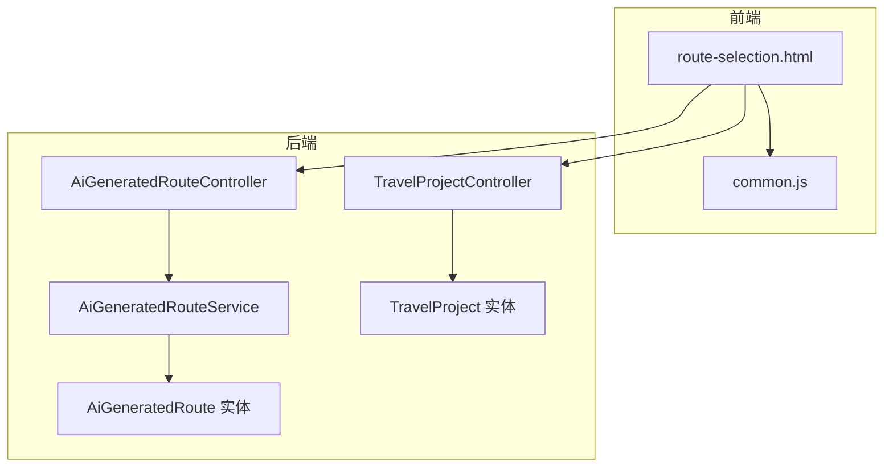
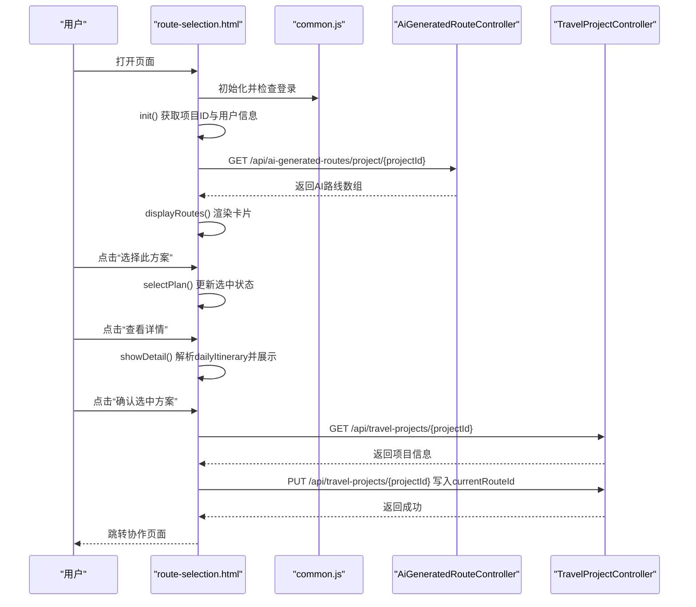
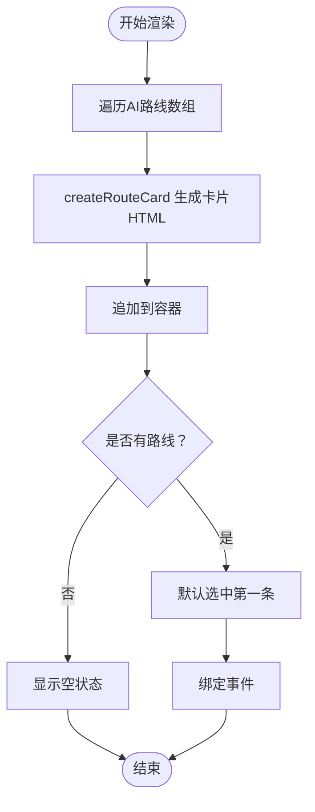
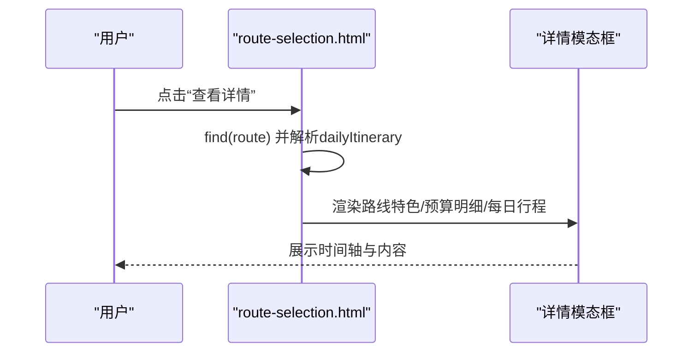
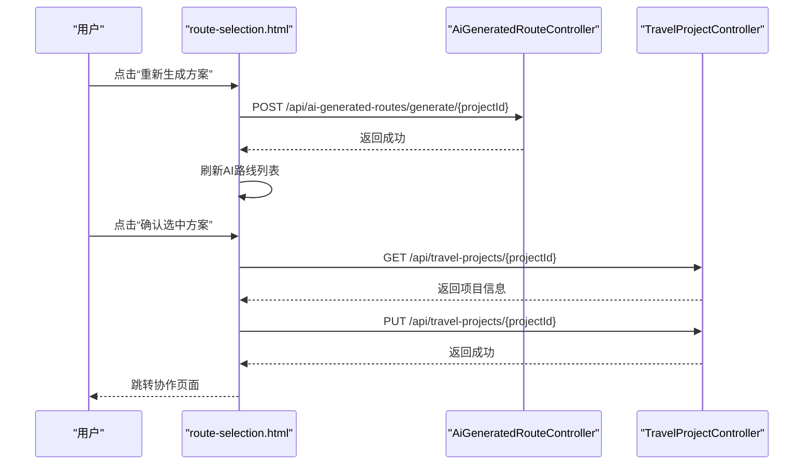
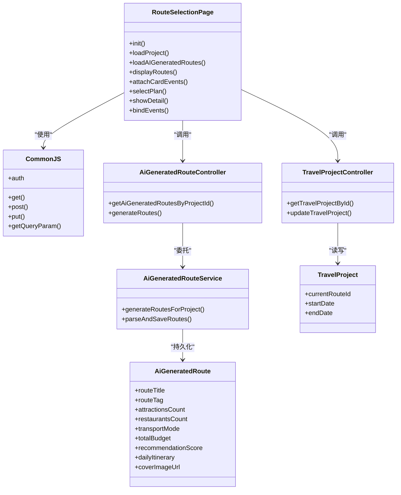

# 前端路线选择界面

<cite>
**本文引用的文件**
- [route-selection.html](file://tudianersha/src/main/resources/static/route-selection.html)
- [common.js](file://tudianersha/src/main/resources/static/js/common.js)
- [AiGeneratedRouteController.java](file://tudianersha/src/main/java/com/tudianersha/controller/AiGeneratedRouteController.java)
- [AiGeneratedRouteService.java](file://tudianersha/src/main/java/com/tudianersha/service/AiGeneratedRouteService.java)
- [AiGeneratedRoute.java](file://tudianersha/src/main/java/com/tudianersha/entity/AiGeneratedRoute.java)
- [TravelProjectController.java](file://tudianersha/src/main/java/com/tudianersha/controller/TravelProjectController.java)
- [TravelProject.java](file://tudianersha/src/main/java/com/tudianersha/entity/TravelProject.java)
- [database_migration.sql](file://tudianersha/database_migration.sql)
</cite>

## 目录
1. [简介](#简介)
2. [项目结构](#项目结构)
3. [核心组件](#核心组件)
4. [架构总览](#架构总览)
5. [详细组件分析](#详细组件分析)
6. [依赖关系分析](#依赖关系分析)
7. [性能考量](#性能考量)
8. [故障排查指南](#故障排查指南)
9. [结论](#结论)

## 简介
本文件面向前端路线选择页面（route-selection.html），系统性解析其现代化UI构建、数据加载与渲染流程、用户交互逻辑以及与后端API的集成方式。页面采用Tailwind CSS与Font Awesome实现响应式与美观的界面，通过JavaScript在页面初始化时获取项目ID与用户信息，并调用后端接口获取AI生成的路线数据，最终支持用户选择方案并进入协作页面。

## 项目结构
该页面位于静态资源目录下，配合公共JS工具库与后端控制器/服务/实体协同工作：
- 前端页面：route-selection.html
- 公共脚本：common.js（封装API请求、认证、工具函数）
- 后端控制器：AiGeneratedRouteController、TravelProjectController
- 业务服务：AiGeneratedRouteService
- 数据模型：AiGeneratedRoute、TravelProject
- 数据库迁移：新增路线结构化字段

图表来源
- [route-selection.html](file://tudianersha/src/main/resources/static/route-selection.html#L1-L120)
- [common.js](file://tudianersha/src/main/resources/static/js/common.js#L1-L60)
- [AiGeneratedRouteController.java](file://tudianersha/src/main/java/com/tudianersha/controller/AiGeneratedRouteController.java#L72-L112)
- [AiGeneratedRouteService.java](file://tudianersha/src/main/java/com/tudianersha/service/AiGeneratedRouteService.java#L59-L92)
- [AiGeneratedRoute.java](file://tudianersha/src/main/java/com/tudianersha/entity/AiGeneratedRoute.java#L136-L183)
- [TravelProjectController.java](file://tudianersha/src/main/java/com/tudianersha/controller/TravelProjectController.java#L26-L61)
- [TravelProject.java](file://tudianersha/src/main/java/com/tudianersha/entity/TravelProject.java#L35-L42)

章节来源
- [route-selection.html](file://tudianersha/src/main/resources/static/route-selection.html#L1-L120)
- [common.js](file://tudianersha/src/main/resources/static/js/common.js#L1-L60)

## 核心组件
- 页面初始化与用户信息展示：页面加载时执行init函数，从URL查询参数获取项目ID，从本地存储获取当前用户信息，填充头部用户头像与用户名。
- AI路线数据加载：通过fetch调用后端GET /api/ai-generated-routes/project/{projectId}接口，获取该项目的AI生成路线集合。
- 路线卡片渲染：displayRoutes将数据渲染为三张可交互的路线卡片，每张卡片包含推荐指数、景点/餐厅数量、交通方式、预算等关键信息。
- 用户交互逻辑：点击“选择此方案”或切换单选按钮触发selectPlan，更新选中状态；点击“查看详情”弹出模态框，解析dailyItinerary JSON并以时间轴形式展示每日行程。
- 确认选中方案：点击“确认选中方案”按钮，先获取当前项目信息，再将selectedRouteId写入TravelProject的currentRouteId字段，随后跳转至协作页面。

章节来源
- [route-selection.html](file://tudianersha/src/main/resources/static/route-selection.html#L118-L177)
- [route-selection.html](file://tudianersha/src/main/resources/static/route-selection.html#L198-L304)
- [route-selection.html](file://tudianersha/src/main/resources/static/route-selection.html#L306-L344)
- [route-selection.html](file://tudianersha/src/main/resources/static/route-selection.html#L345-L488)
- [route-selection.html](file://tudianersha/src/main/resources/static/route-selection.html#L489-L569)

## 架构总览
页面与后端通过REST API进行数据交换，前端负责UI与交互，后端提供AI生成路线与项目信息管理能力。

图表来源
- [route-selection.html](file://tudianersha/src/main/resources/static/route-selection.html#L118-L177)
- [route-selection.html](file://tudianersha/src/main/resources/static/route-selection.html#L198-L304)
- [route-selection.html](file://tudianersha/src/main/resources/static/route-selection.html#L306-L344)
- [route-selection.html](file://tudianersha/src/main/resources/static/route-selection.html#L345-L488)
- [route-selection.html](file://tudianersha/src/main/resources/static/route-selection.html#L489-L569)
- [AiGeneratedRouteController.java](file://tudianersha/src/main/java/com/tudianersha/controller/AiGeneratedRouteController.java#L72-L76)
- [TravelProjectController.java](file://tudianersha/src/main/java/com/tudianersha/controller/TravelProjectController.java#L26-L61)

## 详细组件分析

### 页面初始化与用户信息展示
- init函数在DOM加载完成后执行，校验登录状态，获取当前用户与项目ID，设置页面标题与用户信息区域。
- 若缺少项目ID，显示提示并返回首页。

章节来源
- [route-selection.html](file://tudianersha/src/main/resources/static/route-selection.html#L118-L177)
- [common.js](file://tudianersha/src/main/resources/static/js/common.js#L93-L121)

### AI生成路线数据加载
- loadAIGeneratedRoutes通过fetch调用后端GET /api/ai-generated-routes/project/{projectId}接口，获取该项目的AI生成路线数组。
- 若返回为空，渲染提示并提供返回重新生成的入口。
- 成功后调用displayRoutes渲染卡片，并默认选中第一条。

章节来源
- [route-selection.html](file://tudianersha/src/main/resources/static/route-selection.html#L164-L196)
- [AiGeneratedRouteController.java](file://tudianersha/src/main/java/com/tudianersha/controller/AiGeneratedRouteController.java#L72-L76)

### 路线卡片渲染与交互
- displayRoutes遍历AI路线数组，调用createRouteCard生成每张卡片的HTML结构。
- createRouteCard根据coverImageUrl是否包含逗号决定单图或网格拼接图展示；卡片包含推荐指数、标签、景点/餐厅数量、交通方式、预算等信息，并提供“查看详情”和“选择此方案”按钮。
- attachCardEvents绑定按钮与单选事件，触发selectPlan更新选中状态。

图表来源
- [route-selection.html](file://tudianersha/src/main/resources/static/route-selection.html#L198-L221)
- [route-selection.html](file://tudianersha/src/main/resources/static/route-selection.html#L223-L304)
- [route-selection.html](file://tudianersha/src/main/resources/static/route-selection.html#L306-L344)

章节来源
- [route-selection.html](file://tudianersha/src/main/resources/static/route-selection.html#L198-L304)
- [route-selection.html](file://tudianersha/src/main/resources/static/route-selection.html#L306-L344)

### 详情模态框与每日行程展示
- showDetail根据选中路线生成模态框内容，包括路线特色、预算明细与每日行程时间轴。
- 若存在结构化的dailyItinerary（JSON字符串），解析后按天分段展示活动，依据时间选择不同图标；若不存在，则展示AI原始内容（经格式化处理）。

图表来源
- [route-selection.html](file://tudianersha/src/main/resources/static/route-selection.html#L345-L488)

章节来源
- [route-selection.html](file://tudianersha/src/main/resources/static/route-selection.html#L345-L488)

### 重新生成与确认选中方案
- 重新生成：点击“重新生成方案”，向POST /api/ai-generated-routes/generate/{projectId}发起请求，成功后刷新AI路线列表。
- 确认选中方案：点击“确认选中方案”，先GET获取项目信息，将selectedRouteId写入currentRouteId，PUT保存后跳转协作页面。

图表来源
- [route-selection.html](file://tudianersha/src/main/resources/static/route-selection.html#L496-L569)
- [AiGeneratedRouteController.java](file://tudianersha/src/main/java/com/tudianersha/controller/AiGeneratedRouteController.java#L82-L111)
- [TravelProjectController.java](file://tudianersha/src/main/java/com/tudianersha/controller/TravelProjectController.java#L42-L58)

章节来源
- [route-selection.html](file://tudianersha/src/main/resources/static/route-selection.html#L496-L569)
- [AiGeneratedRouteController.java](file://tudianersha/src/main/java/com/tudianersha/controller/AiGeneratedRouteController.java#L82-L111)
- [TravelProjectController.java](file://tudianersha/src/main/java/com/tudianersha/controller/TravelProjectController.java#L42-L58)

## 依赖关系分析
- 前端依赖
  - Tailwind CSS与Font Awesome用于样式与图标
  - common.js提供统一的API请求封装、认证与工具函数
  - route-selection.html依赖common.js中的auth、get、getQueryParam等方法
- 后端依赖
  - AiGeneratedRouteController提供AI路线查询与生成接口
  - AiGeneratedRouteService负责AI生成逻辑与数据持久化
  - TravelProjectController提供项目信息的增删改查与更新currentRouteId
  - AiGeneratedRoute与TravelProject实体承载数据结构

图表来源
- [route-selection.html](file://tudianersha/src/main/resources/static/route-selection.html#L118-L177)
- [common.js](file://tudianersha/src/main/resources/static/js/common.js#L1-L60)
- [AiGeneratedRouteController.java](file://tudianersha/src/main/java/com/tudianersha/controller/AiGeneratedRouteController.java#L72-L111)
- [AiGeneratedRouteService.java](file://tudianersha/src/main/java/com/tudianersha/service/AiGeneratedRouteService.java#L59-L92)
- [AiGeneratedRoute.java](file://tudianersha/src/main/java/com/tudianersha/entity/AiGeneratedRoute.java#L136-L183)
- [TravelProjectController.java](file://tudianersha/src/main/java/com/tudianersha/controller/TravelProjectController.java#L26-L61)
- [TravelProject.java](file://tudianersha/src/main/java/com/tudianersha/entity/TravelProject.java#L35-L42)

章节来源
- [route-selection.html](file://tudianersha/src/main/resources/static/route-selection.html#L118-L177)
- [common.js](file://tudianersha/src/main/resources/static/js/common.js#L1-L60)
- [AiGeneratedRouteController.java](file://tudianersha/src/main/java/com/tudianersha/controller/AiGeneratedRouteController.java#L72-L111)
- [AiGeneratedRouteService.java](file://tudianersha/src/main/java/com/tudianersha/service/AiGeneratedRouteService.java#L59-L92)
- [AiGeneratedRoute.java](file://tudianersha/src/main/java/com/tudianersha/entity/AiGeneratedRoute.java#L136-L183)
- [TravelProjectController.java](file://tudianersha/src/main/java/com/tudianersha/controller/TravelProjectController.java#L26-L61)
- [TravelProject.java](file://tudianersha/src/main/java/com/tudianersha/entity/TravelProject.java#L35-L42)

## 性能考量
- 图片加载优化：当coverImageUrl为多张图片时，采用网格拼接图减少单图尺寸压力；同时提供onerror回退图片，避免空白。
- DOM操作最小化：displayRoutes一次性拼接HTML并插入容器，attachCardEvents集中绑定事件，降低重复查询成本。
- 异步加载：fetch与async/await确保网络请求非阻塞，提升用户体验。
- 本地存储：auth.getUser与storage封装减少重复序列化/反序列化。

[本节为通用建议，无需列出具体文件来源]

## 故障排查指南
- 登录状态异常
  - 现象：页面未登录即访问
  - 处理：common.js中auth.isLoggedIn检查失败会重定向至登录页
  - 参考
    - [route-selection.html](file://tudianersha/src/main/resources/static/route-selection.html#L113-L116)
    - [common.js](file://tudianersha/src/main/resources/static/js/common.js#L93-L121)
- 缺少项目ID
  - 现象：提示缺少项目ID并返回首页
  - 处理：getQueryParam返回空值时提示并跳转
  - 参考
    - [route-selection.html](file://tudianersha/src/main/resources/static/route-selection.html#L131-L135)
    - [common.js](file://tudianersha/src/main/resources/static/js/common.js#L171-L175)
- AI路线加载失败
  - 现象：网络错误或响应非200
  - 处理：捕获异常并显示提示；检查后端接口可用性
  - 参考
    - [route-selection.html](file://tudianersha/src/main/resources/static/route-selection.html#L164-L196)
    - [AiGeneratedRouteController.java](file://tudianersha/src/main/java/com/tudianersha/controller/AiGeneratedRouteController.java#L72-L76)
- 重新生成失败
  - 现象：生成接口返回失败或网络异常
  - 处理：捕获异常并提示；检查后端生成逻辑与数据库迁移字段
  - 参考
    - [route-selection.html](file://tudianersha/src/main/resources/static/route-selection.html#L506-L526)
    - [AiGeneratedRouteController.java](file://tudianersha/src/main/java/com/tudianersha/controller/AiGeneratedRouteController.java#L82-L111)
    - [database_migration.sql](file://tudianersha/database_migration.sql#L1-L14)
- 选中方案保存失败
  - 现象：PUT更新currentRouteId失败
  - 处理：检查TravelProjectController的PUT实现与实体字段映射
  - 参考
    - [route-selection.html](file://tudianersha/src/main/resources/static/route-selection.html#L536-L569)
    - [TravelProjectController.java](file://tudianersha/src/main/java/com/tudianersha/controller/TravelProjectController.java#L42-L58)
    - [TravelProject.java](file://tudianersha/src/main/java/com/tudianersha/entity/TravelProject.java#L122-L130)

章节来源
- [route-selection.html](file://tudianersha/src/main/resources/static/route-selection.html#L113-L135)
- [common.js](file://tudianersha/src/main/resources/static/js/common.js#L93-L121)
- [route-selection.html](file://tudianersha/src/main/resources/static/route-selection.html#L164-L196)
- [AiGeneratedRouteController.java](file://tudianersha/src/main/java/com/tudianersha/controller/AiGeneratedRouteController.java#L72-L111)
- [database_migration.sql](file://tudianersha/database_migration.sql#L1-L14)
- [route-selection.html](file://tudianersha/src/main/resources/static/route-selection.html#L536-L569)
- [TravelProjectController.java](file://tudianersha/src/main/java/com/tudianersha/controller/TravelProjectController.java#L42-L58)
- [TravelProject.java](file://tudianersha/src/main/java/com/tudianersha/entity/TravelProject.java#L122-L130)

## 结论
该页面通过Tailwind CSS与Font Awesome实现了现代化、响应式的UI设计，结合common.js提供的统一API与认证机制，完成从项目信息展示、AI路线加载、卡片渲染到用户交互与方案确认的完整闭环。后端控制器与服务层提供了稳定的REST接口与AI生成逻辑，实体层定义了结构化字段以支撑前端展示与协作流程。整体架构清晰、职责分离明确，具备良好的扩展性与可维护性。