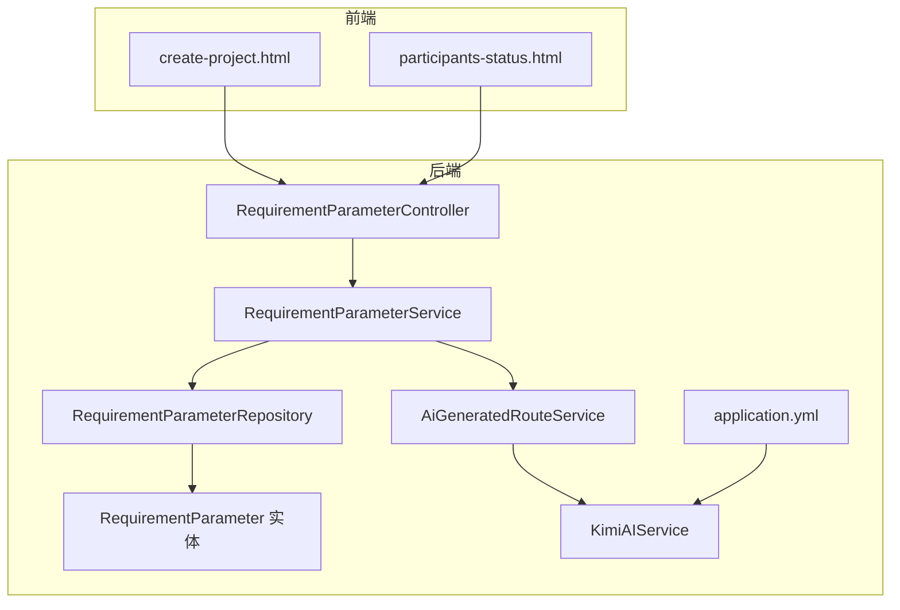
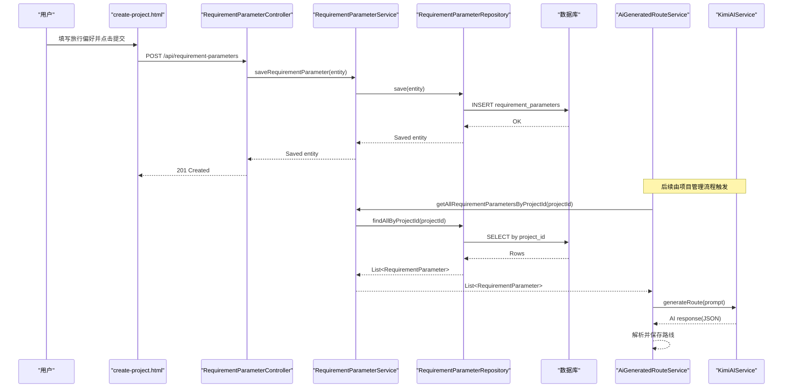
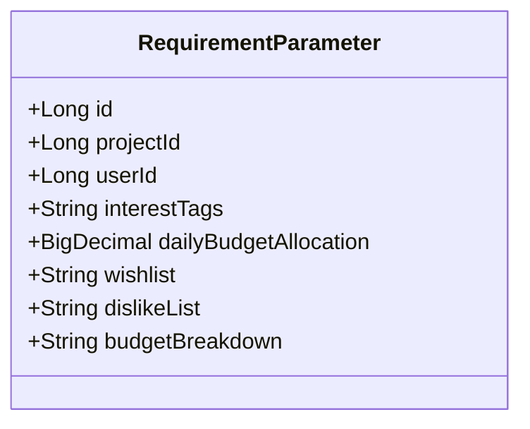
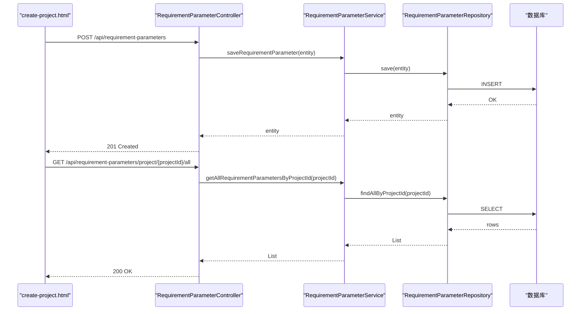
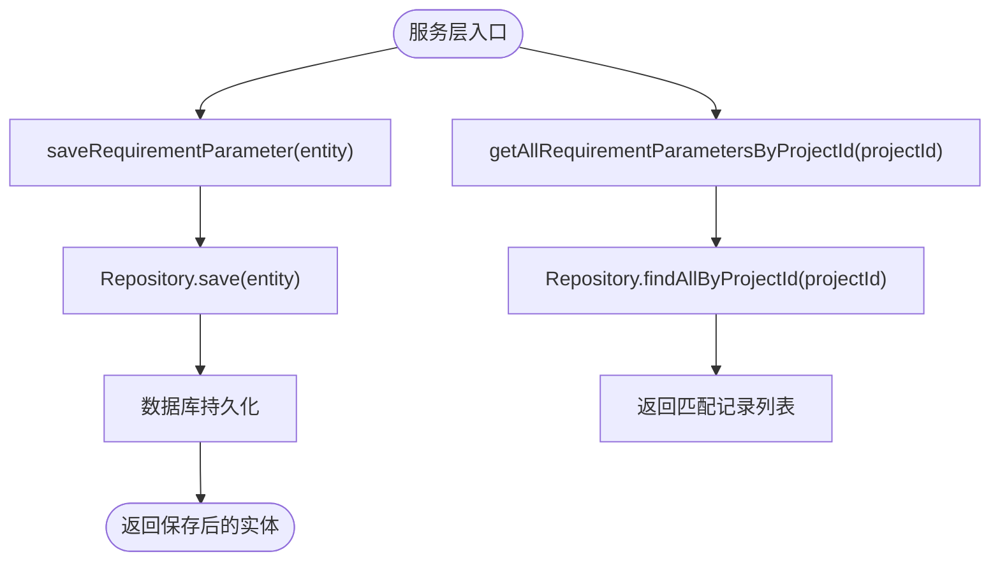
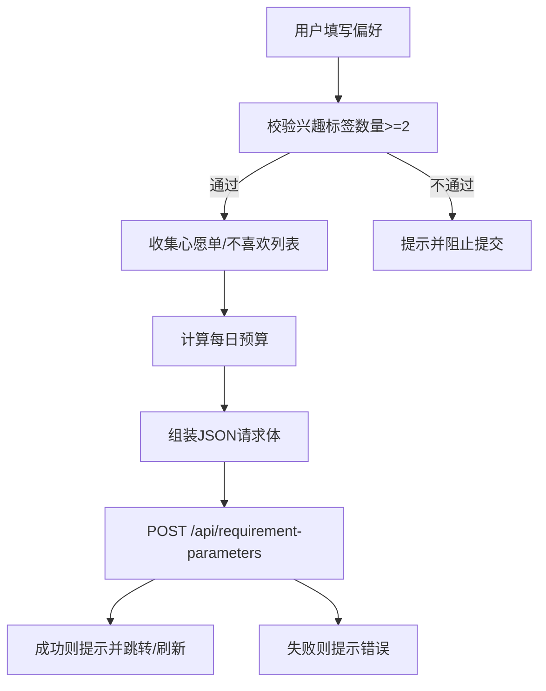
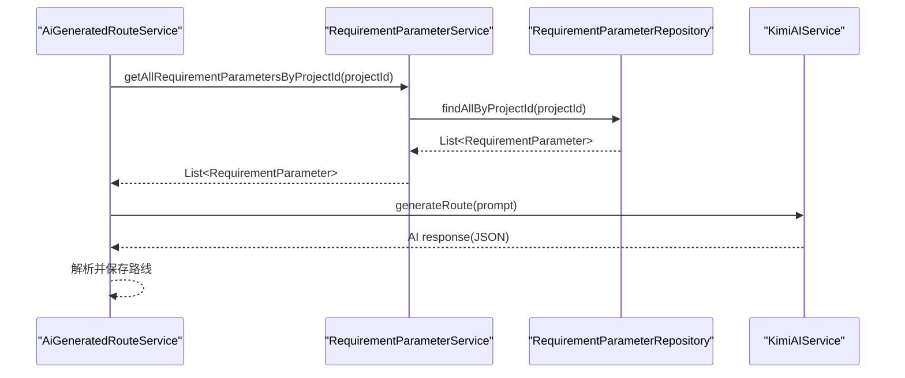
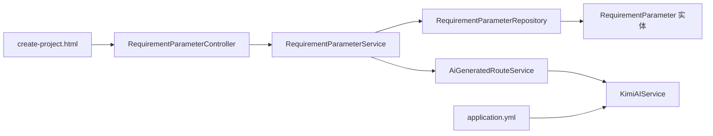

# 用户需求收集

<cite>
**本文引用的文件**
- [RequirementParameter.java](file://tudianersha/src/main/java/com/tudianersha/entity/RequirementParameter.java)
- [RequirementParameterController.java](file://tudianersha/src/main/java/com/tudianersha/controller/RequirementParameterController.java)
- [RequirementParameterService.java](file://tudianersha/src/main/java/com/tudianersha/service/RequirementParameterService.java)
- [RequirementParameterRepository.java](file://tudianersha/src/main/java/com/tudianersha/repository/RequirementParameterRepository.java)
- [create-project.html](file://tudianersha/src/main/resources/static/create-project.html)
- [participants-status.html](file://tudianersha/src/main/resources/static/participants-status.html)
- [AiGeneratedRouteService.java](file://tudianersha/src/main/java/com/tudianersha/service/AiGeneratedRouteService.java)
- [KimiAIService.java](file://tudianersha/src/main/java/com/tudianersha/service/KimiAIService.java)
- [application.yml](file://tudianersha/src/main/resources/application.yml)
- [ApiResponse.java](file://tudianersha/src/main/java/com/tudianersha/dto/ApiResponse.java)
</cite>

## 目录
1. [简介](#简介)
2. [项目结构](#项目结构)
3. [核心组件](#核心组件)
4. [架构总览](#架构总览)
5. [详细组件分析](#详细组件分析)
6. [依赖关系分析](#依赖关系分析)
7. [性能与扩展性](#性能与扩展性)
8. [故障排查指南](#故障排查指南)
9. [结论](#结论)
10. [附录](#附录)

## 简介
本文件围绕“用户旅行需求收集”机制进行深入解析，重点覆盖 RequirementParameter 实体的字段设计与 JPA 映射、RequirementParameterController 的 REST API、RequirementParameterService 的业务逻辑与 RequirementParameterRepository 的持久化能力；同时结合前端 create-project.html 页面说明用户输入如何被序列化并提交至后端，并阐述与 AI 生成服务的集成路径。文档还提供数据验证策略、异常处理（如项目不存在时的 404 响应）以及与其他模块（如项目参与者、旅行项目）的协同方式。

## 项目结构
后端采用 Spring Boot + Spring MVC + Spring Data JPA 的典型分层结构：
- 控制器层：负责接收 HTTP 请求并返回标准响应
- 服务层：封装业务逻辑，协调仓储与外部服务
- 仓储层：基于 JPA 的数据访问接口
- 实体层：映射数据库表的 JPA 实体
- 前端静态资源：HTML 页面与脚本负责用户交互与数据提交

图表来源
- [RequirementParameterController.java](file://tudianersha/src/main/java/com/tudianersha/controller/RequirementParameterController.java#L1-L85)
- [RequirementParameterService.java](file://tudianersha/src/main/java/com/tudianersha/service/RequirementParameterService.java#L1-L40)
- [RequirementParameterRepository.java](file://tudianersha/src/main/java/com/tudianersha/repository/RequirementParameterRepository.java#L1-L14)
- [RequirementParameter.java](file://tudianersha/src/main/java/com/tudianersha/entity/RequirementParameter.java#L1-L123)
- [AiGeneratedRouteService.java](file://tudianersha/src/main/java/com/tudianersha/service/AiGeneratedRouteService.java#L1-L486)
- [KimiAIService.java](file://tudianersha/src/main/java/com/tudianersha/service/KimiAIService.java#L1-L176)
- [application.yml](file://tudianersha/src/main/resources/application.yml#L1-L57)

章节来源
- [RequirementParameterController.java](file://tudianersha/src/main/java/com/tudianersha/controller/RequirementParameterController.java#L1-L85)
- [RequirementParameterService.java](file://tudianersha/src/main/java/com/tudianersha/service/RequirementParameterService.java#L1-L40)
- [RequirementParameterRepository.java](file://tudianersha/src/main/java/com/tudianersha/repository/RequirementParameterRepository.java#L1-L14)
- [RequirementParameter.java](file://tudianersha/src/main/java/com/tudianersha/entity/RequirementParameter.java#L1-L123)
- [create-project.html](file://tudianersha/src/main/resources/static/create-project.html#L1296-L1931)
- [participants-status.html](file://tudianersha/src/main/resources/static/participants-status.html#L274-L380)
- [AiGeneratedRouteService.java](file://tudianersha/src/main/java/com/tudianersha/service/AiGeneratedRouteService.java#L1-L486)
- [KimiAIService.java](file://tudianersha/src/main/java/com/tudianersha/service/KimiAIService.java#L1-L176)
- [application.yml](file://tudianersha/src/main/resources/application.yml#L1-L57)

## 核心组件
- RequirementParameter 实体：定义旅行需求的关键字段（兴趣标签、每日预算分配、心愿单、不喜欢列表、预算明细等），并以 JPA 注解映射到数据库表 requirement_parameters。
- RequirementParameterController：提供 REST API，包括创建、查询、更新、删除需求参数，以及按项目查询的专用接口。
- RequirementParameterService：封装业务逻辑，调用 RequirementParameterRepository 进行数据持久化与查询。
- RequirementParameterRepository：继承 JpaRepository，提供 findByProjectId 和 findAllByProjectId 等定制化查询方法。
- 前端 create-project.html：负责收集用户输入，将兴趣标签、心愿单、不喜欢列表、每日预算明细等序列化为 JSON 并提交到后端。
- AI 生成服务：AiGeneratedRouteService 会聚合项目下所有 RequirementParameter，构建提示词并调用 KimmAIService 生成路线方案。

章节来源
- [RequirementParameter.java](file://tudianersha/src/main/java/com/tudianersha/entity/RequirementParameter.java#L1-L123)
- [RequirementParameterController.java](file://tudianersha/src/main/java/com/tudianersha/controller/RequirementParameterController.java#L1-L85)
- [RequirementParameterService.java](file://tudianersha/src/main/java/com/tudianersha/service/RequirementParameterService.java#L1-L40)
- [RequirementParameterRepository.java](file://tudianersha/src/main/java/com/tudianersha/repository/RequirementParameterRepository.java#L1-L14)
- [create-project.html](file://tudianersha/src/main/resources/static/create-project.html#L1296-L1931)
- [AiGeneratedRouteService.java](file://tudianersha/src/main/java/com/tudianersha/service/AiGeneratedRouteService.java#L1-L486)
- [KimiAIService.java](file://tudianersha/src/main/java/com/tudianersha/service/KimiAIService.java#L1-L176)

## 架构总览
用户在前端页面完成偏好输入后，通过 AJAX 将数据提交到后端 RequirementParameterController。控制器委托服务层保存到数据库，随后 AI 生成服务可按项目维度批量读取这些需求参数，构建提示词并调用 Kimi AI 生成旅行路线。

图表来源
- [RequirementParameterController.java](file://tudianersha/src/main/java/com/tudianersha/controller/RequirementParameterController.java#L1-L85)
- [RequirementParameterService.java](file://tudianersha/src/main/java/com/tudianersha/service/RequirementParameterService.java#L1-L40)
- [RequirementParameterRepository.java](file://tudianersha/src/main/java/com/tudianersha/repository/RequirementParameterRepository.java#L1-L14)
- [AiGeneratedRouteService.java](file://tudianersha/src/main/java/com/tudianersha/service/AiGeneratedRouteService.java#L1-L486)
- [KimiAIService.java](file://tudianersha/src/main/java/com/tudianersha/service/KimiAIService.java#L1-L176)

## 详细组件分析

### RequirementParameter 实体与 JPA 映射
- 表映射：@Entity + @Table(name = "requirement_parameters") 将实体映射到数据库表 requirement_parameters。
- 主键：@Id + @GeneratedValue(strategy = GenerationType.IDENTITY) 自增主键。
- 关键字段：
  - projectId：旅行项目 ID（非空）
  - userId：用户 ID（非空）
  - interestTags：兴趣标签，逗号分隔字符串
  - dailyBudgetAllocation：每日预算分配，精度 10 位，小数 2 位
  - wishlist：心愿单（TEXT）
  - dislikeList：不喜欢列表（TEXT）
  - budgetBreakdown：预算明细（TEXT，JSON 字符串）
- 构造函数与 getter/setter：提供完整属性访问器与常用构造函数。

图表来源
- [RequirementParameter.java](file://tudianersha/src/main/java/com/tudianersha/entity/RequirementParameter.java#L1-L123)

章节来源
- [RequirementParameter.java](file://tudianersha/src/main/java/com/tudianersha/entity/RequirementParameter.java#L1-L123)

### RequirementParameterController REST API
- GET /api/requirement-parameters：获取全部需求参数
- GET /api/requirement-parameters/{id}：按 ID 查询
- POST /api/requirement-parameters：创建需求参数
- PUT /api/requirement-parameters/{id}：按 ID 更新（部分字段）
- DELETE /api/requirement-parameters/{id}：按 ID 删除
- GET /api/requirement-parameters/project/{projectId}：按项目查询单个需求参数（若无则 404）
- GET /api/requirement-parameters/project/{projectId}/all：按项目查询全部需求参数

请求/响应格式要点：
- 请求体：RequirementParameter 对象（JSON）
- 响应体：RequirementParameter 或列表（JSON）
- 状态码：
  - 201 Created：创建成功
  - 200 OK：查询/更新成功
  - 204 No Content：删除成功
  - 404 Not Found：资源不存在

图表来源
- [RequirementParameterController.java](file://tudianersha/src/main/java/com/tudianersha/controller/RequirementParameterController.java#L1-L85)
- [RequirementParameterService.java](file://tudianersha/src/main/java/com/tudianersha/service/RequirementParameterService.java#L1-L40)
- [RequirementParameterRepository.java](file://tudianersha/src/main/java/com/tudianersha/repository/RequirementParameterRepository.java#L1-L14)

章节来源
- [RequirementParameterController.java](file://tudianersha/src/main/java/com/tudianersha/controller/RequirementParameterController.java#L1-L85)

### RequirementParameterService 业务逻辑与 RequirementParameterRepository 持久化
- 业务逻辑：
  - 查询全部、按 ID 查询、保存、删除
  - 按项目查询单个与全部需求参数（委托给 Repository）
- Repository 定制方法：
  - findByProjectId：按项目 ID 查询单个
  - findAllByProjectId：按项目 ID 查询全部

图表来源
- [RequirementParameterService.java](file://tudianersha/src/main/java/com/tudianersha/service/RequirementParameterService.java#L1-L40)
- [RequirementParameterRepository.java](file://tudianersha/src/main/java/com/tudianersha/repository/RequirementParameterRepository.java#L1-L14)

章节来源
- [RequirementParameterService.java](file://tudianersha/src/main/java/com/tudianersha/service/RequirementParameterService.java#L1-L40)
- [RequirementParameterRepository.java](file://tudianersha/src/main/java/com/tudianersha/repository/RequirementParameterRepository.java#L1-L14)

### 前端 create-project.html 输入序列化与提交
- 收集的数据：
  - 兴趣标签：来自前端交互，最终以逗号分隔字符串存入 interestTags
  - 心愿单：来自多个输入框，过滤空值后以逗号分隔字符串存入 wishlist
  - 不喜欢列表：同上，存入 dislikeList
  - 每日预算分配：由前端预算项计算得出，存入 dailyBudgetAllocation
  - 预算明细：JSON 字符串，存入 budgetBreakdown
  - 项目 ID 与用户 ID：提交时由前端注入（创建者或参与者）
- 提交流程：
  - 校验兴趣标签数量（至少 2 个）
  - 组装 JSON 请求体
  - 发送 POST /api/requirement-parameters
  - 创建者还会顺带创建旅行项目与预算，并生成分享链接；参与者仅提交偏好

图表来源
- [create-project.html](file://tudianersha/src/main/resources/static/create-project.html#L1296-L1931)

章节来源
- [create-project.html](file://tudianersha/src/main/resources/static/create-project.html#L1296-L1931)

### 与 AI 生成服务的集成
- AiGeneratedRouteService 在生成路线时会：
  - 读取旅行项目基本信息
  - 读取项目下所有 RequirementParameter
  - 构建提示词（包含兴趣标签、心愿单、不喜欢列表、每日预算）
  - 调用 KimmAIService 生成路线
  - 解析并保存三条 AI 生成的路线
- KimmAIService 通过配置文件中的 Kimi API Key、URL、模型进行远程调用。

图表来源
- [AiGeneratedRouteService.java](file://tudianersha/src/main/java/com/tudianersha/service/AiGeneratedRouteService.java#L1-L486)
- [RequirementParameterService.java](file://tudianersha/src/main/java/com/tudianersha/service/RequirementParameterService.java#L1-L40)
- [RequirementParameterRepository.java](file://tudianersha/src/main/java/com/tudianersha/repository/RequirementParameterRepository.java#L1-L14)
- [KimiAIService.java](file://tudianersha/src/main/java/com/tudianersha/service/KimiAIService.java#L1-L176)
- [application.yml](file://tudianersha/src/main/resources/application.yml#L48-L53)

章节来源
- [AiGeneratedRouteService.java](file://tudianersha/src/main/java/com/tudianersha/service/AiGeneratedRouteService.java#L1-L486)
- [KimiAIService.java](file://tudianersha/src/main/java/com/tudianersha/service/KimiAIService.java#L1-L176)
- [application.yml](file://tudianersha/src/main/resources/application.yml#L48-L53)

## 依赖关系分析
- 控制器依赖服务层
- 服务层依赖仓储层
- 仓储层依赖 JPA/Hibernate 与数据库
- AI 生成服务依赖服务层与 Kimi API
- 前端页面依赖控制器与服务层

图表来源
- [RequirementParameterController.java](file://tudianersha/src/main/java/com/tudianersha/controller/RequirementParameterController.java#L1-L85)
- [RequirementParameterService.java](file://tudianersha/src/main/java/com/tudianersha/service/RequirementParameterService.java#L1-L40)
- [RequirementParameterRepository.java](file://tudianersha/src/main/java/com/tudianersha/repository/RequirementParameterRepository.java#L1-L14)
- [RequirementParameter.java](file://tudianersha/src/main/java/com/tudianersha/entity/RequirementParameter.java#L1-L123)
- [AiGeneratedRouteService.java](file://tudianersha/src/main/java/com/tudianersha/service/AiGeneratedRouteService.java#L1-L486)
- [KimiAIService.java](file://tudianersha/src/main/java/com/tudianersha/service/KimiAIService.java#L1-L176)
- [application.yml](file://tudianersha/src/main/resources/application.yml#L48-L53)
- [create-project.html](file://tudianersha/src/main/resources/static/create-project.html#L1296-L1931)

章节来源
- [RequirementParameterController.java](file://tudianersha/src/main/java/com/tudianersha/controller/RequirementParameterController.java#L1-L85)
- [RequirementParameterService.java](file://tudianersha/src/main/java/com/tudianersha/service/RequirementParameterService.java#L1-L40)
- [RequirementParameterRepository.java](file://tudianersha/src/main/java/com/tudianersha/repository/RequirementParameterRepository.java#L1-L14)
- [RequirementParameter.java](file://tudianersha/src/main/java/com/tudianersha/entity/RequirementParameter.java#L1-L123)
- [AiGeneratedRouteService.java](file://tudianersha/src/main/java/com/tudianersha/service/AiGeneratedRouteService.java#L1-L486)
- [KimiAIService.java](file://tudianersha/src/main/java/com/tudianersha/service/KimiAIService.java#L1-L176)
- [application.yml](file://tudianersha/src/main/resources/application.yml#L48-L53)
- [create-project.html](file://tudianersha/src/main/resources/static/create-project.html#L1296-L1931)

## 性能与扩展性
- 数据库层面：
  - 使用 JPA 自动建模，DDL 自动更新（开发环境）；生产环境建议通过迁移工具管理变更。
  - 字段精度控制（每日预算）避免浮点误差。
- API 层面：
  - 分页与筛选：当前实现为一次性查询全部，若数据量增大，建议引入分页与索引优化。
  - 缓存：对热门项目的偏好聚合结果可考虑缓存。
- AI 生成：
  - Kimi API 调用耗时较长，建议异步化或队列化，避免阻塞请求线程。
- 前端：
  - 预算项动态增删与实时计算，建议在前端做本地缓存与草稿保存，提升用户体验。

[本节为通用建议，无需特定文件引用]

## 故障排查指南
- 404 Not Found：
  - 当按 ID 或按项目查询不到需求参数时，控制器返回 404。检查：
    - 参数 ID 是否正确
    - 项目 ID 是否存在且对应的需求参数是否存在
- 400 Bad Request：
  - 前端提交时未满足校验条件（如兴趣标签少于 2 个）会被阻止提交。检查：
    - 前端校验逻辑与提示
- 500 Internal Server Error：
  - AI 生成失败或数据库异常。检查：
    - Kimi API Key、URL、模型配置
    - 数据库连接与权限
    - 日志输出定位异常堆栈

章节来源
- [RequirementParameterController.java](file://tudianersha/src/main/java/com/tudianersha/controller/RequirementParameterController.java#L1-L85)
- [create-project.html](file://tudianersha/src/main/resources/static/create-project.html#L1296-L1931)
- [application.yml](file://tudianersha/src/main/resources/application.yml#L48-L53)

## 结论
本机制通过清晰的分层设计与前后端协作，实现了旅行需求的采集、持久化与 AI 驱动的路线生成。RequirementParameter 实体承载了旅行偏好的关键信息，控制器与服务层提供了稳定的 REST API，前端页面负责直观的用户交互与数据提交。后续可在性能、可扩展性与用户体验方面持续优化。

[本节为总结，无需特定文件引用]

## 附录

### API 定义与示例
- 创建需求参数
  - 方法：POST
  - 路径：/api/requirement-parameters
  - 请求体：RequirementParameter JSON
  - 响应：201 Created，返回保存后的实体
- 按项目查询
  - 方法：GET
  - 路径：/api/requirement-parameters/project/{projectId}/all
  - 响应：200 OK，返回列表
- 按项目查询单个
  - 方法：GET
  - 路径：/api/requirement-parameters/project/{projectId}
  - 响应：200 OK 或 404 Not Found

章节来源
- [RequirementParameterController.java](file://tudianersha/src/main/java/com/tudianersha/controller/RequirementParameterController.java#L1-L85)

### 数据验证策略
- 前端：
  - 兴趣标签数量校验（至少 2 个）
  - 必填字段校验（目的地、起止日期）
  - 日期逻辑校验（结束时间不得早于开始时间）
- 后端：
  - 控制器层对资源存在性进行判断，不存在返回 404
  - 可在服务层增加更严格的参数校验与 DTO 校验

章节来源
- [create-project.html](file://tudianersha/src/main/resources/static/create-project.html#L1296-L1931)
- [RequirementParameterController.java](file://tudianersha/src/main/java/com/tudianersha/controller/RequirementParameterController.java#L1-L85)

### 与其他模块的协同
- 旅行项目（TravelProject）：前端创建者会先创建项目与预算，再提交需求参数
- 项目参与者（ProjectParticipant/TravelParticipant）：参与者提交偏好后自动加入旅行参与者列表
- 统一响应格式：可参考 ApiResponse 类进行统一响应包装（当前控制器直接返回实体）

章节来源
- [create-project.html](file://tudianersha/src/main/resources/static/create-project.html#L1296-L1931)
- [participants-status.html](file://tudianersha/src/main/resources/static/participants-status.html#L274-L380)
- [ApiResponse.java](file://tudianersha/src/main/java/com/tudianersha/dto/ApiResponse.java#L1-L80)