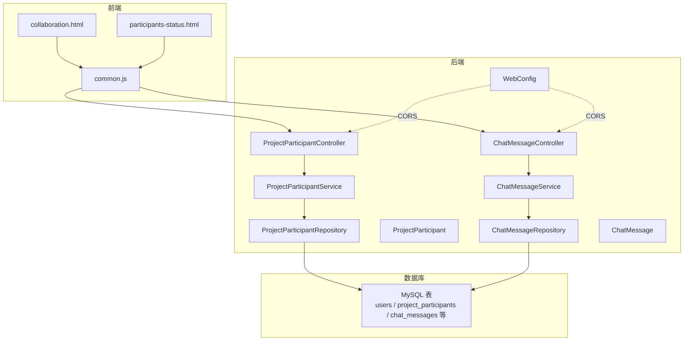
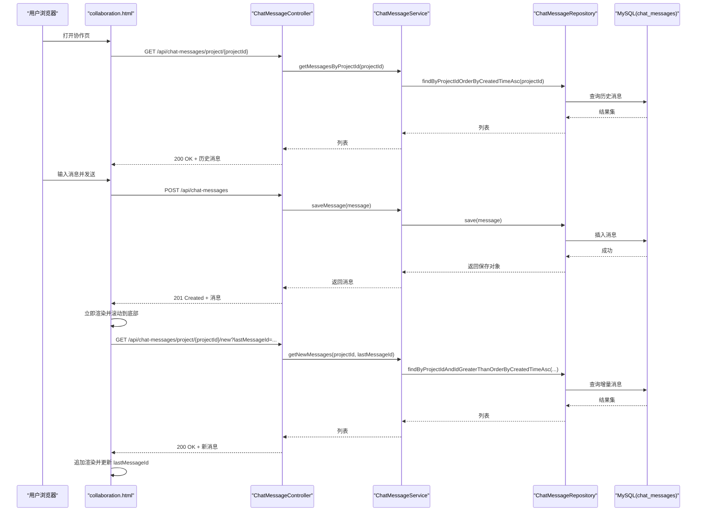
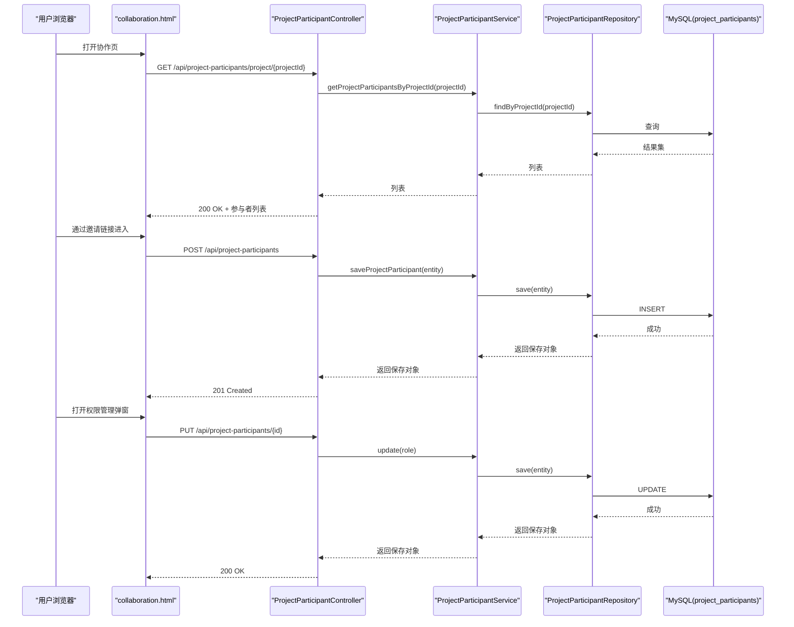
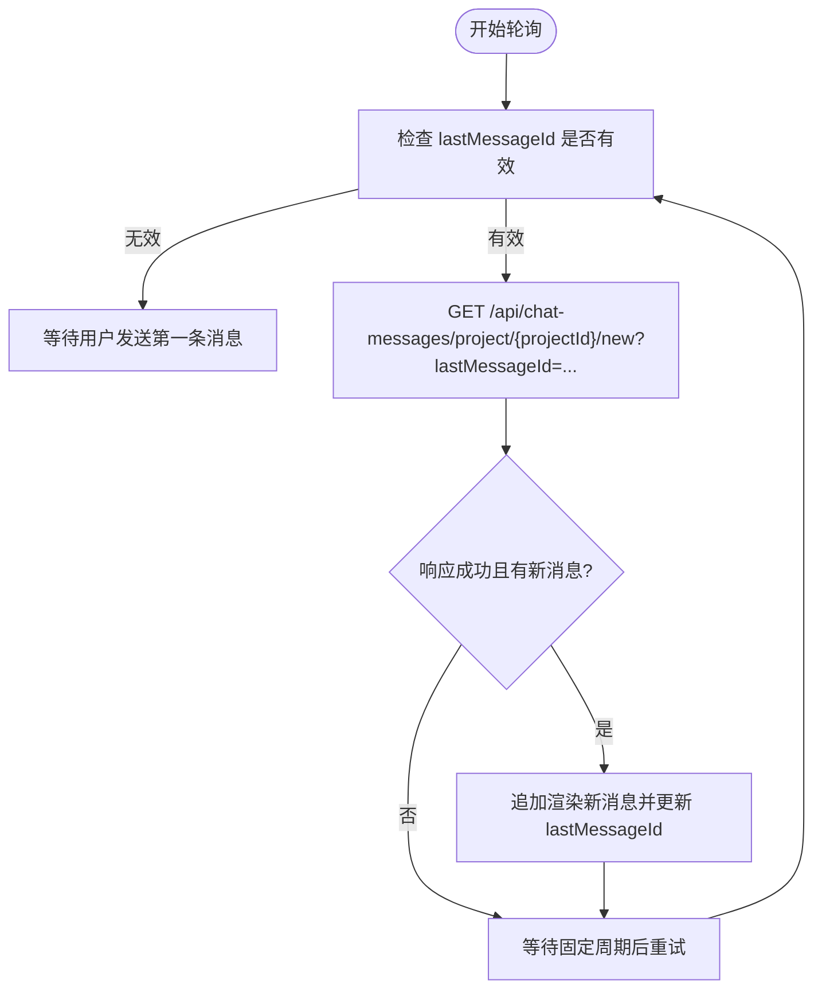
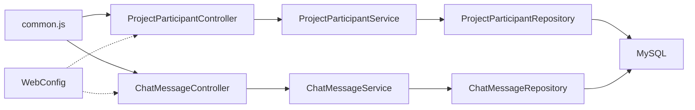

# 协作功能

<cite>
**本文引用的文件**
- [ProjectParticipant.java](file://tudianersha/src/main/java/com/tudianersha/entity/ProjectParticipant.java)
- [ProjectParticipantService.java](file://tudianersha/src/main/java/com/tudianersha/service/ProjectParticipantService.java)
- [ProjectParticipantController.java](file://tudianersha/src/main/java/com/tudianersha/controller/ProjectParticipantController.java)
- [ProjectParticipantRepository.java](file://tudianersha/src/main/java/com/tudianersha/repository/ProjectParticipantRepository.java)
- [ChatMessage.java](file://tudianersha/src/main/java/com/tudianersha/entity/ChatMessage.java)
- [ChatMessageService.java](file://tudianersha/src/main/java/com/tudianersha/service/ChatMessageService.java)
- [ChatMessageController.java](file://tudianersha/src/main/java/com/tudianersha/controller/ChatMessageController.java)
- [WebConfig.java](file://tudianersha/src/main/java/com/tudianersha/config/WebConfig.java)
- [collaboration.html](file://tudianersha/src/main/resources/static/collaboration.html)
- [participants-status.html](file://tudianersha/src/main/resources/static/participants-status.html)
- [common.js](file://tudianersha/src/main/resources/static/js/common.js)
- [schema.sql](file://tudianersha/src/main/resources/schema.sql)
</cite>

## 目录
1. [简介](#简介)
2. [项目结构](#项目结构)
3. [核心组件](#核心组件)
4. [架构总览](#架构总览)
5. [详细组件分析](#详细组件分析)
6. [依赖关系分析](#依赖关系分析)
7. [性能考量](#性能考量)
8. [故障排查指南](#故障排查指南)
9. [结论](#结论)
10. [附录](#附录)

## 简介
本文件系统性阐述平台的多人协作机制，重点覆盖：
- 通过 ProjectParticipant 实体的角色字段（创建者、编辑者、参与者/查看者）实现细粒度权限控制，并由 ProjectParticipantService 统一处理成员邀请、权限变更与状态同步。
- ChatMessageController 实现的实时聊天功能，包括消息发送、接收、历史查询与轮询机制。
- 前端 collaboration.html 与 participants-status.html 的在线成员状态展示、聊天界面布局与交互行为。
- WebSocket 或轮询机制的选择依据、消息序列化格式、并发控制策略与数据一致性保障。
- 典型协作场景的时序图与常见问题（消息丢失、状态不同步）的解决方案。

## 项目结构
后端采用 Spring MVC + JPA 架构，控制器负责对外 API，服务层封装业务逻辑，仓库层访问数据库；前端静态资源位于 static 目录，通过 common.js 统一封装 API 请求与认证工具。

图表来源
- [ProjectParticipantController.java](file://tudianersha/src/main/java/com/tudianersha/controller/ProjectParticipantController.java#L1-L91)
- [ProjectParticipantService.java](file://tudianersha/src/main/java/com/tudianersha/service/ProjectParticipantService.java#L1-L48)
- [ProjectParticipantRepository.java](file://tudianersha/src/main/java/com/tudianersha/repository/ProjectParticipantRepository.java#L1-L16)
- [ChatMessageController.java](file://tudianersha/src/main/java/com/tudianersha/controller/ChatMessageController.java#L1-L45)
- [ChatMessageService.java](file://tudianersha/src/main/java/com/tudianersha/service/ChatMessageService.java#L1-L32)
- [WebConfig.java](file://tudianersha/src/main/java/com/tudianersha/config/WebConfig.java#L1-L24)
- [schema.sql](file://tudianersha/src/main/resources/schema.sql#L1-L123)

章节来源
- [ProjectParticipantController.java](file://tudianersha/src/main/java/com/tudianersha/controller/ProjectParticipantController.java#L1-L91)
- [ChatMessageController.java](file://tudianersha/src/main/java/com/tudianersha/controller/ChatMessageController.java#L1-L45)
- [WebConfig.java](file://tudianersha/src/main/java/com/tudianersha/config/WebConfig.java#L1-L24)
- [schema.sql](file://tudianersha/src/main/resources/schema.sql#L1-L123)

## 核心组件
- ProjectParticipant 实体：承载项目成员信息，包含项目ID、用户ID、加入时间与角色（创建者/编辑者/参与者/查看者）。该角色字段用于前端与后端的权限判定。
- ProjectParticipantService：封装成员查询、保存、删除、存在性判断与按项目/用户维度检索，为权限管理与成员邀请提供支撑。
- ChatMessage 实体：承载聊天消息，包含项目ID、用户ID、用户名、消息正文与创建时间；数据库对项目ID与创建时间建立索引以支持高效查询。
- ChatMessageService：提供按项目查询历史消息、查询增量消息（基于 lastMessageId）、保存与删除消息。
- ChatMessageController：暴露 REST 接口，支持按项目查询历史、增量查询与发送消息。
- WebConfig：全局 CORS 配置，允许来自任意源的跨域请求，便于前端直连后端 API。
- 前端协作页 collaboration.html：实现聊天界面、@ 提及、权限管理弹窗、路线与景点展示等；采用轮询机制拉取增量消息。
- 前端成员状态页 participants-status.html：展示成员填写状态、复制邀请链接、触发 AI 路线生成与定时刷新。

章节来源
- [ProjectParticipant.java](file://tudianersha/src/main/java/com/tudianersha/entity/ProjectParticipant.java#L1-L87)
- [ProjectParticipantService.java](file://tudianersha/src/main/java/com/tudianersha/service/ProjectParticipantService.java#L1-L48)
- [ChatMessage.java](file://tudianersha/src/main/java/com/tudianersha/entity/ChatMessage.java#L1-L90)
- [ChatMessageService.java](file://tudianersha/src/main/java/com/tudianersha/service/ChatMessageService.java#L1-L32)
- [ChatMessageController.java](file://tudianersha/src/main/java/com/tudianersha/controller/ChatMessageController.java#L1-L45)
- [WebConfig.java](file://tudianersha/src/main/java/com/tudianersha/config/WebConfig.java#L1-L24)
- [collaboration.html](file://tudianersha/src/main/resources/static/collaboration.html#L1-L1875)
- [participants-status.html](file://tudianersha/src/main/resources/static/participants-status.html#L1-L436)

## 架构总览
协作功能由“前端页面 + 后端控制器 + 服务层 + 仓库层 + 数据库”构成，前后端通过 REST API 通信；权限控制以角色字段为核心，聊天功能采用轮询拉取增量消息。

图表来源
- [ChatMessageController.java](file://tudianersha/src/main/java/com/tudianersha/controller/ChatMessageController.java#L1-L45)
- [ChatMessageService.java](file://tudianersha/src/main/java/com/tudianersha/service/ChatMessageService.java#L1-L32)
- [schema.sql](file://tudianersha/src/main/resources/schema.sql#L114-L123)

## 详细组件分析

### 1) 角色驱动的权限控制与成员管理
- 角色定义与持久化
  - ProjectParticipant 实体包含 role 字段，数据库表 project_participants 对 role 进行存储。
  - 前端协作页在加载项目信息时，若当前用户为创建者则显示“权限管理”按钮；否则通过后端查询当前用户在项目中的角色，决定是否具备编辑权限。
- 成员邀请与状态同步
  - 若通过邀请链接进入且当前用户不在项目参与者中，则前端自动向后端发起创建参与者记录的请求，角色默认为“参与者”，并更新参与者列表。
- 权限变更流程
  - 创建者打开权限管理弹窗，前端渲染可编辑的参与者列表，逐项提交角色变更（编辑者/查看者），后端通过 PUT 接口更新对应记录，前端刷新列表确认变更生效。

图表来源
- [ProjectParticipantController.java](file://tudianersha/src/main/java/com/tudianersha/controller/ProjectParticipantController.java#L1-L91)
- [ProjectParticipantService.java](file://tudianersha/src/main/java/com/tudianersha/service/ProjectParticipantService.java#L1-L48)
- [ProjectParticipantRepository.java](file://tudianersha/src/main/java/com/tudianersha/repository/ProjectParticipantRepository.java#L1-L16)
- [collaboration.html](file://tudianersha/src/main/resources/static/collaboration.html#L1075-L1176)

章节来源
- [ProjectParticipant.java](file://tudianersha/src/main/java/com/tudianersha/entity/ProjectParticipant.java#L1-L87)
- [ProjectParticipantController.java](file://tudianersha/src/main/java/com/tudianersha/controller/ProjectParticipantController.java#L1-L91)
- [collaboration.html](file://tudianersha/src/main/resources/static/collaboration.html#L439-L543)
- [collaboration.html](file://tudianersha/src/main/resources/static/collaboration.html#L1075-L1176)

### 2) 实时聊天功能与轮询机制
- 消息发送
  - 前端在用户按下回车或点击发送按钮时，构造消息体（包含项目ID、用户ID、用户名、消息文本与创建时间），通过 POST /api/chat-messages 发送到后端。
  - 后端保存消息并返回，前端立即渲染消息并滚动到底部，同时更新 lastMessageId。
- 历史与增量消息
  - 首次加载时，前端通过 GET /api/chat-messages/project/{projectId} 获取历史消息并渲染。
  - 后端提供 GET /api/chat-messages/project/{projectId}/new?lastMessageId={id}，按项目与最后一条消息ID查询增量消息。
- 轮询策略
  - 前端每间隔固定周期（例如 5 秒）主动拉取增量消息，避免长连接复杂度；当有新消息到达时，前端追加渲染并更新 lastMessageId。
- 消息序列化格式
  - 前端发送与接收均为 JSON，字段包含项目ID、用户ID、用户名、消息正文与创建时间。
- 并发与一致性
  - 由于采用轮询，消息写入与读取均通过后端服务层与数据库完成，数据库层面通过索引提升查询效率；前端通过 lastMessageId 避免重复渲染与遗漏。
  - 为减少网络压力，前端在短时间内多次输入时可考虑节流/防抖策略（common.js 提供了防抖/节流工具函数，可在输入事件中复用）。

图表来源
- [collaboration.html](file://tudianersha/src/main/resources/static/collaboration.html#L1208-L1228)
- [collaboration.html](file://tudianersha/src/main/resources/static/collaboration.html#L1230-L1266)
- [collaboration.html](file://tudianersha/src/main/resources/static/collaboration.html#L1339-L1372)
- [ChatMessageController.java](file://tudianersha/src/main/java/com/tudianersha/controller/ChatMessageController.java#L1-L45)
- [ChatMessageService.java](file://tudianersha/src/main/java/com/tudianersha/service/ChatMessageService.java#L1-L32)

章节来源
- [ChatMessageController.java](file://tudianersha/src/main/java/com/tudianersha/controller/ChatMessageController.java#L1-L45)
- [ChatMessageService.java](file://tudianersha/src/main/java/com/tudianersha/service/ChatMessageService.java#L1-L32)
- [collaboration.html](file://tudianersha/src/main/resources/static/collaboration.html#L1208-L1228)
- [collaboration.html](file://tudianersha/src/main/resources/static/collaboration.html#L1230-L1266)
- [collaboration.html](file://tudianersha/src/main/resources/static/collaboration.html#L1339-L1372)

### 3) 前端页面与交互行为
- collaboration.html
  - 聊天区域：包含消息列表容器与输入框，支持 @ 提及与快捷键操作；发送后立即渲染并滚动到底部。
  - 权限管理弹窗：创建者可见，可将参与者角色切换为“编辑者/查看者”，逐项保存并刷新列表。
  - 路线与景点展示：根据项目与路线数据渲染每日行程与景点详情。
  - 邀请链接处理：若通过邀请链接进入且非参与者，自动添加为“参与者”并刷新列表。
- participants-status.html
  - 展示成员填写状态（进行中/已完成），统计人数并提供复制邀请链接与生成 AI 路线入口。
  - 定时刷新（每 5 秒）以保持状态同步。

章节来源
- [collaboration.html](file://tudianersha/src/main/resources/static/collaboration.html#L1-L1875)
- [participants-status.html](file://tudianersha/src/main/resources/static/participants-status.html#L1-L436)

### 4) 数据模型与索引
- 项目成员表 project_participants：包含项目ID、用户ID、加入时间与角色，用于权限判定与成员管理。
- 聊天消息表 chat_messages：包含项目ID、用户ID、用户名、消息正文与创建时间；对项目ID与创建时间建立索引，优化历史与增量查询。
- 用户表 users：用于成员基本信息与登录态校验。

章节来源
- [schema.sql](file://tudianersha/src/main/resources/schema.sql#L1-L123)

## 依赖关系分析
- 控制器依赖服务层，服务层依赖仓库层，仓库层访问数据库。
- 前端通过 common.js 统一发起 API 请求，控制器与服务层之间通过 DTO（如 ChatMessage、ProjectParticipant）传递数据。
- WebConfig 开启 CORS，允许任意源访问 /api/**，简化前端直连后端。

图表来源
- [ProjectParticipantController.java](file://tudianersha/src/main/java/com/tudianersha/controller/ProjectParticipantController.java#L1-L91)
- [ChatMessageController.java](file://tudianersha/src/main/java/com/tudianersha/controller/ChatMessageController.java#L1-L45)
- [ProjectParticipantService.java](file://tudianersha/src/main/java/com/tudianersha/service/ProjectParticipantService.java#L1-L48)
- [ChatMessageService.java](file://tudianersha/src/main/java/com/tudianersha/service/ChatMessageService.java#L1-L32)
- [WebConfig.java](file://tudianersha/src/main/java/com/tudianersha/config/WebConfig.java#L1-L24)

章节来源
- [ProjectParticipantController.java](file://tudianersha/src/main/java/com/tudianersha/controller/ProjectParticipantController.java#L1-L91)
- [ChatMessageController.java](file://tudianersha/src/main/java/com/tudianersha/controller/ChatMessageController.java#L1-L45)
- [WebConfig.java](file://tudianersha/src/main/java/com/tudianersha/config/WebConfig.java#L1-L24)

## 性能考量
- 查询性能
  - 聊天消息表对项目ID与创建时间建立索引，有利于历史查询与增量查询。
- 轮询频率
  - 前端采用固定周期轮询，建议根据消息密度与带宽情况调整轮询间隔，避免过度请求。
- 前端渲染
  - 新消息追加渲染时，优先 DOM 操作最小化，避免全量重绘。
- 并发控制
  - 建议在前端输入事件上应用节流/防抖，减少重复请求；在后端可引入幂等设计（如 lastMessageId 去重）降低重复渲染风险。

[本节为通用指导，无需列出具体文件来源]

## 故障排查指南
- 消息丢失
  - 现象：新消息未及时显示。
  - 排查：确认前端轮询是否正常执行、lastMessageId 是否更新、后端增量查询接口是否返回数据。
  - 建议：在前端增加错误提示与重试逻辑；必要时手动刷新页面以强制拉取最新消息。
- 状态不同步
  - 现象：成员状态页未及时更新。
  - 排查：确认 participants-status.html 的定时刷新是否生效（每 5 秒）。
  - 建议：在权限变更后手动刷新页面，或在前端增加变更后的强制刷新。
- 权限未生效
  - 现象：创建者无法看到权限管理按钮或编辑者仍不可编辑。
  - 排查：确认后端返回的角色值与前端判定逻辑一致；检查数据库中角色字段是否正确更新。
- 跨域问题
  - 现象：前端请求后端报跨域错误。
  - 排查：确认 WebConfig 的 CORS 配置是否生效，后端是否允许 /api/** 的跨域访问。

章节来源
- [collaboration.html](file://tudianersha/src/main/resources/static/collaboration.html#L1208-L1228)
- [participants-status.html](file://tudianersha/src/main/resources/static/participants-status.html#L428-L433)
- [WebConfig.java](file://tudianersha/src/main/java/com/tudianersha/config/WebConfig.java#L1-L24)

## 结论
本协作功能以角色字段为核心实现细粒度权限控制，结合后端服务层与仓库层，提供成员邀请、权限变更与状态同步能力；聊天模块采用轮询机制，通过增量查询与前端即时渲染实现近实时体验。整体架构清晰、扩展性强，适合在现有基础上进一步引入 WebSocket 以降低轮询开销与提升实时性。

[本节为总结性内容，无需列出具体文件来源]

## 附录
- API 一览
  - 成员管理
    - GET /api/project-participants/project/{projectId}
    - POST /api/project-participants
    - PUT /api/project-participants/{id}
  - 聊天消息
    - GET /api/chat-messages/project/{projectId}
    - GET /api/chat-messages/project/{projectId}/new?lastMessageId={id}
    - POST /api/chat-messages
    - DELETE /api/chat-messages/{id}
- 前端工具
  - common.js 提供统一 API 请求、认证工具与常用工具函数，便于在协作页中复用。

章节来源
- [ProjectParticipantController.java](file://tudianersha/src/main/java/com/tudianersha/controller/ProjectParticipantController.java#L1-L91)
- [ChatMessageController.java](file://tudianersha/src/main/java/com/tudianersha/controller/ChatMessageController.java#L1-L45)
- [common.js](file://tudianersha/src/main/resources/static/js/common.js#L1-L272)