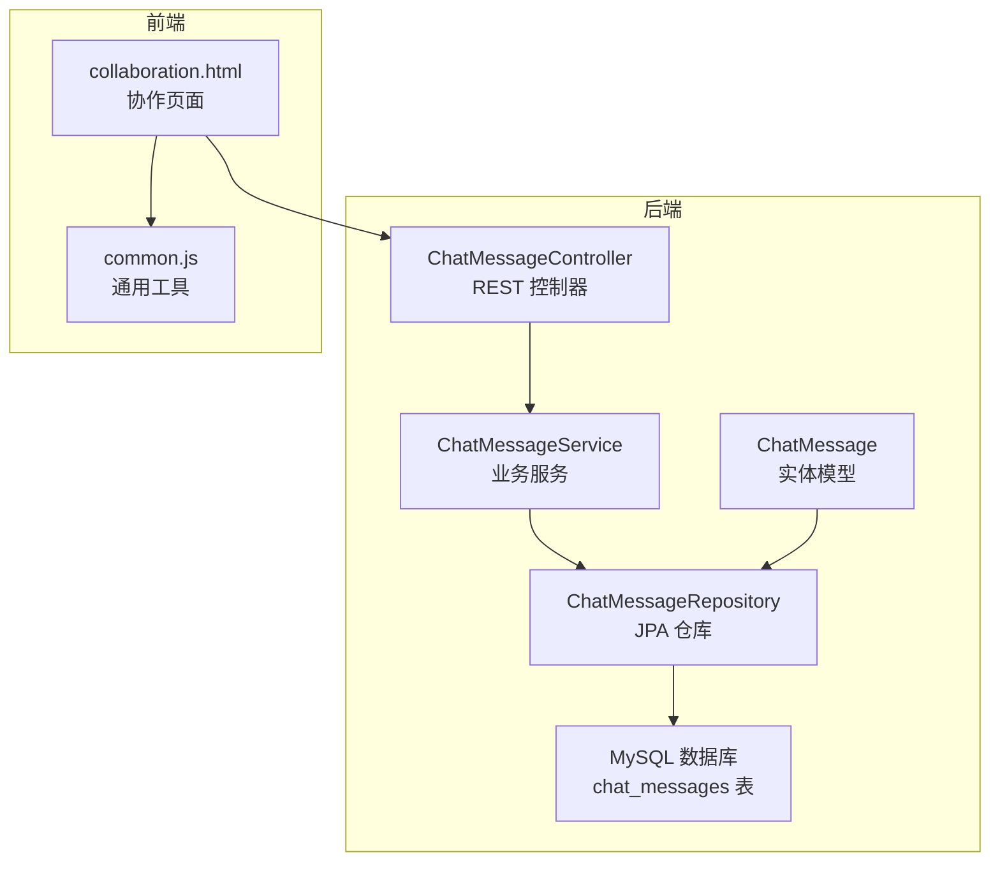
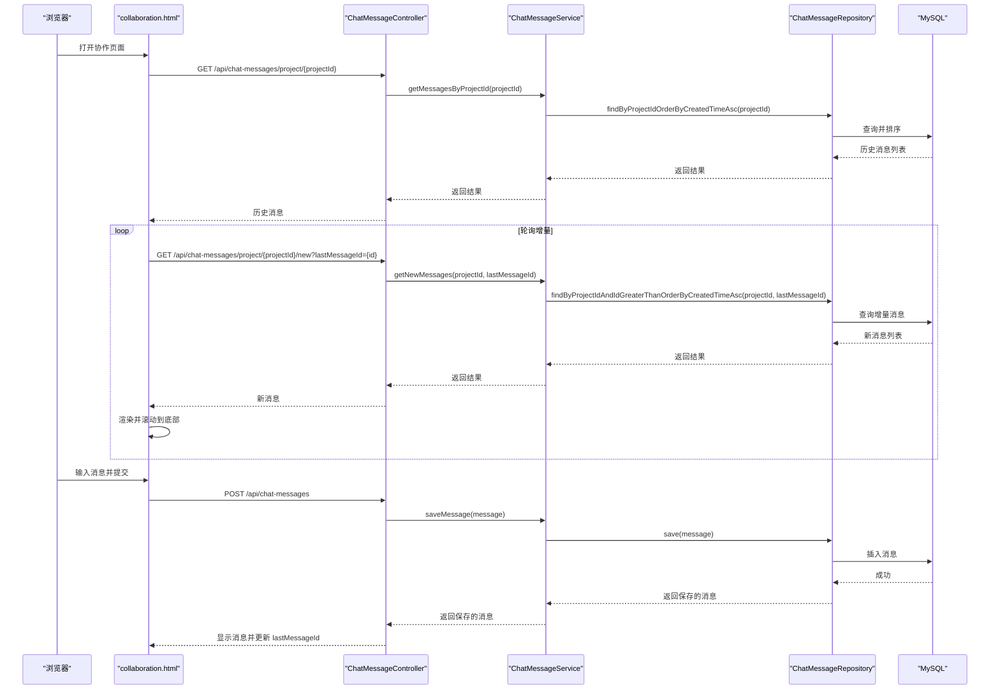
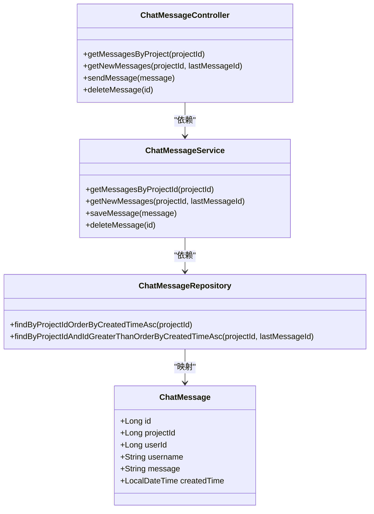
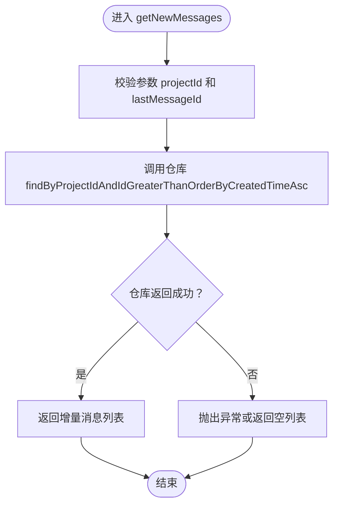
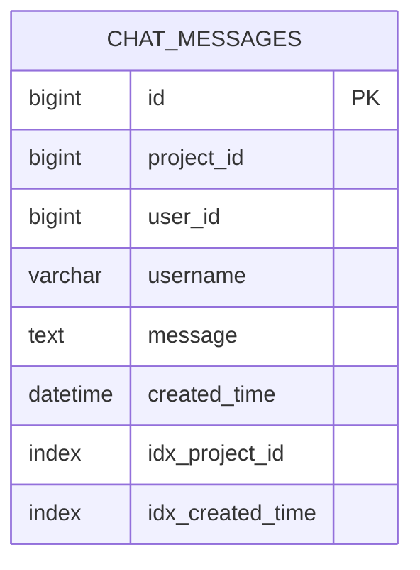
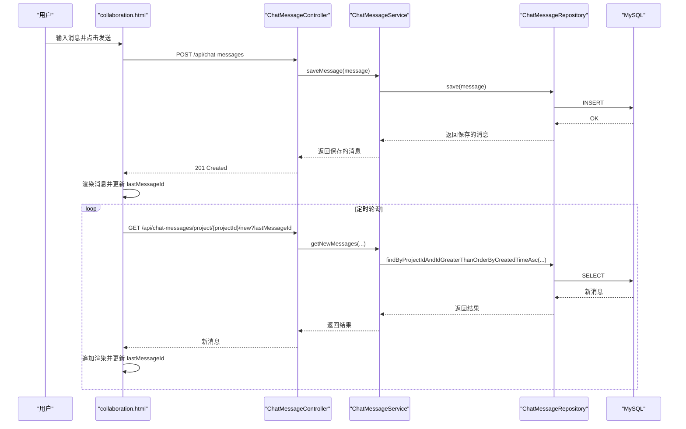
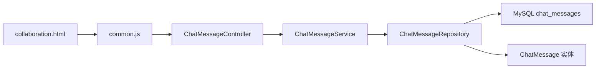

# 实时协作

<cite>
**本文引用的文件**
- [ChatMessageController.java](file://tudianersha/src/main/java/com/tudianersha/controller/ChatMessageController.java)
- [ChatMessageService.java](file://tudianersha/src/main/java/com/tudianersha/service/ChatMessageService.java)
- [ChatMessageRepository.java](file://tudianersha/src/main/java/com/tudianersha/repository/ChatMessageRepository.java)
- [ChatMessage.java](file://tudianersha/src/main/java/com/tudianersha/entity/ChatMessage.java)
- [collaboration.html](file://tudianersha/src/main/resources/static/collaboration.html)
- [common.js](file://tudianersha/src/main/resources/static/js/common.js)
- [schema.sql](file://tudianersha/src/main/resources/schema.sql)
- [application.yml](file://tudianersha/src/main/resources/application.yml)
- [Application.java](file://tudianersha/src/main/java/com/tudianersha/Application.java)
</cite>

## 目录
1. [简介](#简介)
2. [项目结构](#项目结构)
3. [核心组件](#核心组件)
4. [架构总览](#架构总览)
5. [详细组件分析](#详细组件分析)
6. [依赖关系分析](#依赖关系分析)
7. [性能考量](#性能考量)
8. [故障排查指南](#故障排查指南)
9. [结论](#结论)
10. [附录](#附录)

## 简介
本文件深入解析平台的实时聊天功能实现，围绕以下目标展开：
- ChatMessageController 如何通过 RESTful API 处理消息发送（POST）、按项目查询历史消息（GET /project/{projectId}）以及获取增量消息（GET /project/{projectId}/new）。
- ChatMessageService 如何调用 ChatMessageRepository 实现消息的持久化存储与查询，重点解释 getNewMessages 方法如何基于 lastMessageId 实现增量拉取，模拟实时通信效果。
- 结合 collaboration.html 中的聊天界面，描述前端如何轮询或监听新消息、渲染聊天记录、处理 @ 提及功能以及用户交互行为。
- 涵盖消息序列化格式、时间戳处理、错误重试机制、历史消息加载策略以及性能优化建议（如分页、缓存）。

## 项目结构
该功能涉及三层：控制器层（Controller）、服务层（Service）、仓库层（Repository），以及前端静态页面与通用 JavaScript 工具。数据库层面提供 chat_messages 表，包含必要的索引以支持查询与排序。

**图示来源**
- [ChatMessageController.java](file://tudianersha/src/main/java/com/tudianersha/controller/ChatMessageController.java#L1-L45)
- [ChatMessageService.java](file://tudianersha/src/main/java/com/tudianersha/service/ChatMessageService.java#L1-L32)
- [ChatMessageRepository.java](file://tudianersha/src/main/java/com/tudianersha/repository/ChatMessageRepository.java#L1-L16)
- [ChatMessage.java](file://tudianersha/src/main/java/com/tudianersha/entity/ChatMessage.java#L1-L90)
- [collaboration.html](file://tudianersha/src/main/resources/static/collaboration.html#L1-L200)
- [common.js](file://tudianersha/src/main/resources/static/js/common.js#L1-L60)
- [schema.sql](file://tudianersha/src/main/resources/schema.sql#L113-L123)

**章节来源**
- [Application.java](file://tudianersha/src/main/java/com/tudianersha/Application.java#L1-L12)
- [application.yml](file://tudianersha/src/main/resources/application.yml#L1-L20)
- [schema.sql](file://tudianersha/src/main/resources/schema.sql#L113-L123)

## 核心组件
- 控制器层：提供 REST 接口，负责接收请求、参数校验与响应封装。
- 服务层：编排业务逻辑，调用仓库进行数据访问。
- 仓库层：基于 JPA 的方法命名约定，提供按项目查询与增量查询。
- 实体层：定义消息字段，包括项目标识、用户标识、用户名、消息正文与创建时间。
- 前端页面：协作页面包含聊天区域、输入框、@ 提及下拉、历史消息加载与增量轮询。

**章节来源**
- [ChatMessageController.java](file://tudianersha/src/main/java/com/tudianersha/controller/ChatMessageController.java#L1-L45)
- [ChatMessageService.java](file://tudianersha/src/main/java/com/tudianersha/service/ChatMessageService.java#L1-L32)
- [ChatMessageRepository.java](file://tudianersha/src/main/java/com/tudianersha/repository/ChatMessageRepository.java#L1-L16)
- [ChatMessage.java](file://tudianersha/src/main/java/com/tudianersha/entity/ChatMessage.java#L1-L90)
- [collaboration.html](file://tudianersha/src/main/resources/static/collaboration.html#L1196-L1430)

## 架构总览
后端采用 Spring MVC + Spring Data JPA，前端通过 fetch API 调用后端 REST 接口，实现消息的发送、历史加载与增量拉取。

**图示来源**
- [ChatMessageController.java](file://tudianersha/src/main/java/com/tudianersha/controller/ChatMessageController.java#L19-L43)
- [ChatMessageService.java](file://tudianersha/src/main/java/com/tudianersha/service/ChatMessageService.java#L16-L31)
- [ChatMessageRepository.java](file://tudianersha/src/main/java/com/tudianersha/repository/ChatMessageRepository.java#L12-L14)
- [collaboration.html](file://tudianersha/src/main/resources/static/collaboration.html#L1196-L1430)

## 详细组件分析

### 控制器层：ChatMessageController
- GET /api/chat-messages/project/{projectId}
  - 作用：按项目 ID 查询历史消息，按创建时间升序排列。
  - 参数：路径变量 projectId。
  - 返回：消息列表。
- GET /api/chat-messages/project/{projectId}/new?lastMessageId={id}
  - 作用：增量拉取新消息，仅返回大于 lastMessageId 的消息，按创建时间升序。
  - 参数：路径变量 projectId；查询参数 lastMessageId。
  - 返回：增量消息列表。
- POST /api/chat-messages
  - 作用：发送消息，保存后返回保存的消息对象。
  - 请求体：消息对象（包含项目 ID、用户 ID、用户名、消息正文、创建时间）。
  - 返回：保存后的消息对象（状态码 201）。
- DELETE /api/chat-messages/{id}
  - 作用：删除指定消息。
  - 返回：204 No Content。

**图示来源**
- [ChatMessageController.java](file://tudianersha/src/main/java/com/tudianersha/controller/ChatMessageController.java#L1-L45)
- [ChatMessageService.java](file://tudianersha/src/main/java/com/tudianersha/service/ChatMessageService.java#L1-L32)
- [ChatMessageRepository.java](file://tudianersha/src/main/java/com/tudianersha/repository/ChatMessageRepository.java#L1-L16)
- [ChatMessage.java](file://tudianersha/src/main/java/com/tudianersha/entity/ChatMessage.java#L1-L90)

**章节来源**
- [ChatMessageController.java](file://tudianersha/src/main/java/com/tudianersha/controller/ChatMessageController.java#L19-L43)

### 服务层：ChatMessageService
- getMessagesByProjectId(projectId)
  - 调用仓库方法按项目 ID 查询并按创建时间升序排序。
- getNewMessages(projectId, lastMessageId)
  - 调用仓库方法查询大于 lastMessageId 的消息，按创建时间升序排序，实现增量拉取。
- saveMessage(message)
  - 保存消息并返回保存后的对象。
- deleteMessage(id)
  - 删除指定消息。

**图示来源**
- [ChatMessageService.java](file://tudianersha/src/main/java/com/tudianersha/service/ChatMessageService.java#L16-L31)
- [ChatMessageRepository.java](file://tudianersha/src/main/java/com/tudianersha/repository/ChatMessageRepository.java#L12-L14)

**章节来源**
- [ChatMessageService.java](file://tudianersha/src/main/java/com/tudianersha/service/ChatMessageService.java#L16-L31)

### 仓库层：ChatMessageRepository
- findByProjectIdOrderByCreatedTimeAsc(projectId)
  - 按项目 ID 查询并按创建时间升序排序，用于历史消息加载。
- findByProjectIdAndIdGreaterThanOrderByCreatedTimeAsc(projectId, lastMessageId)
  - 增量查询，返回大于 lastMessageId 的消息，按创建时间升序排序，用于增量拉取。

**图示来源**
- [schema.sql](file://tudianersha/src/main/resources/schema.sql#L113-L123)
- [ChatMessageRepository.java](file://tudianersha/src/main/java/com/tudianersha/repository/ChatMessageRepository.java#L12-L14)

**章节来源**
- [ChatMessageRepository.java](file://tudianersha/src/main/java/com/tudianersha/repository/ChatMessageRepository.java#L12-L14)
- [schema.sql](file://tudianersha/src/main/resources/schema.sql#L113-L123)

### 实体层：ChatMessage
- 字段：id、projectId、userId、username、message、createdTime。
- 用途：作为 JPA 实体映射 chat_messages 表，用于消息的持久化与查询。

**章节来源**
- [ChatMessage.java](file://tudianersha/src/main/java/com/tudianersha/entity/ChatMessage.java#L1-L90)

### 前端：collaboration.html 与 common.js
- 历史消息加载
  - 页面加载时调用 GET /api/chat-messages/project/{projectId}，渲染聊天记录，并更新 lastMessageId 为最新消息 ID。
- 增量消息轮询
  - 定期调用 GET /api/chat-messages/project/{projectId}/new?lastMessageId={id}，若返回新消息则追加渲染并更新 lastMessageId。
- 发送消息
  - 用户输入消息后，POST /api/chat-messages，请求体包含 projectId、userId、username、message、createdTime，成功后立即渲染并更新 lastMessageId。
- @ 提及功能
  - 输入框检测 @ 符号，展示参与者下拉列表，支持键盘上下选择与回车确认，插入 @用户名+空格。
- 时间戳与格式化
  - createdTime 由后端实体字段提供，前端使用 formatTimeAgo 将时间转换为“刚刚/几分钟前/几小时前/日期”。
- 错误处理
  - 前端对网络错误进行捕获并提示；common.js 提供统一的 apiRequest 封装，便于后续扩展错误重试与拦截器。

**图示来源**
- [collaboration.html](file://tudianersha/src/main/resources/static/collaboration.html#L1196-L1430)
- [common.js](file://tudianersha/src/main/resources/static/js/common.js#L1-L60)

**章节来源**
- [collaboration.html](file://tudianersha/src/main/resources/static/collaboration.html#L1196-L1430)
- [common.js](file://tudianersha/src/main/resources/static/js/common.js#L1-L60)

## 依赖关系分析
- 控制器依赖服务层，服务层依赖仓库层，仓库层映射实体并访问数据库。
- 前端通过 fetch API 调用后端接口，common.js 提供统一的请求封装。
- 数据库层提供 chat_messages 表，包含项目 ID 与创建时间索引，支撑按项目查询与增量查询。

**图示来源**
- [ChatMessageController.java](file://tudianersha/src/main/java/com/tudianersha/controller/ChatMessageController.java#L1-L45)
- [ChatMessageService.java](file://tudianersha/src/main/java/com/tudianersha/service/ChatMessageService.java#L1-L32)
- [ChatMessageRepository.java](file://tudianersha/src/main/java/com/tudianersha/repository/ChatMessageRepository.java#L1-L16)
- [ChatMessage.java](file://tudianersha/src/main/java/com/tudianersha/entity/ChatMessage.java#L1-L90)
- [collaboration.html](file://tudianersha/src/main/resources/static/collaboration.html#L1196-L1430)
- [common.js](file://tudianersha/src/main/resources/static/js/common.js#L1-L60)
- [schema.sql](file://tudianersha/src/main/resources/schema.sql#L113-L123)

**章节来源**
- [ChatMessageController.java](file://tudianersha/src/main/java/com/tudianersha/controller/ChatMessageController.java#L1-L45)
- [ChatMessageService.java](file://tudianersha/src/main/java/com/tudianersha/service/ChatMessageService.java#L1-L32)
- [ChatMessageRepository.java](file://tudianersha/src/main/java/com/tudianersha/repository/ChatMessageRepository.java#L1-L16)
- [schema.sql](file://tudianersha/src/main/resources/schema.sql#L113-L123)

## 性能考量
- 增量拉取策略
  - 基于 lastMessageId 的增量查询避免了全量扫描，适合高频轮询场景。
  - 建议前端轮询间隔根据消息密度动态调整，减少无效请求。
- 数据库索引
  - chat_messages 表已建立 project_id 与 created_time 索引，有利于按项目查询与排序。
  - 可考虑复合索引（project_id, created_time）进一步优化查询。
- 分页与缓存
  - 历史消息加载可引入分页参数（如 limit/offset 或基于时间窗口），减轻一次性传输压力。
  - 前端可缓存最近 N 条消息，避免重复渲染与 DOM 操作。
- 并发与一致性
  - 增量查询按创建时间升序，确保消息顺序一致。
  - 若需强一致，可在服务层增加幂等性校验（如去重 lastMessageId）。

[本节为通用性能建议，无需特定文件来源]

## 故障排查指南
- 前端网络错误
  - 检查 common.js 的 apiRequest 是否返回错误，确认后端接口是否可达。
  - 确认浏览器控制台是否存在跨域问题或 404/500 错误。
- 增量拉取无新消息
  - 确认 lastMessageId 是否正确更新，避免重复请求相同 lastMessageId。
  - 检查数据库中是否存在大于 lastMessageId 的消息。
- 历史消息为空
  - 确认 projectId 是否正确传递，且项目存在对应消息。
- 时间戳显示异常
  - 检查 createdTime 的时区与格式化逻辑，确保前后端时间一致。
- @ 提及功能异常
  - 确认参与者列表加载成功，输入框 @ 触发逻辑正常，下拉项选择后插入成功。

**章节来源**
- [common.js](file://tudianersha/src/main/resources/static/js/common.js#L1-L60)
- [collaboration.html](file://tudianersha/src/main/resources/static/collaboration.html#L1196-L1430)

## 结论
该实时聊天功能通过清晰的三层架构与简洁的 REST 接口实现了消息的发送、历史加载与增量拉取。前端采用定时轮询与 DOM 追加的方式模拟实时效果，配合 @ 提及与时间戳格式化提升了协作体验。数据库层面的索引设计与服务层的增量查询策略共同保障了性能与可维护性。后续可在分页、缓存与错误重试方面进一步优化，以提升大规模并发下的稳定性与用户体验。

[本节为总结性内容，无需特定文件来源]

## 附录

### API 定义概览
- GET /api/chat-messages/project/{projectId}
  - 作用：按项目查询历史消息（按创建时间升序）
  - 参数：projectId（路径变量）
  - 返回：消息列表
- GET /api/chat-messages/project/{projectId}/new?lastMessageId={id}
  - 作用：增量拉取新消息（按创建时间升序）
  - 参数：projectId（路径变量）、lastMessageId（查询参数）
  - 返回：增量消息列表
- POST /api/chat-messages
  - 作用：发送消息
  - 请求体：消息对象（projectId、userId、username、message、createdTime）
  - 返回：保存后的消息对象（201 Created）
- DELETE /api/chat-messages/{id}
  - 作用：删除消息
  - 返回：204 No Content

**章节来源**
- [ChatMessageController.java](file://tudianersha/src/main/java/com/tudianersha/controller/ChatMessageController.java#L19-L43)

### 消息序列化与时间戳
- 请求体字段
  - projectId：项目 ID
  - userId：发送用户 ID
  - username：发送用户名
  - message：消息正文
  - createdTime：消息创建时间（ISO 8601）
- 响应体字段
  - id：消息 ID
  - projectId、userId、username、message、createdTime：同上

**章节来源**
- [ChatMessage.java](file://tudianersha/src/main/java/com/tudianersha/entity/ChatMessage.java#L1-L90)
- [collaboration.html](file://tudianersha/src/main/resources/static/collaboration.html#L1339-L1372)

### 数据库表结构
- chat_messages 表
  - 字段：id、project_id、user_id、username、message、created_time
  - 索引：idx_project_id、idx_created_time

**章节来源**
- [schema.sql](file://tudianersha/src/main/resources/schema.sql#L113-L123)