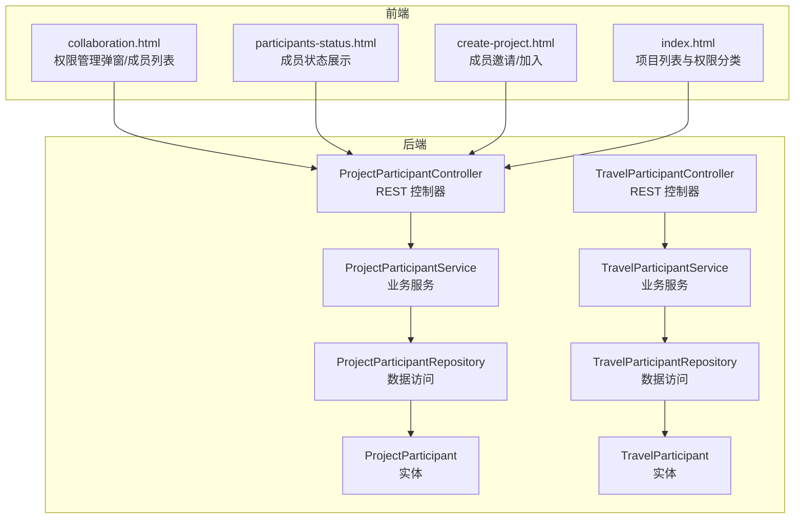
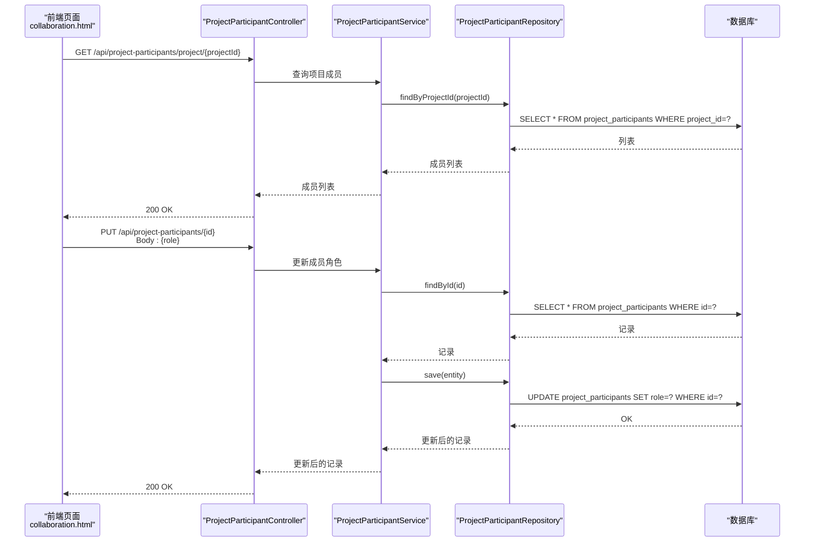
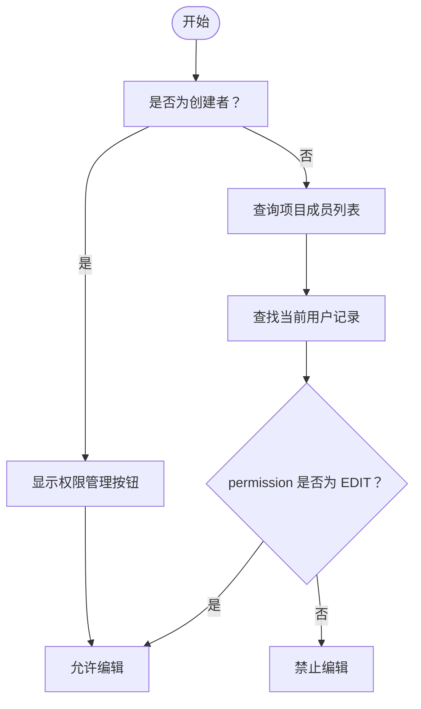
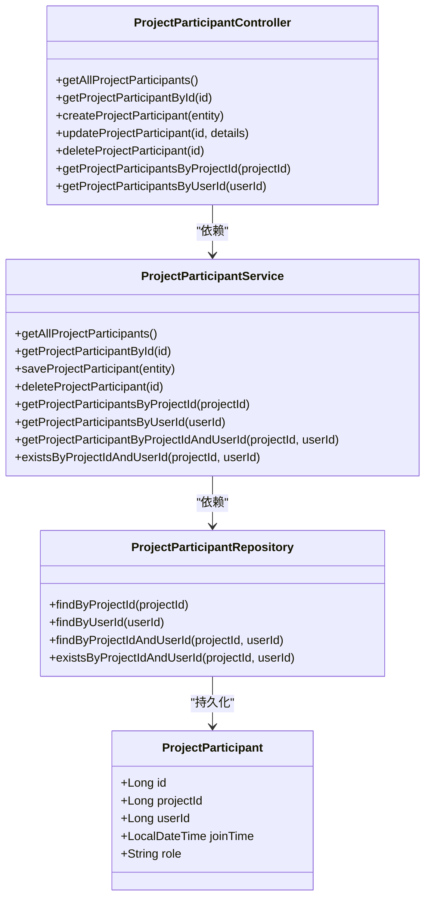
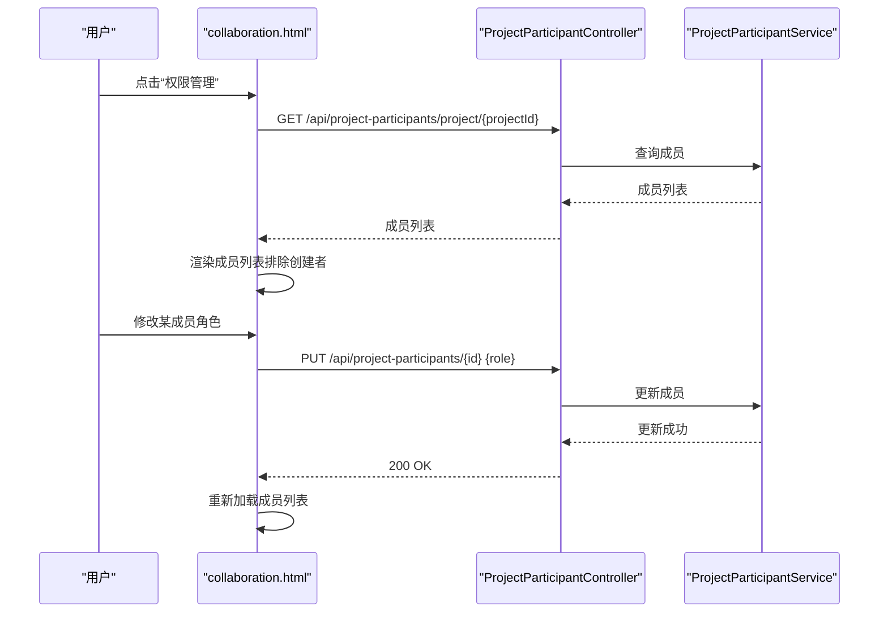
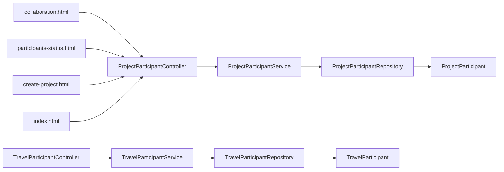

# 权限管理

<cite>
**本文引用的文件**
- [ProjectParticipant.java](file://tudianersha/src/main/java/com/tudianersha/entity/ProjectParticipant.java)
- [ProjectParticipantController.java](file://tudianersha/src/main/java/com/tudianersha/controller/ProjectParticipantController.java)
- [ProjectParticipantService.java](file://tudianersha/src/main/java/com/tudianersha/service/ProjectParticipantService.java)
- [ProjectParticipantRepository.java](file://tudianersha/src/main/java/com/tudianersha/repository/ProjectParticipantRepository.java)
- [TravelParticipant.java](file://tudianersha/src/main/java/com/tudianersha/entity/TravelParticipant.java)
- [TravelParticipantController.java](file://tudianersha/src/main/java/com/tudianersha/controller/TravelParticipantController.java)
- [TravelParticipantService.java](file://tudianersha/src/main/java/com/tudianersha/service/TravelParticipantService.java)
- [TravelParticipantRepository.java](file://tudianersha/src/main/java/com/tudianersha/repository/TravelParticipantRepository.java)
- [collaboration.html](file://tudianersha/src/main/resources/static/collaboration.html)
- [participants-status.html](file://tudianersha/src/main/resources/static/participants-status.html)
- [create-project.html](file://tudianersha/src/main/resources/static/create-project.html)
- [index.html](file://tudianersha/src/main/resources/static/index.html)
</cite>

## 目录
1. [引言](#引言)
2. [项目结构](#项目结构)
3. [核心组件](#核心组件)
4. [架构总览](#架构总览)
5. [详细组件分析](#详细组件分析)
6. [依赖关系分析](#依赖关系分析)
7. [性能考量](#性能考量)
8. [故障排查指南](#故障排查指南)
9. [结论](#结论)

## 引言
本文件系统性阐述平台的权限管理体系，围绕 ProjectParticipant 实体的角色字段（创建者、编辑者、参与者）展开，解释其如何实现细粒度访问控制；梳理 ProjectParticipantController 提供的 REST API 如何与 ProjectParticipantService 协同，支撑成员邀请、权限变更与项目成员管理；并结合前端 collaboration.html 的权限管理弹窗与 participants-status.html 的成员状态展示，说明前端如何通过 API 获取成员列表、渲染权限界面、处理权限变更请求。文档同时覆盖权限验证逻辑、并发更新处理、数据一致性保障以及常见问题（如权限不同步、角色更新失败）的解决方案。

## 项目结构
- 后端采用 Spring MVC + JPA，权限相关的核心实体为 ProjectParticipant 和 TravelParticipant，分别对应项目成员与旅行项目的成员表。
- 前端静态资源位于 static 目录，包含协作页面、成员状态页与项目创建页等，负责调用后端 API 完成权限管理与成员状态展示。

图表来源
- [ProjectParticipantController.java](file://tudianersha/src/main/java/com/tudianersha/controller/ProjectParticipantController.java#L1-L91)
- [ProjectParticipantService.java](file://tudianersha/src/main/java/com/tudianersha/service/ProjectParticipantService.java#L1-L48)
- [ProjectParticipantRepository.java](file://tudianersha/src/main/java/com/tudianersha/repository/ProjectParticipantRepository.java#L1-L16)
- [ProjectParticipant.java](file://tudianersha/src/main/java/com/tudianersha/entity/ProjectParticipant.java#L1-L87)
- [TravelParticipantController.java](file://tudianersha/src/main/java/com/tudianersha/controller/TravelParticipantController.java#L1-L60)
- [TravelParticipantService.java](file://tudianersha/src/main/java/com/tudianersha/service/TravelParticipantService.java#L1-L52)
- [TravelParticipantRepository.java](file://tudianersha/src/main/java/com/tudianersha/repository/TravelParticipantRepository.java#L1-L17)
- [TravelParticipant.java](file://tudianersha/src/main/java/com/tudianersha/entity/TravelParticipant.java#L1-L73)
- [collaboration.html](file://tudianersha/src/main/resources/static/collaboration.html#L1-L1213)
- [participants-status.html](file://tudianersha/src/main/resources/static/participants-status.html#L1-L436)
- [create-project.html](file://tudianersha/src/main/resources/static/create-project.html#L1296-L1323)
- [index.html](file://tudianersha/src/main/resources/static/index.html#L305-L342)

章节来源
- [ProjectParticipantController.java](file://tudianersha/src/main/java/com/tudianersha/controller/ProjectParticipantController.java#L1-L91)
- [ProjectParticipantService.java](file://tudianersha/src/main/java/com/tudianersha/service/ProjectParticipantService.java#L1-L48)
- [ProjectParticipantRepository.java](file://tudianersha/src/main/java/com/tudianersha/repository/ProjectParticipantRepository.java#L1-L16)
- [ProjectParticipant.java](file://tudianersha/src/main/java/com/tudianersha/entity/ProjectParticipant.java#L1-L87)
- [TravelParticipantController.java](file://tudianersha/src/main/java/com/tudianersha/controller/TravelParticipantController.java#L1-L60)
- [TravelParticipantService.java](file://tudianersha/src/main/java/com/tudianersha/service/TravelParticipantService.java#L1-L52)
- [TravelParticipantRepository.java](file://tudianersha/src/main/java/com/tudianersha/repository/TravelParticipantRepository.java#L1-L17)
- [TravelParticipant.java](file://tudianersha/src/main/java/com/tudianersha/entity/TravelParticipant.java#L1-L73)
- [collaboration.html](file://tudianersha/src/main/resources/static/collaboration.html#L1-L1213)
- [participants-status.html](file://tudianersha/src/main/resources/static/participants-status.html#L1-L436)
- [create-project.html](file://tudianersha/src/main/resources/static/create-project.html#L1296-L1323)
- [index.html](file://tudianersha/src/main/resources/static/index.html#L305-L342)

## 核心组件
- ProjectParticipant 实体：存储项目成员记录，包含项目ID、用户ID、加入时间与角色（创建者/编辑者/参与者）。该字段即为细粒度访问控制的核心依据。
- ProjectParticipantController：提供成员查询、创建、更新、删除等 REST 接口，并支持按项目ID或用户ID检索成员。
- ProjectParticipantService：封装对 ProjectParticipantRepository 的调用，提供成员列表、按条件查询与存在性判断等能力。
- 前端协作页面 collaboration.html：提供权限管理弹窗，允许创建者或拥有编辑权限的用户调整成员角色；同时根据成员角色决定是否显示编辑按钮。
- 前端成员状态页 participants-status.html：展示成员状态（填写中/已完成），并基于成员角色进行过滤与渲染。
- 前端项目创建页 create-project.html：在邀请链接场景下自动将用户加入项目并设置初始角色。
- 前端首页 index.html：根据成员记录对项目进行权限分类（创建者/编辑者/参与者）。

章节来源
- [ProjectParticipant.java](file://tudianersha/src/main/java/com/tudianersha/entity/ProjectParticipant.java#L1-L87)
- [ProjectParticipantController.java](file://tudianersha/src/main/java/com/tudianersha/controller/ProjectParticipantController.java#L1-L91)
- [ProjectParticipantService.java](file://tudianersha/src/main/java/com/tudianersha/service/ProjectParticipantService.java#L1-L48)
- [collaboration.html](file://tudianersha/src/main/resources/static/collaboration.html#L415-L454)
- [participants-status.html](file://tudianersha/src/main/resources/static/participants-status.html#L274-L307)
- [create-project.html](file://tudianersha/src/main/resources/static/create-project.html#L1296-L1323)
- [index.html](file://tudianersha/src/main/resources/static/index.html#L305-L342)

## 架构总览
后端通过控制器-服务-仓储三层结构管理成员与权限；前端通过 AJAX 调用后端 API，实现成员邀请、权限变更与状态展示。

图表来源
- [ProjectParticipantController.java](file://tudianersha/src/main/java/com/tudianersha/controller/ProjectParticipantController.java#L1-L91)
- [ProjectParticipantService.java](file://tudianersha/src/main/java/com/tudianersha/service/ProjectParticipantService.java#L1-L48)
- [ProjectParticipantRepository.java](file://tudianersha/src/main/java/com/tudianersha/repository/ProjectParticipantRepository.java#L1-L16)
- [collaboration.html](file://tudianersha/src/main/resources/static/collaboration.html#L1093-L1176)

## 详细组件分析

### ProjectParticipant 角色与权限边界
- 角色定义
  - 创建者：项目拥有者，具备最高权限，通常可显示“权限管理”入口并进行角色变更。
  - 编辑者：可查看与编辑项目内容。
  - 参与者：仅可查看项目内容，不可编辑。
- 权限边界
  - 前端协作页面在加载项目信息时，若当前用户为创建者则显示“权限管理”按钮；否则通过查询项目成员列表判断当前用户是否为编辑者，从而决定是否允许编辑操作。
  - 成员状态页对成员角色进行过滤，仅展示非创建者且非创建者的参与者，便于统计与展示。
- 状态流转
  - 成员加入：通过邀请链接自动加入项目并设置初始角色（如参与者）。
  - 角色变更：创建者或具备编辑权限的用户在权限管理弹窗中调整成员角色，后端保存更新。

图表来源
- [collaboration.html](file://tudianersha/src/main/resources/static/collaboration.html#L415-L454)
- [participants-status.html](file://tudianersha/src/main/resources/static/participants-status.html#L274-L307)

章节来源
- [collaboration.html](file://tudianersha/src/main/resources/static/collaboration.html#L415-L454)
- [participants-status.html](file://tudianersha/src/main/resources/static/participants-status.html#L274-L307)

### ProjectParticipantController 与 ProjectParticipantService 协同
- REST API
  - GET /api/project-participants：获取全部成员
  - GET /api/project-participants/{id}：按ID获取成员
  - POST /api/project-participants：创建成员（用于邀请加入）
  - PUT /api/project-participants/{id}：更新成员（用于角色变更）
  - DELETE /api/project-participants/{id}：删除成员
  - GET /api/project-participants/project/{projectId}：按项目ID查询成员
  - GET /api/project-participants/user/{userId}：按用户ID查询成员
- 与 Service 的协作
  - 控制器接收请求后委托 Service 执行业务逻辑，Service 再调用 Repository 访问数据库。
  - 更新接口采用部分字段更新策略，仅对传入的非空字段进行赋值与保存，避免覆盖其他字段。

图表来源
- [ProjectParticipantController.java](file://tudianersha/src/main/java/com/tudianersha/controller/ProjectParticipantController.java#L1-L91)
- [ProjectParticipantService.java](file://tudianersha/src/main/java/com/tudianersha/service/ProjectParticipantService.java#L1-L48)
- [ProjectParticipantRepository.java](file://tudianersha/src/main/java/com/tudianersha/repository/ProjectParticipantRepository.java#L1-L16)
- [ProjectParticipant.java](file://tudianersha/src/main/java/com/tudianersha/entity/ProjectParticipant.java#L1-L87)

章节来源
- [ProjectParticipantController.java](file://tudianersha/src/main/java/com/tudianersha/controller/ProjectParticipantController.java#L1-L91)
- [ProjectParticipantService.java](file://tudianersha/src/main/java/com/tudianersha/service/ProjectParticipantService.java#L1-L48)
- [ProjectParticipantRepository.java](file://tudianersha/src/main/java/com/tudianersha/repository/ProjectParticipantRepository.java#L1-L16)
- [ProjectParticipant.java](file://tudianersha/src/main/java/com/tudianersha/entity/ProjectParticipant.java#L1-L87)

### 前端协作页面权限管理弹窗
- 成员邀请
  - 通过邀请链接进入时，前端检测当前用户是否已是成员；若否，则自动向后端发起创建成员的请求，设置初始角色为“参与者”，并刷新成员列表。
- 权限变更流程
  - 打开权限管理弹窗时，前端渲染成员列表，仅显示非创建者成员；用户在下拉框中选择新角色后，逐条向后端发起更新请求，成功后关闭弹窗并重新加载成员列表。
- 权限验证
  - 页面根据项目创建者身份与成员列表中的角色字段决定是否显示“新增活动”等编辑按钮。

图表来源
- [collaboration.html](file://tudianersha/src/main/resources/static/collaboration.html#L1080-L1176)
- [ProjectParticipantController.java](file://tudianersha/src/main/java/com/tudianersha/controller/ProjectParticipantController.java#L42-L67)
- [ProjectParticipantService.java](file://tudianersha/src/main/java/com/tudianersha/service/ProjectParticipantService.java#L1-L48)

章节来源
- [collaboration.html](file://tudianersha/src/main/resources/static/collaboration.html#L1080-L1176)
- [create-project.html](file://tudianersha/src/main/resources/static/create-project.html#L1296-L1323)

### 前端成员状态页
- 数据加载
  - 获取项目信息与成员列表后，过滤掉创建者与创建者本人，仅展示参与者。
  - 对每个参与者，再调用用户详情与需求提交状态接口，用于渲染“填写中/已完成”状态。
- 展示逻辑
  - 将参与者分为“正在填写”和“已完成填写”两类，分别渲染到对应区域，并统计人数。

章节来源
- [participants-status.html](file://tudianersha/src/main/resources/static/participants-status.html#L263-L326)

### 旅行项目成员（TravelParticipant）对比
- TravelParticipant 实体与 TravelParticipantController/Service/Repository 提供了旅行项目维度的成员与权限管理能力，与 ProjectParticipant 在结构上类似，但字段命名与用途不同（permission 字段与 role 字段在不同实体中出现）。
- 若项目存在旅行项目维度的成员管理，应确保前后端一致地使用相应实体与 API。

章节来源
- [TravelParticipant.java](file://tudianersha/src/main/java/com/tudianersha/entity/TravelParticipant.java#L1-L73)
- [TravelParticipantController.java](file://tudianersha/src/main/java/com/tudianersha/controller/TravelParticipantController.java#L1-L60)
- [TravelParticipantService.java](file://tudianersha/src/main/java/com/tudianersha/service/TravelParticipantService.java#L1-L52)
- [TravelParticipantRepository.java](file://tudianersha/src/main/java/com/tudianersha/repository/TravelParticipantRepository.java#L1-L17)

## 依赖关系分析
- 控制器依赖服务层，服务层依赖仓储层，仓储层依赖数据库。
- 前端依赖后端 API，通过 HTTP 请求与响应进行交互。
- 前端页面之间存在间接依赖：协作页面与成员状态页均依赖项目成员 API；首页依赖成员记录进行权限分类。

图表来源
- [ProjectParticipantController.java](file://tudianersha/src/main/java/com/tudianersha/controller/ProjectParticipantController.java#L1-L91)
- [ProjectParticipantService.java](file://tudianersha/src/main/java/com/tudianersha/service/ProjectParticipantService.java#L1-L48)
- [ProjectParticipantRepository.java](file://tudianersha/src/main/java/com/tudianersha/repository/ProjectParticipantRepository.java#L1-L16)
- [ProjectParticipant.java](file://tudianersha/src/main/java/com/tudianersha/entity/ProjectParticipant.java#L1-L87)
- [TravelParticipantController.java](file://tudianersha/src/main/java/com/tudianersha/controller/TravelParticipantController.java#L1-L60)
- [TravelParticipantService.java](file://tudianersha/src/main/java/com/tudianersha/service/TravelParticipantService.java#L1-L52)
- [TravelParticipantRepository.java](file://tudianersha/src/main/java/com/tudianersha/repository/TravelParticipantRepository.java#L1-L17)
- [TravelParticipant.java](file://tudianersha/src/main/java/com/tudianersha/entity/TravelParticipant.java#L1-L73)
- [collaboration.html](file://tudianersha/src/main/resources/static/collaboration.html#L1-L1213)
- [participants-status.html](file://tudianersha/src/main/resources/static/participants-status.html#L1-L436)
- [create-project.html](file://tudianersha/src/main/resources/static/create-project.html#L1296-L1323)
- [index.html](file://tudianersha/src/main/resources/static/index.html#L305-L342)

## 性能考量
- API 调用频率
  - 成员状态页采用定时轮询（每 5 秒）刷新数据，建议在高并发场景下考虑合并请求或使用长连接替代轮询。
- 数据量与分页
  - 成员列表与聊天消息等接口建议增加分页参数，避免一次性返回大量数据。
- 并发更新
  - 前端逐条更新成员角色，后端未显式实现乐观锁或版本号校验；建议在关键路径引入版本号或时间戳校验，防止并发覆盖。

[本节为通用指导，无需列出章节来源]

## 故障排查指南
- 权限不同步
  - 现象：前端显示的编辑按钮或成员角色与实际不一致。
  - 排查：确认前端是否正确调用项目成员查询接口；检查后端是否返回最新数据；确认前端是否在权限变更后及时重新加载成员列表。
- 角色更新失败
  - 现象：权限管理弹窗保存后提示失败。
  - 排查：检查后端 PUT /api/project-participants/{id} 是否返回 200；确认前端逐条更新的循环是否中断；查看网络面板与后端日志。
- 邀请加入失败
  - 现象：通过邀请链接加入项目后未显示为成员。
  - 排查：确认前端在检测到非成员后是否正确发起 POST /api/project-participants；检查后端是否保存成功；确认前端是否重新加载成员列表。
- 项目列表权限分类异常
  - 现象：首页未正确区分创建者/编辑者/参与者。
  - 排查：确认前端是否正确读取成员记录并进行分类；检查成员记录是否包含当前用户的项目参与信息。

章节来源
- [collaboration.html](file://tudianersha/src/main/resources/static/collaboration.html#L1136-L1179)
- [create-project.html](file://tudianersha/src/main/resources/static/create-project.html#L1296-L1323)
- [index.html](file://tudianersha/src/main/resources/static/index.html#L305-L342)

## 结论
本权限体系以 ProjectParticipant 实体的角色字段为核心，通过后端 REST API 与前端协作页面、成员状态页形成闭环：创建者与编辑者拥有角色变更权，参与者仅具查看权；前端在邀请加入、权限管理与状态展示三个关键环节与后端 API 紧密配合。建议后续在并发更新与数据一致性方面引入版本控制机制，并优化前端轮询策略以提升性能与用户体验。