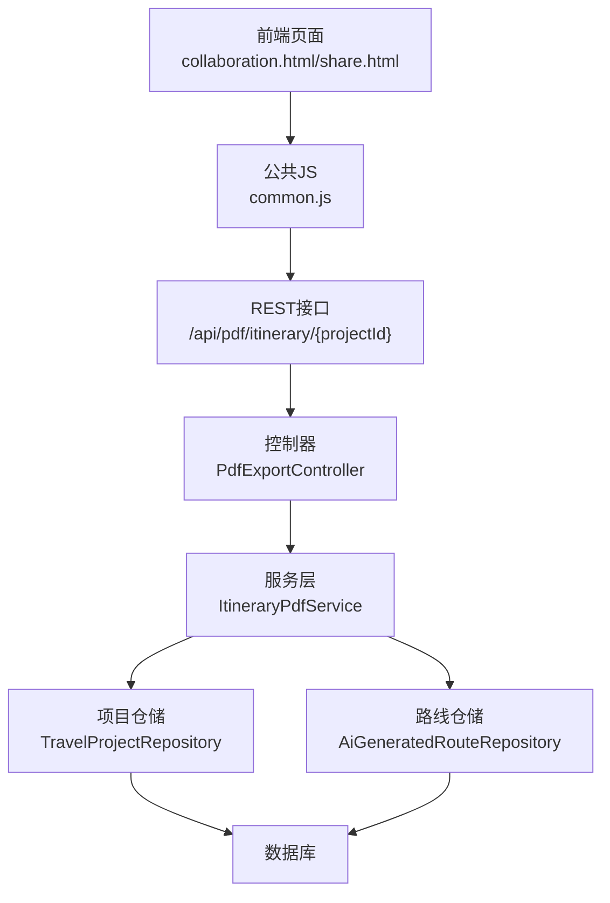
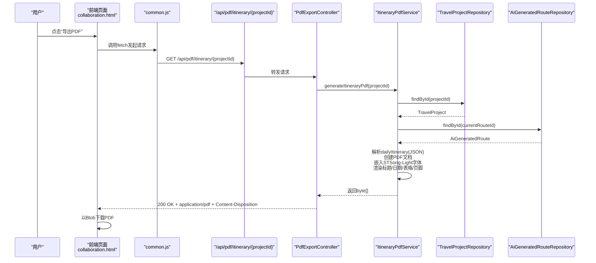
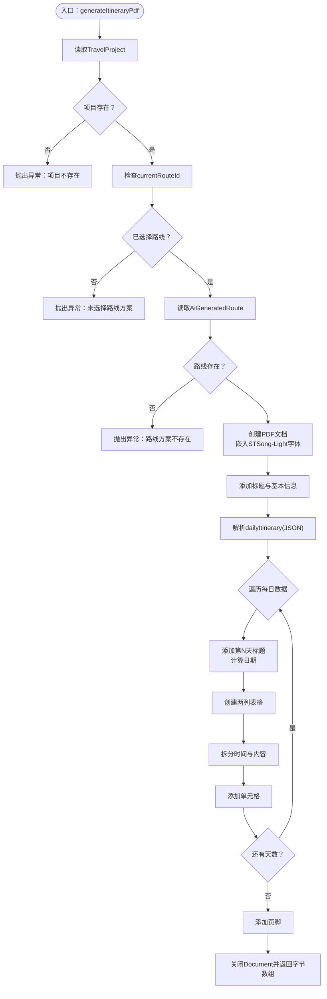
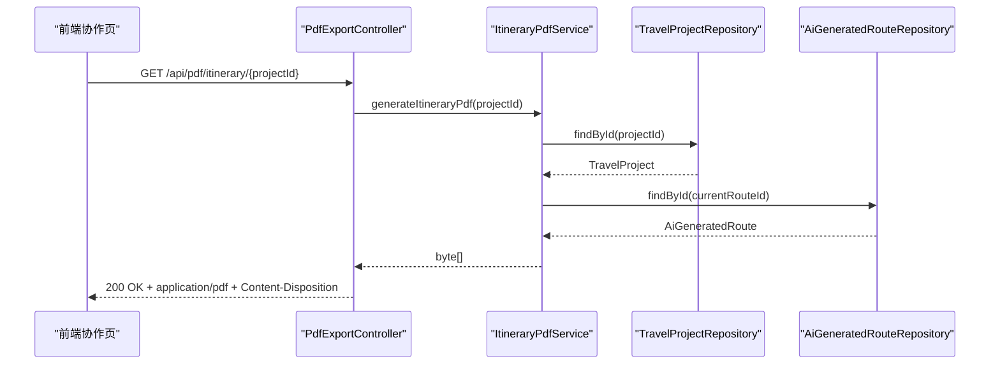
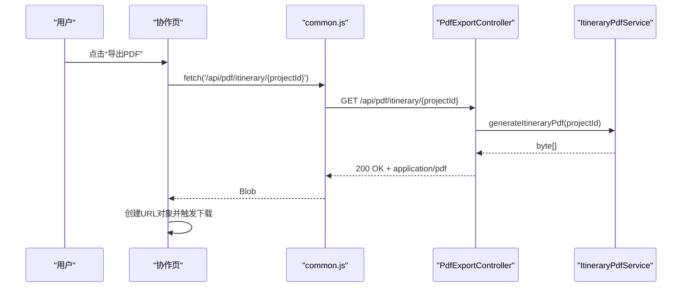
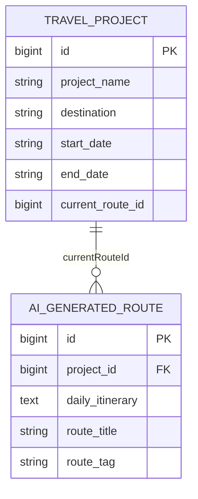
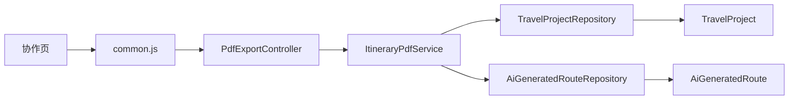

# PDF行程导出功能

<cite>
**本文引用的文件**
- [ItineraryPdfService.java](file://tudianersha/src/main/java/com/tudianersha/service/ItineraryPdfService.java)
- [PdfExportController.java](file://tudianersha/src/main/java/com/tudianersha/controller/PdfExportController.java)
- [TravelProjectRepository.java](file://tudianersha/src/main/java/com/tudianersha/repository/TravelProjectRepository.java)
- [AiGeneratedRouteRepository.java](file://tudianersha/src/main/java/com/tudianersha/repository/AiGeneratedRouteRepository.java)
- [TravelProject.java](file://tudianersha/src/main/java/com/tudianersha/entity/TravelProject.java)
- [AiGeneratedRoute.java](file://tudianersha/src/main/java/com/tudianersha/entity/AiGeneratedRoute.java)
- [collaboration.html](file://tudianersha/src/main/resources/static/collaboration.html)
- [share.html](file://tudianersha/src/main/resources/static/share.html)
- [common.js](file://tudianersha/src/main/resources/static/js/common.js)
- [application.yml](file://tudianersha/src/main/resources/application.yml)
</cite>

## 目录
1. [简介](#简介)
2. [项目结构](#项目结构)
3. [核心组件](#核心组件)
4. [架构总览](#架构总览)
5. [详细组件分析](#详细组件分析)
6. [依赖关系分析](#依赖关系分析)
7. [性能考量](#性能考量)
8. [故障排查指南](#故障排查指南)
9. [结论](#结论)
10. [附录](#附录)

## 简介
本文件深入解析基于iText7的PDF行程单生成技术实现，重点说明ItineraryPdfService如何通过TravelProjectRepository与AiGeneratedRouteRepository获取旅行项目与AI生成的每日行程数据，并将其转换为结构化的PDF文档。文档覆盖以下要点：
- 中文字体（STSong-Light）的嵌入与配置
- 标题与页脚的样式设计
- 表格布局（时间与活动内容分列）的创建
- 日期格式化处理与动态内容渲染逻辑
- generateItineraryPdf方法中的异常处理机制（项目或路线不存在）
- 字节流输出方式与/api/pdf/itinerary/{projectId}接口的调用与响应处理
- 前端通过common.js中的导出函数触发请求并处理返回的PDF二进制流实现浏览器下载
- 性能优化建议（异步生成、结果缓存）、大文档处理风险及跨平台字体兼容性问题

## 项目结构
该功能涉及后端服务层、控制器层、数据访问层以及前端页面与公共JS工具。整体采用Spring Boot + iText7实现PDF生成，前端通过标准fetch API发起请求并以Blob形式下载PDF。

图表来源
- [PdfExportController.java](file://tudianersha/src/main/java/com/tudianersha/controller/PdfExportController.java#L1-L46)
- [ItineraryPdfService.java](file://tudianersha/src/main/java/com/tudianersha/service/ItineraryPdfService.java#L1-L168)
- [TravelProjectRepository.java](file://tudianersha/src/main/java/com/tudianersha/repository/TravelProjectRepository.java#L1-L13)
- [AiGeneratedRouteRepository.java](file://tudianersha/src/main/java/com/tudianersha/repository/AiGeneratedRouteRepository.java#L1-L12)

章节来源
- [application.yml](file://tudianersha/src/main/resources/application.yml#L1-L57)

## 核心组件
- ItineraryPdfService：负责PDF生成的核心业务逻辑，包括项目与路线数据读取、中文字体嵌入、标题与页脚样式、表格布局、日期格式化与动态内容渲染、异常处理与字节流输出。
- PdfExportController：提供REST接口，接收项目ID，调用服务层生成PDF并以字节流返回，设置正确的Content-Type与Content-Disposition。
- TravelProjectRepository / AiGeneratedRouteRepository：JPA仓储接口，用于查询旅行项目与AI生成路线。
- TravelProject / AiGeneratedRoute：实体类，承载项目基本信息与每日行程JSON等字段。
- 前端协作页与分享页：包含导出PDF的交互逻辑，通过fetch调用后端接口并以浏览器下载PDF。
- common.js：封装通用API请求与工具函数，供前端页面复用。

章节来源
- [ItineraryPdfService.java](file://tudianersha/src/main/java/com/tudianersha/service/ItineraryPdfService.java#L1-L168)
- [PdfExportController.java](file://tudianersha/src/main/java/com/tudianersha/controller/PdfExportController.java#L1-L46)
- [TravelProjectRepository.java](file://tudianersha/src/main/java/com/tudianersha/repository/TravelProjectRepository.java#L1-L13)
- [AiGeneratedRouteRepository.java](file://tudianersha/src/main/java/com/tudianersha/repository/AiGeneratedRouteRepository.java#L1-L12)
- [TravelProject.java](file://tudianersha/src/main/java/com/tudianersha/entity/TravelProject.java#L1-L163)
- [AiGeneratedRoute.java](file://tudianersha/src/main/java/com/tudianersha/entity/AiGeneratedRoute.java#L1-L193)
- [collaboration.html](file://tudianersha/src/main/resources/static/collaboration.html#L1446-L1500)
- [share.html](file://tudianersha/src/main/resources/static/share.html#L112-L160)
- [common.js](file://tudianersha/src/main/resources/static/js/common.js#L1-L272)

## 架构总览
后端采用分层架构：前端通过协作页或分享页触发导出；common.js封装fetch请求；PdfExportController接收请求并调用ItineraryPdfService；服务层读取项目与路线数据，使用iText7构建PDF文档，最终以字节流返回给前端；前端以Blob形式下载PDF。

图表来源
- [PdfExportController.java](file://tudianersha/src/main/java/com/tudianersha/controller/PdfExportController.java#L1-L46)
- [ItineraryPdfService.java](file://tudianersha/src/main/java/com/tudianersha/service/ItineraryPdfService.java#L1-L168)
- [TravelProjectRepository.java](file://tudianersha/src/main/java/com/tudianersha/repository/TravelProjectRepository.java#L1-L13)
- [AiGeneratedRouteRepository.java](file://tudianersha/src/main/java/com/tudianersha/repository/AiGeneratedRouteRepository.java#L1-L12)
- [collaboration.html](file://tudianersha/src/main/resources/static/collaboration.html#L1446-L1500)

## 详细组件分析

### ItineraryPdfService：PDF生成核心
- 数据源获取
  - 通过TravelProjectRepository按ID查找旅行项目；若不存在则抛出运行时异常。
  - 若项目未选择路线方案（currentRouteId为空），抛出运行时异常。
  - 通过AiGeneratedRouteRepository按currentRouteId查找AI生成路线；若不存在则抛出运行时异常。
- 文档构建
  - 使用ByteArrayOutputStream作为PDF写入目标，创建PdfWriter与PdfDocument，再包装为Document。
  - 加载中文字体STSong-Light并设置为默认字体，确保中文正常显示。
  - 添加标题（项目名）、基本信息（目的地与日期范围）、页脚（生成时间与平台标识）。
- 动态内容渲染
  - 解析AiGeneratedRoute.dailyItinerary（JSON数组）逐日渲染。
  - 使用DateTimeFormatter对项目开始日期进行格式化；按天数累加计算具体日期。
  - 对每日活动列表创建两列表格：左侧时间、右侧内容；内容中冒号前部分作为时间，其余作为活动内容。
  - 表格单元格设置背景色、内边距与居中对齐，提升可读性。
- 异常处理与输出
  - 在数据缺失或无效时抛出运行时异常，便于上层统一捕获。
  - 生成完成后关闭Document并返回字节数组，供控制器以字节流返回。

图表来源
- [ItineraryPdfService.java](file://tudianersha/src/main/java/com/tudianersha/service/ItineraryPdfService.java#L1-L168)

章节来源
- [ItineraryPdfService.java](file://tudianersha/src/main/java/com/tudianersha/service/ItineraryPdfService.java#L1-L168)
- [TravelProjectRepository.java](file://tudianersha/src/main/java/com/tudianersha/repository/TravelProjectRepository.java#L1-L13)
- [AiGeneratedRouteRepository.java](file://tudianersha/src/main/java/com/tudianersha/repository/AiGeneratedRouteRepository.java#L1-L12)
- [TravelProject.java](file://tudianersha/src/main/java/com/tudianersha/entity/TravelProject.java#L1-L163)
- [AiGeneratedRoute.java](file://tudianersha/src/main/java/com/tudianersha/entity/AiGeneratedRoute.java#L1-L193)

### PdfExportController：PDF导出接口
- 路径与方法
  - GET /api/pdf/itinerary/{projectId}
- 流程
  - 记录开始日志，调用ItineraryPdfService生成PDF字节数组。
  - 设置响应头：Content-Type为application/pdf，Content-Disposition为附件并命名文件。
  - 设置缓存控制头，避免浏览器缓存。
  - 正常返回200 OK与字节流；异常返回500 INTERNAL_SERVER_ERROR。
- 前端对接
  - 前端协作页通过fetch调用该接口，接收Blob并触发浏览器下载。

图表来源
- [PdfExportController.java](file://tudianersha/src/main/java/com/tudianersha/controller/PdfExportController.java#L1-L46)
- [ItineraryPdfService.java](file://tudianersha/src/main/java/com/tudianersha/service/ItineraryPdfService.java#L1-L168)

章节来源
- [PdfExportController.java](file://tudianersha/src/main/java/com/tudianersha/controller/PdfExportController.java#L1-L46)
- [collaboration.html](file://tudianersha/src/main/resources/static/collaboration.html#L1446-L1500)

### 前端导出流程：common.js与页面交互
- common.js
  - 提供通用API请求函数，支持GET/POST/PUT/DELETE，默认JSON头。
  - 统一处理响应内容类型与空响应，便于前后端解耦。
- 协作页导出
  - 点击“导出PDF”按钮后，构造请求URL为/api/pdf/itinerary/{projectId}。
  - 发起fetch请求，接收响应后以blob形式创建下载链接并触发下载。
  - 恢复按钮状态，处理异常并提示用户。
- 分享页
  - 包含PDF下载链接输入框与按钮，当前实现为模拟生成链接；后续可替换为真实PDF下载逻辑。

图表来源
- [collaboration.html](file://tudianersha/src/main/resources/static/collaboration.html#L1446-L1500)
- [common.js](file://tudianersha/src/main/resources/static/js/common.js#L1-L272)
- [PdfExportController.java](file://tudianersha/src/main/java/com/tudianersha/controller/PdfExportController.java#L1-L46)
- [ItineraryPdfService.java](file://tudianersha/src/main/java/com/tudianersha/service/ItineraryPdfService.java#L1-L168)

章节来源
- [collaboration.html](file://tudianersha/src/main/resources/static/collaboration.html#L1446-L1500)
- [common.js](file://tudianersha/src/main/resources/static/js/common.js#L1-L272)

### 数据模型与仓储
- TravelProject
  - 关键字段：projectName、destination、startDate、endDate、currentRouteId等。
  - 用于确定标题、日期范围与路线选择。
- AiGeneratedRoute
  - 关键字段：dailyItinerary（JSON字符串，包含每日活动列表）、routeTitle、routeTag等。
  - dailyItinerary为服务层解析与渲染的核心数据源。
- 仓储接口
  - TravelProjectRepository：提供按ID查询与按状态/创建者查询的能力。
  - AiGeneratedRouteRepository：提供按项目ID查询的能力。

图表来源
- [TravelProject.java](file://tudianersha/src/main/java/com/tudianersha/entity/TravelProject.java#L1-L163)
- [AiGeneratedRoute.java](file://tudianersha/src/main/java/com/tudianersha/entity/AiGeneratedRoute.java#L1-L193)

章节来源
- [TravelProject.java](file://tudianersha/src/main/java/com/tudianersha/entity/TravelProject.java#L1-L163)
- [AiGeneratedRoute.java](file://tudianersha/src/main/java/com/tudianersha/entity/AiGeneratedRoute.java#L1-L193)
- [TravelProjectRepository.java](file://tudianersha/src/main/java/com/tudianersha/repository/TravelProjectRepository.java#L1-L13)
- [AiGeneratedRouteRepository.java](file://tudianersha/src/main/java/com/tudianersha/repository/AiGeneratedRouteRepository.java#L1-L12)

## 依赖关系分析
- 控制器依赖服务层：PdfExportController持有ItineraryPdfService实例，负责接口编排与响应头设置。
- 服务层依赖仓储层：ItineraryPdfService依赖TravelProjectRepository与AiGeneratedRouteRepository进行数据读取。
- 实体依赖仓储接口：实体类与仓储接口通过JPA映射关联，形成清晰的数据访问层。
- 前端依赖公共JS：协作页通过common.js封装的fetch请求与通用工具函数，简化了API调用与错误处理。

图表来源
- [PdfExportController.java](file://tudianersha/src/main/java/com/tudianersha/controller/PdfExportController.java#L1-L46)
- [ItineraryPdfService.java](file://tudianersha/src/main/java/com/tudianersha/service/ItineraryPdfService.java#L1-L168)
- [TravelProjectRepository.java](file://tudianersha/src/main/java/com/tudianersha/repository/TravelProjectRepository.java#L1-L13)
- [AiGeneratedRouteRepository.java](file://tudianersha/src/main/java/com/tudianersha/repository/AiGeneratedRouteRepository.java#L1-L12)
- [collaboration.html](file://tudianersha/src/main/resources/static/collaboration.html#L1446-L1500)
- [common.js](file://tudianersha/src/main/resources/static/js/common.js#L1-L272)

章节来源
- [PdfExportController.java](file://tudianersha/src/main/java/com/tudianersha/controller/PdfExportController.java#L1-L46)
- [ItineraryPdfService.java](file://tudianersha/src/main/java/com/tudianersha/service/ItineraryPdfService.java#L1-L168)
- [TravelProjectRepository.java](file://tudianersha/src/main/java/com/tudianersha/repository/TravelProjectRepository.java#L1-L13)
- [AiGeneratedRouteRepository.java](file://tudianersha/src/main/java/com/tudianersha/repository/AiGeneratedRouteRepository.java#L1-L12)
- [collaboration.html](file://tudianersha/src/main/resources/static/collaboration.html#L1446-L1500)
- [common.js](file://tudianersha/src/main/resources/static/js/common.js#L1-L272)

## 性能考量
- 异步生成
  - 建议在高并发场景下将PDF生成任务异步化，例如使用消息队列或线程池，避免阻塞Web请求线程。
- 结果缓存
  - 对于相同项目ID与路线版本的PDF，可在Redis等缓存中缓存生成后的字节流，减少重复计算。
- 大文档处理
  - 大型PDF生成会占用较多内存与CPU，建议限制最大天数或分页输出策略，必要时采用流式写入。
- 跨平台字体兼容性
  - STSong-Light在Windows环境下可用；Linux/Mac需确认字体可用性，必要时提供字体文件或回退方案。
- 前端下载优化
  - 前端使用URL.createObjectURL创建临时URL，下载完成后及时释放，避免内存泄漏。

[本节为通用性能建议，不直接分析具体文件]

## 故障排查指南
- 项目不存在
  - 现象：抛出运行时异常，提示“项目不存在”。
  - 排查：确认项目ID是否正确，数据库是否存在对应记录。
- 未选择路线方案
  - 现象：抛出运行时异常，提示“项目未选择路线方案”。
  - 排查：确认TravelProject.currentRouteId是否已设置。
- 路线方案不存在
  - 现象：抛出运行时异常，提示“路线方案不存在”。
  - 排查：确认AiGeneratedRouteRepository中是否存在对应ID的记录。
- PDF接口返回500
  - 现象：后端捕获异常并返回500。
  - 排查：查看后端日志，定位异常堆栈；检查数据库连接、JPA配置与iText依赖。
- 前端下载失败
  - 现象：前端提示“PDF导出失败，请稍后重试”。
  - 排查：确认/api/pdf/itinerary/{projectId}可达，响应头Content-Type为application/pdf，浏览器未拦截下载。

章节来源
- [ItineraryPdfService.java](file://tudianersha/src/main/java/com/tudianersha/service/ItineraryPdfService.java#L1-L168)
- [PdfExportController.java](file://tudianersha/src/main/java/com/tudianersha/controller/PdfExportController.java#L1-L46)
- [collaboration.html](file://tudianersha/src/main/resources/static/collaboration.html#L1446-L1500)

## 结论
该PDF行程导出功能通过清晰的分层设计与iText7的稳定能力，实现了从AI生成的每日行程数据到结构化PDF文档的完整链路。ItineraryPdfService承担了数据解析与文档构建的核心职责，PdfExportController提供了简洁的REST接口，前端协作页通过common.js完成请求与下载。建议在生产环境中引入异步生成与缓存策略，并关注跨平台字体兼容与大文档处理的风险。

[本节为总结性内容，不直接分析具体文件]

## 附录
- 接口定义
  - 方法：GET
  - 路径：/api/pdf/itinerary/{projectId}
  - 请求参数：路径变量projectId（Long）
  - 成功响应：200 OK，Content-Type: application/pdf，Content-Disposition: attachment; filename=travel-itinerary-{projectId}.pdf，Body: PDF字节流
  - 失败响应：500 Internal Server Error（当抛出异常时）

章节来源
- [PdfExportController.java](file://tudianersha/src/main/java/com/tudianersha/controller/PdfExportController.java#L1-L46)