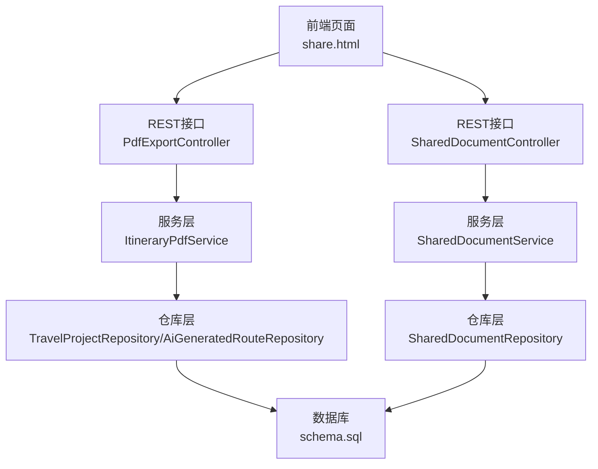
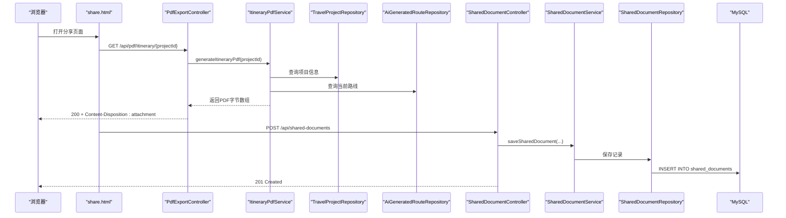
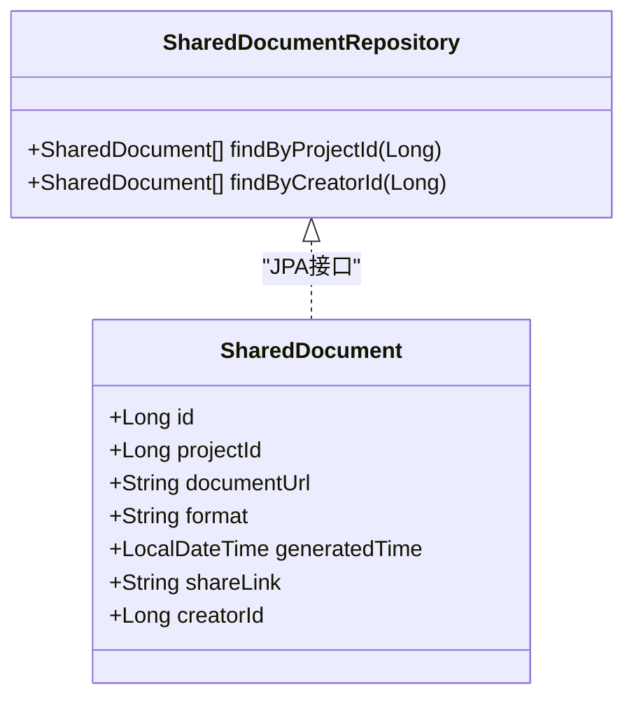
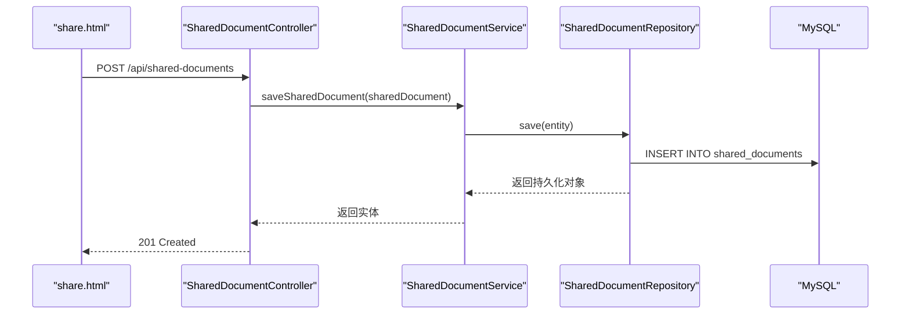
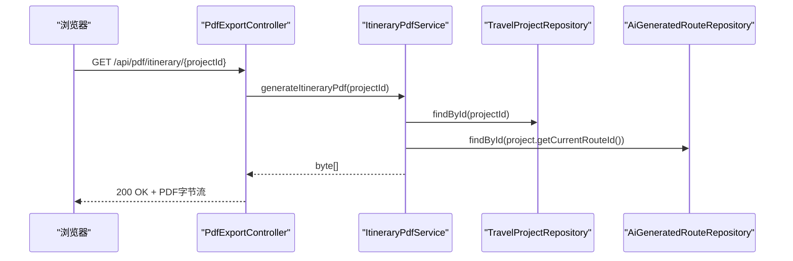
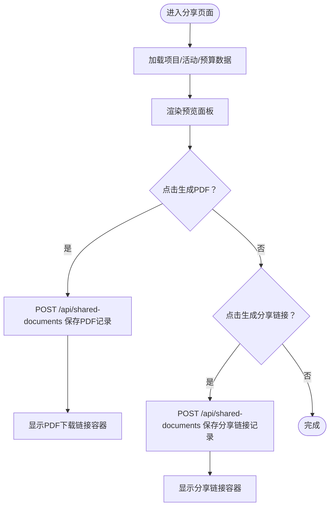
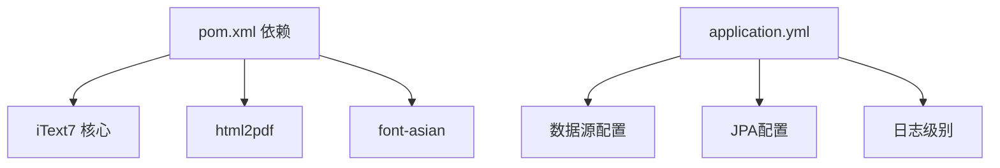

# 文档共享与导出

<cite>
**本文引用的文件**
- [SharedDocument.java](file://tudianersha/src/main/java/com/tudianersha/entity/SharedDocument.java)
- [SharedDocumentController.java](file://tudianersha/src/main/java/com/tudianersha/controller/SharedDocumentController.java)
- [SharedDocumentService.java](file://tudianersha/src/main/java/com/tudianersha/service/SharedDocumentService.java)
- [SharedDocumentRepository.java](file://tudianersha/src/main/java/com/tudianersha/repository/SharedDocumentRepository.java)
- [PdfExportController.java](file://tudianersha/src/main/java/com/tudianersha/controller/PdfExportController.java)
- [ItineraryPdfService.java](file://tudianersha/src/main/java/com/tudianersha/service/ItineraryPdfService.java)
- [share.html](file://tudianersha/src/main/resources/static/share.html)
- [schema.sql](file://tudianersha/src/main/resources/schema.sql)
- [application.yml](file://tudianersha/src/main/resources/application.yml)
- [pom.xml](file://tudianersha/pom.xml)
</cite>

## 目录
1. [引言](#引言)
2. [项目结构](#项目结构)
3. [核心组件](#核心组件)
4. [架构总览](#架构总览)
5. [详细组件分析](#详细组件分析)
6. [依赖关系分析](#依赖关系分析)
7. [性能与可扩展性](#性能与可扩展性)
8. [安全与防护](#安全与防护)
9. [故障排查指南](#故障排查指南)
10. [结论](#结论)

## 引言
本文件围绕“文档共享与PDF导出”的技术实现进行系统化梳理，重点覆盖：
- 共享文档实体与控制器如何存储与管理共享文件元数据（文件名、URL、上传者、有效期等），并通过REST接口实现上传、链接生成与访问控制。
- 行程PDF导出服务基于iText7将行程数据渲染为PDF，包括模板设计、字体嵌入、表格布局与日期计算。
- 前端share.html如何触发导出与分享流程，并展示生成的链接。
- 大文件处理策略、异步生成与缓存优化、安全防护（防止任意文件下载）、跨浏览器兼容性问题。
- 错误处理机制与日志追踪方案。

## 项目结构
该模块采用经典的分层架构：前端静态页面负责交互，后端通过Spring MVC提供REST接口，Service层封装业务逻辑，Repository层访问数据库。共享文档与PDF导出功能分别由独立的控制器与服务实现，共享文档表用于持久化分享链接与PDF地址。

图示来源
- [PdfExportController.java](file://tudianersha/src/main/java/com/tudianersha/controller/PdfExportController.java#L1-L46)
- [SharedDocumentController.java](file://tudianersha/src/main/java/com/tudianersha/controller/SharedDocumentController.java#L1-L83)
- [ItineraryPdfService.java](file://tudianersha/src/main/java/com/tudianersha/service/ItineraryPdfService.java#L1-L168)
- [SharedDocumentService.java](file://tudianersha/src/main/java/com/tudianersha/service/SharedDocumentService.java#L1-L40)
- [schema.sql](file://tudianersha/src/main/resources/schema.sql#L1-L123)

章节来源
- [application.yml](file://tudianersha/src/main/resources/application.yml#L1-L57)
- [pom.xml](file://tudianersha/pom.xml#L1-L180)

## 核心组件
- 共享文档实体：定义共享文件的元数据字段，包括项目ID、文档URL、格式、生成时间、分享链接、创建者ID等。
- 共享文档控制器：提供查询、新增、更新、删除共享文档的REST接口；支持按项目ID与创建者ID检索。
- 共享文档服务：封装对共享文档仓库的访问，提供列表查询、按条件查询与持久化保存。
- PDF导出控制器：对外暴露生成行程PDF的接口，返回PDF字节流并设置下载头。
- 行程PDF服务：基于iText7读取项目与路线数据，解析每日行程JSON，构建标题、基本信息、每日活动表格与页脚，输出PDF字节数组。
- 前端share.html：提供分享面板，支持生成PDF链接与分享链接，模拟下载行为（当前版本未直接调用后端PDF接口）。

章节来源
- [SharedDocument.java](file://tudianersha/src/main/java/com/tudianersha/entity/SharedDocument.java#L1-L114)
- [SharedDocumentController.java](file://tudianersha/src/main/java/com/tudianersha/controller/SharedDocumentController.java#L1-L83)
- [SharedDocumentService.java](file://tudianersha/src/main/java/com/tudianersha/service/SharedDocumentService.java#L1-L40)
- [SharedDocumentRepository.java](file://tudianersha/src/main/java/com/tudianersha/repository/SharedDocumentRepository.java#L1-L13)
- [PdfExportController.java](file://tudianersha/src/main/java/com/tudianersha/controller/PdfExportController.java#L1-L46)
- [ItineraryPdfService.java](file://tudianersha/src/main/java/com/tudianersha/service/ItineraryPdfService.java#L1-L168)
- [share.html](file://tudianersha/src/main/resources/static/share.html#L1-L333)

## 架构总览
下图展示了从前端到后端再到数据库的数据流与职责划分。

图示来源
- [PdfExportController.java](file://tudianersha/src/main/java/com/tudianersha/controller/PdfExportController.java#L1-L46)
- [ItineraryPdfService.java](file://tudianersha/src/main/java/com/tudianersha/service/ItineraryPdfService.java#L1-L168)
- [SharedDocumentController.java](file://tudianersha/src/main/java/com/tudianersha/controller/SharedDocumentController.java#L1-L83)
- [SharedDocumentService.java](file://tudianersha/src/main/java/com/tudianersha/service/SharedDocumentService.java#L1-L40)
- [SharedDocumentRepository.java](file://tudianersha/src/main/java/com/tudianersha/repository/SharedDocumentRepository.java#L1-L13)
- [schema.sql](file://tudianersha/src/main/resources/schema.sql#L102-L111)

## 详细组件分析

### 共享文档实体与仓储
- 实体字段包含项目ID、文档URL、格式、生成时间、分享链接、创建者ID等，满足“文件名、URL、上传者、有效期”等元数据需求。
- 仓储提供按项目ID与创建者ID查询的能力，便于前端按用户维度查看分享历史。

图示来源
- [SharedDocument.java](file://tudianersha/src/main/java/com/tudianersha/entity/SharedDocument.java#L1-L114)
- [SharedDocumentRepository.java](file://tudianersha/src/main/java/com/tudianersha/repository/SharedDocumentRepository.java#L1-L13)

章节来源
- [SharedDocument.java](file://tudianersha/src/main/java/com/tudianersha/entity/SharedDocument.java#L1-L114)
- [SharedDocumentRepository.java](file://tudianersha/src/main/java/com/tudianersha/repository/SharedDocumentRepository.java#L1-L13)
- [schema.sql](file://tudianersha/src/main/resources/schema.sql#L102-L111)

### 共享文档控制器与服务
- 控制器提供GET/POST/PUT/DELETE接口，支持按ID查询、按项目ID与创建者ID查询，以及新增与更新共享文档。
- 服务层封装了对仓库的调用，提供统一的业务方法，便于扩展与测试。

图示来源
- [SharedDocumentController.java](file://tudianersha/src/main/java/com/tudianersha/controller/SharedDocumentController.java#L1-L83)
- [SharedDocumentService.java](file://tudianersha/src/main/java/com/tudianersha/service/SharedDocumentService.java#L1-L40)
- [SharedDocumentRepository.java](file://tudianersha/src/main/java/com/tudianersha/repository/SharedDocumentRepository.java#L1-L13)

章节来源
- [SharedDocumentController.java](file://tudianersha/src/main/java/com/tudianersha/controller/SharedDocumentController.java#L1-L83)
- [SharedDocumentService.java](file://tudianersha/src/main/java/com/tudianersha/service/SharedDocumentService.java#L1-L40)

### PDF导出控制器与服务
- 控制器接收项目ID，调用服务生成PDF字节数组，并设置Content-Type为application/pdf与Content-Disposition为附件下载，同时设置缓存控制头。
- 服务层读取项目与当前路线，解析每日行程JSON，构建标题、基本信息、每日活动表格与页脚，最终输出PDF字节数组。

图示来源
- [PdfExportController.java](file://tudianersha/src/main/java/com/tudianersha/controller/PdfExportController.java#L1-L46)
- [ItineraryPdfService.java](file://tudianersha/src/main/java/com/tudianersha/service/ItineraryPdfService.java#L1-L168)

章节来源
- [PdfExportController.java](file://tudianersha/src/main/java/com/tudianersha/controller/PdfExportController.java#L1-L46)
- [ItineraryPdfService.java](file://tudianersha/src/main/java/com/tudianersha/service/ItineraryPdfService.java#L1-L168)

### 前端分享页面与导出流程
- share.html提供行程预览、预算概览、生成PDF与生成分享链接三个主要功能。
- 生成PDF时，前端模拟生成PDF链接并保存至共享文档表；生成分享链接时，同样保存一条记录。
- 当前版本的下载按钮提示需要后端支持（模拟行为），后续可直接调用后端PDF接口。

图示来源
- [share.html](file://tudianersha/src/main/resources/static/share.html#L1-L333)
- [SharedDocumentController.java](file://tudianersha/src/main/java/com/tudianersha/controller/SharedDocumentController.java#L1-L83)

章节来源
- [share.html](file://tudianersha/src/main/resources/static/share.html#L1-L333)

## 依赖关系分析
- 依赖管理：项目引入iText7核心与html2pdf、font-asian以支持中文排版与亚洲字体嵌入。
- 数据源与JPA：通过application.yml配置MySQL连接、JPA方言与DDL策略，确保实体与表结构同步。
- 日志级别：设置com.tudianersha包为debug，便于定位PDF生成与共享文档流程中的问题。

图示来源
- [pom.xml](file://tudianersha/pom.xml#L1-L180)
- [application.yml](file://tudianersha/src/main/resources/application.yml#L1-L57)

章节来源
- [pom.xml](file://tudianersha/pom.xml#L1-L180)
- [application.yml](file://tudianersha/src/main/resources/application.yml#L1-L57)

## 性能与可扩展性
- PDF生成性能
  - 使用ByteArrayOutputStream避免磁盘IO，减少中间文件开销。
  - 字体嵌入策略采用PREFER_EMBEDDED，保证跨平台一致性但可能增大体积，建议在生产环境评估字体大小与压缩策略。
  - 表格单元格采用固定列宽与紧凑内边距，降低渲染复杂度。
- 异步生成与缓存
  - 当前控制器同步生成PDF并直接返回字节流，适合中小规模PDF。对于大体量行程或高并发场景，建议引入异步队列（如RabbitMQ/Kafka）与本地/云存储缓存（如Redis+MinIO），生成完成后通过任务状态查询或回调通知用户下载。
- 大文件处理
  - 对于超长行程，建议分页输出或拆分为多段PDF，前端分页加载；或采用流式下载（Content-Range）以提升用户体验。
- 跨浏览器兼容性
  - 设置Content-Disposition为attachment，强制下载；同时确保Content-Type为application/pdf，避免部分浏览器内联渲染导致样式异常。
  - 中文字体嵌入需确保客户端具备相应字体支持，必要时提供回退字体或在线CDN资源。

[本节为通用性能建议，不直接分析具体文件，故无章节来源]

## 安全与防护
- 防止任意文件下载
  - PDF导出接口仅接受合法的项目ID参数，建议在控制器层增加鉴权与权限校验（如检查当前用户是否为项目成员或创建者），并在生成前验证项目存在性与路线完整性。
  - 共享文档保存接口应限制请求体字段，避免注入非法URL或格式；对输入进行白名单校验与长度限制。
- 访问控制
  - 在SharedDocumentController与PdfExportController中增加基于JWT或会话的认证拦截器，确保只有授权用户可生成与访问PDF。
- 有效期与清理
  - 在共享文档实体中增加过期时间字段（例如validUntil），并定期清理过期记录；前端展示“链接有效期：30天”等提示，引导用户重新生成。
- 输入校验与异常处理
  - 对项目ID、JSON格式、日期格式进行严格校验；捕获并记录异常，返回明确的错误码与提示信息。

[本节为通用安全建议，不直接分析具体文件，故无章节来源]

## 故障排查指南
- PDF生成失败
  - 检查项目是否存在且已选择路线方案；确认ai_generated_routes中dailyItinerary为合法JSON数组。
  - 查看日志输出，定位异常堆栈；关注字体加载失败、日期解析异常、表格构建错误等问题。
- 下载无响应或浏览器报错
  - 确认Content-Type与Content-Disposition设置正确；检查网络代理与跨域配置。
  - 若为大文件，考虑改为异步生成与分片下载。
- 共享链接无法访问
  - 核对共享文档记录是否保存成功；检查数据库中shared_documents表字段是否完整。
  - 如启用鉴权，确认用户身份与项目权限校验通过。

章节来源
- [PdfExportController.java](file://tudianersha/src/main/java/com/tudianersha/controller/PdfExportController.java#L1-L46)
- [ItineraryPdfService.java](file://tudianersha/src/main/java/com/tudianersha/service/ItineraryPdfService.java#L1-L168)
- [SharedDocumentController.java](file://tudianersha/src/main/java/com/tudianersha/controller/SharedDocumentController.java#L1-L83)
- [application.yml](file://tudianersha/src/main/resources/application.yml#L1-L57)

## 结论
本模块通过清晰的分层设计实现了“文档共享与PDF导出”的核心能力：前端提供友好的分享与导出入口，后端以REST接口承载业务逻辑，服务层整合iText7完成PDF渲染，仓储层保障数据持久化。当前实现简洁可靠，适合中小规模使用；在高并发与大体量场景下，建议引入异步队列、缓存与鉴权体系，并完善有效期与清理策略，以进一步提升性能与安全性。