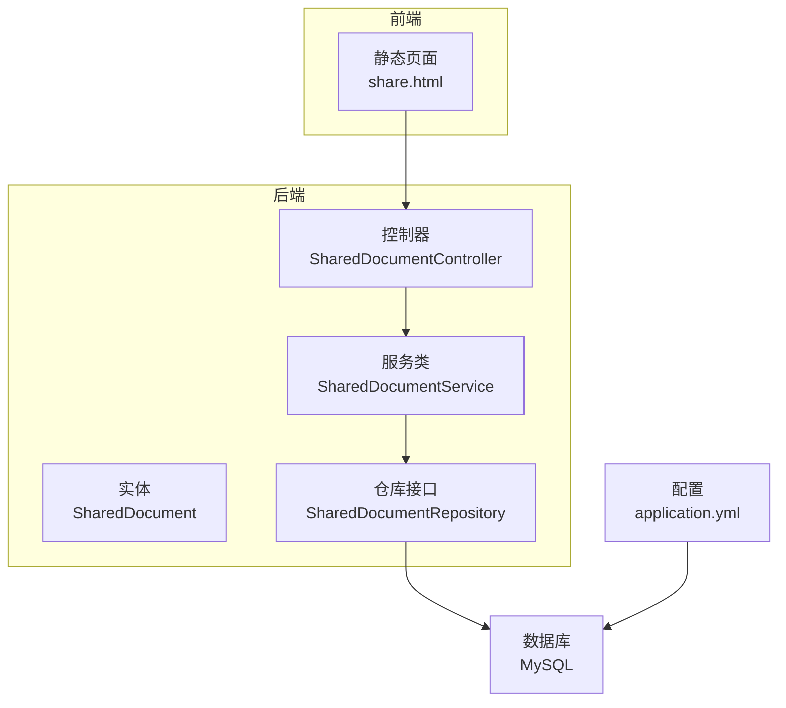
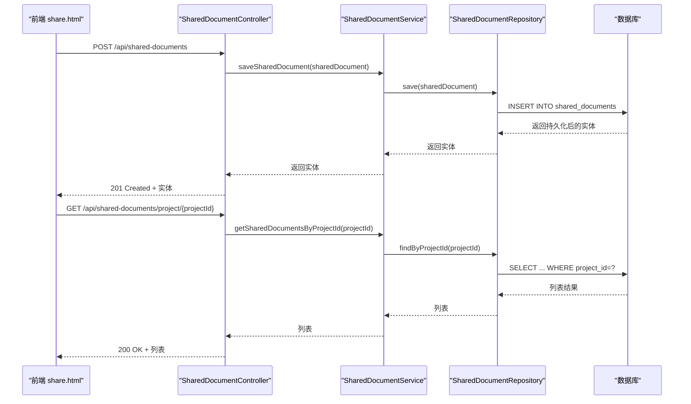
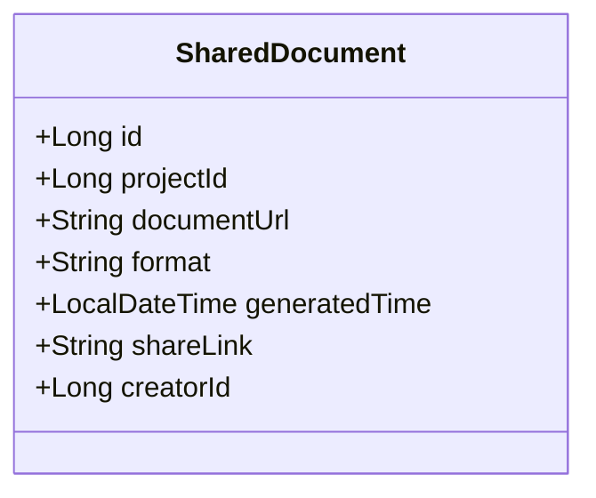
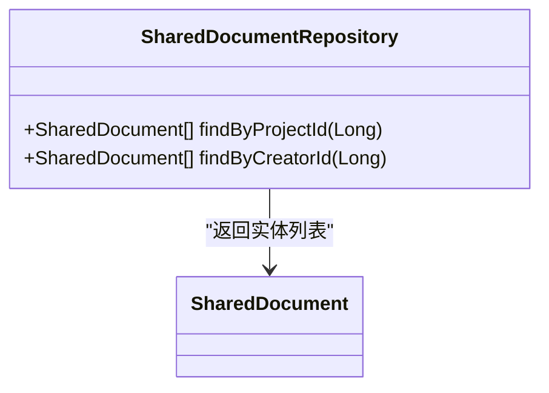
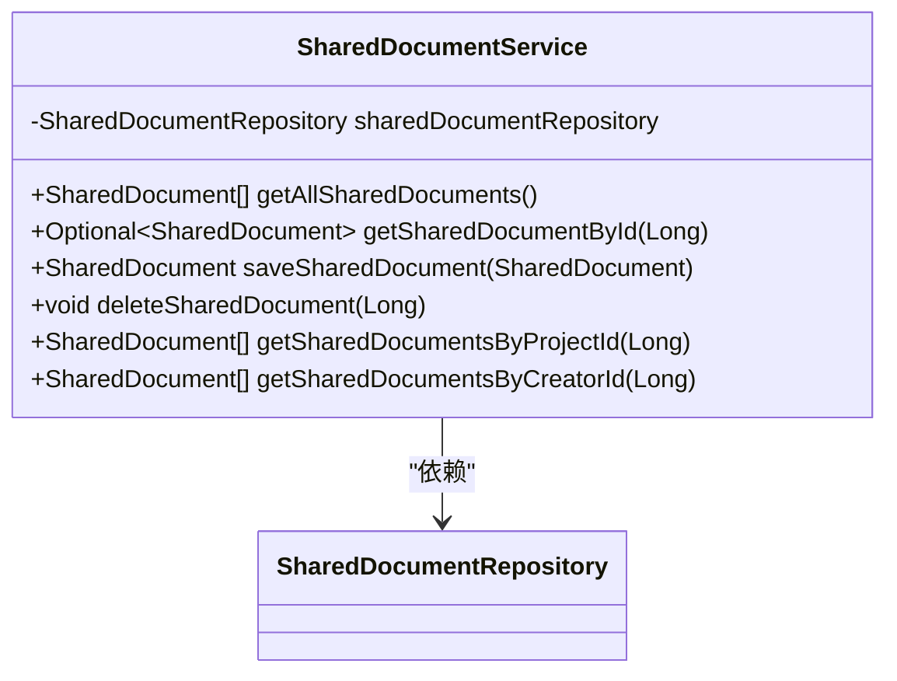
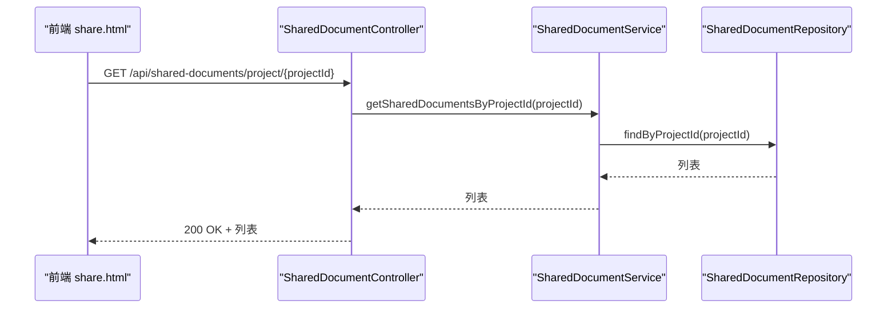
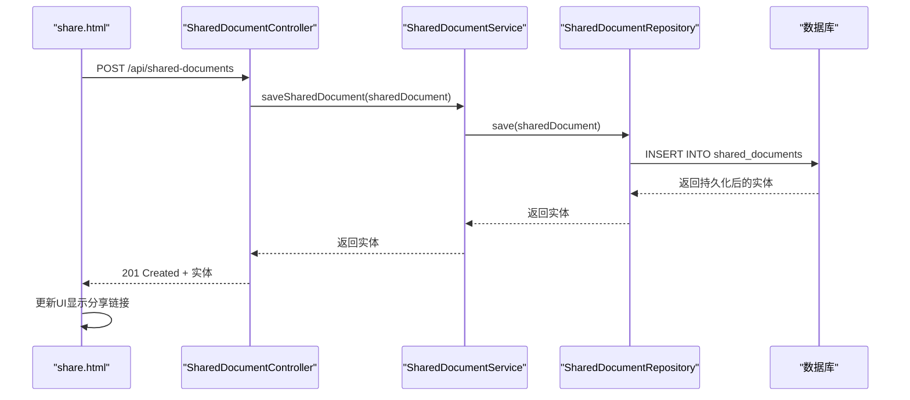
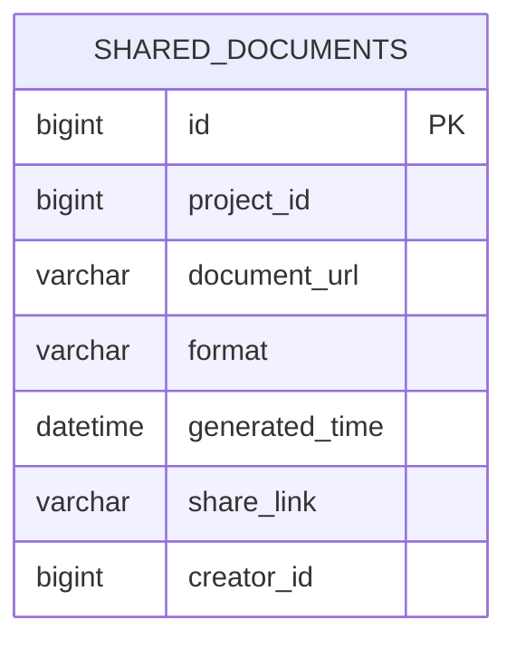
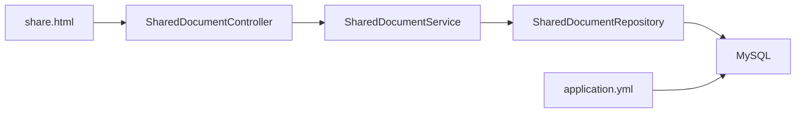

# 文档管理功能

<cite>
**本文引用的文件**
- [SharedDocument.java](file://tudianersha/src/main/java/com/tudianersha/entity/SharedDocument.java)
- [SharedDocumentRepository.java](file://tudianersha/src/main/java/com/tudianersha/repository/SharedDocumentRepository.java)
- [SharedDocumentService.java](file://tudianersha/src/main/java/com/tudianersha/service/SharedDocumentService.java)
- [SharedDocumentController.java](file://tudianersha/src/main/java/com/tudianersha/controller/SharedDocumentController.java)
- [share.html](file://tudianersha/src/main/resources/static/share.html)
- [schema.sql](file://tudianersha/src/main/resources/schema.sql)
- [application.yml](file://tudianersha/src/main/resources/application.yml)
- [ApiResponse.java](file://tudianersha/src/main/java/com/tudianersha/dto/ApiResponse.java)
</cite>

## 目录
1. [简介](#简介)
2. [项目结构](#项目结构)
3. [核心组件](#核心组件)
4. [架构总览](#架构总览)
5. [详细组件分析](#详细组件分析)
6. [依赖关系分析](#依赖关系分析)
7. [性能考量](#性能考量)
8. [故障排查指南](#故障排查指南)
9. [结论](#结论)
10. [附录](#附录)

## 简介
本文件围绕“文档共享功能”的技术实现进行系统化梳理，重点覆盖以下方面：
- SharedDocument 实体如何定义文件元数据（文件名、URL、上传者ID、项目ID、创建时间、分享链接），并通过 JPA 映射到数据库表 shared_documents。
- SharedDocumentRepository 提供的数据访问方法，包括按项目ID和创建者ID查询文档列表。
- SharedDocumentService 中的业务逻辑，如文档的保存、删除与查询；当前实现未包含访问权限控制策略。
- 结合 SharedDocumentController 的 RESTful API 设计，涵盖 GET /api/shared-documents、POST /api/shared-documents、PUT /api/shared-documents/{id}、DELETE /api/shared-documents/{id}、GET /api/shared-documents/project/{projectId}、GET /api/shared-documents/creator/{creatorId} 等端点的请求处理流程。
- 前端 share.html 页面通过 fetch API 与后端交互，实现文档列表渲染、上传表单提交（保存分享记录）和链接复制功能。
- 安全性考虑（如防止未授权访问）、URL 有效期管理机制、数据库索引优化以及异常处理（如文档不存在、权限不足）。

## 项目结构
该功能位于 Spring Boot 后端模块中，采用分层架构：实体层（Entity）、仓库层（Repository）、服务层（Service）、控制器层（Controller），并配合静态资源前端页面。

图示来源
- [SharedDocument.java](file://tudianersha/src/main/java/com/tudianersha/entity/SharedDocument.java#L1-L114)
- [SharedDocumentRepository.java](file://tudianersha/src/main/java/com/tudianersha/repository/SharedDocumentRepository.java#L1-L13)
- [SharedDocumentService.java](file://tudianersha/src/main/java/com/tudianersha/service/SharedDocumentService.java#L1-L40)
- [SharedDocumentController.java](file://tudianersha/src/main/java/com/tudianersha/controller/SharedDocumentController.java#L1-L83)
- [share.html](file://tudianersha/src/main/resources/static/share.html#L1-L333)
- [application.yml](file://tudianersha/src/main/resources/application.yml#L1-L57)

章节来源
- [SharedDocument.java](file://tudianersha/src/main/java/com/tudianersha/entity/SharedDocument.java#L1-L114)
- [SharedDocumentRepository.java](file://tudianersha/src/main/java/com/tudianersha/repository/SharedDocumentRepository.java#L1-L13)
- [SharedDocumentService.java](file://tudianersha/src/main/java/com/tudianersha/service/SharedDocumentService.java#L1-L40)
- [SharedDocumentController.java](file://tudianersha/src/main/java/com/tudianersha/controller/SharedDocumentController.java#L1-L83)
- [share.html](file://tudianersha/src/main/resources/static/share.html#L1-L333)
- [application.yml](file://tudianersha/src/main/resources/application.yml#L1-L57)

## 核心组件
- 实体层：SharedDocument 定义了文档元数据字段，并通过 JPA 注解映射到 shared_documents 表。
- 仓库层：SharedDocumentRepository 继承 JpaRepository，提供按项目ID和创建者ID的查询方法。
- 服务层：SharedDocumentService 封装业务逻辑，负责保存、删除、查询等操作。
- 控制器层：SharedDocumentController 提供 RESTful 接口，处理文档的增删改查与按项目/创建者的筛选。
- 前端：share.html 使用 fetch API 与后端交互，用于生成 PDF 或分享链接并保存记录。

章节来源
- [SharedDocument.java](file://tudianersha/src/main/java/com/tudianersha/entity/SharedDocument.java#L1-L114)
- [SharedDocumentRepository.java](file://tudianersha/src/main/java/com/tudianersha/repository/SharedDocumentRepository.java#L1-L13)
- [SharedDocumentService.java](file://tudianersha/src/main/java/com/tudianersha/service/SharedDocumentService.java#L1-L40)
- [SharedDocumentController.java](file://tudianersha/src/main/java/com/tudianersha/controller/SharedDocumentController.java#L1-L83)
- [share.html](file://tudianersha/src/main/resources/static/share.html#L1-L333)

## 架构总览
后端采用经典的 MVC 分层与 Spring Data JPA 访问数据库，前端通过 fetch API 调用后端接口，形成前后端分离的协作模式。

图示来源
- [SharedDocumentController.java](file://tudianersha/src/main/java/com/tudianersha/controller/SharedDocumentController.java#L1-L83)
- [SharedDocumentService.java](file://tudianersha/src/main/java/com/tudianersha/service/SharedDocumentService.java#L1-L40)
- [SharedDocumentRepository.java](file://tudianersha/src/main/java/com/tudianersha/repository/SharedDocumentRepository.java#L1-L13)
- [schema.sql](file://tudianersha/src/main/resources/schema.sql#L102-L111)

## 详细组件分析

### 实体：SharedDocument
- 字段与含义
  - id：主键，自增
  - projectId：所属项目ID，非空
  - documentUrl：文档下载或访问地址
  - format：文档格式（如 PDF、LINK）
  - generatedTime：生成时间，非空
  - shareLink：分享链接（可与 documentUrl 相同）
  - creatorId：创建者ID，非空
- JPA 映射
  - 使用 @Entity 和 @Table(name = "shared_documents") 映射到数据库表
  - 字段通过 @Column 进行列映射，部分字段标注为非空
- 复杂度与性能
  - 作为 JPA 实体，字段数量较少，查询复杂度主要取决于数据库索引与查询条件
  - 建议对常用查询字段（如 projectId、creatorId、generatedTime）建立索引以提升查询性能

图示来源
- [SharedDocument.java](file://tudianersha/src/main/java/com/tudianersha/entity/SharedDocument.java#L1-L114)

章节来源
- [SharedDocument.java](file://tudianersha/src/main/java/com/tudianersha/entity/SharedDocument.java#L1-L114)
- [schema.sql](file://tudianersha/src/main/resources/schema.sql#L102-L111)

### 仓库：SharedDocumentRepository
- 方法
  - findByProjectId(Long projectId)：按项目ID查询
  - findByCreatorId(Long creatorId)：按创建者ID查询
- 复杂度
  - 基于 Spring Data JPA 的方法名推断，查询复杂度取决于数据库索引与数据量
  - 建议为上述字段建立索引以优化查询

图示来源
- [SharedDocumentRepository.java](file://tudianersha/src/main/java/com/tudianersha/repository/SharedDocumentRepository.java#L1-L13)

章节来源
- [SharedDocumentRepository.java](file://tudianersha/src/main/java/com/tudianersha/repository/SharedDocumentRepository.java#L1-L13)

### 服务：SharedDocumentService
- 方法
  - getAllSharedDocuments()：查询所有文档
  - getSharedDocumentById(Long id)：按ID查询
  - saveSharedDocument(SharedDocument)：保存文档
  - deleteSharedDocument(Long id)：删除文档
  - getSharedDocumentsByProjectId(Long projectId)：按项目ID查询
  - getSharedDocumentsByCreatorId(Long creatorId)：按创建者ID查询
- 权限控制
  - 当前实现未包含访问权限控制策略（如校验用户是否为项目成员或文档创建者）

图示来源
- [SharedDocumentService.java](file://tudianersha/src/main/java/com/tudianersha/service/SharedDocumentService.java#L1-L40)
- [SharedDocumentRepository.java](file://tudianersha/src/main/java/com/tudianersha/repository/SharedDocumentRepository.java#L1-L13)

章节来源
- [SharedDocumentService.java](file://tudianersha/src/main/java/com/tudianersha/service/SharedDocumentService.java#L1-L40)

### 控制器：SharedDocumentController
- RESTful 端点
  - GET /api/shared-documents：获取全部文档
  - GET /api/shared-documents/{id}：按ID获取文档
  - POST /api/shared-documents：创建文档
  - PUT /api/shared-documents/{id}：更新文档
  - DELETE /api/shared-documents/{id}：删除文档
  - GET /api/shared-documents/project/{projectId}：按项目ID查询
  - GET /api/shared-documents/creator/{creatorId}：按创建者ID查询
- 异常处理
  - 未找到文档时返回 404
  - 删除不存在文档时返回 404
  - 创建成功返回 201，更新成功返回 200，删除成功返回 204

图示来源
- [SharedDocumentController.java](file://tudianersha/src/main/java/com/tudianersha/controller/SharedDocumentController.java#L1-L83)
- [SharedDocumentService.java](file://tudianersha/src/main/java/com/tudianersha/service/SharedDocumentService.java#L1-L40)
- [SharedDocumentRepository.java](file://tudianersha/src/main/java/com/tudianersha/repository/SharedDocumentRepository.java#L1-L13)

章节来源
- [SharedDocumentController.java](file://tudianersha/src/main/java/com/tudianersha/controller/SharedDocumentController.java#L1-L83)

### 前端：share.html 与后端交互
- 功能概述
  - 生成 PDF：构造 PDF 下载 URL，调用 POST /api/shared-documents 保存一条文档记录，随后展示 PDF 下载链接
  - 生成分享链接：构造分享链接，调用 POST /api/shared-documents 保存一条分享记录，随后展示可复制的链接
  - 复制链接：选中输入框并执行复制命令
- 交互流程（生成 PDF）

图示来源
- [share.html](file://tudianersha/src/main/resources/static/share.html#L264-L288)
- [SharedDocumentController.java](file://tudianersha/src/main/java/com/tudianersha/controller/SharedDocumentController.java#L36-L40)
- [SharedDocumentService.java](file://tudianersha/src/main/java/com/tudianersha/service/SharedDocumentService.java#L25-L27)
- [SharedDocumentRepository.java](file://tudianersha/src/main/java/com/tudianersha/repository/SharedDocumentRepository.java#L1-L13)

- 交互流程（生成分享链接）

图示来源
- [share.html](file://tudianersha/src/main/resources/static/share.html#L290-L312)
- [SharedDocumentController.java](file://tudianersha/src/main/java/com/tudianersha/controller/SharedDocumentController.java#L36-L40)
- [SharedDocumentService.java](file://tudianersha/src/main/java/com/tudianersha/service/SharedDocumentService.java#L25-L27)
- [SharedDocumentRepository.java](file://tudianersha/src/main/java/com/tudianersha/repository/SharedDocumentRepository.java#L1-L13)

章节来源
- [share.html](file://tudianersha/src/main/resources/static/share.html#L264-L312)
- [SharedDocumentController.java](file://tudianersha/src/main/java/com/tudianersha/controller/SharedDocumentController.java#L36-L40)

### 数据库模型与索引
- 表结构（shared_documents）
  - 字段：id、project_id、document_url、format、generated_time、share_link、creator_id
  - 主键：id
  - 非空约束：project_id、generated_time、creator_id
- 建议索引
  - 对 project_id 建立索引，以优化按项目查询
  - 对 creator_id 建立索引，以优化按创建者查询
  - 对 generated_time 建立索引，便于按时间范围查询（如有需要）

图示来源
- [schema.sql](file://tudianersha/src/main/resources/schema.sql#L102-L111)

章节来源
- [schema.sql](file://tudianersha/src/main/resources/schema.sql#L102-L111)

## 依赖关系分析
- 控制器依赖服务，服务依赖仓库，仓库依赖数据库
- 前端通过 fetch API 调用控制器端点
- 配置文件 application.yml 指定数据源与 JPA 设置

图示来源
- [SharedDocumentController.java](file://tudianersha/src/main/java/com/tudianersha/controller/SharedDocumentController.java#L1-L83)
- [SharedDocumentService.java](file://tudianersha/src/main/java/com/tudianersha/service/SharedDocumentService.java#L1-L40)
- [SharedDocumentRepository.java](file://tudianersha/src/main/java/com/tudianersha/repository/SharedDocumentRepository.java#L1-L13)
- [application.yml](file://tudianersha/src/main/resources/application.yml#L1-L57)

章节来源
- [SharedDocumentController.java](file://tudianersha/src/main/java/com/tudianersha/controller/SharedDocumentController.java#L1-L83)
- [SharedDocumentService.java](file://tudianersha/src/main/java/com/tudianersha/service/SharedDocumentService.java#L1-L40)
- [SharedDocumentRepository.java](file://tudianersha/src/main/java/com/tudianersha/repository/SharedDocumentRepository.java#L1-L13)
- [application.yml](file://tudianersha/src/main/resources/application.yml#L1-L57)

## 性能考量
- 查询优化
  - 为 shared_documents 的 project_id、creator_id、generated_time 建立索引，以提升按项目/创建者/时间范围的查询性能
- 写入优化
  - 批量写入场景建议使用事务批量提交，减少往返开销
- 缓存策略
  - 对热点查询（如最近生成的文档列表）可引入缓存层（如 Redis）以降低数据库压力
- 分页与限制
  - 在控制器层增加分页参数，避免一次性返回大量数据导致内存压力

[本节为通用性能建议，不直接分析具体文件]

## 故障排查指南
- 常见问题
  - 文档不存在：控制器在按ID查询或删除时，若未找到文档返回 404
  - 权限不足：当前服务层未实现权限校验，需在服务层补充校验逻辑（如检查当前用户是否为项目成员或文档创建者）
  - URL 有效期：前端页面提示“链接有效期：30天”，但服务层未实现过期逻辑；可在实体中增加过期时间字段并在查询时过滤
- 日志与监控
  - application.yml 已开启 SQL 输出与日志级别，便于定位问题
- 响应格式
  - 可统一使用 ApiResponse 包裹响应，便于前端一致处理

章节来源
- [SharedDocumentController.java](file://tudianersha/src/main/java/com/tudianersha/controller/SharedDocumentController.java#L26-L34)
- [application.yml](file://tudianersha/src/main/resources/application.yml#L1-L57)
- [ApiResponse.java](file://tudianersha/src/main/java/com/tudianersha/dto/ApiResponse.java#L1-L80)

## 结论
- 技术实现清晰：实体、仓库、服务、控制器分层明确，Spring Data JPA 使数据访问简洁高效
- 功能完整：实现了文档的保存、查询、删除与按项目/创建者筛选
- 安全与可用性待加强：缺少访问权限控制与 URL 有效期管理；建议补充索引与缓存策略以提升性能
- 前后端协作顺畅：前端通过 fetch API 与后端交互，用户体验良好

[本节为总结性内容，不直接分析具体文件]

## 附录

### API 定义概览
- GET /api/shared-documents：返回全部文档
- GET /api/shared-documents/{id}：按ID返回文档，不存在返回 404
- POST /api/shared-documents：创建文档，返回 201
- PUT /api/shared-documents/{id}：更新文档，不存在返回 404
- DELETE /api/shared-documents/{id}：删除文档，不存在返回 404
- GET /api/shared-documents/project/{projectId}：按项目ID返回文档列表
- GET /api/shared-documents/creator/{creatorId}：按创建者ID返回文档列表

章节来源
- [SharedDocumentController.java](file://tudianersha/src/main/java/com/tudianersha/controller/SharedDocumentController.java#L1-L83)