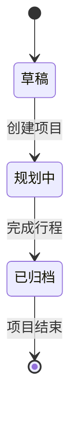
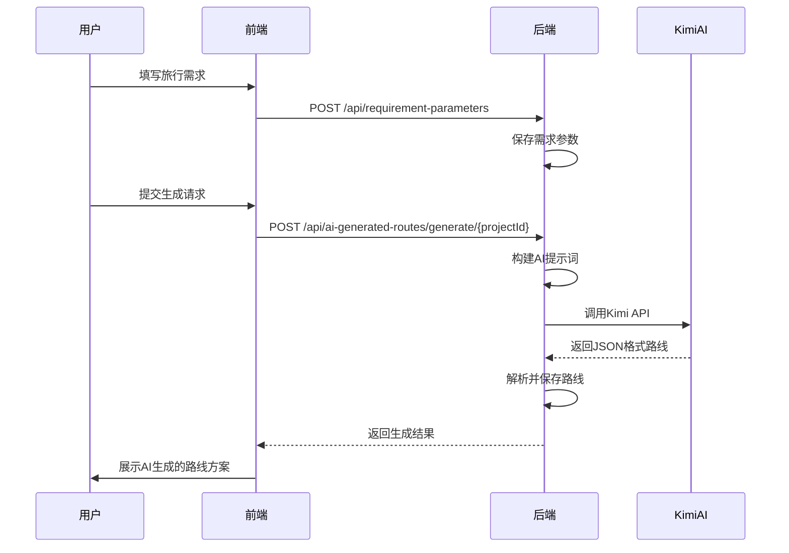
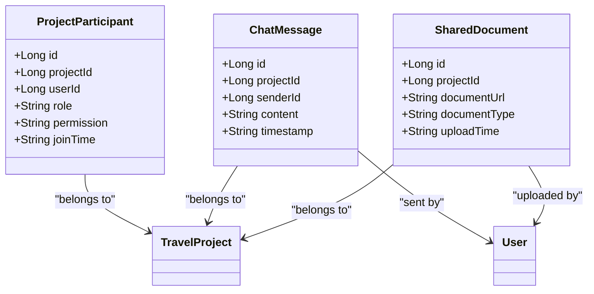
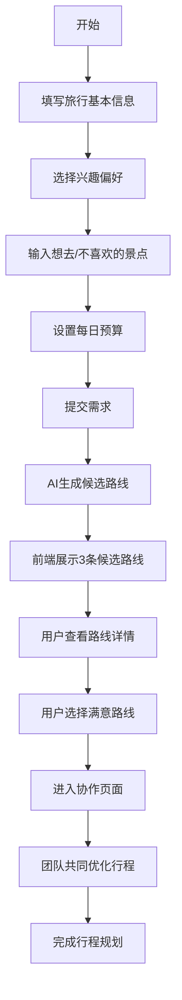

# 核心功能模块

<cite>
**本文档引用文件**  
- [TravelProjectController.java](file://tudianersha/src/main/java/com/tudianersha/controller/TravelProjectController.java)
- [TravelProject.java](file://tudianersha/src/main/java/com/tudianersha/entity/TravelProject.java)
- [TravelProjectService.java](file://tudianersha/src/main/java/com/tudianersha/service/TravelProjectService.java)
- [create-project.html](file://tudianersha/src/main/resources/static/create-project.html)
- [AiGeneratedRouteController.java](file://tudianersha/src/main/java/com/tudianersha/controller/AiGeneratedRouteController.java)
- [AiGeneratedRoute.java](file://tudianersha/src/main/java/com/tudianersha/entity/AiGeneratedRoute.java)
- [AiGeneratedRouteService.java](file://tudianersha/src/main/java/com/tudianersha/service/AiGeneratedRouteService.java)
- [KimiAIService.java](file://tudianersha/src/main/java/com/tudianersha/service/KimiAIService.java)
- [RequirementParameter.java](file://tudianersha/src/main/java/com/tudianersha/entity/RequirementParameter.java)
- [RequirementParameterController.java](file://tudianersha/src/main/java/com/tudianersha/controller/RequirementParameterController.java)
- [RequirementParameterService.java](file://tudianersha/src/main/java/com/tudianersha/service/RequirementParameterService.java)
- [route-selection.html](file://tudianersha/src/main/resources/static/route-selection.html)
- [ProjectParticipantController.java](file://tudianersha/src/main/java/com/tudianersha/controller/ProjectParticipantController.java)
- [ChatMessageController.java](file://tudianersha/src/main/java/com/tudianersha/controller/ChatMessageController.java)
- [SharedDocumentController.java](file://tudianersha/src/main/java/com/tudianersha/controller/SharedDocumentController.java)
- [BudgetController.java](file://tudianersha/src/main/java/com/tudianersha/controller/BudgetController.java)
- [Budget.java](file://tudianersha/src/main/java/com/tudianersha/entity/Budget.java)
- [BudgetService.java](file://tudianersha/src/main/java/com/tudianersha/service/BudgetService.java)
- [collaboration.html](file://tudianersha/src/main/resources/static/collaboration.html)
</cite>

## 目录
1. [旅行项目全生命周期管理](#旅行项目全生命周期管理)
2. [AI智能路线生成功能](#ai智能路线生成功能)
3. [多人协作机制](#多人协作机制)
4. [预算管理模块](#预算管理模块)
5. [用户旅程流程](#用户旅程流程)

## 旅行项目全生命周期管理

平台提供完整的旅行项目全生命周期管理功能，涵盖创建、编辑、删除和状态跟踪。用户可通过`TravelProjectController`提供的REST API对项目进行增删改查操作。项目实体`TravelProject`包含项目名称、目的地、天数、创建者ID、状态、创建时间、更新时间等核心字段。状态字段支持“草稿”、“规划中”、“已归档”等多种状态，实现项目阶段的精细化管理。

项目创建后，系统自动记录创建者信息和时间戳，确保操作可追溯。编辑功能允许项目创建者或具有编辑权限的成员更新项目信息，系统会自动更新`updatedTime`字段。删除操作为软删除，保留项目历史记录。通过`/api/travel-projects/creator/{creatorId}`和`/api/travel-projects/status/{status}`等接口，用户可按创建者或状态查询项目列表，实现高效的项目筛选和管理。

**Section sources**
- [TravelProjectController.java](file://tudianersha/src/main/java/com/tudianersha/controller/TravelProjectController.java#L13-L85)
- [TravelProject.java](file://tudianersha/src/main/java/com/tudianersha/entity/TravelProject.java#L6-L163)
- [TravelProjectService.java](file://tudianersha/src/main/java/com/tudianersha/service/TravelProjectService.java#L11-L40)

**Diagram sources**
- [TravelProject.java](file://tudianersha/src/main/java/com/tudianersha/entity/TravelProject.java#L27)

## AI智能路线生成功能

平台的核心功能之一是AI智能路线生成，通过收集用户需求参数，调用KimiAIService生成个性化路线方案。用户在`create-project.html`页面填写旅行偏好，包括兴趣标签、想去的景点、不喜欢的景点和每日预算等信息。这些信息被封装为`RequirementParameter`对象并存储。

当用户提交需求后，系统调用`AiGeneratedRouteService`的`generateRoutesForProject`方法。该方法首先获取项目基本信息和所有参与者的需求参数，然后构建详细的AI提示词（prompt），调用`KimiAIService`生成路线。提示词包含项目名称、目的地、出行时间、行程天数、参与人数以及所有参与者的需求汇总，确保AI生成的路线全面考虑所有用户偏好。

AI生成的路线以JSON格式返回，包含路线名称、特色标签、每日详细行程、景点数量、餐厅数量、交通方式、总预算和推荐指数等结构化信息。系统解析AI响应后，将路线信息存储到`ai_generated_routes`表中，并在`route-selection.html`页面展示给用户选择。

**Diagram sources**
- [create-project.html](file://tudianersha/src/main/resources/static/create-project.html#L424-L672)
- [AiGeneratedRouteService.java](file://tudianersha/src/main/java/com/tudianersha/service/AiGeneratedRouteService.java#L70-L360)
- [KimiAIService.java](file://tudianersha/src/main/java/com/tudianersha/service/KimiAIService.java#L44-L97)

**Section sources**
- [AiGeneratedRouteController.java](file://tudianersha/src/main/java/com/tudianersha/controller/AiGeneratedRouteController.java#L16-L112)
- [AiGeneratedRoute.java](file://tudianersha/src/main/java/com/tudianersha/entity/AiGeneratedRoute.java#L6-L193)
- [AiGeneratedRouteService.java](file://tudianersha/src/main/java/com/tudianersha/service/AiGeneratedRouteService.java#L23-L486)
- [KimiAIService.java](file://tudianersha/src/main/java/com/tudianersha/service/KimiAIService.java#L13-L176)
- [RequirementParameter.java](file://tudianersha/src/main/java/com/tudianersha/entity/RequirementParameter.java#L6-L123)
- [RequirementParameterController.java](file://tudianersha/src/main/java/com/tudianersha/controller/RequirementParameterController.java#L14-L85)
- [RequirementParameterService.java](file://tudianersha/src/main/java/com/tudianersha/service/RequirementParameterService.java#L11-L40)

## 多人协作机制

平台支持多人协作，通过`ProjectParticipant`实体实现权限控制。项目创建者拥有最高权限，可以管理其他参与者的权限。系统支持三种角色：创建者、编辑者和参与者。创建者可以添加成员、分配权限；编辑者可以查看和编辑项目内容；参与者只能查看项目信息。

`ChatMessageController`提供实时聊天功能，团队成员可以在`collaboration.html`页面进行实时沟通。聊天支持@提及功能，方便定向沟通。`SharedDocumentController`管理PDF和链接分享，团队成员可以共享行程文档和相关资源。当项目创建者生成AI路线后，系统会自动生成协作链接，邀请其他成员加入项目，共同优化行程。

**Diagram sources**
- [ProjectParticipant.java](file://tudianersha/src/main/java/com/tudianersha/entity/ProjectParticipant.java)
- [ChatMessage.java](file://tudianersha/src/main/java/com/tudianersha/entity/ChatMessage.java)
- [SharedDocument.java](file://tudianersha/src/main/java/com/tudianersha/entity/SharedDocument.java)

**Section sources**
- [ProjectParticipantController.java](file://tudianersha/src/main/java/com/tudianersha/controller/ProjectParticipantController.java)
- [ChatMessageController.java](file://tudianersha/src/main/java/com/tudianersha/controller/ChatMessageController.java)
- [SharedDocumentController.java](file://tudianersha/src/main/java/com/tudianersha/controller/SharedDocumentController.java)
- [collaboration.html](file://tudianersha/src/main/resources/static/collaboration.html)

## 预算管理模块

预算管理模块负责计算和跟踪项目的总预算、已用预算和剩余预算。`Budget`实体包含`totalBudget`、`usedBudget`和`remainingBudget`三个核心字段，分别表示总预算、已用预算和剩余预算。系统通过`BudgetController`提供的REST API对预算进行管理。

当用户在`create-project.html`页面设置每日预算时，系统会根据行程天数自动计算总预算，并在右侧预算摘要面板中实时显示。预算项包括景点门票、午餐、晚餐和住宿等基本项目，用户可以动态添加或删除预算项。系统会自动计算每日总预算，并在项目进行过程中更新已用预算和剩余预算，帮助用户控制旅行开支。

**Section sources**
- [BudgetController.java](file://tudianersha/src/main/java/com/tudianersha/controller/BudgetController.java#L14-L79)
- [Budget.java](file://tudianersha/src/main/java/com/tudianersha/entity/Budget.java#L6-L87)
- [BudgetService.java](file://tudianersha/src/main/java/com/tudianersha/service/BudgetService.java#L11-L36)
- [create-project.html](file://tudianersha/src/main/resources/static/create-project.html#L703-L723)

## 用户旅程流程

从用户需求输入到AI推荐的完整用户旅程始于`create-project.html`页面。用户首先填写旅行基本信息，包括目的地、开始时间和结束时间。然后选择兴趣偏好，如美食、自然风光、历史古迹等。接着输入想去的景点和不喜欢的景点，设置每日预算。

当用户提交表单后，系统将需求参数保存到数据库，并调用AI服务生成路线。生成的路线在`route-selection.html`页面展示，用户可以查看3条不同风格的候选路线，包括路线名称、特色标签、景点数量、餐厅数量、交通方式、总预算和推荐指数等信息。用户可以点击“查看详情”查看每条路线的详细行程安排，包括每日的时间段、景点名称、开放时间、门票信息和游玩时长建议。

用户选择满意的路线后，点击“确认选中方案，进入协作”按钮，系统将选中的路线ID保存到项目中，并跳转到`collaboration.html`页面。在协作页面，团队成员可以共同查看和编辑行程，进行实时聊天，分享文档，最终完成行程规划。

**Diagram sources**
- [create-project.html](file://tudianersha/src/main/resources/static/create-project.html)
- [route-selection.html](file://tudianersha/src/main/resources/static/route-selection.html)
- [collaboration.html](file://tudianersha/src/main/resources/static/collaboration.html)

**Section sources**
- [create-project.html](file://tudianersha/src/main/resources/static/create-project.html)
- [route-selection.html](file://tudianersha/src/main/resources/static/route-selection.html)
- [collaboration.html](file://tudianersha/src/main/resources/static/collaboration.html)