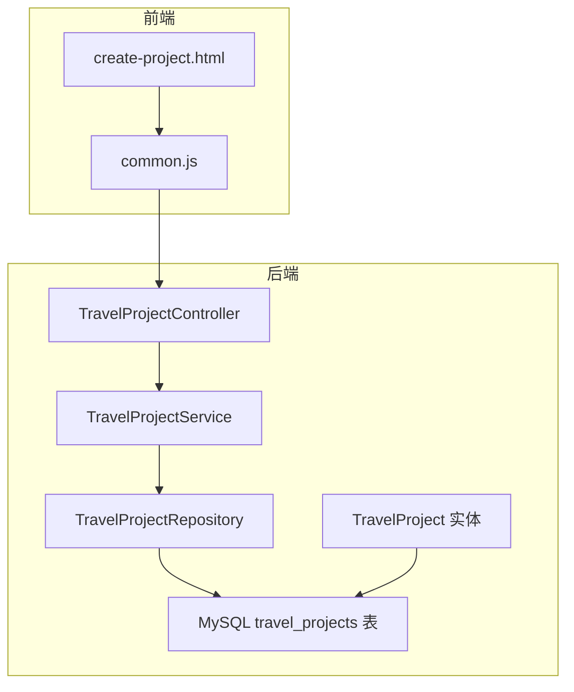
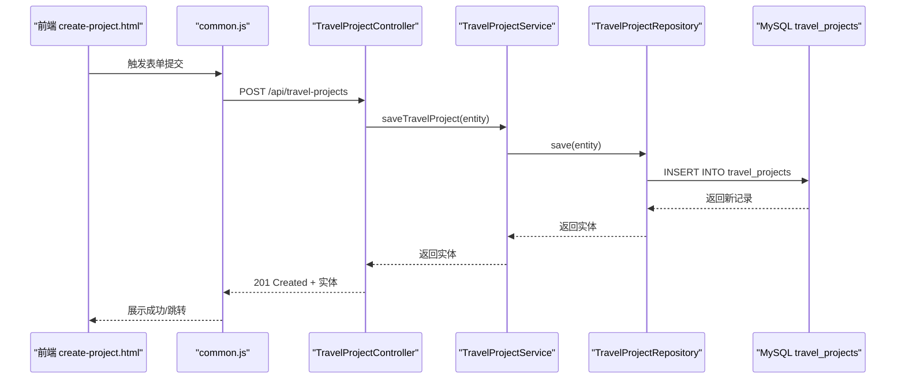
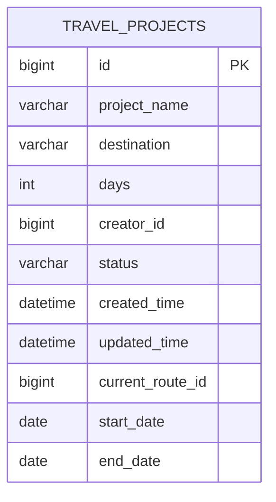
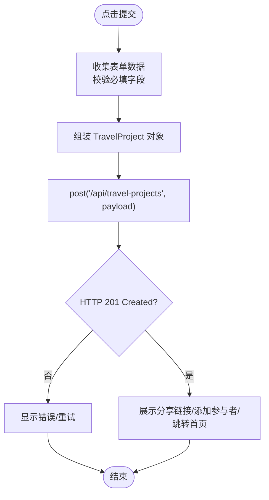
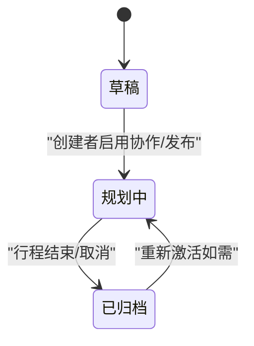
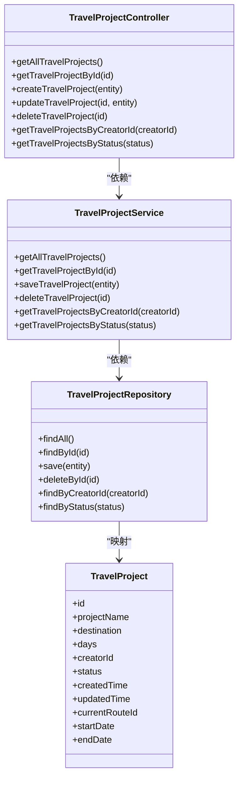

# 项目管理

<cite>
**本文引用的文件**
- [TravelProjectController.java](file://tudianersha/src/main/java/com/tudianersha/controller/TravelProjectController.java)
- [TravelProjectService.java](file://tudianersha/src/main/java/com/tudianersha/service/TravelProjectService.java)
- [TravelProject.java](file://tudianersha/src/main/java/com/tudianersha/entity/TravelProject.java)
- [TravelProjectRepository.java](file://tudianersha/src/main/java/com/tudianersha/repository/TravelProjectRepository.java)
- [create-project.html](file://tudianersha/src/main/resources/static/create-project.html)
- [common.js](file://tudianersha/src/main/resources/static/js/common.js)
- [schema.sql](file://tudianersha/src/main/resources/schema.sql)
- [application.yml](file://tudianersha/src/main/resources/application.yml)
- [ApiResponse.java](file://tudianersha/src/main/java/com/tudianersha/dto/ApiResponse.java)
</cite>

## 目录
1. [引言](#引言)
2. [项目结构](#项目结构)
3. [核心组件](#核心组件)
4. [架构总览](#架构总览)
5. [详细组件分析](#详细组件分析)
6. [依赖分析](#依赖分析)
7. [性能考虑](#性能考虑)
8. [故障排查指南](#故障排查指南)
9. [结论](#结论)

## 引言
本文件围绕旅行项目的全生命周期管理展开，重点说明 TravelProjectController 的创建、编辑、删除、查询等核心 API 实现机制，并结合 TravelProjectService 的业务逻辑与数据访问层，解释 TravelProject 实体类字段设计与数据库表映射关系。同时，结合 create-project.html 页面流程，描述前端如何通过表单提交触发后端 REST 接口完成项目初始化；给出项目状态机模型与状态转换条件；最后提供异常处理策略、性能优化建议与常见问题排查指南。

## 项目结构
后端采用 Spring Boot + JPA 架构：
- 控制器层：TravelProjectController 提供 REST 接口
- 服务层：TravelProjectService 封装业务逻辑
- 数据访问层：TravelProjectRepository 继承 JpaRepository
- 实体层：TravelProject 映射 travel_projects 表
- 前端静态资源：create-project.html 与 common.js 提供表单与 API 请求封装

图示来源
- [TravelProjectController.java](file://tudianersha/src/main/java/com/tudianersha/controller/TravelProjectController.java#L1-L85)
- [TravelProjectService.java](file://tudianersha/src/main/java/com/tudianersha/service/TravelProjectService.java#L1-L40)
- [TravelProjectRepository.java](file://tudianersha/src/main/java/com/tudianersha/repository/TravelProjectRepository.java#L1-L13)
- [TravelProject.java](file://tudianersha/src/main/java/com/tudianersha/entity/TravelProject.java#L1-L163)
- [schema.sql](file://tudianersha/src/main/resources/schema.sql#L20-L33)

章节来源
- [TravelProjectController.java](file://tudianersha/src/main/java/com/tudianersha/controller/TravelProjectController.java#L1-L85)
- [TravelProjectService.java](file://tudianersha/src/main/java/com/tudianersha/service/TravelProjectService.java#L1-L40)
- [TravelProjectRepository.java](file://tudianersha/src/main/java/com/tudianersha/repository/TravelProjectRepository.java#L1-L13)
- [TravelProject.java](file://tudianersha/src/main/java/com/tudianersha/entity/TravelProject.java#L1-L163)
- [schema.sql](file://tudianersha/src/main/resources/schema.sql#L20-L33)

## 核心组件
- TravelProjectController：提供 /api/travel-projects 的 GET/POST/PUT/DELETE 接口，按 id、创建者、状态等维度查询
- TravelProjectService：封装 findAll、findById、save、delete、按 creatorId/status 查询
- TravelProjectRepository：继承 JpaRepository，提供 findByCreatorId、findByStatus
- TravelProject 实体：映射 travel_projects 表，包含项目名称、目的地、天数、创建者、状态、时间戳、当前路线等字段
- create-project.html：前端表单页面，使用 common.js 发起 API 请求，完成项目初始化与偏好提交

章节来源
- [TravelProjectController.java](file://tudianersha/src/main/java/com/tudianersha/controller/TravelProjectController.java#L1-L85)
- [TravelProjectService.java](file://tudianersha/src/main/java/com/tudianersha/service/TravelProjectService.java#L1-L40)
- [TravelProjectRepository.java](file://tudianersha/src/main/java/com/tudianersha/repository/TravelProjectRepository.java#L1-L13)
- [TravelProject.java](file://tudianersha/src/main/java/com/tudianersha/entity/TravelProject.java#L1-L163)
- [create-project.html](file://tudianersha/src/main/resources/static/create-project.html#L1-L800)
- [common.js](file://tudianersha/src/main/resources/static/js/common.js#L1-L272)

## 架构总览
后端采用经典的三层架构：控制器负责接收请求与返回响应，服务层承载业务规则，数据访问层负责持久化。TravelProjectController 通过 TravelProjectService 调用 TravelProjectRepository 访问数据库；TravelProject 实体与 travel_projects 表一一对应。

图示来源
- [TravelProjectController.java](file://tudianersha/src/main/java/com/tudianersha/controller/TravelProjectController.java#L36-L40)
- [TravelProjectService.java](file://tudianersha/src/main/java/com/tudianersha/service/TravelProjectService.java#L25-L27)
- [TravelProjectRepository.java](file://tudianersha/src/main/java/com/tudianersha/repository/TravelProjectRepository.java#L1-L13)
- [TravelProject.java](file://tudianersha/src/main/java/com/tudianersha/entity/TravelProject.java#L1-L163)
- [create-project.html](file://tudianersha/src/main/resources/static/create-project.html#L1732-L1752)
- [common.js](file://tudianersha/src/main/resources/static/js/common.js#L48-L66)

## 详细组件分析

### TravelProjectController API 一览
- GET /api/travel-projects：获取全部项目
- GET /api/travel-projects/{id}：按 id 查询
- POST /api/travel-projects：创建项目
- PUT /api/travel-projects/{id}：按 id 更新
- DELETE /api/travel-projects/{id}：按 id 删除
- GET /api/travel-projects/creator/{creatorId}：按创建者查询
- GET /api/travel-projects/status/{status}：按状态查询

章节来源
- [TravelProjectController.java](file://tudianersha/src/main/java/com/tudianersha/controller/TravelProjectController.java#L20-L85)

### TravelProjectService 业务逻辑
- getAllTravelProjects：委托 Repository 全量查询
- getTravelProjectById：按主键查询
- saveTravelProject：持久化实体
- deleteTravelProject：按主键删除
- getTravelProjectsByCreatorId：按创建者过滤
- getTravelProjectsByStatus：按状态过滤

章节来源
- [TravelProjectService.java](file://tudianersha/src/main/java/com/tudianersha/service/TravelProjectService.java#L1-L40)
- [TravelProjectRepository.java](file://tudianersha/src/main/java/com/tudianersha/repository/TravelProjectRepository.java#L1-L13)

### TravelProject 实体与数据库映射
- 表名：travel_projects
- 字段映射要点：
  - id → 主键自增
  - project_name → 项目名称（非空）
  - destination → 目的地（非空）
  - days → 天数（非空）
  - creator_id → 创建者用户 ID（非空）
  - status → 状态（非空，注释为“草稿/规划中/已归档”）
  - created_time → 创建时间（非空）
  - updated_time → 更新时间（非空）
  - current_route_id → 当前方案 ID（可空）
  - start_date → 开始日期（可空）
  - end_date → 结束日期（可空）

图示来源
- [TravelProject.java](file://tudianersha/src/main/java/com/tudianersha/entity/TravelProject.java#L1-L163)
- [schema.sql](file://tudianersha/src/main/resources/schema.sql#L20-L33)

章节来源
- [TravelProject.java](file://tudianersha/src/main/java/com/tudianersha/entity/TravelProject.java#L1-L163)
- [schema.sql](file://tudianersha/src/main/resources/schema.sql#L20-L33)

### 前端表单提交流程（create-project.html）
- 表单元素：隐藏字段（项目名、目的地、天数），显式输入（开始/结束日期）
- 提交行为：阻止默认提交，收集表单数据，调用 common.js 的 post 方法
- 关键步骤：
  - 校验必填字段（目的地、开始/结束日期）
  - 组装 TravelProject 对象（含 creatorId、status、时间戳等）
  - 调用 POST /api/travel-projects 创建项目
  - 成功后展示分享链接、添加旅行参与者、跳转首页

图示来源
- [create-project.html](file://tudianersha/src/main/resources/static/create-project.html#L1732-L1752)
- [common.js](file://tudianersha/src/main/resources/static/js/common.js#L48-L66)
- [TravelProjectController.java](file://tudianersha/src/main/java/com/tudianersha/controller/TravelProjectController.java#L36-L40)

章节来源
- [create-project.html](file://tudianersha/src/main/resources/static/create-project.html#L1732-L1752)
- [common.js](file://tudianersha/src/main/resources/static/js/common.js#L48-L66)
- [TravelProjectController.java](file://tudianersha/src/main/java/com/tudianersha/controller/TravelProjectController.java#L36-L40)

### 项目状态机模型
- 状态定义（依据实体注释与前端状态映射）：
  - 草稿（Draft）
  - 规划中（Planning）
  - 已归档（Archived）
- 前端状态映射（index.html 中存在 PLANNING/COMPLETED/CANCELLED 映射），表明系统支持更丰富的状态集合
- 状态转换条件（基于现有代码与注释推断）：
  - 新建项目：初始状态通常为“草稿”
  - 编辑/发布：当项目被创建者启用协作或正式推进时，状态可切换至“规划中”
  - 结束：当行程完成或取消，状态切换至“已归档”或“已完成/已取消”

图示来源
- [TravelProject.java](file://tudianersha/src/main/java/com/tudianersha/entity/TravelProject.java#L26-L28)
- [index.html](file://tudianersha/src/main/resources/static/index.html#L383-L387)

章节来源
- [TravelProject.java](file://tudianersha/src/main/java/com/tudianersha/entity/TravelProject.java#L26-L28)
- [index.html](file://tudianersha/src/main/resources/static/index.html#L383-L387)

### 异常处理策略
- 权限校验失败：
  - 前端 common.js 在页面加载时会检查登录状态，未登录则跳转登录页
  - 建议在控制器层增加基于角色/权限的拦截器或方法级校验，确保只有项目创建者或具有编辑权限的用户能修改项目
- 数据冲突：
  - JPA 默认不会对并发写入做额外约束，如需避免重复创建或状态冲突，可在服务层引入乐观锁或唯一性约束
- 错误响应：
  - 建议统一使用 ApiResponse 包裹响应体，便于前后端一致处理
  - 当前 TravelProjectController 返回 ResponseEntity，未强制使用 ApiResponse；可在控制器层统一包装

章节来源
- [common.js](file://tudianersha/src/main/resources/static/js/common.js#L115-L121)
- [TravelProjectController.java](file://tudianersha/src/main/java/com/tudianersha/controller/TravelProjectController.java#L20-L85)
- [ApiResponse.java](file://tudianersha/src/main/java/com/tudianersha/dto/ApiResponse.java#L1-L80)

### 数据访问与查询扩展
- 当前 Repository 已提供按创建者与状态的查询方法
- 若需分页查询，可在 Controller 层引入 Pageable 参数，Service 层返回 Page<TravelProject>，以提升大数据量下的查询性能

章节来源
- [TravelProjectRepository.java](file://tudianersha/src/main/java/com/tudianersha/repository/TravelProjectRepository.java#L1-L13)
- [TravelProjectService.java](file://tudianersha/src/main/java/com/tudianersha/service/TravelProjectService.java#L1-L40)

## 依赖分析
- 控制器依赖服务层，服务层依赖仓库层，仓库层依赖 JPA 与数据库
- TravelProject 实体与 travel_projects 表字段一一对应
- 前端通过 common.js 的 apiRequest/post/put/del 封装 HTTP 请求

图示来源
- [TravelProjectController.java](file://tudianersha/src/main/java/com/tudianersha/controller/TravelProjectController.java#L1-L85)
- [TravelProjectService.java](file://tudianersha/src/main/java/com/tudianersha/service/TravelProjectService.java#L1-L40)
- [TravelProjectRepository.java](file://tudianersha/src/main/java/com/tudianersha/repository/TravelProjectRepository.java#L1-L13)
- [TravelProject.java](file://tudianersha/src/main/java/com/tudianersha/entity/TravelProject.java#L1-L163)

## 性能考虑
- 分页查询：在 Controller 层引入 Pageable，Service 返回 Page<TravelProject>，减少一次性加载大量数据
- 索引优化：travel_projects 表中 creator_id、status 字段可建立索引，加速按创建者与状态查询
- 批量操作：批量更新状态或删除项目时，使用批量 SQL 或分批提交，降低数据库压力
- 缓存策略：对热点查询（如最近项目列表）引入 Redis 缓存，降低数据库负载

章节来源
- [TravelProjectRepository.java](file://tudianersha/src/main/java/com/tudianersha/repository/TravelProjectRepository.java#L1-L13)
- [schema.sql](file://tudianersha/src/main/resources/schema.sql#L20-L33)

## 故障排查指南
- 项目无法保存：
  - 检查前端表单必填字段是否完整（目的地、开始/结束日期）
  - 检查后端日志与数据库连接配置（application.yml）
  - 确认 travel_projects 表结构与实体字段一致
- 状态更新延迟：
  - 确认前端是否正确发起 PUT 请求并携带最新状态
  - 检查服务层是否正确更新 updated_time 字段
- 权限相关问题：
  - 确认 common.js 的登录检查逻辑是否生效
  - 如需细粒度权限控制，建议在控制器层增加鉴权注解或拦截器
- 数据库连接问题：
  - 检查 application.yml 中的数据库 URL、用户名、密码与驱动配置

章节来源
- [create-project.html](file://tudianersha/src/main/resources/static/create-project.html#L1732-L1752)
- [common.js](file://tudianersha/src/main/resources/static/js/common.js#L115-L121)
- [application.yml](file://tudianersha/src/main/resources/application.yml#L1-L57)
- [schema.sql](file://tudianersha/src/main/resources/schema.sql#L20-L33)

## 结论
本项目围绕 TravelProject 的全生命周期管理，实现了从前端表单提交到后端 REST 接口再到数据库持久化的完整链路。TravelProjectController 提供了创建、查询、更新、删除等核心能力；TravelProjectService 承载业务逻辑；TravelProject 实体与 travel_projects 表保持一致映射。结合前端 create-project.html 的交互流程，项目初始化与协作开启得以顺畅完成。建议后续补充统一异常响应、权限校验与分页查询能力，以进一步提升系统的健壮性与可维护性。