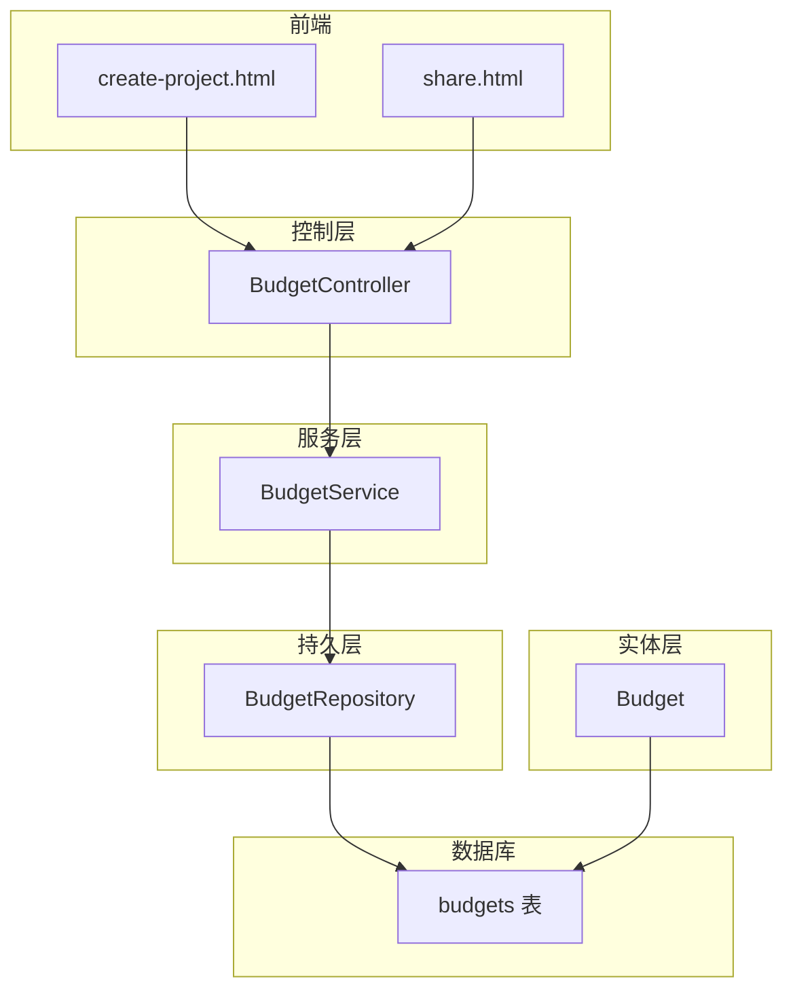
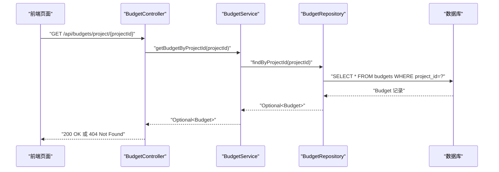
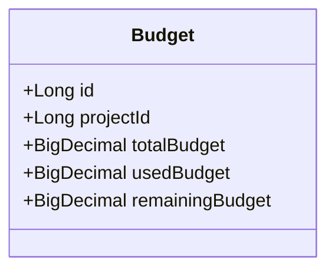
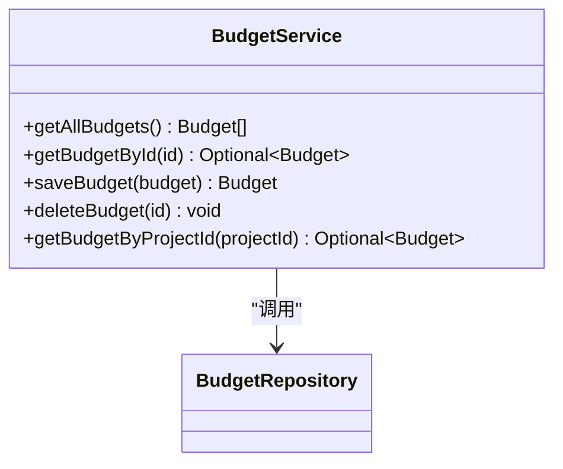
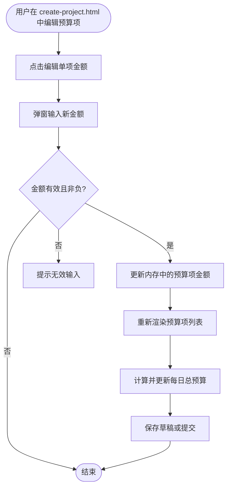
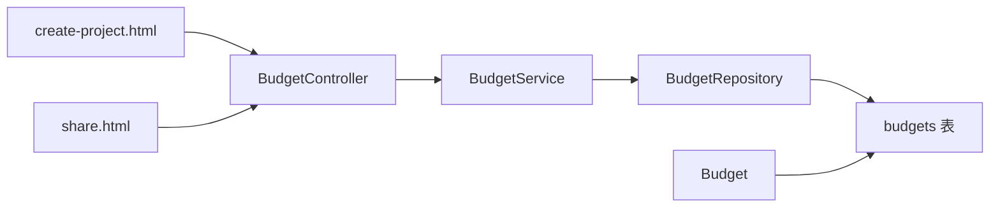

# 预算管理

<cite>
**本文引用的文件**
- [Budget.java](file://tudianersha/src/main/java/com/tudianersha/entity/Budget.java)
- [BudgetController.java](file://tudianersha/src/main/java/com/tudianersha/controller/BudgetController.java)
- [BudgetService.java](file://tudianersha/src/main/java/com/tudianersha/service/BudgetService.java)
- [BudgetRepository.java](file://tudianersha/src/main/java/com/tudianersha/repository/BudgetRepository.java)
- [ApiResponse.java](file://tudianersha/src/main/java/com/tudianersha/dto/ApiResponse.java)
- [schema.sql](file://tudianersha/src/main/resources/schema.sql)
- [application.yml](file://tudianersha/src/main/resources/application.yml)
- [create-project.html](file://tudianersha/src/main/resources/static/create-project.html)
- [share.html](file://tudianersha/src/main/resources/static/share.html)
</cite>

## 目录
1. [简介](#简介)
2. [项目结构](#项目结构)
3. [核心组件](#核心组件)
4. [架构总览](#架构总览)
5. [详细组件分析](#详细组件分析)
6. [依赖关系分析](#依赖关系分析)
7. [性能考虑](#性能考虑)
8. [故障排查指南](#故障排查指南)
9. [结论](#结论)
10. [附录](#附录)

## 简介
本文件系统性讲解预算管理模块的设计与实现，围绕 Budget 实体如何记录总预算、已支出金额、剩余预算及项目维度的预算汇总，以及通过 BudgetController 暴露的增删改查接口进行说明；同时分析 BudgetService 中的预算校验逻辑、自动计算机制与事务一致性保障现状，并给出前后端数据交互格式（统一响应封装）与错误码建议、预算变更审计日志设计建议、前端可视化图表集成方案与性能优化策略（如缓存预算汇总数据）。文中所有技术细节均以仓库现有代码为依据，避免臆造。

## 项目结构
预算管理模块位于后端三层架构中：
- 控制层：BudgetController 提供 REST 接口
- 服务层：BudgetService 调用仓储层并负责业务流程
- 持久层：BudgetRepository 基于 Spring Data JPA 访问数据库
- 实体层：Budget 实体映射 budgets 表
- 前端静态页面：create-project.html 与 share.html 展示预算数据



图示来源
- [BudgetController.java](file://tudianersha/src/main/java/com/tudianersha/controller/BudgetController.java#L1-L79)
- [BudgetService.java](file://tudianersha/src/main/java/com/tudianersha/service/BudgetService.java#L1-L36)
- [BudgetRepository.java](file://tudianersha/src/main/java/com/tudianersha/repository/BudgetRepository.java#L1-L12)
- [Budget.java](file://tudianersha/src/main/java/com/tudianersha/entity/Budget.java#L1-L87)
- [schema.sql](file://tudianersha/src/main/resources/schema.sql#L43-L50)
- [create-project.html](file://tudianersha/src/main/resources/static/create-project.html#L186-L340)
- [share.html](file://tudianersha/src/main/resources/static/share.html#L237-L264)

章节来源
- [BudgetController.java](file://tudianersha/src/main/java/com/tudianersha/controller/BudgetController.java#L1-L79)
- [BudgetService.java](file://tudianersha/src/main/java/com/tudianersha/service/BudgetService.java#L1-L36)
- [BudgetRepository.java](file://tudianersha/src/main/java/com/tudianersha/repository/BudgetRepository.java#L1-L12)
- [Budget.java](file://tudianersha/src/main/java/com/tudianersha/entity/Budget.java#L1-L87)
- [schema.sql](file://tudianersha/src/main/resources/schema.sql#L43-L50)
- [create-project.html](file://tudianersha/src/main/resources/static/create-project.html#L186-L340)
- [share.html](file://tudianersha/src/main/resources/static/share.html#L237-L264)

## 核心组件
- Budget 实体：包含项目维度的预算字段（总预算、已使用、剩余预算），用于持久化与传输。
- BudgetController：提供 GET/POST/PUT/DELETE 接口，按 id 与 project_id 查询。
- BudgetService：封装 CRUD 与按项目查询逻辑，当前未实现预算校验与自动计算。
- BudgetRepository：JPA 仓储接口，提供按项目 id 查询。
- ApiResponse：统一响应封装，便于前后端一致的数据格式。
- 前端页面：create-project.html 动态渲染预算项与每日总预算；share.html 展示预算概览。

章节来源
- [Budget.java](file://tudianersha/src/main/java/com/tudianersha/entity/Budget.java#L1-L87)
- [BudgetController.java](file://tudianersha/src/main/java/com/tudianersha/controller/BudgetController.java#L1-L79)
- [BudgetService.java](file://tudianersha/src/main/java/com/tudianersha/service/BudgetService.java#L1-L36)
- [BudgetRepository.java](file://tudianersha/src/main/java/com/tudianersha/repository/BudgetRepository.java#L1-L12)
- [ApiResponse.java](file://tudianersha/src/main/java/com/tudianersha/dto/ApiResponse.java#L1-L80)
- [create-project.html](file://tudianersha/src/main/resources/static/create-project.html#L186-L340)
- [share.html](file://tudianersha/src/main/resources/static/share.html#L237-L264)

## 架构总览
预算管理采用经典的 MVC + JPA 分层架构，控制器负责请求路由与状态码返回，服务层负责业务编排，仓储层负责数据访问，实体层映射数据库表。前端通过静态页面与后端 API 进行数据交互。



图示来源
- [BudgetController.java](file://tudianersha/src/main/java/com/tudianersha/controller/BudgetController.java#L70-L79)
- [BudgetService.java](file://tudianersha/src/main/java/com/tudianersha/service/BudgetService.java#L33-L35)
- [BudgetRepository.java](file://tudianersha/src/main/java/com/tudianersha/repository/BudgetRepository.java#L11-L12)
- [schema.sql](file://tudianersha/src/main/resources/schema.sql#L43-L50)

## 详细组件分析

### Budget 实体与数据库映射
- 字段设计：包含项目 id、总预算、已使用、剩余预算，均为数值类型，满足预算金额的精度要求。
- 关系映射：实体类注解映射到 budgets 表，字段名与表列一致。
- 用途：作为 JPA 实体参与持久化与跨层传递。



图示来源
- [Budget.java](file://tudianersha/src/main/java/com/tudianersha/entity/Budget.java#L1-L87)
- [schema.sql](file://tudianersha/src/main/resources/schema.sql#L43-L50)

章节来源
- [Budget.java](file://tudianersha/src/main/java/com/tudianersha/entity/Budget.java#L1-L87)
- [schema.sql](file://tudianersha/src/main/resources/schema.sql#L43-L50)

### BudgetController 接口设计
- 列表查询：GET /api/budgets 返回全部预算。
- 单条查询：GET /api/budgets/{id} 返回指定预算。
- 新建预算：POST /api/budgets 创建预算。
- 更新预算：PUT /api/budgets/{id} 支持修改项目 id、总预算、已使用、剩余预算。
- 删除预算：DELETE /api/budgets/{id} 删除预算。
- 按项目查询：GET /api/budgets/project/{projectId} 返回项目预算。

```mermaid
flowchart TD
A["请求进入 BudgetController"] --> B{"路径匹配"}
B --> |GET /api/budgets| C["getAllBudgets() -> ResponseEntity<List<Budget>>"]
B --> |GET /api/budgets/{id}| D["getBudgetById() -> ResponseEntity<Budget|NotFound>"]
B --> |POST /api/budgets| E["createBudget() -> ResponseEntity<Budget|Created>"]
B --> |PUT /api/budgets/{id}| F["updateBudget() -> ResponseEntity<Budget|NotFound>"]
B --> |DELETE /api/budgets/{id}| G["deleteBudget() -> ResponseEntity<NoContent|NotFound>"]
B --> |GET /api/budgets/project/{projectId}| H["getBudgetByProjectId() -> ResponseEntity<Budget|NotFound>"]
```

图示来源
- [BudgetController.java](file://tudianersha/src/main/java/com/tudianersha/controller/BudgetController.java#L1-L79)

章节来源
- [BudgetController.java](file://tudianersha/src/main/java/com/tudianersha/controller/BudgetController.java#L1-L79)

### BudgetService 业务逻辑现状
- 当前实现：提供查询全部、按 id 查询、保存、删除、按项目 id 查询。
- 缺失能力：未实现预算校验（如防止超额支出）、自动计算（剩余预算动态更新）、事务一致性保障（未声明事务注解）。



图示来源
- [BudgetService.java](file://tudianersha/src/main/java/com/tudianersha/service/BudgetService.java#L1-L36)
- [BudgetRepository.java](file://tudianersha/src/main/java/com/tudianersha/repository/BudgetRepository.java#L1-L12)

章节来源
- [BudgetService.java](file://tudianersha/src/main/java/com/tudianersha/service/BudgetService.java#L1-L36)
- [BudgetRepository.java](file://tudianersha/src/main/java/com/tudianersha/repository/BudgetRepository.java#L1-L12)

### 前后端数据交互格式与统一响应
- 统一响应：ApiResponse 提供 success/error 两类静态方法，统一返回结构，便于前端解析。
- 控制器返回：使用 ResponseEntity，结合 HttpStatus 返回状态码，配合 ApiResponse 可进一步标准化响应体。

章节来源
- [ApiResponse.java](file://tudianersha/src/main/java/com/tudianersha/dto/ApiResponse.java#L1-L80)
- [BudgetController.java](file://tudianersha/src/main/java/com/tudianersha/controller/BudgetController.java#L1-L79)

### 前端预算可视化与交互
- create-project.html：动态渲染预算项列表，支持编辑单个预算项金额、删除预算项、实时计算每日总预算。
- share.html：展示项目预算概览（总预算、已使用、剩余）。



图示来源
- [create-project.html](file://tudianersha/src/main/resources/static/create-project.html#L1345-L1472)
- [create-project.html](file://tudianersha/src/main/resources/static/create-project.html#L1454-L1457)
- [create-project.html](file://tudianersha/src/main/resources/static/create-project.html#L1384-L1418)
- [create-project.html](file://tudianersha/src/main/resources/static/create-project.html#L1422-L1451)
- [share.html](file://tudianersha/src/main/resources/static/share.html#L237-L264)

章节来源
- [create-project.html](file://tudianersha/src/main/resources/static/create-project.html#L1345-L1472)
- [create-project.html](file://tudianersha/src/main/resources/static/create-project.html#L1454-L1457)
- [create-project.html](file://tudianersha/src/main/resources/static/create-project.html#L1384-L1418)
- [create-project.html](file://tudianersha/src/main/resources/static/create-project.html#L1422-L1451)
- [share.html](file://tudianersha/src/main/resources/static/share.html#L237-L264)

## 依赖关系分析
- 控制器依赖服务层；服务层依赖仓储层；仓储层依赖数据库。
- Budget 实体与 budgets 表一一对应，字段与表结构一致。
- 前端静态页面通过控制器提供的接口获取与展示预算数据。



图示来源
- [BudgetController.java](file://tudianersha/src/main/java/com/tudianersha/controller/BudgetController.java#L1-L79)
- [BudgetService.java](file://tudianersha/src/main/java/com/tudianersha/service/BudgetService.java#L1-L36)
- [BudgetRepository.java](file://tudianersha/src/main/java/com/tudianersha/repository/BudgetRepository.java#L1-L12)
- [Budget.java](file://tudianersha/src/main/java/com/tudianersha/entity/Budget.java#L1-L87)
- [schema.sql](file://tudianersha/src/main/resources/schema.sql#L43-L50)
- [create-project.html](file://tudianersha/src/main/resources/static/create-project.html#L186-L340)
- [share.html](file://tudianersha/src/main/resources/static/share.html#L237-L264)

章节来源
- [BudgetController.java](file://tudianersha/src/main/java/com/tudianersha/controller/BudgetController.java#L1-L79)
- [BudgetService.java](file://tudianersha/src/main/java/com/tudianersha/service/BudgetService.java#L1-L36)
- [BudgetRepository.java](file://tudianersha/src/main/java/com/tudianersha/repository/BudgetRepository.java#L1-L12)
- [Budget.java](file://tudianersha/src/main/java/com/tudianersha/entity/Budget.java#L1-L87)
- [schema.sql](file://tudianersha/src/main/resources/schema.sql#L43-L50)
- [create-project.html](file://tudianersha/src/main/resources/static/create-project.html#L186-L340)
- [share.html](file://tudianersha/src/main/resources/static/share.html#L237-L264)

## 性能考虑
- 前端性能
  - create-project.html 中的预算计算为纯前端 JavaScript，使用 reduce 累加，时间复杂度 O(n)，n 为预算项数量，适合中小规模预算项。
  - 建议：若预算项较多，可考虑虚拟滚动与懒渲染，减少 DOM 更新频率。
- 后端性能
  - BudgetService 当前未实现缓存与批量查询，建议：
    - 对按项目 id 的预算查询结果进行缓存，降低数据库压力。
    - 在需要时引入分页查询，避免一次性加载大量预算记录。
  - 事务一致性
    - 当前 BudgetService 未声明事务注解，建议在涉及预算校验与更新的场景使用 @Transactional，确保并发安全与一致性。
- 数据库性能
  - budgets 表已建立自增主键索引，建议为 project_id 建立索引以加速按项目查询。
  - application.yml 中 JPA 配置开启 show-sql，便于开发调试，生产环境可关闭以减少日志开销。

章节来源
- [create-project.html](file://tudianersha/src/main/resources/static/create-project.html#L1454-L1457)
- [BudgetService.java](file://tudianersha/src/main/java/com/tudianersha/service/BudgetService.java#L1-L36)
- [application.yml](file://tudianersha/src/main/resources/application.yml#L11-L16)
- [schema.sql](file://tudianersha/src/main/resources/schema.sql#L43-L50)

## 故障排查指南
- 常见问题
  - 404 未找到：当按 id 或按项目 id 查询不到预算时，控制器返回 404。检查项目 id 是否正确、预算是否已创建。
  - 500 服务器错误：通常由数据库异常或空指针导致。检查 BudgetService 的空值处理与数据库连接配置。
- 日志与诊断
  - application.yml 中已配置日志级别，可在开发阶段观察 JPA SQL 输出与应用日志。
  - 建议在 BudgetService 方法上增加日志记录，定位异常发生点。
- 前端问题
  - create-project.html 中的预算编辑与删除交互依赖事件绑定，若出现无法编辑或删除，检查浏览器控制台是否有错误，确认事件绑定是否生效。

章节来源
- [BudgetController.java](file://tudianersha/src/main/java/com/tudianersha/controller/BudgetController.java#L20-L79)
- [application.yml](file://tudianersha/src/main/resources/application.yml#L43-L46)
- [create-project.html](file://tudianersha/src/main/resources/static/create-project.html#L1384-L1418)

## 结论
当前预算管理模块实现了基础的 CRUD 能力与前端预算展示，但缺少预算校验、自动计算与事务一致性保障。建议在服务层补充预算校验与自动计算逻辑，并引入事务注解保证一致性；同时在前端与后端分别引入缓存与事件优化，提升整体性能与用户体验。

## 附录

### API 定义（基于现有实现）
- 获取全部预算
  - 方法：GET
  - 路径：/api/budgets
  - 返回：200 OK，列表
- 按 id 获取预算
  - 方法：GET
  - 路径：/api/budgets/{id}
  - 返回：200 OK 或 404 Not Found
- 创建预算
  - 方法：POST
  - 路径：/api/budgets
  - 请求体：Budget 对象
  - 返回：201 Created
- 更新预算
  - 方法：PUT
  - 路径：/api/budgets/{id}
  - 请求体：Budget 对象（可更新项目 id、总预算、已使用、剩余预算）
  - 返回：200 OK 或 404 Not Found
- 删除预算
  - 方法：DELETE
  - 路径：/api/budgets/{id}
  - 返回：204 No Content 或 404 Not Found
- 按项目 id 获取预算
  - 方法：GET
  - 路径：/api/budgets/project/{projectId}
  - 返回：200 OK 或 404 Not Found

章节来源
- [BudgetController.java](file://tudianersha/src/main/java/com/tudianersha/controller/BudgetController.java#L1-L79)

### 错误码建议（概念性）
- BUDGET_NOT_FOUND：按 id 或项目 id 查询不到预算
- BUDGET_INVALID_INPUT：请求体字段非法（如金额为负）
- BUDGET_EXCEEDED：尝试超额支出（建议在服务层实现后启用）

[本节为概念性建议，不直接分析具体文件]

### 预算校验与自动计算建议（实现要点）
- 预算校验
  - 在更新预算时，比较“已使用”与“总预算”，拒绝超额设置。
  - 若涉及单笔支出，应在扣减已使用后再次校验。
- 自动计算
  - 剩余预算 = 总预算 - 已使用，建议在保存前自动计算并写入。
- 事务一致性
  - 在 BudgetService 的预算更新方法上添加 @Transactional，确保多步操作原子性。

[本节为实现建议，不直接分析具体文件]

### 预算变更审计日志设计建议（概念性）
- 记录字段：操作人、操作时间、预算项、变更前/后值、变更原因（可选）。
- 存储位置：新增审计表或扩展 Budget 实体字段（如 last_modified_by、last_modified_at）。
- 触发时机：每次预算更新与删除时触发。

[本节为设计建议，不直接分析具体文件]

### 前端可视化图表集成方案（概念性）
- 图表库：推荐使用开源图表库（如 ECharts、Chart.js）。
- 数据源：从 BudgetController 的按项目查询接口获取数据。
- 展示内容：总预算、已使用、剩余预算的饼图/柱状图；按项目维度的预算分布。

[本节为集成建议，不直接分析具体文件]