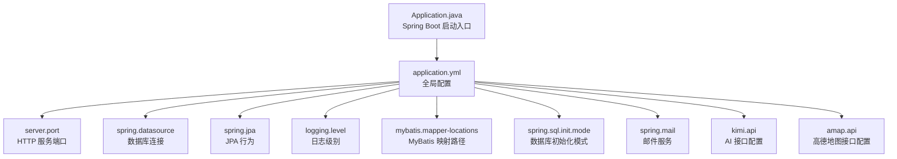
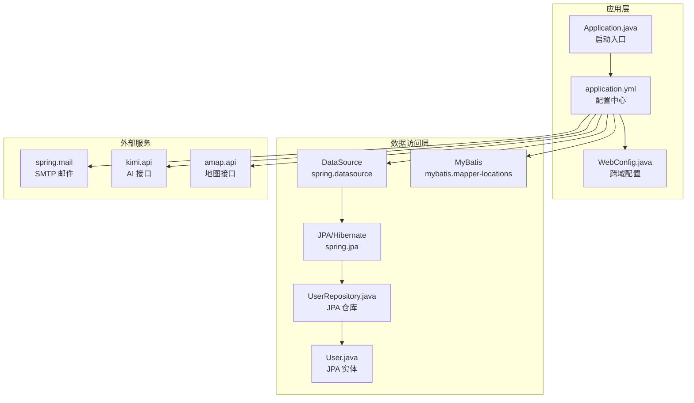
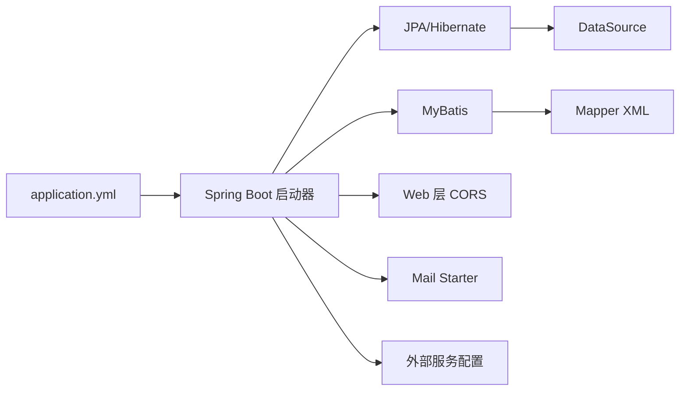

# 应用配置

<cite>
**本文引用的文件**
- [application.yml](file://tudianersha/src/main/resources/application.yml)
- [Application.java](file://tudianersha/src/main/java/com/tudianersha/Application.java)
- [DatabaseConfig.java](file://tudianersha/src/main/java/com/tudianersha/config/DatabaseConfig.java)
- [WebConfig.java](file://tudianersha/src/main/java/com/tudianersha/config/WebConfig.java)
- [UserRepository.java](file://tudianersha/src/main/java/com/tudianersha/repository/UserRepository.java)
- [User.java](file://tudianersha/src/main/java/com/tudianersha/entity/User.java)
- [schema.sql](file://tudianersha/src/main/resources/schema.sql)
- [data.sql](file://tudianersha/src/main/resources/data.sql)
- [pom.xml](file://tudianersha/pom.xml)
</cite>

## 目录
1. [简介](#简介)
2. [项目结构](#项目结构)
3. [核心组件](#核心组件)
4. [架构总览](#架构总览)
5. [详细组件分析](#详细组件分析)
6. [依赖分析](#依赖分析)
7. [性能考虑](#性能考虑)
8. [故障排查指南](#故障排查指南)
9. [结论](#结论)
10. [附录](#附录)

## 简介
本文件围绕项目中的 application.yml 配置进行系统化解读，重点覆盖以下方面：
- server.port：服务端口配置与默认值及多环境调整建议
- spring.datasource：数据库连接配置与驱动选择
- spring.jpa：JPA行为控制（DDL策略、SQL输出、方言）
- logging.level：日志级别设置与调试建议
- mybatis.mapper-locations：MyBatis映射文件路径配置
- spring.sql.init.mode: never 的含义及其对数据库初始化的影响
- 其他关键配置项（邮件、Kimi AI、高德地图API）的用途与安全注意事项
- 实际代码片段路径示例，展示如何修改端口、启用SQL日志输出、配置MyBatis映射路径
- 基于配置的性能优化与调试能力提升建议

## 项目结构
本项目采用 Spring Boot 标准目录结构，配置文件位于 resources 目录下，核心启动类位于 java 包中，JPA 仓库与实体类分别位于 repository 与 entity 包中。application.yml 中包含服务器、数据库、JPA、日志、MyBatis、邮件、第三方服务等配置。

图示来源
- [Application.java](file://tudianersha/src/main/java/com/tudianersha/Application.java#L1-L12)
- [application.yml](file://tudianersha/src/main/resources/application.yml#L1-L57)

章节来源
- [Application.java](file://tudianersha/src/main/java/com/tudianersha/Application.java#L1-L12)
- [application.yml](file://tudianersha/src/main/resources/application.yml#L1-L57)

## 核心组件
本节聚焦 application.yml 中的关键配置项及其作用、默认值与调优建议。

- server.port
  - 作用：指定应用对外提供 HTTP 服务的端口
  - 默认值：未显式配置时由 Spring Boot 默认端口决定（通常为 8080），但当前配置已显式设置为 8010
  - 多环境建议：
    - 开发环境：可保持 8010 或改为 8080 以与默认一致
    - 测试/预发布：使用独立端口避免冲突
    - 生产环境：结合反向代理或容器编排统一暴露端口
  - 修改示例路径：[application.yml](file://tudianersha/src/main/resources/application.yml#L1-L3)

- spring.datasource
  - 作用：配置数据源连接信息，包括 JDBC URL、用户名、密码、驱动类名
  - 默认值：未配置时无默认数据源；需显式提供
  - 当前配置要点：
    - URL：指向本地 MySQL 8 数据库，包含时区与时编码参数
    - 驱动类名：MySQL 8 驱动
  - 安全与多环境建议：
    - 生产环境应使用密钥管理或环境变量注入敏感信息
    - 不同环境使用不同的数据库实例与凭据
  - 示例路径：
    - [application.yml](file://tudianersha/src/main/resources/application.yml#L5-L9)
    - [pom.xml](file://tudianersha/pom.xml#L47-L52)

- spring.jpa
  - 作用：控制 JPA/Hibernate 的行为
  - 当前配置要点：
    - ddl-auto: update：自动根据实体更新数据库结构（开发友好，生产需谨慎）
    - show-sql: true：输出 SQL 到日志，便于调试
    - database-platform: MySQL8Dialect：指定方言适配 MySQL 8
  - 默认值：未配置时，show-sql 默认 false，ddl-auto 默认 validate，方言取决于数据库类型
  - 多环境建议：
    - 开发：update 或 validate
    - 测试：validate
    - 生产：validate 或 none，并通过迁移工具管理结构变更
  - 示例路径：
    - [application.yml](file://tudianersha/src/main/resources/application.yml#L11-L15)
    - [DatabaseConfig.java](file://tudianersha/src/main/java/com/tudianersha/config/DatabaseConfig.java#L1-L10)
    - [UserRepository.java](file://tudianersha/src/main/java/com/tudianersha/repository/UserRepository.java#L1-L15)
    - [User.java](file://tudianersha/src/main/java/com/tudianersha/entity/User.java#L1-L73)

- logging.level
  - 作用：设置包级日志级别
  - 当前配置要点：将 com.tudianersha 包的日志级别设为 debug
  - 默认值：未配置时由框架默认级别决定
  - 多环境建议：
    - 开发：debug 或 trace
    - 测试：info
    - 生产：warn 或 error，避免敏感信息泄露
  - 示例路径：
    - [application.yml](file://tudianersha/src/main/resources/application.yml#L43-L46)

- mybatis.mapper-locations
  - 作用：指定 MyBatis 映射文件（XML）的位置
  - 当前配置要点：classpath:mapper/*.xml
  - 默认值：未配置时 MyBatis 默认位置可能不匹配项目结构
  - 多环境建议：确保资源路径与打包后 classpath 一致
  - 示例路径：
    - [application.yml](file://tudianersha/src/main/resources/application.yml#L39-L41)
    - [pom.xml](file://tudianersha/pom.xml#L54-L59)

- spring.sql.init.mode
  - 作用：控制 SQL 初始化脚本的执行模式
  - 当前配置：never
  - 含义：禁止自动执行初始化脚本（schema.sql、data.sql）
  - 影响：
    - 若依赖 JPA 自动建表（如 ddl-auto: update），则无需 SQL 脚本
    - 若希望使用 SQL 脚本初始化，应改为 always 或当且仅当 schema 存在时（若可用）
  - 示例路径：
    - [application.yml](file://tudianersha/src/main/resources/application.yml#L17-L19)
    - [schema.sql](file://tudianersha/src/main/resources/schema.sql#L1-L123)
    - [data.sql](file://tudianersha/src/main/resources/data.sql#L1-L7)

- spring.mail
  - 作用：配置 SMTP 邮件发送
  - 当前配置要点：QQ 邮箱 SMTP，端口、认证、TLS、超时等
  - 安全建议：生产环境使用专用邮箱与密钥管理，避免硬编码
  - 示例路径：
    - [application.yml](file://tudianersha/src/main/resources/application.yml#L21-L38)

- kimi.api 与 amap.api
  - 作用：第三方服务接口配置（AI 与地图）
  - 安全建议：生产环境使用密钥管理与环境变量注入
  - 示例路径：
    - [application.yml](file://tudianersha/src/main/resources/application.yml#L47-L57)

章节来源
- [application.yml](file://tudianersha/src/main/resources/application.yml#L1-L57)
- [pom.xml](file://tudianersha/pom.xml#L47-L59)
- [schema.sql](file://tudianersha/src/main/resources/schema.sql#L1-L123)
- [data.sql](file://tudianersha/src/main/resources/data.sql#L1-L7)
- [DatabaseConfig.java](file://tudianersha/src/main/java/com/tudianersha/config/DatabaseConfig.java#L1-L10)
- [UserRepository.java](file://tudianersha/src/main/java/com/tudianersha/repository/UserRepository.java#L1-L15)
- [User.java](file://tudianersha/src/main/java/com/tudianersha/entity/User.java#L1-L73)

## 架构总览
下图展示了 application.yml 中关键配置与运行时组件之间的关系，以及它们如何影响应用启动与数据访问层的行为。

图示来源
- [Application.java](file://tudianersha/src/main/java/com/tudianersha/Application.java#L1-L12)
- [application.yml](file://tudianersha/src/main/resources/application.yml#L1-L57)
- [WebConfig.java](file://tudianersha/src/main/java/com/tudianersha/config/WebConfig.java#L1-L24)
- [DatabaseConfig.java](file://tudianersha/src/main/java/com/tudianersha/config/DatabaseConfig.java#L1-L10)
- [UserRepository.java](file://tudianersha/src/main/java/com/tudianersha/repository/UserRepository.java#L1-L15)
- [User.java](file://tudianersha/src/main/java/com/tudianersha/entity/User.java#L1-L73)

## 详细组件分析

### server.port：服务端口配置
- 作用与默认值
  - 作用：定义应用监听的 TCP 端口
  - 默认值：未显式配置时由 Spring Boot 默认端口决定（通常为 8080）
- 当前配置
  - 已显式设置为 8010
- 多环境建议
  - 开发：可保持 8010 或改为 8080
  - 测试/预发布：使用独立端口
  - 生产：结合反向代理或容器编排
- 修改示例路径
  - [application.yml](file://tudianersha/src/main/resources/application.yml#L1-L3)

章节来源
- [application.yml](file://tudianersha/src/main/resources/application.yml#L1-L3)

### spring.datasource：数据库连接
- 作用与默认值
  - 作用：提供数据源连接参数
  - 默认值：无默认数据源
- 当前配置要点
  - JDBC URL 指向本地 MySQL 8，包含时区与时编码参数
  - 驱动类名为 MySQL 8 驱动
- 多环境建议
  - 使用环境变量注入敏感信息
  - 不同环境使用不同数据库实例
- 示例路径
  - [application.yml](file://tudianersha/src/main/resources/application.yml#L5-L9)
  - [pom.xml](file://tudianersha/pom.xml#L47-L52)

章节来源
- [application.yml](file://tudianersha/src/main/resources/application.yml#L5-L9)
- [pom.xml](file://tudianersha/pom.xml#L47-L52)

### spring.jpa：JPA 行为
- 作用与默认值
  - 作用：控制 Hibernate 的 DDL 策略、SQL 输出、数据库方言
  - 默认值：show-sql 默认 false，ddl-auto 默认 validate，方言取决于数据库类型
- 当前配置要点
  - ddl-auto: update：自动根据实体更新数据库结构
  - show-sql: true：输出 SQL 到日志
  - database-platform: MySQL8Dialect：适配 MySQL 8
- 多环境建议
  - 开发：update 或 validate
  - 测试：validate
  - 生产：validate 或 none，并通过迁移工具管理结构变更
- 示例路径
  - [application.yml](file://tudianersha/src/main/resources/application.yml#L11-L15)
  - [DatabaseConfig.java](file://tudianersha/src/main/java/com/tudianersha/config/DatabaseConfig.java#L1-L10)
  - [UserRepository.java](file://tudianersha/src/main/java/com/tudianersha/repository/UserRepository.java#L1-L15)
  - [User.java](file://tudianersha/src/main/java/com/tudianersha/entity/User.java#L1-L73)

章节来源
- [application.yml](file://tudianersha/src/main/resources/application.yml#L11-L15)
- [DatabaseConfig.java](file://tudianersha/src/main/java/com/tudianersha/config/DatabaseConfig.java#L1-L10)
- [UserRepository.java](file://tudianersha/src/main/java/com/tudianersha/repository/UserRepository.java#L1-L15)
- [User.java](file://tudianersha/src/main/java/com/tudianersha/entity/User.java#L1-L73)

### logging.level：日志级别
- 作用与默认值
  - 作用：设置包级日志级别
  - 默认值：未配置时由框架默认级别决定
- 当前配置要点
  - 将 com.tudianersha 包的日志级别设为 debug
- 多环境建议
  - 开发：debug 或 trace
  - 测试：info
  - 生产：warn 或 error
- 示例路径
  - [application.yml](file://tudianersha/src/main/resources/application.yml#L43-L46)

章节来源
- [application.yml](file://tudianersha/src/main/resources/application.yml#L43-L46)

### mybatis.mapper-locations：MyBatis 映射路径
- 作用与默认值
  - 作用：指定 MyBatis 映射文件（XML）的位置
  - 默认值：未配置时 MyBatis 默认位置可能不匹配项目结构
- 当前配置要点
  - classpath:mapper/*.xml
- 多环境建议
  - 确保资源路径与打包后 classpath 一致
- 示例路径
  - [application.yml](file://tudianersha/src/main/resources/application.yml#L39-L41)
  - [pom.xml](file://tudianersha/pom.xml#L54-L59)

章节来源
- [application.yml](file://tudianersha/src/main/resources/application.yml#L39-L41)
- [pom.xml](file://tudianersha/pom.xml#L54-L59)

### spring.sql.init.mode: never 的含义与影响
- 含义
  - never：禁止自动执行初始化脚本（schema.sql、data.sql）
- 对数据库初始化的影响
  - 若依赖 JPA 自动建表（如 ddl-auto: update），则无需 SQL 脚本
  - 若希望使用 SQL 脚本初始化，应改为 always 或当且仅当 schema 存在时（若可用）
- 示例路径
  - [application.yml](file://tudianersha/src/main/resources/application.yml#L17-L19)
  - [schema.sql](file://tudianersha/src/main/resources/schema.sql#L1-L123)
  - [data.sql](file://tudianersha/src/main/resources/data.sql#L1-L7)

章节来源
- [application.yml](file://tudianersha/src/main/resources/application.yml#L17-L19)
- [schema.sql](file://tudianersha/src/main/resources/schema.sql#L1-L123)
- [data.sql](file://tudianersha/src/main/resources/data.sql#L1-L7)

### 其他关键配置项
- spring.mail
  - 作用：配置 SMTP 邮件发送
  - 安全建议：生产环境使用密钥管理与环境变量注入
  - 示例路径：[application.yml](file://tudianersha/src/main/resources/application.yml#L21-L38)
- kimi.api 与 amap.api
  - 作用：第三方服务接口配置（AI 与地图）
  - 安全建议：生产环境使用密钥管理与环境变量注入
  - 示例路径：[application.yml](file://tudianersha/src/main/resources/application.yml#L47-L57)

章节来源
- [application.yml](file://tudianersha/src/main/resources/application.yml#L21-L38)
- [application.yml](file://tudianersha/src/main/resources/application.yml#L47-L57)

## 依赖分析
- 组件耦合与职责
  - application.yml 作为配置中心，被 Spring Boot 启动器读取并注入到运行时组件
  - 数据访问层同时使用 JPA 与 MyBatis，二者通过各自的配置项独立工作
  - Web 层通过 CORS 配置支持跨域请求
- 外部依赖
  - MySQL 连接器与 MyBatis Spring Boot Starter 在 pom.xml 中声明
- 可能的循环依赖
  - 当前配置未见直接循环依赖；JPA 与 MyBatis 并行存在，互不干扰

图示来源
- [application.yml](file://tudianersha/src/main/resources/application.yml#L1-L57)
- [pom.xml](file://tudianersha/pom.xml#L47-L59)

章节来源
- [pom.xml](file://tudianersha/pom.xml#L47-L59)

## 性能考虑
- 日志级别
  - 在生产环境降低日志级别，减少 I/O 压力
  - 仅在调试阶段开启 debug 或 trace
- SQL 输出
  - show-sql: true 有助于开发调试，但会产生额外日志开销，生产环境建议关闭
- 数据库初始化
  - ddl-auto: update 在开发友好，生产建议使用迁移工具管理结构变更
  - spring.sql.init.mode: never 避免重复初始化，配合迁移工具更稳妥
- 跨域配置
  - CORS 配置允许通配符来源，开发方便，生产建议限制具体来源并启用凭证策略
- 第三方服务
  - AI 与地图接口配置应结合超时与重试策略，避免阻塞请求线程

[本节为通用建议，不直接分析具体文件]

## 故障排查指南
- 端口占用
  - 症状：启动失败或端口冲突
  - 排查：检查 server.port 是否被占用，必要时修改为其他端口
  - 参考路径：[application.yml](file://tudianersha/src/main/resources/application.yml#L1-L3)
- 数据库连接失败
  - 症状：无法连接数据库
  - 排查：确认 JDBC URL、用户名、密码、驱动类名正确；网络连通性；数据库服务状态
  - 参考路径：[application.yml](file://tudianersha/src/main/resources/application.yml#L5-L9)，[pom.xml](file://tudianersha/pom.xml#L47-L52)
- JPA 结构不一致
  - 症状：实体与数据库表不一致
  - 排查：检查 ddl-auto 设置；生产环境建议使用迁移工具
  - 参考路径：[application.yml](file://tudianersha/src/main/resources/application.yml#L11-L15)
- SQL 日志未输出
  - 症状：无法看到 SQL 输出
  - 排查：确认 logging.level 与 show-sql 设置；检查日志实现是否启用
  - 参考路径：[application.yml](file://tudianersha/src/main/resources/application.yml#L11-L15)，[application.yml](file://tudianersha/src/main/resources/application.yml#L43-L46)
- MyBatis 映射文件未加载
  - 症状：Mapper XML 未生效
  - 排查：确认 mybatis.mapper-locations 路径与打包后 classpath 一致
  - 参考路径：[application.yml](file://tudianersha/src/main/resources/application.yml#L39-L41)，[pom.xml](file://tudianersha/pom.xml#L54-L59)
- 数据初始化问题
  - 症状：数据库未按预期初始化
  - 排查：检查 spring.sql.init.mode 与 schema.sql/data.sql 内容
  - 参考路径：[application.yml](file://tudianersha/src/main/resources/application.yml#L17-L19)，[schema.sql](file://tudianersha/src/main/resources/schema.sql#L1-L123)，[data.sql](file://tudianersha/src/main/resources/data.sql#L1-L7)
- CORS 导致跨域失败
  - 症状：前端跨域请求被拒绝
  - 排查：检查 WebConfig 中 CORS 规则；生产环境限制来源
  - 参考路径：[WebConfig.java](file://tudianersha/src/main/java/com/tudianersha/config/WebConfig.java#L1-L24)

章节来源
- [application.yml](file://tudianersha/src/main/resources/application.yml#L1-L57)
- [schema.sql](file://tudianersha/src/main/resources/schema.sql#L1-L123)
- [data.sql](file://tudianersha/src/main/resources/data.sql#L1-L7)
- [WebConfig.java](file://tudianersha/src/main/java/com/tudianersha/config/WebConfig.java#L1-L24)
- [pom.xml](file://tudianersha/pom.xml#L47-L59)

## 结论
本文件基于项目中的 application.yml 对关键配置项进行了全面解读，明确了各项配置的作用、默认值与多环境调整建议，并提供了与之对应的代码片段路径示例。通过合理设置 server.port、spring.datasource、spring.jpa、logging.level、mybatis.mapper-locations 以及 spring.sql.init.mode，可以在开发、测试与生产环境中获得更好的调试能力与运行稳定性。同时，针对安全敏感的配置（如数据库凭据、邮件凭据、第三方 API Key），建议使用密钥管理与环境变量注入，避免硬编码。

[本节为总结性内容，不直接分析具体文件]

## 附录
- 实际代码片段路径示例（不展示具体代码内容）
  - 修改端口：[application.yml](file://tudianersha/src/main/resources/application.yml#L1-L3)
  - 启用 SQL 日志输出：[application.yml](file://tudianersha/src/main/resources/application.yml#L11-L15)
  - 配置 MyBatis 映射路径：[application.yml](file://tudianersha/src/main/resources/application.yml#L39-L41)
  - 数据库初始化模式：[application.yml](file://tudianersha/src/main/resources/application.yml#L17-L19)
  - 日志级别设置：[application.yml](file://tudianersha/src/main/resources/application.yml#L43-L46)
  - 数据源配置：[application.yml](file://tudianersha/src/main/resources/application.yml#L5-L9)，[pom.xml](file://tudianersha/pom.xml#L47-L52)
  - JPA 行为与实体/仓库：[application.yml](file://tudianersha/src/main/resources/application.yml#L11-L15)，[DatabaseConfig.java](file://tudianersha/src/main/java/com/tudianersha/config/DatabaseConfig.java#L1-L10)，[UserRepository.java](file://tudianersha/src/main/java/com/tudianersha/repository/UserRepository.java#L1-L15)，[User.java](file://tudianersha/src/main/java/com/tudianersha/entity/User.java#L1-L73)
  - CORS 配置：[WebConfig.java](file://tudianersha/src/main/java/com/tudianersha/config/WebConfig.java#L1-L24)