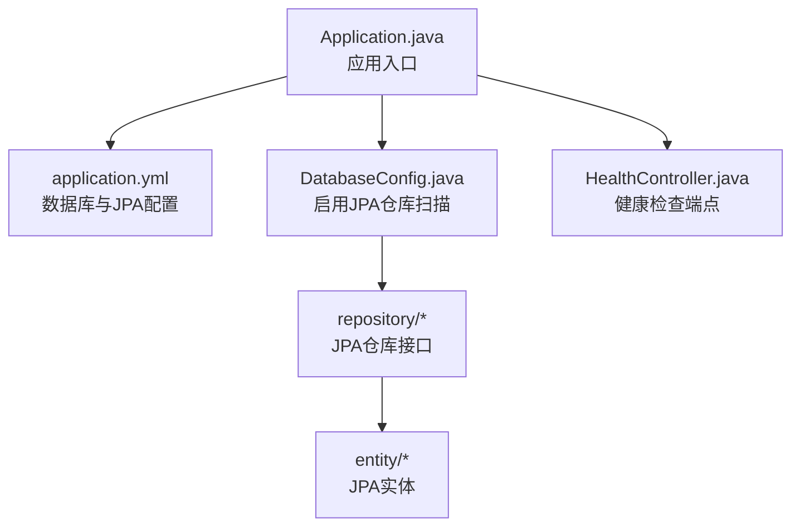
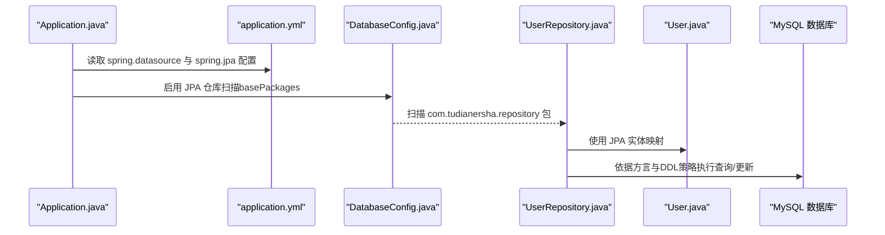
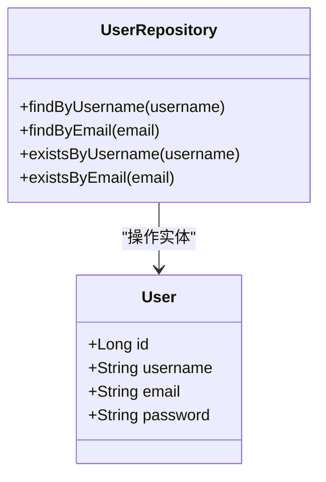
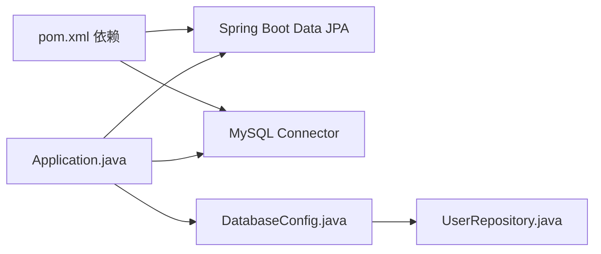
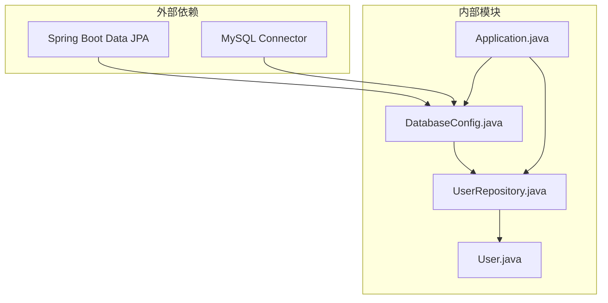
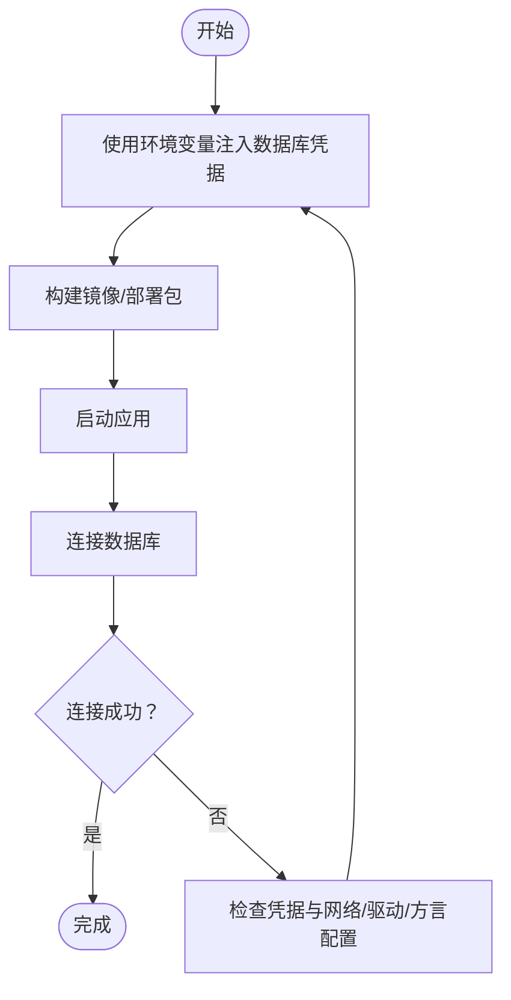

# 数据库配置

<cite>
**本文引用的文件列表**
- [application.yml](file://tudianersha/src/main/resources/application.yml)
- [DatabaseConfig.java](file://tudianersha/src/main/java/com/tudianersha/config/DatabaseConfig.java)
- [pom.xml](file://tudianersha/pom.xml)
- [Application.java](file://tudianersha/src/main/java/com/tudianersha/Application.java)
- [UserRepository.java](file://tudianersha/src/main/java/com/tudianersha/repository/UserRepository.java)
- [User.java](file://tudianersha/src/main/java/com/tudianersha/entity/User.java)
- [PasswordEncoderUtil.java](file://tudianersha/src/main/java/com/tudianersha/util/PasswordEncoderUtil.java)
- [HealthController.java](file://tudianersha/src/main/java/com/tudianersha/controller/HealthController.java)
</cite>

## 目录
1. [简介](#简介)
2. [项目结构](#项目结构)
3. [核心组件](#核心组件)
4. [架构总览](#架构总览)
5. [详细组件分析](#详细组件分析)
6. [依赖关系分析](#依赖关系分析)
7. [性能与可靠性考虑](#性能与可靠性考虑)
8. [故障排查指南](#故障排查指南)
9. [结论](#结论)
10. [附录：环境适配与安全建议](#附录环境适配与安全建议)

## 简介
本文件系统性解析本项目的数据库配置机制，围绕以下主题展开：
- application.yml 中 spring.datasource 的关键配置项（URL、用户名、密码、驱动类）与 spring.jpa 的相关设置（ddl-auto、show-sql、database-platform）
- DatabaseConfig.java 中 @EnableJpaRepositories 的作用与扫描路径
- 如何通过配置适配开发、测试、生产环境的数据库连接
- 安全建议（使用环境变量替代明文密码）
- 配置验证方法，确保服务能正确连接数据库

## 项目结构
从配置与数据访问层的角度，项目的关键位置如下：
- 配置文件：resources/application.yml
- JPA 配置与仓库扫描：config/DatabaseConfig.java
- 应用入口：Application.java
- 实体与仓库：entity/User.java、repository/UserRepository.java
- 安全工具：util/PasswordEncoderUtil.java
- 健康检查端点：controller/HealthController.java

图表来源
- [Application.java](file://tudianersha/src/main/java/com/tudianersha/Application.java#L1-L12)
- [application.yml](file://tudianersha/src/main/resources/application.yml#L1-L57)
- [DatabaseConfig.java](file://tudianersha/src/main/java/com/tudianersha/config/DatabaseConfig.java#L1-L10)
- [UserRepository.java](file://tudianersha/src/main/java/com/tudianersha/repository/UserRepository.java#L1-L15)
- [User.java](file://tudianersha/src/main/java/com/tudianersha/entity/User.java#L1-L73)
- [HealthController.java](file://tudianersha/src/main/java/com/tudianersha/controller/HealthController.java#L1-L15)

章节来源
- [Application.java](file://tudianersha/src/main/java/com/tudianersha/Application.java#L1-L12)
- [application.yml](file://tudianersha/src/main/resources/application.yml#L1-L57)
- [DatabaseConfig.java](file://tudianersha/src/main/java/com/tudianersha/config/DatabaseConfig.java#L1-L10)

## 核心组件
- 数据源配置（spring.datasource）
  - URL：数据库连接地址
  - 用户名：数据库用户
  - 密码：数据库用户密码
  - 驱动类：JDBC驱动类名
- JPA 配置（spring.jpa）
  - ddl-auto：自动建模策略
  - show-sql：是否打印 SQL
  - database-platform：数据库方言
- JPA 仓库扫描（@EnableJpaRepositories）
  - basePackages：扫描 JPA 仓库的包路径
- 实体与仓库
  - 实体：User.java
  - 仓库：UserRepository.java（继承 JpaRepository）

章节来源
- [application.yml](file://tudianersha/src/main/resources/application.yml#L1-L57)
- [DatabaseConfig.java](file://tudianersha/src/main/java/com/tudianersha/config/DatabaseConfig.java#L1-L10)
- [UserRepository.java](file://tudianersha/src/main/java/com/tudianersha/repository/UserRepository.java#L1-L15)
- [User.java](file://tudianersha/src/main/java/com/tudianersha/entity/User.java#L1-L73)

## 架构总览
下图展示应用启动后，配置如何影响数据访问层的工作流。

图表来源
- [Application.java](file://tudianersha/src/main/java/com/tudianersha/Application.java#L1-L12)
- [application.yml](file://tudianersha/src/main/resources/application.yml#L1-L57)
- [DatabaseConfig.java](file://tudianersha/src/main/java/com/tudianersha/config/DatabaseConfig.java#L1-L10)
- [UserRepository.java](file://tudianersha/src/main/java/com/tudianersha/repository/UserRepository.java#L1-L15)
- [User.java](file://tudianersha/src/main/java/com/tudianersha/entity/User.java#L1-L73)

## 详细组件分析

### 数据源与 JPA 配置项解析
- spring.datasource
  - URL：用于建立到 MySQL 的连接
  - 用户名：数据库用户
  - 密码：数据库用户密码
  - 驱动类：MySQL 连接驱动类名
- spring.jpa
  - ddl-auto：当前为 update，表示根据实体变更自动更新表结构
  - show-sql：true，便于调试时查看生成的 SQL
  - database-platform：MySQL8 方言，确保 Hibernate 生成兼容的 SQL

这些配置直接影响实体映射、SQL 生成与数据库交互行为。

章节来源
- [application.yml](file://tudianersha/src/main/resources/application.yml#L1-L57)

### JPA 仓库扫描与实体映射
- @EnableJpaRepositories(basePackages = "com.tudianersha.repository")
  - 指定 Spring Data JPA 扫描仓库接口的包路径
- UserRepository 接口
  - 继承 JpaRepository，天然具备 CRUD 能力
  - 自定义查询方法签名体现业务查询需求
- User 实体
  - 使用 JPA 注解标注主键、列与表映射

图表来源
- [UserRepository.java](file://tudianersha/src/main/java/com/tudianersha/repository/UserRepository.java#L1-L15)
- [User.java](file://tudianersha/src/main/java/com/tudianersha/entity/User.java#L1-L73)

章节来源
- [DatabaseConfig.java](file://tudianersha/src/main/java/com/tudianersha/config/DatabaseConfig.java#L1-L10)
- [UserRepository.java](file://tudianersha/src/main/java/com/tudianersha/repository/UserRepository.java#L1-L15)
- [User.java](file://tudianersha/src/main/java/com/tudianersha/entity/User.java#L1-L73)

### 依赖与运行时关系
- pom.xml 引入了 Spring Boot Starter Data JPA 与 MySQL Connector，保证 JPA 与 MySQL 的运行时支持
- Application.java 作为启动入口，加载上述配置并初始化容器

图表来源
- [pom.xml](file://tudianersha/pom.xml#L1-L180)
- [Application.java](file://tudianersha/src/main/java/com/tudianersha/Application.java#L1-L12)
- [DatabaseConfig.java](file://tudianersha/src/main/java/com/tudianersha/config/DatabaseConfig.java#L1-L10)

章节来源
- [pom.xml](file://tudianersha/pom.xml#L1-L180)
- [Application.java](file://tudianersha/src/main/java/com/tudianersha/Application.java#L1-L12)

## 依赖关系分析
- 外部依赖
  - Spring Boot Data JPA：提供 JPA 抽象与仓库扫描能力
  - MySQL Connector：提供 JDBC 驱动
- 内部依赖
  - DatabaseConfig 启用 JPA 仓库扫描
  - UserRepository 依赖 JPA 与实体 User
  - Application 作为装配入口

图表来源
- [pom.xml](file://tudianersha/pom.xml#L1-L180)
- [DatabaseConfig.java](file://tudianersha/src/main/java/com/tudianersha/config/DatabaseConfig.java#L1-L10)
- [UserRepository.java](file://tudianersha/src/main/java/com/tudianersha/repository/UserRepository.java#L1-L15)
- [User.java](file://tudianersha/src/main/java/com/tudianersha/entity/User.java#L1-L73)
- [Application.java](file://tudianersha/src/main/java/com/tudianersha/Application.java#L1-L12)

章节来源
- [pom.xml](file://tudianersha/pom.xml#L1-L180)
- [DatabaseConfig.java](file://tudianersha/src/main/java/com/tudianersha/config/DatabaseConfig.java#L1-L10)
- [UserRepository.java](file://tudianersha/src/main/java/com/tudianersha/repository/UserRepository.java#L1-L15)
- [User.java](file://tudianersha/src/main/java/com/tudianersha/entity/User.java#L1-L73)
- [Application.java](file://tudianersha/src/main/java/com/tudianersha/Application.java#L1-L12)

## 性能与可靠性考虑
- DDL 策略
  - 当前为 update，适合开发阶段快速迭代；在生产中建议更严格地管理迁移脚本，避免自动变更带来的风险
- SQL 输出
  - show-sql 为 true，便于调试；在生产中建议关闭以减少日志开销
- 方言选择
  - database-platform 指向 MySQL8 方言，确保 SQL 兼容性
- 连接池与超时
  - 可在 application.yml 中增加连接池与超时参数，提升稳定性（例如 hikari 的连接超时、空闲超时等）

[本节为通用指导，不直接分析具体文件]

## 故障排查指南
- 健康检查
  - 提供 /api/health 端点，可作为服务可用性的基础验证入口
- 数据库连通性验证步骤
  1) 确认 application.yml 中 spring.datasource 的 URL、用户名、密码、驱动类配置正确
  2) 确认 spring.jpa 的 database-platform 与目标数据库版本一致
  3) 启动应用后观察控制台日志，确认未出现连接失败或方言不匹配错误
  4) 若 show-sql 为 true，可在日志中查看生成的 SQL，辅助定位问题
  5) 使用 /api/health 确认应用已成功启动
- 常见问题定位
  - 驱动类不匹配：检查驱动类名与实际驱动版本
  - 方言不匹配：database-platform 与数据库版本不符会导致 SQL 生成异常
  - DDL 策略：若表结构异常，检查 ddl-auto 的影响范围

章节来源
- [HealthController.java](file://tudianersha/src/main/java/com/tudianersha/controller/HealthController.java#L1-L15)
- [application.yml](file://tudianersha/src/main/resources/application.yml#L1-L57)

## 结论
本项目的数据库配置采用 Spring Boot 默认约定式配置，配合 @EnableJpaRepositories 明确扫描路径，实现了实体与仓库的无缝集成。通过合理调整 spring.jpa 的 ddl-auto、show-sql 与 database-platform，可在不同环境下平衡开发效率与生产稳定性。建议在生产环境中关闭 show-sql，并以显式的迁移脚本替代自动建模，同时加强凭据安全管理。

[本节为总结性内容，不直接分析具体文件]

## 附录：环境适配与安全建议

### 开发、测试、生产环境适配
- 使用 Spring Profile 切换配置
  - 在 application.yml 中按 profile 分组配置不同的 spring.datasource 与 spring.jpa 参数
  - 或者拆分为 application-dev.yml、application-test.yml、application-prod.yml，通过 spring.profiles.active 激活
- 不同环境的典型差异
  - 开发：show-sql=true，ddl-auto=update，便于快速迭代
  - 测试：show-sql 可选，ddl-auto=validate 或自定义迁移脚本
  - 生产：show-sql=false，ddl-auto=validate 或由运维统一迁移，严格控制 DDL

[本节为通用指导，不直接分析具体文件]

### 凭据安全建议
- 使用环境变量替换明文密码
  - 将 spring.datasource.username 与 spring.datasource.password 替换为环境变量注入
  - 在 CI/CD 中通过密钥管理服务注入敏感信息，避免提交到代码库
- 密码加密与校验
  - 使用 BCrypt 对用户密码进行加密存储
  - 在登录流程中使用匹配函数进行校验

图表来源
- [application.yml](file://tudianersha/src/main/resources/application.yml#L1-L57)
- [PasswordEncoderUtil.java](file://tudianersha/src/main/java/com/tudianersha/util/PasswordEncoderUtil.java#L1-L32)

章节来源
- [application.yml](file://tudianersha/src/main/resources/application.yml#L1-L57)
- [PasswordEncoderUtil.java](file://tudianersha/src/main/java/com/tudianersha/util/PasswordEncoderUtil.java#L1-L32)