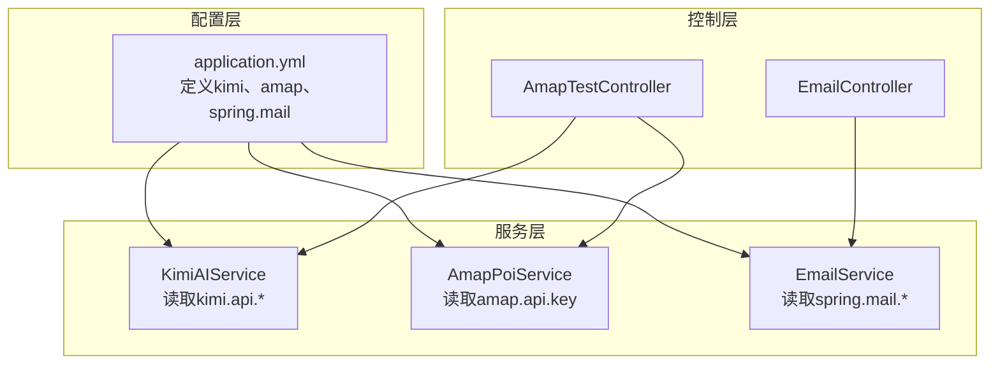
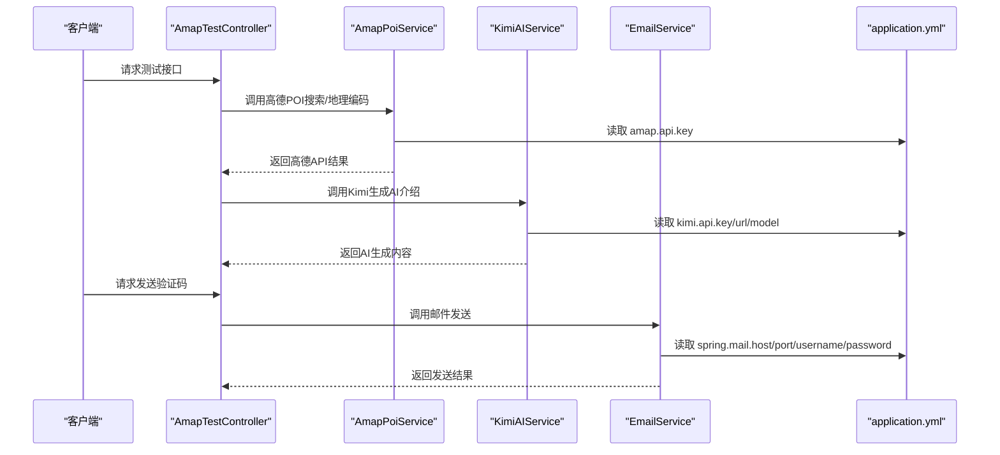
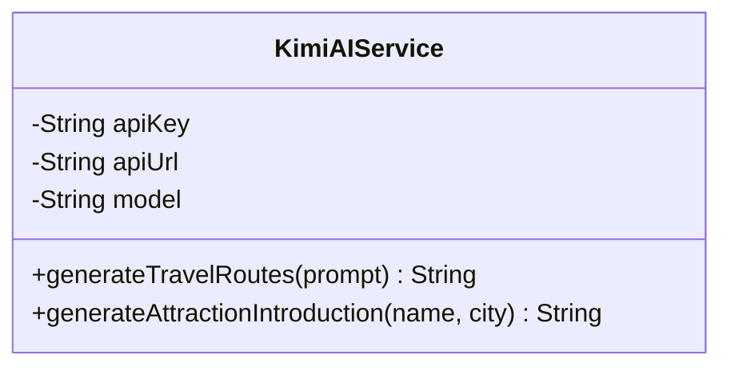
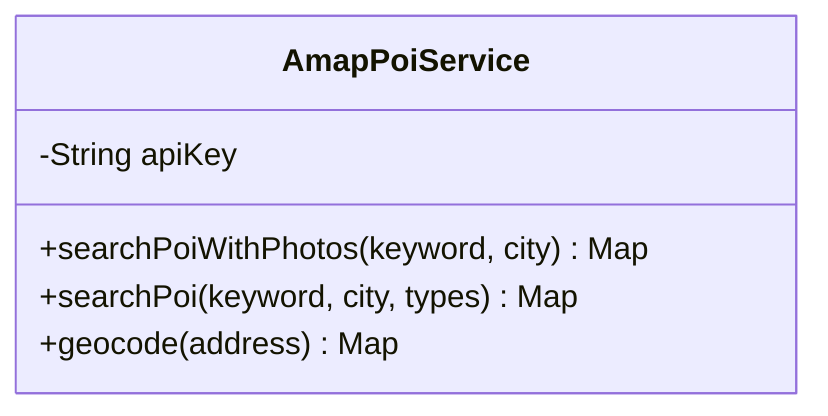
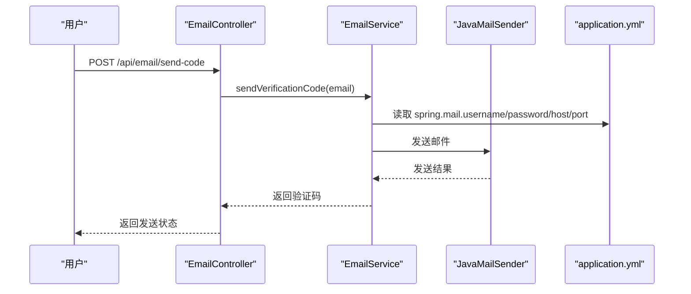

# 第三方服务密钥配置

<cite>
**本文引用的文件**
- [application.yml](file://tudianersha/src/main/resources/application.yml)
- [KimiAIService.java](file://tudianersha/src/main/java/com/tudianersha/service/KimiAIService.java)
- [AmapPoiService.java](file://tudianersha/src/main/java/com/tudianersha/service/AmapPoiService.java)
- [EmailService.java](file://tudianersha/src/main/java/com/tudianersha/service/EmailService.java)
- [EmailController.java](file://tudianersha/src/main/java/com/tudianersha/controller/EmailController.java)
- [AmapTestController.java](file://tudianersha/src/main/java/com/tudianersha/controller/AmapTestController.java)
</cite>

## 目录
1. [简介](#简介)
2. [项目结构](#项目结构)
3. [核心组件](#核心组件)
4. [架构总览](#架构总览)
5. [详细组件分析](#详细组件分析)
6. [依赖关系分析](#依赖关系分析)
7. [性能与可用性考量](#性能与可用性考量)
8. [故障排查指南](#故障排查指南)
9. [结论](#结论)
10. [附录](#附录)

## 简介
本文件系统化说明项目中第三方服务密钥的配置方式，重点覆盖：
- Kimi AI 服务的密钥、请求端点与模型参数配置
- 高德地图 API 密钥的配置与用途范围
- Spring Mail（QQ 邮箱 SMTP）配置项：主机、端口、认证机制（STARTTLS）、超时设置
并提供密钥安全管理最佳实践与常见问题排查步骤，帮助在开发与生产环境中安全、稳定地使用这些外部服务。

## 项目结构
围绕“第三方服务密钥”的配置，涉及以下关键文件与模块：
- 配置文件：application.yml 中定义 Kimi、高德地图、Spring Mail 的配置键值
- 业务服务：KimiAIService、AmapPoiService、EmailService 分别消费上述配置
- 控制器：AmapTestController、EmailController 对外暴露测试与邮件验证码接口



图表来源
- [application.yml](file://tudianersha/src/main/resources/application.yml#L21-L57)
- [KimiAIService.java](file://tudianersha/src/main/java/com/tudianersha/service/KimiAIService.java#L16-L24)
- [AmapPoiService.java](file://tudianersha/src/main/java/com/tudianersha/service/AmapPoiService.java#L23-L24)
- [EmailService.java](file://tudianersha/src/main/java/com/tudianersha/service/EmailService.java#L18-L19)
- [AmapTestController.java](file://tudianersha/src/main/java/com/tudianersha/controller/AmapTestController.java#L1-L22)
- [EmailController.java](file://tudianersha/src/main/java/com/tudianersha/controller/EmailController.java#L1-L22)

章节来源
- [application.yml](file://tudianersha/src/main/resources/application.yml#L21-L57)

## 核心组件
本节聚焦于三类配置键及其作用：
- Kimi API 配置块（kimi.api.*）
  - key：用于鉴权的 API 密钥
  - url：Kimi AI 的聊天补全接口端点
  - model：模型标识（如 moonshot-v1-8k）
- 高德地图 API 配置块（amap.api.key）
  - key：高德开放平台的访问密钥
- Spring Mail（QQ 邮箱 SMTP）配置块（spring.mail.*）
  - host：SMTP 主机（smtp.qq.com）
  - port：SMTP 端口（587）
  - username/password：发件人邮箱与授权密码
  - properties.mail.smtp.auth/starttls.enable/starttls.required：启用认证与 STARTTLS
  - properties.mail.smtp.connectiontimeout/timeout/writetimeout：连接、读写超时
  - default-encoding：默认字符集

章节来源
- [application.yml](file://tudianersha/src/main/resources/application.yml#L21-L57)

## 架构总览
下图展示了“配置—服务—控制器”的调用链路，以及各服务如何读取配置键。



图表来源
- [AmapTestController.java](file://tudianersha/src/main/java/com/tudianersha/controller/AmapTestController.java#L1-L22)
- [AmapPoiService.java](file://tudianersha/src/main/java/com/tudianersha/service/AmapPoiService.java#L23-L24)
- [KimiAIService.java](file://tudianersha/src/main/java/com/tudianersha/service/KimiAIService.java#L16-L24)
- [EmailService.java](file://tudianersha/src/main/java/com/tudianersha/service/EmailService.java#L18-L19)
- [application.yml](file://tudianersha/src/main/resources/application.yml#L21-L57)

## 详细组件分析

### Kimi AI 服务配置与使用
- 配置键
  - kimi.api.key：用于 Authorization 头部的 Bearer Token
  - kimi.api.url：Kimi AI 的 chat/completions 接口端点
  - kimi.api.model：模型标识（如 moonshot-v1-8k）
- 服务实现要点
  - 通过 @Value 注入配置键
  - 使用 OkHttp 客户端发起 POST 请求，携带 Authorization 与 Content-Type
  - 解析响应中的 choices/message/content 字段提取 AI 输出
  - 设置连接/读写超时，满足长耗时 AI 生成场景
- 参数作用说明
  - 模型选择：决定推理能力与上下文长度上限（如 moonshot-v1-8k）
  - 请求端点：指向 Kimi 的聊天补全接口，用于生成旅行路线与景点介绍



图表来源
- [KimiAIService.java](file://tudianersha/src/main/java/com/tudianersha/service/KimiAIService.java#L16-L24)
- [KimiAIService.java](file://tudianersha/src/main/java/com/tudianersha/service/KimiAIService.java#L70-L99)
- [KimiAIService.java](file://tudianersha/src/main/java/com/tudianersha/service/KimiAIService.java#L140-L175)

章节来源
- [application.yml](file://tudianersha/src/main/resources/application.yml#L47-L53)
- [KimiAIService.java](file://tudianersha/src/main/java/com/tudianersha/service/KimiAIService.java#L16-L24)
- [KimiAIService.java](file://tudianersha/src/main/java/com/tudianersha/service/KimiAIService.java#L70-L99)
- [KimiAIService.java](file://tudianersha/src/main/java/com/tudianersha/service/KimiAIService.java#L140-L175)

### 高德地图 API 配置与使用
- 配置键
  - amap.api.key：高德开放平台的访问密钥
- 服务实现要点
  - 通过 @Value 注入配置键，并提供默认值兜底
  - 使用 OkHttp 客户端发起 GET 请求，拼接文本检索、地理编码等接口参数
  - 解析 JSON 响应，提取 POI 列表、地址、经纬度等字段
- 参数作用说明
  - 密钥用途：用于高德地图文本检索、地理编码等接口的身份校验与配额控制



图表来源
- [AmapPoiService.java](file://tudianersha/src/main/java/com/tudianersha/service/AmapPoiService.java#L23-L24)
- [AmapPoiService.java](file://tudianersha/src/main/java/com/tudianersha/service/AmapPoiService.java#L229-L290)
- [AmapPoiService.java](file://tudianersha/src/main/java/com/tudianersha/service/AmapPoiService.java#L292-L362)

章节来源
- [application.yml](file://tudianersha/src/main/resources/application.yml#L54-L57)
- [AmapPoiService.java](file://tudianersha/src/main/java/com/tudianersha/service/AmapPoiService.java#L23-L24)
- [AmapPoiService.java](file://tudianersha/src/main/java/com/tudianersha/service/AmapPoiService.java#L229-L290)
- [AmapPoiService.java](file://tudianersha/src/main/java/com/tudianersha/service/AmapPoiService.java#L292-L362)

### Spring Mail（QQ 邮箱 SMTP）配置与使用
- 配置键
  - spring.mail.host：SMTP 主机（smtp.qq.com）
  - spring.mail.port：SMTP 端口（587）
  - spring.mail.username/password：发件人邮箱与授权密码
  - spring.mail.properties.mail.smtp.auth：启用认证
  - spring.mail.properties.mail.smtp.starttls.enable/required：启用并强制 STARTTLS
  - spring.mail.properties.mail.smtp.connectiontimeout/timeout/writetimeout：连接、读写超时
  - spring.mail.default-encoding：默认字符集（UTF-8）
- 服务实现要点
  - 通过 @Value 注入 spring.mail.username 作为发件人地址
  - 使用 JavaMailSender 发送简单文本邮件（包含验证码）
  - 控制器负责接收邮箱地址并调用服务发送验证码



图表来源
- [EmailController.java](file://tudianersha/src/main/java/com/tudianersha/controller/EmailController.java#L23-L57)
- [EmailService.java](file://tudianersha/src/main/java/com/tudianersha/service/EmailService.java#L18-L19)
- [application.yml](file://tudianersha/src/main/resources/application.yml#L21-L38)

章节来源
- [application.yml](file://tudianersha/src/main/resources/application.yml#L21-L38)
- [EmailService.java](file://tudianersha/src/main/java/com/tudianersha/service/EmailService.java#L18-L19)
- [EmailController.java](file://tudianersha/src/main/java/com/tudianersha/controller/EmailController.java#L23-L57)

## 依赖关系分析
- 配置键与服务的绑定关系
  - KimiAIService 依赖 kimi.api.key、kimi.api.url、kimi.api.model
  - AmapPoiService 依赖 amap.api.key
  - EmailService 依赖 spring.mail.host/port/username/password 等
- 控制器对服务的调用
  - AmapTestController 同时依赖 KimiAIService 与 AmapPoiService
  - EmailController 依赖 EmailService

```mermaid
graph LR
K["KimiAIService"] -- "@Value(kimi.api.*)"
A["AmapPoiService"] -- "@Value(amap.api.key)"
E["EmailService"] -- "@Value(spring.mail.*)"
AK["AmapTestController"] --> K
AK --> A
AE["EmailController"] --> E
```

图表来源
- [KimiAIService.java](file://tudianersha/src/main/java/com/tudianersha/service/KimiAIService.java#L16-L24)
- [AmapPoiService.java](file://tudianersha/src/main/java/com/tudianersha/service/AmapPoiService.java#L23-L24)
- [EmailService.java](file://tudianersha/src/main/java/com/tudianersha/service/EmailService.java#L18-L19)
- [AmapTestController.java](file://tudianersha/src/main/java/com/tudianersha/controller/AmapTestController.java#L1-L22)
- [EmailController.java](file://tudianersha/src/main/java/com/tudianersha/controller/EmailController.java#L1-L22)

章节来源
- [KimiAIService.java](file://tudianersha/src/main/java/com/tudianersha/service/KimiAIService.java#L16-L24)
- [AmapPoiService.java](file://tudianersha/src/main/java/com/tudianersha/service/AmapPoiService.java#L23-L24)
- [EmailService.java](file://tudianersha/src/main/java/com/tudianersha/service/EmailService.java#L18-L19)
- [AmapTestController.java](file://tudianersha/src/main/java/com/tudianersha/controller/AmapTestController.java#L1-L22)
- [EmailController.java](file://tudianersha/src/main/java/com/tudianersha/controller/EmailController.java#L1-L22)

## 性能与可用性考量
- Kimi AI
  - 已设置较长的连接/读写超时，适合长耗时的 AI 生成任务
  - 建议在网关或服务层增加限流与熔断策略，避免上游流量洪峰导致超时
- 高德地图
  - 已设置合理的连接/读取超时
  - 建议对高频查询做本地缓存（如 Redis），降低外部依赖压力
- 邮件服务
  - 已开启 STARTTLS 并设置连接/读写超时
  - 建议对发送频率做限流，避免触发 SMTP 服务商的速率限制

[本节为通用建议，无需列出具体文件来源]

## 故障排查指南
- Kimi AI
  - 症状：请求失败或响应格式异常
  - 排查步骤
    - 确认 kimi.api.key 是否正确且未过期
    - 确认 kimi.api.url 是否指向正确的接口端点
    - 确认 kimi.api.model 是否符合服务端支持的模型标识
    - 观察服务端日志中 OkHttp 的响应状态与错误信息
- 高德地图
  - 症状：POI 检索无结果或报错
  - 排查步骤
    - 确认 amap.api.key 是否正确且未被禁用
    - 检查请求参数（关键词、城市、类型）是否合法
    - 关注响应中的状态码与提示信息，定位是配额不足还是参数错误
- 邮件服务（QQ 邮箱 SMTP）
  - 症状：发送失败、认证失败或超时
  - 排查步骤
    - 确认 spring.mail.username/password 是否为邮箱地址与授权码
    - 确认 spring.mail.host/port/starttls 配置是否与 QQ 邮箱要求一致
    - 检查网络连通性与防火墙策略
    - 查看超时配置是否过短，必要时适当延长

章节来源
- [KimiAIService.java](file://tudianersha/src/main/java/com/tudianersha/service/KimiAIService.java#L70-L99)
- [AmapPoiService.java](file://tudianersha/src/main/java/com/tudianersha/service/AmapPoiService.java#L229-L290)
- [application.yml](file://tudianersha/src/main/resources/application.yml#L21-L38)

## 结论
本项目通过 application.yml 将 Kimi、高德地图与 QQ 邮箱 SMTP 的密钥与参数集中管理，并由对应的服务类按需注入使用。为确保安全与稳定，建议采用环境变量或配置中心进行密钥隔离，严格最小权限原则，并在生产环境开启更强的超时与限流策略。遇到问题时，可依据本文提供的排查步骤快速定位配置与网络层面的问题。

[本节为总结性内容，无需列出具体文件来源]

## 附录
- 密钥安全管理最佳实践
  - 使用环境变量或配置中心（如 Spring Cloud Config、Vault、Kubernetes Secret）存储敏感信息
  - 不将密钥硬编码在仓库中，使用占位符并在部署时注入
  - 为不同环境（dev/staging/prod）分别配置独立密钥
  - 定期轮换密钥并及时更新配置
  - 限制密钥使用范围（如高德地图仅授予必要接口权限）

[本节为通用建议，无需列出具体文件来源]