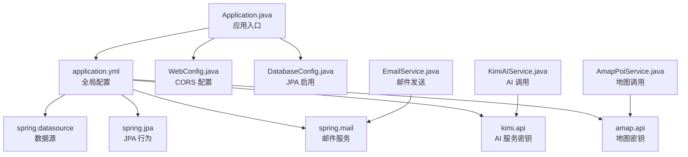
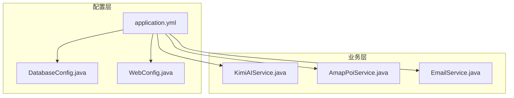
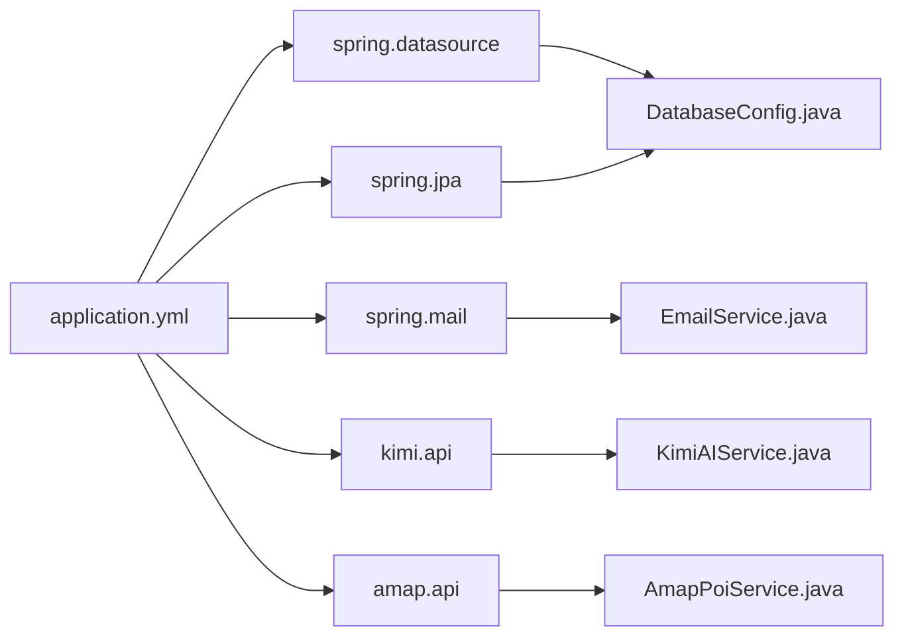

# 配置指南

<cite>
**本文引用的文件**
- [application.yml](file://tudianersha/src/main/resources/application.yml)
- [DatabaseConfig.java](file://tudianersha/src/main/java/com/tudianersha/config/DatabaseConfig.java)
- [WebConfig.java](file://tudianersha/src/main/java/com/tudianersha/config/WebConfig.java)
- [KimiAIService.java](file://tudianersha/src/main/java/com/tudianersha/service/KimiAIService.java)
- [AmapPoiService.java](file://tudianersha/src/main/java/com/tudianersha/service/AmapPoiService.java)
- [EmailService.java](file://tudianersha/src/main/java/com/tudianersha/service/EmailService.java)
- [Application.java](file://tudianersha/src/main/java/com/tudianersha/Application.java)
- [pom.xml](file://tudianersha/pom.xml)
</cite>

## 目录
1. [简介](#简介)
2. [项目结构](#项目结构)
3. [核心组件](#核心组件)
4. [架构总览](#架构总览)
5. [详细组件分析](#详细组件分析)
6. [依赖关系分析](#依赖关系分析)
7. [性能考虑](#性能考虑)
8. [故障排查指南](#故障排查指南)
9. [结论](#结论)
10. [附录](#附录)

## 简介
本指南面向开发者与运维人员，提供对系统配置的完整说明，重点覆盖以下方面：
- application.yml 中各配置项的含义与可调参数
- 如何在不同环境（开发、测试、生产）切换数据库连接
- DatabaseConfig.java 的自定义数据源配置与 WebConfig.java 的 WebMvcConfigurer 使用场景
- 敏感配置的安全管理建议（环境变量/配置中心）
- 配置验证步骤与常见问题排查
- 所有可配置项及其默认值清单

## 项目结构
该系统基于 Spring Boot 构建，配置集中在 resources/application.yml；数据库访问通过 Spring Data JPA；Web 层通过 CORS 配置实现跨域支持；AI 与地图服务通过外部 API 调用，邮件服务通过 SMTP 发送验证码。

图表来源
- [Application.java](file://tudianersha/src/main/java/com/tudianersha/Application.java#L1-L12)
- [application.yml](file://tudianersha/src/main/resources/application.yml#L1-L57)
- [WebConfig.java](file://tudianersha/src/main/java/com/tudianersha/config/WebConfig.java#L1-L24)
- [DatabaseConfig.java](file://tudianersha/src/main/java/com/tudianersha/config/DatabaseConfig.java#L1-L10)
- [KimiAIService.java](file://tudianersha/src/main/java/com/tudianersha/service/KimiAIService.java#L1-L175)
- [AmapPoiService.java](file://tudianersha/src/main/java/com/tudianersha/service/AmapPoiService.java#L1-L309)
- [EmailService.java](file://tudianersha/src/main/java/com/tudianersha/service/EmailService.java#L1-L75)

章节来源
- [Application.java](file://tudianersha/src/main/java/com/tudianersha/Application.java#L1-L12)
- [pom.xml](file://tudianersha/pom.xml#L1-L180)

## 核心组件
本节逐项解析 application.yml 中的关键配置，并结合代码使用场景说明其作用与可调参数。

- server.port
  - 作用：设置服务监听端口
  - 默认值：8010
  - 可调范围：1–65535（需避开系统保留端口）
  - 使用场景：开发调试、容器编排、反向代理转发
  - 修改方式：直接在 application.yml 中调整对应数值
  - 章节来源
    - [application.yml](file://tudianersha/src/main/resources/application.yml#L1-L5)

- spring.datasource.*
  - 作用：数据库连接配置
  - 关键子项
    - url：数据库连接串（含主机、端口、数据库名、字符集与时区）
    - username：数据库用户名
    - password：数据库密码
    - driver-class-name：JDBC 驱动类名
  - 默认值：示例中为本地 MySQL 连接串、root 用户、123456 密码、MySQL 8 驱动
  - 可调参数：主机、端口、数据库名、用户、密码、时区、字符集
  - 修改方式：按不同环境替换上述字段
  - 章节来源
    - [application.yml](file://tudianersha/src/main/resources/application.yml#L5-L9)

- spring.jpa.*
  - 作用：JPA/Hibernate 行为控制
  - 关键子项
    - hibernate.ddl-auto：数据库模式策略（如 update、validate、none 等）
    - show-sql：是否打印 SQL 日志
    - database-platform：数据库方言（如 MySQL8Dialect）
  - 默认值：示例中为 update、true、MySQL8Dialect
  - 可调参数：DDL 策略、SQL 输出、方言
  - 修改方式：根据环境选择合适策略（开发建议 update，生产建议 validate 或 none）
  - 章节来源
    - [application.yml](file://tudianersha/src/main/resources/application.yml#L11-L15)

- spring.sql.init.mode
  - 作用：初始化脚本执行模式
  - 默认值：never（不自动执行初始化脚本）
  - 可调参数：never、always、embedded（按需启用）
  - 章节来源
    - [application.yml](file://tudianersha/src/main/resources/application.yml#L17-L19)

- spring.mail.*
  - 作用：SMTP 邮件发送配置（QQ 邮箱示例）
  - 关键子项
    - host：SMTP 主机
    - port：SMTP 端口
    - username：发件邮箱
    - password：授权码（非登录密码）
    - properties.mail.smtp.*：认证、TLS、超时等
    - default-encoding：默认编码
  - 默认值：示例中为 QQ 邮箱 SMTP 参数
  - 可调参数：host、port、username、password、TLS、超时
  - 修改方式：更换邮箱服务商或账号时同步更新
  - 章节来源
    - [application.yml](file://tudianersha/src/main/resources/application.yml#L21-L37)

- mybatis.*
  - 作用：MyBatis 映射与别名包
  - 关键子项
    - mapper-locations：Mapper XML 文件路径
    - type-aliases-package：实体包扫描
  - 默认值：示例中为 classpath:mapper/*.xml 与实体包
  - 可调参数：映射文件位置、实体包
  - 章节来源
    - [application.yml](file://tudianersha/src/main/resources/application.yml#L39-L41)

- logging.level.*
  - 作用：日志级别
  - 默认值：com.tudianersha 包 debug
  - 可调参数：按包或类设置
  - 章节来源
    - [application.yml](file://tudianersha/src/main/resources/application.yml#L43-L46)

- kimi.api.*
  - 作用：Moonshot AI 接口密钥与模型
  - 关键子项
    - key：API 密钥
    - url：API 请求地址
    - model：模型标识
  - 默认值：示例中为 Moonshot 接口参数
  - 可调参数：密钥、URL、模型
  - 使用场景：AI 生成路线、景点介绍
  - 章节来源
    - [application.yml](file://tudianersha/src/main/resources/application.yml#L47-L53)
    - [KimiAIService.java](file://tudianersha/src/main/java/com/tudianersha/service/KimiAIService.java#L1-L175)

- amap.api.*
  - 作用：高德地图 API 密钥
  - 关键子项
    - key：API 密钥
  - 默认值：示例中为高德密钥
  - 可调参数：密钥
  - 使用场景：POI 搜索、地理编码、照片抓取
  - 章节来源
    - [application.yml](file://tudianersha/src/main/resources/application.yml#L54-L57)
    - [AmapPoiService.java](file://tudianersha/src/main/java/com/tudianersha/service/AmapPoiService.java#L1-L309)

## 架构总览
下图展示配置在系统中的作用与流向，以及与服务层的关系。

图表来源
- [application.yml](file://tudianersha/src/main/resources/application.yml#L1-L57)
- [DatabaseConfig.java](file://tudianersha/src/main/java/com/tudianersha/config/DatabaseConfig.java#L1-L10)
- [WebConfig.java](file://tudianersha/src/main/java/com/tudianersha/config/WebConfig.java#L1-L24)
- [KimiAIService.java](file://tudianersha/src/main/java/com/tudianersha/service/KimiAIService.java#L1-L175)
- [AmapPoiService.java](file://tudianersha/src/main/java/com/tudianersha/service/AmapPoiService.java#L1-L309)
- [EmailService.java](file://tudianersha/src/main/java/com/tudianersha/service/EmailService.java#L1-L75)

## 详细组件分析

### 数据库配置与 JPA 行为
- DatabaseConfig.java
  - 作用：启用 JPA Repository 扫描，指定基础包为 com.tudianersha.repository
  - 使用场景：当需要自定义数据源 Bean 或扩展 JPA 行为时在此添加
  - 章节来源
    - [DatabaseConfig.java](file://tudianersha/src/main/java/com/tudianersha/config/DatabaseConfig.java#L1-L10)

- application.yml 中的 spring.jpa.*
  - ddl-auto：update（开发阶段方便快速演进，生产建议改为 validate 或 none）
  - show-sql：true（便于调试 SQL，生产建议关闭）
  - database-platform：MySQL8Dialect（与驱动版本匹配）
  - 章节来源
    - [application.yml](file://tudianersha/src/main/resources/application.yml#L11-L15)

- 数据库连接切换流程（开发/测试/生产）
  - 步骤
    1) 在 application.yml 中替换 spring.datasource.url、username、password
    2) 如需切换方言，调整 database-platform
    3) 根据环境调整 ddl-auto（开发 update，测试 validate，生产 none）
    4) 启动应用，观察日志确认连接成功
  - 章节来源
    - [application.yml](file://tudianersha/src/main/resources/application.yml#L5-L15)

### Web 跨域配置
- WebConfig.java
  - 作用：通过 WebMvcConfigurer 添加 CORS 规则，开放 /api/** 路径的跨域访问
  - 使用场景：前端跨域请求、本地联调
  - 注意：允许来源为 "*"，生产环境建议限定具体域名
  - 章节来源
    - [WebConfig.java](file://tudianersha/src/main/java/com/tudianersha/config/WebConfig.java#L1-L24)

### AI 与地图服务配置
- KimiAIService.java
  - 作用：调用 Moonshot AI 接口生成旅行相关内容
  - 配置来源：kimi.api.key、kimi.api.url、kimi.api.model
  - 章节来源
    - [KimiAIService.java](file://tudianersha/src/main/java/com/tudianersha/service/KimiAIService.java#L1-L175)
    - [application.yml](file://tudianersha/src/main/resources/application.yml#L47-L53)

- AmapPoiService.java
  - 作用：调用高德地图 API 进行 POI 搜索、地理编码、照片抓取
  - 配置来源：amap.api.key（带默认值）
  - 章节来源
    - [AmapPoiService.java](file://tudianersha/src/main/java/com/tudianersha/service/AmapPoiService.java#L1-L309)
    - [application.yml](file://tudianersha/src/main/resources/application.yml#L54-L57)

### 邮件服务配置
- EmailService.java
  - 作用：通过 JavaMailSender 发送验证码邮件
  - 配置来源：spring.mail.*（host、port、username、password、properties）
  - 章节来源
    - [EmailService.java](file://tudianersha/src/main/java/com/tudianersha/service/EmailService.java#L1-L75)
    - [application.yml](file://tudianersha/src/main/resources/application.yml#L21-L37)

### 配置验证流程（确保服务正常启动）
- 步骤
  1) 修改 application.yml 后保存
  2) 启动应用（Application.java）
  3) 观察控制台日志，确认数据库连接、JPA 初始化、邮件 SMTP、AI 与地图密钥加载均无异常
  4) 访问健康检查端点（如 /actuator/health），确认服务状态
  5) 手动触发一次邮件发送、AI 调用或地图查询，验证功能可用
- 章节来源
  - [Application.java](file://tudianersha/src/main/java/com/tudianersha/Application.java#L1-L12)
  - [pom.xml](file://tudianersha/pom.xml#L120-L140)

## 依赖关系分析
- 配置与模块耦合
  - application.yml 为全局配置源，被各服务类通过 @Value 注解读取
  - DatabaseConfig.java 与 WebConfig.java 作为配置扩展点，分别影响数据访问与 Web 层行为
- 外部依赖
  - MySQL 驱动、MyBatis、Spring Mail、OkHttp3（AI/地图调用）
- 章节来源
  - [pom.xml](file://tudianersha/pom.xml#L24-L169)

图表来源
- [application.yml](file://tudianersha/src/main/resources/application.yml#L1-L57)
- [DatabaseConfig.java](file://tudianersha/src/main/java/com/tudianersha/config/DatabaseConfig.java#L1-L10)
- [EmailService.java](file://tudianersha/src/main/java/com/tudianersha/service/EmailService.java#L1-L75)
- [KimiAIService.java](file://tudianersha/src/main/java/com/tudianersha/service/KimiAIService.java#L1-L175)
- [AmapPoiService.java](file://tudianersha/src/main/java/com/tudianersha/service/AmapPoiService.java#L1-L309)

## 性能考虑
- JPA 日志输出
  - show-sql 设为 true 会增加日志开销，建议在生产关闭
- DDL 自动迁移
  - update 在生产风险较高，建议改为 validate 或手动迁移
- 超时与并发
  - AI 与地图接口调用设置了较长超时，注意网络波动与限流
- CORS 允许来源
  - 生产环境建议限制为受信域名，避免安全风险

## 故障排查指南
- 数据库连接失败
  - 检查 spring.datasource.url、username、password 是否正确
  - 确认数据库服务可达、防火墙放行
  - 章节来源
    - [application.yml](file://tudianersha/src/main/resources/application.yml#L5-L9)

- JPA 初始化异常
  - 检查 ddl-auto 与 database-platform 是否匹配当前数据库版本
  - 章节来源
    - [application.yml](file://tudianersha/src/main/resources/application.yml#L11-L15)

- 邮件发送失败
  - 检查 spring.mail.host、port、username、password、SMTP TLS 设置
  - 确认邮箱授权码正确且未开启“仅 IMAP/SMTP 服务”
  - 章节来源
    - [application.yml](file://tudianersha/src/main/resources/application.yml#L21-L37)
    - [EmailService.java](file://tudianersha/src/main/java/com/tudianersha/service/EmailService.java#L1-L75)

- AI 或地图接口报错
  - 检查 kimi.api.key、kimi.api.url、kimi.api.model 或 amap.api.key 是否正确
  - 章节来源
    - [application.yml](file://tudianersha/src/main/resources/application.yml#L47-L57)
    - [KimiAIService.java](file://tudianersha/src/main/java/com/tudianersha/service/KimiAIService.java#L1-L175)
    - [AmapPoiService.java](file://tudianersha/src/main/java/com/tudianersha/service/AmapPoiService.java#L1-L309)

- CORS 跨域问题
  - 检查 WebConfig.java 的 CORS 规则是否符合预期
  - 章节来源
    - [WebConfig.java](file://tudianersha/src/main/java/com/tudianersha/config/WebConfig.java#L1-L24)

## 结论
本指南提供了从配置项含义、环境适配、安全加固到验证与排错的全流程说明。建议在生产环境关闭 show-sql、采用 validate/none 的 DDL 策略、限制 CORS 来源，并通过环境变量或配置中心管理敏感信息，确保系统稳定与安全。

## 附录

### 不同环境的数据库连接切换建议
- 开发环境
  - 使用本地 MySQL，url 指向 localhost，用户名/密码为本地凭据
  - ddl-auto：update
  - show-sql：true
- 测试环境
  - 使用测试数据库实例，url 指向测试服务器
  - ddl-auto：validate
  - show-sql：false
- 生产环境
  - 使用生产数据库实例，url 指向线上主机
  - ddl-auto：none
  - show-sql：false
  - 章节来源
    - [application.yml](file://tudianersha/src/main/resources/application.yml#L5-L15)

### 敏感配置的安全管理建议
- 使用环境变量或配置中心注入敏感值（如 kimi.api.key、amap.api.key、spring.mail.password）
- 在 CI/CD 中通过密文管理工具进行加密存储与注入
- 避免将明文配置提交至版本库
- 定期轮换密钥并限制访问权限

### 配置项与默认值清单
- server.port：8010
- spring.datasource.url：jdbc:mysql://localhost:3306/…（示例）
- spring.datasource.username：root（示例）
- spring.datasource.password：123456（示例）
- spring.datasource.driver-class-name：com.mysql.cj.jdbc.Driver
- spring.jpa.hibernate.ddl-auto：update
- spring.jpa.show-sql：true
- spring.jpa.database-platform：org.hibernate.dialect.MySQL8Dialect
- spring.sql.init.mode：never
- spring.mail.host：smtp.qq.com（示例）
- spring.mail.port：587（示例）
- spring.mail.username：2230845112@qq.com（示例）
- spring.mail.password：snqivklkwjeieabj（示例）
- spring.mail.properties.mail.smtp.auth：true
- spring.mail.properties.mail.smtp.starttls.enable：true
- spring.mail.properties.mail.smtp.starttls.required：true
- spring.mail.properties.mail.smtp.connectiontimeout：5000
- spring.mail.properties.mail.smtp.timeout：5000
- spring.mail.properties.mail.smtp.writetimeout：5000
- spring.mail.default-encoding：UTF-8
- mybatis.mapper-locations：classpath:mapper/*.xml
- mybatis.type-aliases-package：com.tudianersha.entity
- logging.level.com.tudianersha：debug
- kimi.api.key：sk-…（示例）
- kimi.api.url：https://api.moonshot.cn/v1/chat/completions（示例）
- kimi.api.model：moonshot-v1-8k（示例）
- amap.api.key：4290f3a6e308a95a70bc29f5577a6a21（示例）

章节来源
- [application.yml](file://tudianersha/src/main/resources/application.yml#L1-L57)