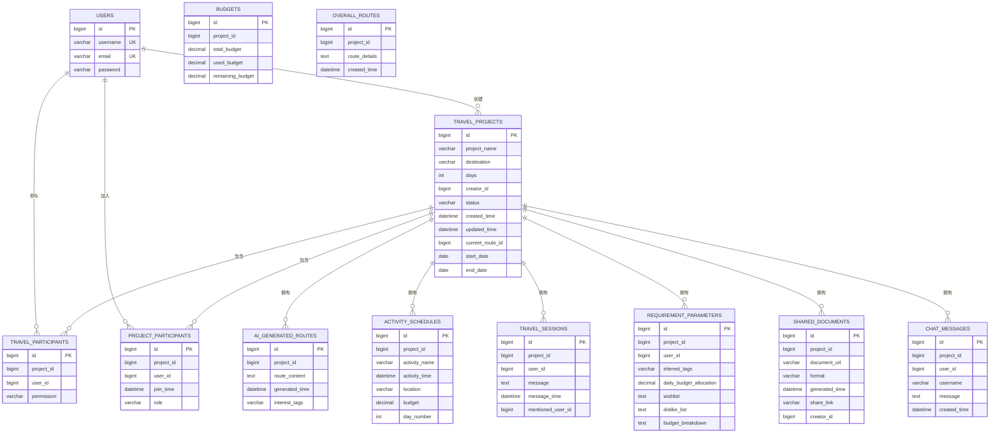

# 项目概述

<cite>
**本文引用的文件**
- [Application.java](file://tudianersha/src/main/java/com/tudianersha/Application.java)
- [pom.xml](file://tudianersha/pom.xml)
- [application.yml](file://tudianersha/src/main/resources/application.yml)
- [DatabaseConfig.java](file://tudianersha/src/main/java/com/tudianersha/config/DatabaseConfig.java)
- [User.java](file://tudianersha/src/main/java/com/tudianersha/entity/User.java)
- [UserRepository.java](file://tudianersha/src/main/java/com/tudianersha/repository/UserRepository.java)
- [UserController.java](file://tudianersha/src/main/java/com/tudianersha/controller/UserController.java)
- [UserService.java](file://tudianersha/src/main/java/com/tudianersha/service/UserService.java)
- [TravelProject.java](file://tudianersha/src/main/java/com/tudianersha/entity/TravelProject.java)
- [TravelProjectService.java](file://tudianersha/src/main/java/com/tudianersha/service/TravelProjectService.java)
- [AiGeneratedRoute.java](file://tudianersha/src/main/java/com/tudianersha/entity/AiGeneratedRoute.java)
- [AiGeneratedRouteController.java](file://tudianersha/src/main/java/com/tudianersha/controller/AiGeneratedRouteController.java)
- [KimiAIService.java](file://tudianersha/src/main/java/com/tudianersha/service/KimiAIService.java)
- [ItineraryPdfService.java](file://tudianersha/src/main/java/com/tudianersha/service/ItineraryPdfService.java)
- [schema.sql](file://tudianersha/src/main/resources/schema.sql)
- [index.html](file://tudianersha/src/main/resources/static/index.html)
- [create-project.html](file://tudianersha/src/main/resources/static/create-project.html)
- [README.md](file://tudianersha/README.md)
- [PasswordEncoderUtil.java](file://tudianersha/src/main/java/com/tudianersha/util/PasswordEncoderUtil.java)
- [PasswordGenerator.java](file://tudianersha/src/main/java/com/tudianersha/util/PasswordGenerator.java)
- [data.sql](file://tudianersha/src/main/resources/data.sql)
</cite>

## 更新摘要
**已更新内容**
- 在"引言"、"核心组件"和"用户注册与登录流程"章节中添加了关于密码安全性的最新信息
- 新增"安全特性"章节，详细说明BCrypt密码加密机制
- 更新了"依赖分析"章节，补充了安全相关依赖的说明
- 更新了"用户注册与登录流程"序列图，反映密码加密流程

## 目录
1. [引言](#引言)
2. [项目结构](#项目结构)
3. [核心组件](#核心组件)
4. [架构总览](#架构总览)
5. [详细组件分析](#详细组件分析)
6. [安全特性](#安全特性)
7. [依赖分析](#依赖分析)
8. [性能考虑](#性能考虑)
9. [故障排查指南](#故障排查指南)
10. [结论](#结论)
11. [附录](#附录)

## 引言
途点儿啥（tudianersha）是一个基于Spring Boot构建的AI驱动智能旅行规划与协作平台。系统通过"用户注册登录 → 创建旅行项目 → 收集需求参数 → AI生成推荐路线 → 多人协作讨论 → 预算管理 → 行程确认 → PDF导出与分享"的完整流程，为用户提供从需求收集到最终行程落地的一站式体验。后端采用Spring MVC分层（Controller-Service-Repository-Entity），前端以HTML/CSS/JS实现静态页面，数据库使用MySQL，持久化采用JPA与MyBatis并存策略，AI能力通过Kimi大模型集成，PDF导出采用iText7生态。**系统已实施BCrypt密码加密机制，确保用户密码安全存储，所有测试账户密码均已更新为哈希值。**

## 项目结构
项目采用标准的Maven多模块布局，核心源码位于src/main/java/com/tudianersha目录下，按职责划分为：
- config：应用配置（如数据库JPA启用）
- controller：REST接口层
- service：业务逻辑层
- repository：数据访问层（JPA）
- entity：JPA实体模型
- util：工具类（如密码加密）
- resources：静态资源与配置（application.yml、schema.sql、静态HTML）


**图表来源**
- [Application.java](file://tudianersha/src/main/java/com/tudianersha/Application.java#L1-L12)
- [DatabaseConfig.java](file://tudianersha/src/main/java/com/tudianersha/config/DatabaseConfig.java#L1-L10)
- [index.html](file://tudianersha/src/main/resources/static/index.html#L1-L515)
- [create-project.html](file://tudianersha/src/main/resources/static/create-project.html#L1-L800)
- [application.yml](file://tudianersha/src/main/resources/application.yml#L1-L57)

**章节来源**
- [README.md](file://tudianersha/README.md#L1-L66)
- [pom.xml](file://tudianersha/pom.xml#L1-L180)

## 核心组件
- 启动类与配置
  - Application：Spring Boot入口，负责应用启动
  - application.yml：数据库连接、JPA方言、邮件、日志级别、Kimi与高德API配置
  - DatabaseConfig：启用JPA仓库扫描
- 用户域
  - User实体、UserRepository、UserController、UserService构成用户注册、登录、查询、更新、删除的完整链路
  - **新增PasswordEncoderUtil工具类，提供静态方法用于密码加密与验证**
- 旅行项目域
  - TravelProject实体、TravelProjectService提供项目查询、保存、删除、按创建者/状态筛选
- AI与PDF
  - KimiAIService：封装Kimi大模型调用，支持生成旅行路线与景点介绍
  - ItineraryPdfService：解析AI生成的行程JSON，生成可打印PDF
- 前端静态页面
  - index.html：项目列表与权限分类展示
  - create-project.html：旅行偏好收集、预算汇总、协作分享
- **安全工具**
  - **新增PasswordGenerator.java工具类，用于生成测试账户的BCrypt哈希密码**

**章节来源**
- [Application.java](file://tudianersha/src/main/java/com/tudianersha/Application.java#L1-L12)
- [application.yml](file://tudianersha/src/main/resources/application.yml#L1-L57)
- [DatabaseConfig.java](file://tudianersha/src/main/java/com/tudianersha/config/DatabaseConfig.java#L1-L10)
- [User.java](file://tudianersha/src/main/java/com/tudianersha/entity/User.java#L1-L73)
- [UserRepository.java](file://tudianersha/src/main/java/com/tudianersha/repository/UserRepository.java#L1-L15)
- [UserController.java](file://tudianersha/src/main/java/com/tudianersha/controller/UserController.java#L1-L152)
- [TravelProjectService.java](file://tudianersha/src/main/java/com/tudianersha/service/TravelProjectService.java#L1-L40)
- [AiGeneratedRoute.java](file://tudianersha/src/main/java/com/tudianersha/entity/AiGeneratedRoute.java)
- [AiGeneratedRouteController.java](file://tudianersha/src/main/java/com/tudianersha/controller/AiGeneratedRouteController.java#L1-L112)
- [KimiAIService.java](file://tudianersha/src/main/java/com/tudianersha/service/KimiAIService.java#L1-L176)
- [ItineraryPdfService.java](file://tudianersha/src/main/java/com/tudianersha/service/ItineraryPdfService.java#L1-L168)
- [index.html](file://tudianersha/src/main/resources/static/index.html#L1-L515)
- [create-project.html](file://tudianersha/src/main/resources/static/create-project.html#L1-L800)
- [PasswordEncoderUtil.java](file://tudianersha/src/main/java/com/tudianersha/util/PasswordEncoderUtil.java#L1-L32)
- [PasswordGenerator.java](file://tudianersha/src/main/java/com/tudianersha/util/PasswordGenerator.java#L1-L38)

## 架构总览
系统采用经典的MVC分层与前后端分离的静态页面模式：
- 控制器层：接收HTTP请求，组装响应
- 服务层：编排业务流程，调用AI与数据库
- 数据访问层：JPA负责ORM映射，MyBatis相关依赖在pom中声明（用于特定场景或扩展）
- 前端：静态HTML+脚本，通过REST接口与后端交互


**图表来源**
- [UserController.java](file://tudianersha/src/main/java/com/tudianersha/controller/UserController.java#L1-L152)
- [AiGeneratedRouteController.java](file://tudianersha/src/main/java/com/tudianersha/controller/AiGeneratedRouteController.java#L1-L112)
- [KimiAIService.java](file://tudianersha/src/main/java/com/tudianersha/service/KimiAIService.java#L1-L176)
- [ItineraryPdfService.java](file://tudianersha/src/main/java/com/tudianersha/service/ItineraryPdfService.java#L1-L168)
- [application.yml](file://tudianersha/src/main/resources/application.yml#L1-L57)

## 详细组件分析

### MVC分层与依赖关系
- 控制器依赖服务：Controller仅负责参数校验、调用Service并返回统一响应包装
- 服务依赖仓库：Service通过Repository访问数据库，必要时组合多个Repository
- 仓库依赖实体：Repository基于JPA对实体进行CRUD
- 配置启用JPA：DatabaseConfig开启JPA仓库扫描，确保Repository被Spring管理


**图表来源**
- [UserController.java](file://tudianersha/src/main/java/com/tudianersha/controller/UserController.java#L1-L152)
- [AiGeneratedRouteController.java](file://tudianersha/src/main/java/com/tudianersha/controller/AiGeneratedRouteController.java#L1-L112)
- [UserRepository.java](file://tudianersha/src/main/java/com/tudianersha/repository/UserRepository.java#L1-L15)
- [TravelProjectService.java](file://tudianersha/src/main/java/com/tudianersha/service/TravelProjectService.java#L1-L40)
- [DatabaseConfig.java](file://tudianersha/src/main/java/com/tudianersha/config/DatabaseConfig.java#L1-L10)
- [User.java](file://tudianersha/src/main/java/com/tudianersha/entity/User.java#L1-L73)
- [TravelProject.java](file://tudianersha/src/main/java/com/tudianersha/entity/TravelProject.java)

**章节来源**
- [DatabaseConfig.java](file://tudianersha/src/main/java/com/tudianersha/config/DatabaseConfig.java#L1-L10)
- [UserRepository.java](file://tudianersha/src/main/java/com/tudianersha/repository/UserRepository.java#L1-L15)
- [TravelProjectService.java](file://tudianersha/src/main/java/com/tudianersha/service/TravelProjectService.java#L1-L40)

### 用户注册与登录流程
用户通过前端页面提交注册/登录请求，控制器层进行参数校验与业务处理，服务层调用仓库持久化或查询，工具类负责密码加密与匹配。


**图表来源**
- [UserController.java](file://tudianersha/src/main/java/com/tudianersha/controller/UserController.java#L1-L152)
- [UserService.java](file://tudianersha/src/main/java/com/tudianersha/service/UserService.java)
- [UserRepository.java](file://tudianersha/src/main/java/com/tudianersha/repository/UserRepository.java#L1-L15)
- [PasswordEncoderUtil.java](file://tudianersha/src/main/java/com/tudianersha/util/PasswordEncoderUtil.java#L1-L33)

**章节来源**
- [UserController.java](file://tudianersha/src/main/java/com/tudianersha/controller/UserController.java#L1-L152)
- [UserRepository.java](file://tudianersha/src/main/java/com/tudianersha/repository/UserRepository.java#L1-L15)
- [PasswordEncoderUtil.java](file://tudianersha/src/main/java/com/tudianersha/util/PasswordEncoderUtil.java#L1-L33)

### AI生成旅行路线流程
控制器触发服务层生成AI路线，服务层调用KimiAIService发起HTTP请求，解析响应后持久化AI生成记录，供后续选择与导出。


**图表来源**
- [AiGeneratedRouteController.java](file://tudianersha/src/main/java/com/tudianersha/controller/AiGeneratedRouteController.java#L1-L112)
- [KimiAIService.java](file://tudianersha/src/main/java/com/tudianersha/service/KimiAIService.java#L1-L176)
- [AiGeneratedRoute.java](file://tudianersha/src/main/java/com/tudianersha/entity/AiGeneratedRoute.java)

**章节来源**
- [AiGeneratedRouteController.java](file://tudianersha/src/main/java/com/tudianersha/controller/AiGeneratedRouteController.java#L1-L112)
- [KimiAIService.java](file://tudianersha/src/main/java/com/tudianersha/service/KimiAIService.java#L1-L176)

### PDF导出流程
服务层根据项目与当前选中路线，解析AI生成的每日行程JSON，使用iText7生成PDF字节流返回给控制器，前端下载或预览。


**图表来源**
- [ItineraryPdfService.java](file://tudianersha/src/main/java/com/tudianersha/service/ItineraryPdfService.java#L1-L168)
- [TravelProject.java](file://tudianersha/src/main/java/com/tudianersha/entity/TravelProject.java)
- [AiGeneratedRoute.java](file://tudianersha/src/main/java/com/tudianersha/entity/AiGeneratedRoute.java)

**章节来源**
- [ItineraryPdfService.java](file://tudianersha/src/main/java/com/tudianersha/service/ItineraryPdfService.java#L1-L168)

### 数据模型与表结构
系统采用关系型数据库，核心表包括用户、项目、参与者、预算、AI生成路线、总体路线、活动安排、会话、需求参数、共享文档、聊天消息等。



**图表来源**
- [schema.sql](file://tudianersha/src/main/resources/schema.sql#L1-L123)

**章节来源**
- [schema.sql](file://tudianersha/src/main/resources/schema.sql#L1-L123)

### 前端交互与协作流程
前端页面通过common.js与后端API交互，首页按权限分类展示项目卡片，创建项目页面收集旅行偏好与预算，支持协作分享与成员管理。


**图表来源**
- [index.html](file://tudianersha/src/main/resources/static/index.html#L1-L515)
- [create-project.html](file://tudianersha/src/main/resources/static/create-project.html#L1-L800)

**章节来源**
- [index.html](file://tudianersha/src/main/resources/static/index.html#L1-L515)
- [create-project.html](file://tudianersha/src/main/resources/static/create-project.html#L1-L800)

## 安全特性
系统已实施BCrypt密码加密机制，确保用户密码的安全存储。所有用户密码在存储到数据库前都会经过BCrypt算法加密，即使数据库泄露，攻击者也无法直接获取明文密码。

### 密码加密与验证机制
系统使用Spring Security提供的BCryptPasswordEncoder实现密码加密与验证。BCrypt是一种自适应哈希函数，具有以下优势：
- **盐值内嵌**：每个哈希值都包含唯一的随机盐值，防止彩虹表攻击
- **计算成本可调**：通过调整工作因子（work factor）控制计算复杂度
- **抗暴力破解**：故意设计为计算缓慢，增加暴力破解难度


**图表来源**
- [PasswordEncoderUtil.java](file://tudianersha/src/main/java/com/tudianersha/util/PasswordEncoderUtil.java#L1-L32)

### 密码加密流程
当用户注册时，系统会自动对密码进行BCrypt加密处理：


**图表来源**
- [UserController.java](file://tudianersha/src/main/java/com/tudianersha/controller/UserController.java#L45-L83)
- [PasswordEncoderUtil.java](file://tudianersha/src/main/java/com/tudianersha/util/PasswordEncoderUtil.java#L1-L32)

### 测试账户密码管理
为方便开发和测试，系统提供了PasswordGenerator工具类，用于生成测试账户的BCrypt哈希密码。该工具类可以生成指定明文密码的哈希值，并验证加密结果的正确性。

```java
// PasswordGenerator.java 示例代码
public class PasswordGenerator {
    public static void main(String[] args) {
        BCryptPasswordEncoder encoder = new BCryptPasswordEncoder();
        
        // 生成 admin123 的加密密码
        String admin123 = encoder.encode("admin123");
        System.out.println("admin123 加密后: " + admin123);
        
        // 验证密码
        System.out.println("验证 admin123: " + encoder.matches("admin123", admin123));
    }
}
```

**图表来源**
- [PasswordGenerator.java](file://tudianersha/src/main/java/com/tudianersha/util/PasswordGenerator.java#L1-L38)

### 初始化数据安全
系统初始化脚本(data.sql)中的测试账户密码已全部更新为BCrypt哈希值，不再使用明文密码。这确保了即使在开发环境中，密码安全也得到保障。

```sql
-- data.sql 示例
-- 明文密码：admin123, user123, tsl123, qjq123, ysy123
INSERT IGNORE INTO users (username, email, password) VALUES ('admin', 'admin@example.com', '$2a$10$vI8aWBnW3fID.ZQ4/zo1G.q1lRps.9cGLcZEiGDMVr5yUP1T58B/C');
INSERT IGNORE INTO users (username, email, password) VALUES ('user1', 'user1@example.com', '$2a$10$dXJ3SW6G7P50lGmMkkmwe.20cyhQQhf2.v/zH9xqB7A0H1YE8RlhO');
```

**图表来源**
- [data.sql](file://tudianersha/src/main/resources/data.sql#L1-L8)

## 依赖分析
- 启动与Web
  - spring-boot-starter、spring-boot-starter-web：应用启动与Web容器
- 数据访问
  - spring-boot-starter-data-jpa：JPA ORM
  - mysql-connector-java：MySQL驱动
  - mybatis-spring-boot-starter：MyBatis集成（用于特定场景或扩展）
- 工具与安全
  - **spring-security-crypto**：**提供BCryptPasswordEncoder，实现密码加密安全**
  - **bcprov**：**Bouncy Castle加密提供者，支持高级加密算法**
  - apache poi：DOCX读取（用于文档处理）
  - commons-io：IO工具
- 监控与健康
  - spring-boot-starter-actuator：运行时监控
- HTTP与JSON
  - okhttp3：HTTP客户端
  - gson：JSON序列化
- PDF与国际化
  - itext7-core/html2pdf/font-asian：PDF生成与中文字体支持
- 其他
  - jaxb-api/jaxb-runtime：Java 11兼容性
  - junit-jupiter/spring-boot-starter-test：测试


**图表来源**
- [pom.xml](file://tudianersha/pom.xml#L1-L180)

**章节来源**
- [pom.xml](file://tudianersha/pom.xml#L1-L180)

## 性能考虑
- 数据库连接与事务
  - 合理设置连接池大小与超时，避免长事务占用连接
  - 对高频查询建立索引（如聊天消息按项目ID与时间索引）
- AI调用
  - KimiAIService设置合理的连接/读写超时，避免阻塞线程
  - 对AI响应进行缓存（如近期相同prompt可复用）
- PDF生成
  - 使用流式写入减少内存占用
  - 字体嵌入与压缩策略平衡体积与清晰度
- 前端交互
  - 静态资源CDN加速，减少首屏渲染时间
  - 列表懒加载与分页，降低一次性渲染压力

## 故障排查指南
- 启动失败
  - 检查数据库连接参数与MySQL服务状态
  - 确认JPA方言与驱动版本匹配
- 用户登录/注册异常
  - 核对用户名/邮箱唯一性约束
  - 检查密码加密与匹配逻辑
  - **如果使用测试账户，确保data.sql中的密码是正确的BCrypt哈希值**
- AI生成失败
  - 检查Kimi API Key与URL配置
  - 关注OkHttp超时与响应格式
- PDF导出异常
  - 确认项目已选择当前路线
  - 检查JSON字段格式与日期解析
- 前端无法访问API
  - 检查跨域配置与路由路径
  - 确认静态资源路径与common.js可用

**章节来源**
- [application.yml](file://tudianersha/src/main/resources/application.yml#L1-L57)
- [UserController.java](file://tudianersha/src/main/java/com/tudianersha/controller/UserController.java#L1-L152)
- [KimiAIService.java](file://tudianersha/src/main/java/com/tudianersha/service/KimiAIService.java#L1-L176)
- [ItineraryPdfService.java](file://tudianersha/src/main/java/com/tudianersha/service/ItineraryPdfService.java#L1-L168)
- [index.html](file://tudianersha/src/main/resources/static/index.html#L1-L515)

## 结论
途点儿啥项目以Spring Boot为核心，结合JPA与MyBatis、Kimi大模型与iText7，构建了从需求收集到行程落地的完整闭环。MVC分层清晰、前后端职责明确，具备良好的扩展性与可维护性。**系统已实施BCrypt密码加密机制，显著提升了用户数据的安全性。** 对于初学者，建议先理解MVC与REST接口；对于高级开发者，可在AI调用、PDF生成与数据库优化方面深入实践。

## 附录
- 快速运行
  - 准备MySQL数据库并创建库名
  - 更新application.yml中的数据库凭据
  - 使用Maven打包并启动Spring Boot应用
- API示例
  - 用户：GET/POST/PUT/DELETE /api/users
  - AI路线：POST /api/ai-generated-routes/generate/{projectId}
  - PDF导出：GET /api/pdf/export/{projectId}

**章节来源**
- [README.md](file://tudianersha/README.md#L1-L66)
- [application.yml](file://tudianersha/src/main/resources/application.yml#L1-L57)