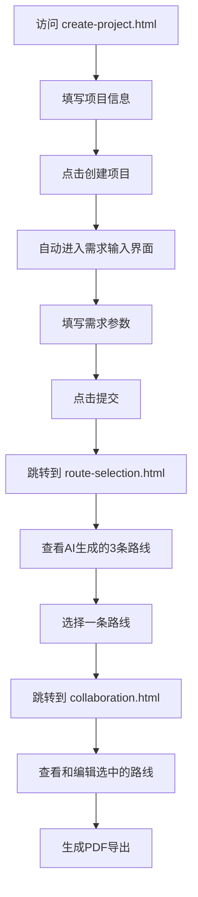
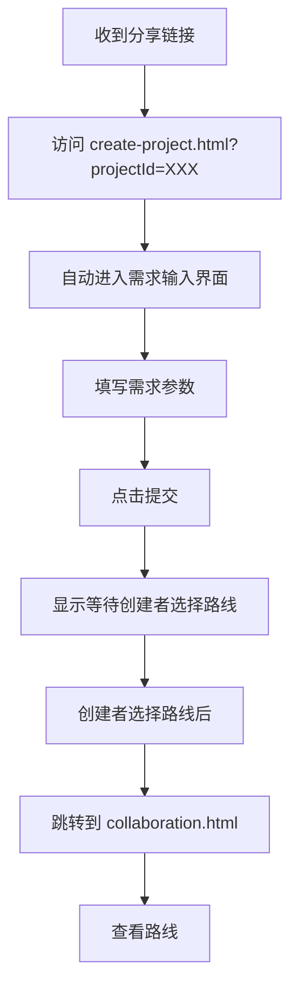

# 项目流程修复说明

**修复时间**: 2025年12月13日 15:16  
**问题**: 创建者填写需求后直接跳转到协作界面，跳过了AI路线选择步骤  
**影响**: 协作界面无数据，流程不完整

---

## ❌ 修复前的错误流程

```
创建项目
   ↓
填写需求
   ↓
❌ 直接跳转到 participants-status.html（成员状态页面）
   ↓
❌ 再跳转到空白的 collaboration.html（协作界面）
   ↓
❌ 协作界面没有路线数据
```

**问题根源**: 第1896-1897行

```javascript
// ❌ 错误代码
setTimeout(() => {
    navigate(`/participants-status.html?id=${projectId}`);
}, 1500);
```

---

## ✅ 修复后的正确流程

```
创建项目
   ↓
填写需求（创建者）
   ↓
✅ 跳转到 route-selection.html（AI路线选择页面）
   ↓
AI生成3条路线方案
   ↓
创建者选择一条路线
   ↓
✅ 跳转到 collaboration.html（协作界面）
   ↓
✅ 协作界面显示选中的路线数据
```

**修复代码**: 第1896-1897行

```javascript
// ✅ 正确代码
setTimeout(() => {
    navigate(`/route-selection.html?projectId=${projectId}`);
}, 1500);
```

---

## 📊 完整的用户旅程

### 创建者完整流程



### 参与者完整流程



---

## 🔧 修复的文件

### 文件: create-project.html

**修改位置**: 第1892-1898行

**修改前**:
```javascript
loading.hide();
showSuccess('创建成功！正在跳转...');

// 创建者直接跳转到查看成员页面
setTimeout(() => {
    navigate(`/participants-status.html?id=${projectId}`);
}, 1500);
```

**修改后**:
```javascript
loading.hide();
showSuccess('创建成功！正在生成AI路线...');

// 创建者跳转到AI路线选择页面
setTimeout(() => {
    navigate(`/route-selection.html?projectId=${projectId}`);
}, 1500);
```

**变更说明**:
- ✅ 修改跳转目标: `participants-status.html` → `route-selection.html`
- ✅ 修改URL参数: `id` → `projectId`（保持一致性）
- ✅ 修改提示文案: "正在跳转..." → "正在生成AI路线..."

---

## 🎯 验证步骤

### 步骤1: 清除浏览器缓存

**操作**:
1. 按 **Ctrl + F5** 强制刷新
2. 或清空缓存: `Ctrl + Shift + Delete`

---

### 步骤2: 完整测试流程

**2.1 创建项目**

1. 访问 `http://localhost:8010/create-project.html`
2. 填写项目信息:
   - 项目名称: 杭州3日游
   - 目的地: 杭州
   - 旅行天数: 3天
   - 日期: 2025-12-15 至 2025-12-17
   - 预算: 2500元
3. 点击"创建项目"

**预期结果**: 自动进入需求输入界面

---

**2.2 填写需求**

1. 选择兴趣标签（如：美食、文化）
2. 填写想去景点: 西湖、雷峰塔
3. 填写预算明细
4. 点击"提交"

**预期结果**: 
- 显示 "创建成功！正在生成AI路线..."
- 1.5秒后自动跳转到路线选择页面

**截图验证**:
- 截取跳转后的页面
- URL应该是: `http://localhost:8010/route-selection.html?projectId=XXX`

---

**2.3 选择AI路线**

1. 查看3条AI生成的路线方案
2. 点击其中一条路线的"选择此路线"按钮

**预期结果**: 跳转到协作界面

---

**2.4 查看协作界面**

1. 协作界面应该显示:
   - 项目名称
   - 目的地
   - 旅行天数
   - **每日行程详情**（有数据）
   - 景点列表
   - 预算信息

**预期结果**: 协作界面有完整数据 ✅

**截图验证**:
- 截取协作界面
- 确认显示路线数据

---

## 🔍 故障排查

### 问题1: 仍然跳转到participants-status.html

**可能原因**: 浏览器缓存未清除

**解决方案**:
1. **硬性刷新**: Ctrl + F5
2. **清除缓存**:
   - Chrome: Ctrl + Shift + Delete
   - 选择"缓存的图片和文件"
   - 点击"清除数据"
3. **关闭并重新打开浏览器**
4. **重新访问页面**

---

### 问题2: route-selection.html 404错误

**症状**: 
```
Cannot GET /route-selection.html
404 Not Found
```

**检查文件是否存在**:
```
文件路径: e:/tudianershatest/tudianersha/src/main/resources/static/route-selection.html
```

**验证方法**:
在PowerShell中执行:
```powershell
Test-Path "e:/tudianershatest/tudianersha/src/main/resources/static/route-selection.html"
```

**预期结果**: `True`

**如果返回False**: 文件不存在，需要创建该页面

---

### 问题3: AI路线选择页面无数据

**症状**: 页面打开了，但没有显示路线

**可能原因**:
1. AI路线生成失败
2. 数据库中没有路线记录

**检查方法**:

**在浏览器Console执行**:
```javascript
// 获取projectId
const urlParams = new URLSearchParams(window.location.search);
const projectId = urlParams.get('projectId');
console.log('项目ID:', projectId);

// 查询AI路线
fetch(`http://localhost:8010/api/ai-generated-routes/project/${projectId}`)
    .then(res => res.json())
    .then(routes => {
        console.log('AI路线数量:', routes.length);
        console.log('路线数据:', routes);
    });
```

**预期结果**:
```
项目ID: 123
AI路线数量: 1 (或更多)
路线数据: [{id: 456, projectId: 123, ...}]
```

**如果路线数量为0**: 说明AI路线生成失败

**查看后端日志**:
- 在IDEA Run窗口搜索 "ai-generated-routes"
- 查看是否有错误日志

---

### 问题4: 协作界面仍然无数据

**症状**: 进入协作界面，但页面空白

**可能原因**:
1. 没有选择路线
2. `currentRouteId` 未设置

**检查方法**:

**在collaboration.html的Console执行**:
```javascript
const urlParams = new URLSearchParams(window.location.search);
const projectId = urlParams.get('projectId');

fetch(`http://localhost:8010/api/travel-projects/${projectId}`)
    .then(res => res.json())
    .then(project => {
        console.log('项目信息:', project);
        console.log('当前路线ID:', project.currentRouteId);
        
        if (!project.currentRouteId) {
            console.error('❌ 未设置当前路线ID');
        } else {
            console.log('✅ 已设置路线ID:', project.currentRouteId);
        }
    });
```

**预期结果**:
```
✅ 已设置路线ID: 456
```

**如果未设置**: 需要在路线选择页面选择一条路线

---

## 📝 页面跳转参数对照表

### 正确的URL参数格式

| 页面 | URL格式 | 参数名 | 示例 |
|------|---------|--------|------|
| **创建项目** | `/create-project.html` | 无 | `http://localhost:8010/create-project.html` |
| **需求输入（创建者）** | `/create-project.html` | 无 | 自动显示需求输入界面 |
| **需求输入（参与者）** | `/create-project.html?projectId=XXX` | `projectId` | `http://localhost:8010/create-project.html?projectId=123` |
| **AI路线选择** | `/route-selection.html?projectId=XXX` | `projectId` | `http://localhost:8010/route-selection.html?projectId=123` |
| **协作界面** | `/collaboration.html?projectId=XXX` | `projectId` | `http://localhost:8010/collaboration.html?projectId=123` |

**注意**: 
- ✅ 统一使用 `projectId` 参数
- ❌ 不要使用 `id` 参数（避免混淆）

---

## 🎯 完整测试清单

测试创建者完整流程:

- [ ] 访问创建项目页面
- [ ] 填写项目信息
- [ ] 点击"创建项目"
- [ ] 自动进入需求输入界面
- [ ] 填写需求参数
- [ ] 点击"提交"
- [ ] **看到提示: "创建成功！正在生成AI路线..."**
- [ ] **自动跳转到 route-selection.html**
- [ ] **页面显示AI生成的路线方案**
- [ ] 选择一条路线
- [ ] 跳转到协作界面
- [ ] **协作界面显示完整的路线数据**

---

## 🚀 下一步操作

### 立即执行

1. **强制刷新浏览器**
   ```
   按 Ctrl + F5
   ```

2. **重新测试创建项目流程**
   ```
   1. 访问 http://localhost:8010/create-project.html
   2. 创建项目 → 填写需求 → 提交
   3. 观察是否跳转到 route-selection.html
   ```

3. **提供验证截图**
   - 截图1: 提交需求后的提示消息（应显示"正在生成AI路线..."）
   - 截图2: 跳转后的URL（应该是route-selection.html）
   - 截图3: AI路线选择页面（显示路线方案）
   - 截图4: 协作界面（显示路线数据）

---

**修复完成**: ✅  
**修复内容**: 创建者流程跳转逻辑  
**预期效果**: 创建项目 → 需求输入 → **AI路线选择** → 协作界面  
**测试状态**: 等待用户验证

**现在请强制刷新浏览器（Ctrl + F5），然后重新测试创建项目流程！**🚀
